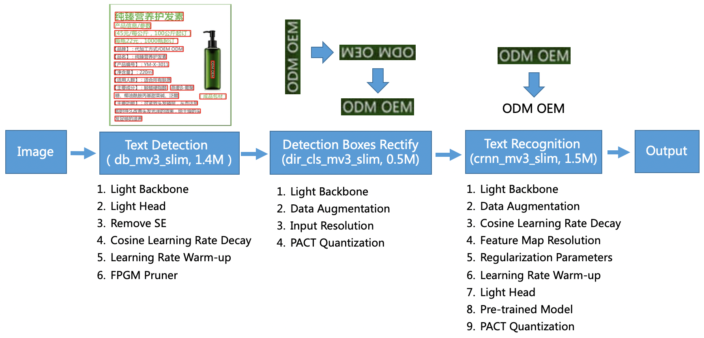
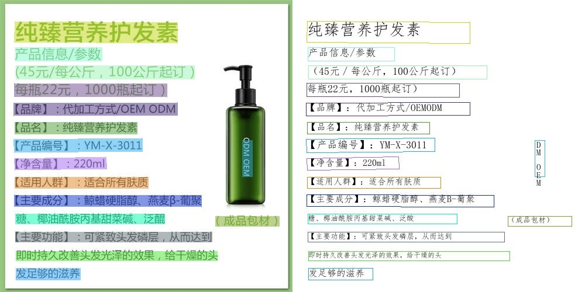
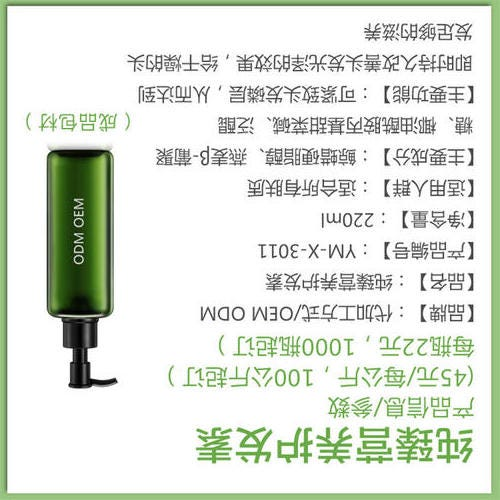
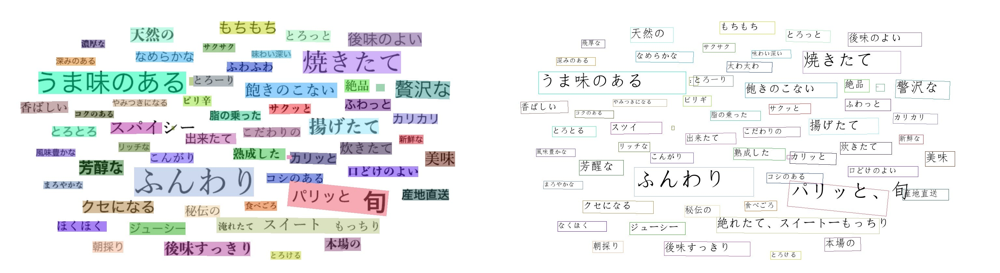

# PaddleOCR: 最新の軽量OCRシステム

# PaddleOCR: 最新の軽量OCRシステム

[](https://medium.com/@mucunwuxian?source=post_page---byline--8744205f3703---------------------------------------)

[Taketo Kimura](https://medium.com/@mucunwuxian?source=post_page---byline--8744205f3703---------------------------------------)

18 min read

·

Mar 21, 2021

--

Share

[ailia SDK](https://ailia.jp/)で使用できる機械学習モデルである「PaddleOCR」のご紹介です。[ailia SDK](https://ailia.jp/)はエッジ向け推論フレームワークであり、[ailia MODELS](https://github.com/axinc-ai/ailia-models)に公開されている機械学習モデルを使用することで、簡単にAIの機能をアプリケーションに実装することができます。

## PaddleOCRの概要

PaddleOCRは、中国の検索大手 Baidu（百度）が、ディープラーニングフレームワーク「PaddlePaddle（PArallel Distributed Deep LEarning）」を用いて開発した、最新のOCRモデルです。  
リリース版プログラムと論文が、2020年9月に公開されました。

[## PaddlePaddle/PaddleOCR

### English | 简体中文 PaddleOCR aims to create multilingual, awesome, leading, and practical OCR tools that help users train…

github.com](https://github.com/PaddlePaddle/PaddleOCR?source=post_page-----8744205f3703---------------------------------------)

[## PP-OCR: A Practical Ultra Lightweight OCR System

### The Optical Character Recognition (OCR) systems have been widely used in various of application scenarios, such as…

arxiv.org](https://arxiv.org/abs/2009.09941?source=post_page-----8744205f3703---------------------------------------)

実用に向け、認識精度と演算負荷とのバランスを多大に配慮した、素晴らしい内容となっています。  
論文では、その配慮以外にも、学習の際に工夫したことや、実験に基づく各種設計の最適化なども紹介してくれています。

## PaddleOCRが対応する言語の種類

多言語対応を目指すOCRとのことで、2021年3月時点にて、27言語が対応されています。  
日本語も対応されています。

[## Multilingual OCR Development Plan · Issue #1048 · PaddlePaddle/PaddleOCR

### model name description model size download Update Date ch Chinese and English 3.71M inference model / trained model…

github.com](https://github.com/PaddlePaddle/PaddleOCR/issues/1048?source=post_page-----8744205f3703---------------------------------------)

## PaddleOCRで用いられるモデルの種類

PaddleOCRの処理の流れは、以下の構成となっています。

Press enter or click to view image in full size



出典：<https://github.com/PaddlePaddle/PaddleOCR/blob/release/2.0/doc/ppocr_framework.png>

図に示されるように、大きく3段階の処理があります。  
それは、「①文字位置検出 → ②文字向き認識、及び、修正 → ③文字内容認識」の3つです。

その為、GitHubリポジトリ上には、各処理別のモデルが用意されています。  
尚、「①文字位置検出」と「②文字向き認識」とを行うためのモデルは、全言語共通となっています。  
「③文字内容認識」を行うためのモデルが、言語別に存在します。

[## PaddlePaddle/PaddleOCR

### Note : Compared with models 1.1, which are trained with static graph programming paradigm, models 2.0 are the dynamic…

github.com](https://github.com/PaddlePaddle/PaddleOCR/blob/release/2.0/doc/doc_en/models_list_en.md?source=post_page-----8744205f3703---------------------------------------)

## PaddleOCRの出力

先ずは、入出力のイメージを確認していただくと、直感的に分かりやすいかと思います。

GitHub上に用意されている以下の画像を入力に、中国語の認識をしてみます。


出典：<https://github.com/PaddlePaddle/PaddleOCR/blob/release/2.0/doc/imgs/11.jpg>

PaddleOCRの出力は、以下となります。

Press enter or click to view image in full size



ほぼ完璧に認識ができています。

次に、先程の画像を反転させたものを、入力としてみます。



PaddleOCRの出力は、以下となります。

Press enter or click to view image in full size


逆さまになっても、ほぼ完璧に認識ができています。  
「②文字向き認識、及び、修正」という処理がある為、このような結果を導出することができます。

最後に、GitHub上に用意されている以下の画像を入力に、日本語の認識をしてみます。

Press enter or click to view image in full size


出典：<https://github.com/PaddlePaddle/PaddleOCR/blob/release/2.0/doc/imgs/japan_2.jpg>

PaddleOCRの出力は以下となります。

Press enter or click to view image in full size



概ね間違えずに、認識ができています。

## Get Taketo Kimura’s stories in your inbox

Join Medium for free to get updates from this writer.

Subscribe

Subscribe

Remember me for faster sign in

プログラム中の具体的な話をすると、先程の日本語の画像を入力とした場合、下記の2つの変数が出力されます。

> np.shape(dt\_boxes) = (58, 4, 2)  
> np.shape(rec\_res) = (58, 2)

上記、*dt\_boxes*は、detection bounding boxの略で、文字検出位置を示す矩形の四隅を、XY座標で表現した数値が格納されています。  
矩形四隅のXY座標が、58個あることで、*(58, 4, 2)*という要素数になっています。  
一例をあげると、以下となります。

> [[675., 66.], [844., 66.], [844., 104.], [675., 104.]]

*rec\_res*は、recognition resultの略で、認識予測された文字列と、その自信度合いを「0〜1」の範囲にて表現した数値とが、格納されています。  
一例をあげると、以下となります。

> (‘もちもち’, 0.98491704)

## PaddlePaddleから使用する

PaddlePaddleから、PaddleOCRを使用するには、GitHubリポジトリ内に[Quick Start](https://github.com/PaddlePaddle/PaddleOCR/blob/release/2.0/doc/doc_en/quickstart_en.md)を参考に進めれば、実現できます。

概ねの手順としては、[requirements.txt](https://github.com/PaddlePaddle/PaddleOCR/blob/release/2.0/requirements.txt)に記載されるライブラリと、paddlepaddleとをインストールした上で、スクリプトを実行する形です。尚、paddlepaddleは、[CPU版](https://pypi.org/project/paddlepaddle/)と、[GPU版](https://pypi.org/project/paddlepaddle-gpu/)とがありますので、環境に合う方をインストールすると良いかと思います。

例えば、中国語認識を行いたい場合、スクリプトを実行するコマンドは、以下となります。

```
# Predict a single image specified by image_dir  
python3 tools/infer/predict_system.py \  
        --image_dir="./doc/imgs/11.jpg" \  
        --det_model_dir="./inference/ch_ppocr_mobile_v2.0_det_infer/"  \  
        --rec_model_dir="./inference/ch_ppocr_mobile_v2.0_rec_infer/" \  
        --cls_model_dir="./inference/ch_ppocr_mobile_v2.0_cls_infer/" \  
        --use_angle_cls=True \  
        --use_space_char=True
```

日本語認識を行いたい場合、スクリプトを実行するコマンドは、以下となります。

```
# Predict a single image specified by image_dir  
python3 tools/infer/predict_system.py \  
        --image_dir="./doc/imgs/japan_2.jpg" \  
        --det_model_dir="./inference/ch_ppocr_mobile_v2.0_det_infer/"  \  
        --rec_model_dir="./inference/japan_mobile_v2.0_rec_infer/" \  
        --cls_model_dir="./inference/ch_ppocr_mobile_v2.0_cls_infer/" \  
        --use_angle_cls=True \  
        --use_space_char=True
```

モデルファイルは、事前に用意しておく必要があります。  
例えば、以下のコマンドで実現することができます。

```
# Download the detection model of the ultra-lightweight Chinese OCR model and uncompress it  
wget https://paddleocr.bj.bcebos.com/dygraph_v2.0/ch/ch_ppocr_mobile_v2.0_det_infer.tar && tar xf ch_ppocr_mobile_v2.0_det_infer.tar# Download the recognition model of the ultra-lightweight Chinese OCR model and uncompress it  
wget https://paddleocr.bj.bcebos.com/dygraph_v2.0/ch/ch_ppocr_mobile_v2.0_rec_infer.tar && tar xf ch_ppocr_mobile_v2.0_rec_infer.tar# Download the angle classifier model of the ultra-lightweight Chinese OCR model and uncompress it  
wget https://paddleocr.bj.bcebos.com/dygraph_v2.0/ch/ch_ppocr_mobile_v2.0_cls_infer.tar && tar xf ch_ppocr_mobile_v2.0_cls_infer.tar# Download the angle classifier model of the ultra-lightweight Japanese OCR model and uncompress it  
wget https://paddleocr.bj.bcebos.com/dygraph_v2.0/multilingual/japan_mobile_v2.0_rec_infer.tar && tar xf japan_mobile_v2.0_rec_infer.tar
```

尚、上記コマンドは、以下4つのモデルをダウンロードするコマンドです。

> *（１）軽量の文字検出モデル  
> （２）文字向き認識モデル  
> （３）中国語の文字内容認識モデル  
> （４）日本語の文字内容認識モデル*

上記以外にも、精度重視の重めの文字検出モデルや、他の言語のモデルなどが、先程も紹介させていただいた[モデル一覧](https://github.com/PaddlePaddle/PaddleOCR/blob/release/2.0/doc/doc_en/models_list_en.md)に記載されています。  
必要に応じて、上記コマンドをカスタマイズして、ダウンロードしていただくと良いかと思います。

## PaddleOCRのONNXへのエクスポート

PaddleOCRをONNXにエクスポートする方法ですが、実は、直接的な方法が、2021年3月時点にて、フォローされていません。  
そのことは、GitHubリポジトリのIssuesにある幾つかのやり取りにて、確認をすることができます。  
ONNXをフォローしていない理由は、PaddlePaddleが独自でONNXのようなMobile対応を行っている為かと思われます。

その為、PaddlePaddleをONNXにエクスポートするには、一度、PaddlePaddleをPytorchに変換した上で、PytorchからONNXにエクスポートを行う必要があります。  
尚、PaddlePaddleをPytorchに変換する方法ですが、こちらについても公式のフォローは無いようで、力技で実現する必要があります。  
PaddlePaddleで構築したモデルと同一構造のネットワークを、Pytorch上にて構築し、重みの値をPaddlePaddleのネットワークからPytorchのネットワークへと、1つ1つ順繰りにコピーする、という方法です。

PaddleOCRに関しては、有り難いことに、以下のGitHubリポジトリが、PaddlePaddleからPytorchへの変換プログラムを用意してくれています。

[## frotms/PaddleOCR2Pytorch

### PytorchOCR由 PaddleOCR-2.0rc1+ 动态图版本移植。 高质量推理模型，准确的识别效果 超轻量ptocr\_mobile移动端系列 通用ptocr\_server系列 支持中英文数字组合识别、竖排文本识别、长文本识别…

github.com](https://github.com/frotms/PaddleOCR2Pytorch?source=post_page-----8744205f3703---------------------------------------)

こちらのリポジトリを使って、所望のモデルを、PaddlePaddleからPytorchへと変換します。  
尚、中国語以外の言語での、「③文字内容認識」を行うモデルについては、変換コードが無いのですが、最終層のクラス数だけを各言語の文字数に変換すれば、変換が行えます。  
つまり、文字内容を認識するモデルのネットワーク構造は、最終層以外は、全言語間で共通となっています。

PaddlePaddleからPytorchに変換した後には、[公式の手順](https://pytorch.org/tutorials/advanced/super_resolution_with_onnxruntime.html)にて、ONNXへのエクスポートを実現できます。  
「①文字位置検出」を行うモデルについては、入力画像サイズが様々考えられる為、画像の縦横サイズに動的対応できるように、エクスポートを行います。

```
# Input to the model  
x = torch.randn(1, 3, 960, 1280, requires_grad=True)  
  
# Export the model  
torch.onnx.export(converter.net,             # model being run  
                  x,                         # model input (or a tuple for multiple inputs)  
                  "./onnx/ch_ppocr_server_v2.0_det_train.onnx",  # where to save the model (can be a file or file-like object)  
                  export_params=True,        # store the trained parameter weights inside the model file  
                  opset_version=10,          # the ONNX version to export the model to  
                  do_constant_folding=True,  # whether to execute constant folding for optimization  
                  input_names = ['input'],   # the model's input names  
                  output_names = ['output'], # the model's output names  
                  dynamic_axes={'input' : {0 : 'batch_size',   
                                           2 : 'height_size',   
                                           3 : 'width_size'},  # variable lenght axes  
                                'output' : {0 : 'batch_size',   
                                            2 : 'height_size',   
                                            3 : 'width_size'}})
```

「②文字向き認識」を行うモデルについては、入力画像サイズをconfigの指定に従い固定サイズにリサイズをする為、動的対応は不要です。  
configにて指定される固定サイズにて、エクスポートを行います。

```
# Input to the model  
x = torch.randn(1, 3, 48, 192, requires_grad=True)  
  
# Export the model  
torch.onnx.export(converter.net,             # model being run  
                  x,                         # model input (or a tuple for multiple inputs)  
                  "./onnx/ch_ppocr_mobile_v2.0_cls_train.onnx",  # where to save the model (can be a file or file-like object)  
                  export_params=True,        # store the trained parameter weights inside the model file  
                  opset_version=10,          # the ONNX version to export the model to  
                  do_constant_folding=True,  # whether to execute constant folding for optimization  
                  input_names = ['input'],   # the model's input names  
                  output_names = ['output'], # the model's output names  
                  dynamic_axes={'input' : {0 : 'batch_size'},  # variable lenght axes  
                                'output' : {0 : 'batch_size'}})
```

「③文字内容認識」を行うモデルについては、検出した文字位置部分の画像をクロップした上で、configの指定に従い高さのみ固定サイズにリサイズをする為、画像の横サイズに対してのみ、動的対応が必要です。  
configにて指定される固定の高さにて、エクスポートを行います。

```
# Input to the model  
x = torch.randn(1, 3, 32, 320, requires_grad=True)  
  
# Export the model  
torch.onnx.export(converter.net,             # model being run  
                  x,                         # model input (or a tuple for multiple inputs)  
                  "./onnx/japan_mobile_v2.0_rec_infer.onnx",  # where to save the model (can be a file or file-like object)  
                  export_params=True,        # store the trained parameter weights inside the model file  
                  opset_version=10,          # the ONNX version to export the model to  
                  do_constant_folding=True,  # whether to execute constant folding for optimization  
                  input_names = ['input'],   # the model's input names  
                  output_names = ['output'], # the model's output names  
                  dynamic_axes={'input' : {0 : 'batch_size',   
                                           3 : 'width_size'},    # variable lenght axes  
                                'output' : {0 : 'batch_size',   
                                            1 : 'width_size'}})
```

## ailia SDKからの利用

ailia SDKから利用するには、下記のコマンドを使用します。入力画像に対して日本語の認識が行われます。

```
$ python paddleocr.py -i input.png
```

-c serverオプションを付与することで、axで独自に学習した高精度モデルも使用可能です。

```
$ python paddleocr.py -i input.png -c server
```

実行例です。

[## axinc-ai/ailia-models

### (from https://github.com/PaddlePaddle/PaddleOCR/tree/dygraph/doc/imgs) Automatically downloads the onnx and prototxt…

github.com](https://github.com/axinc-ai/ailia-models/tree/master/text_recognition/paddleocr?source=post_page-----8744205f3703---------------------------------------)

ax株式会社はAIを実用化する会社として、クロスプラットフォームでGPUを使用した高速な推論を行うことができるailia SDKを開発しています。ax株式会社ではコンサルティングからモデル作成、SDKの提供、AIを利用したアプリ・システム開発、サポートまで、 AIに関するトータルソリューションを提供していますのでお気軽に[お問い合わせ](https://axinc.jp/)ください