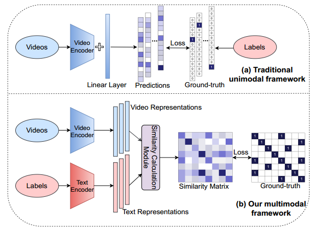
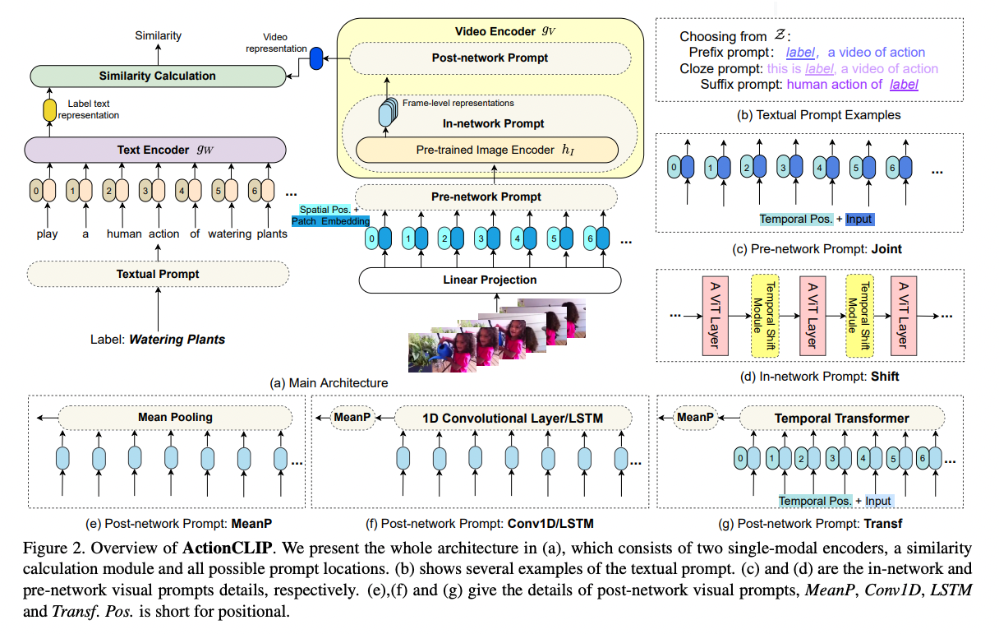
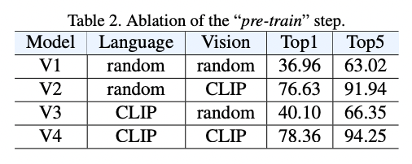
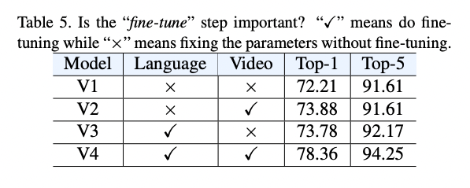
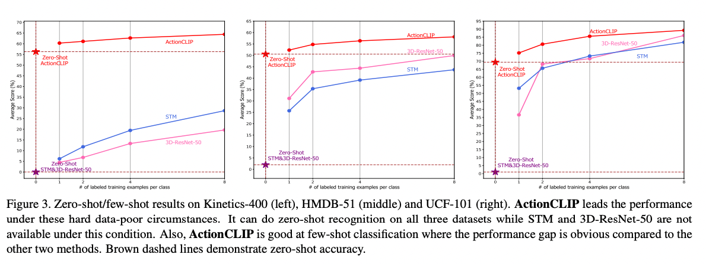
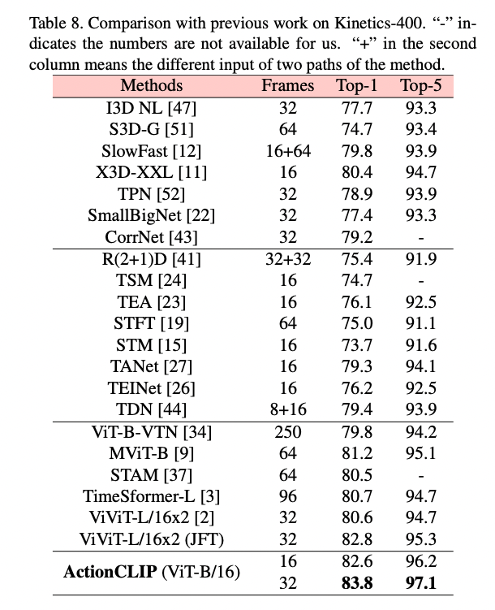
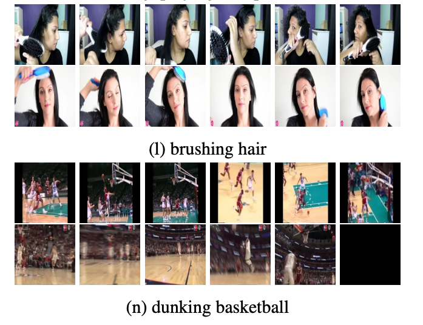

# ActionClip : 任意のアクションを検知できるアクション検知モデル

# ActionClip : 任意のアクションを検知できるアクション検知モデル

[](https://kyakuno.medium.com/?source=post_page---byline--d12f8b513f53---------------------------------------)

[Kazuki Kyakuno](https://kyakuno.medium.com/?source=post_page---byline--d12f8b513f53---------------------------------------)

10 min read

·

Aug 17, 2022

--

Share

[ailia SDK](https://ailia.jp/)で使用できる機械学習モデルである「ActionClip」のご紹介です。エッジ向け推論フレームワークである[ailia SDK](https://ailia.jp/)と[ailia MODELS](https://github.com/axinc-ai/ailia-models)に公開されている機械学習モデルを使用することで、簡単にAIの機能をアプリケーションに実装することができます。

## ActionClipの概要

ActionClipは2021年9月に公開されたアクション検知モデルです。言語処理系と画像識別を統合し、WEB上の膨大な画像によって事前学習されたClipの学習済みモデルを活用することで、任意のアクションを検出可能にします。

Press enter or click to view image in full size



Action Clipの概要（出典：<https://github.com/sallymmx/ActionCLIP>）

[## GitHub - sallymmx/ActionCLIP: This is the official implement of paper "ActionCLIP: A New Paradigm…

### The code is built with following libraries: For video data pre-processing, you may need ffmpeg. More detail information…

github.com](https://github.com/sallymmx/ActionCLIP?source=post_page-----d12f8b513f53---------------------------------------)

## ActionClipのアーキテクチャ

従来のアクション検出は、検知したいアクションのラベルに単純な番号を割り当て、入力された動画に対して、どのラベルが最も適切かを学習します。

ActionClipでは、ラベルに単純な番号を設定するのではなく、ラベルのテキストからエンコードした特徴量を使用して学習します。モデルは、ビデオとテキストをマッチングするように学習します。ラベルのテキストから特徴量を抽出するため、学習に使用していないラベルの検出も可能になります。これにより、zero-shotのアクション検知を実現します。

Press enter or click to view image in full size



Action Clipのアーキテクチャ（出典：<https://github.com/sallymmx/ActionCLIP>）

Action Clipは8フレームを入力としてアクションを推定します。バックボーンにはVisionTransformerを使用します。

## Get Kazuki Kyakuno’s stories in your inbox

Join Medium for free to get updates from this writer.

Subscribe

Subscribe

Remember me for faster sign in

Action Clipは膨大なWEBの画像を使用して学習されたCLIPを初期値として学習しています。このパラダイムは、”pre-train, prompt and fine-tune.”と呼び、膨大なWEBの画像・動画・テキストで学習されたCLIPを使用することで、性能向上を実現しています。CLIPを初期値としてモデルを学習することで、大幅に性能が向上しています。



CLIPの重みの性能への影響（出典：<https://github.com/sallymmx/ActionCLIP>）

また、Action Clipはzero-shotのアクション検知ができるだけではなく、end-to-endのfine tuningによって、既存のアクション検出タスクにおいても最高の性能を発揮します。Kinetics-400データセットでVit-B/16バックボーンを使用してfine tuningした場合に、83.8%のTop-1 accuracyを達成します。



FineTuningの性能への影響（出典：<https://github.com/sallymmx/ActionCLIP>）

Press enter or click to view image in full size



ZeroShotとFewShotの性能への影響（出典：<https://github.com/sallymmx/ActionCLIP>）

## ActionClipの性能

ActionClipはKinetic-400データセットでSoTAを達成しています。



Kinetic400データセットでの性能比較（出典：<https://github.com/sallymmx/ActionCLIP>）



Kineticデータセットの例（出典：<https://arxiv.org/pdf/1705.06950.pdf>）

## ActionClipの使用方法

下記のコマンドで任意の動画に対してActionClipを適用可能です。検知したいアクションはテキストで指定します。

```
$ python3 action_clip.py --video VIDEO_PATH --text "drinking" --text "eating" --text "laughing"
```

[## ailia-models/action\_recognition/action\_clip at master · axinc-ai/ailia-models

### (GIF from…

github.com](https://github.com/axinc-ai/ailia-models/tree/master/action_recognition/action_clip?source=post_page-----d12f8b513f53---------------------------------------)

ビデオが入力された場合、ランダムに8フレームをキャプチャし、アクションを検知します。そのため、現在はWEBカメラには非対応となります。

実行例は下記となります。


出典：<https://pixabay.com/videos/running-people-sports-run-walk-294/>

```
$ python3 action_clip.py -v Running\ -\ 294.mp4 --text "running" --text "walking" --text "sitting" --text "dancing" --text "standing"INFO action_clip.py (202) : class_count = 5  
 INFO action_clip.py (205) : + idx = 0  
 INFO action_clip.py (206) :   category = 1 [walking]  
 INFO action_clip.py (207) :   prob = 0.5208446979522705  
 INFO action_clip.py (205) : + idx = 1  
 INFO action_clip.py (206) :   category = 0 [running]  
 INFO action_clip.py (207) :   prob = 0.47726234793663025  
 INFO action_clip.py (205) : + idx = 2  
 INFO action_clip.py (206) :   category = 3 [dancing]  
 INFO action_clip.py (207) :   prob = 0.0013572901953011751  
 INFO action_clip.py (205) : + idx = 3  
 INFO action_clip.py (206) :   category = 4 [standing]  
 INFO action_clip.py (207) :   prob = 0.000507637916598469  
 INFO action_clip.py (205) : + idx = 4  
 INFO action_clip.py (206) :   category = 2 [sitting]  
 INFO action_clip.py (207) :   prob = 2.8073100111214444e-05  
 INFO action_clip.py (208) :   
 INFO action_clip.py (238) : Script finished successfully.
```

Press enter or click to view image in full size


出典：<https://pixabay.com/videos/coffee-woman-girl-drink-cup-youth-20564/>

```
$ python3 action_clip.py -v Coffee\ -\ 20564.mp4 --text "running" --text "walking" --text "sitting" --text "dancing" --text "standing"INFO action_clip.py (202) : class_count = 5  
 INFO action_clip.py (205) : + idx = 0  
 INFO action_clip.py (206) :   category = 2 [sitting]  
 INFO action_clip.py (207) :   prob = 0.975949227809906  
 INFO action_clip.py (205) : + idx = 1  
 INFO action_clip.py (206) :   category = 4 [standing]  
 INFO action_clip.py (207) :   prob = 0.01414870098233223  
 INFO action_clip.py (205) : + idx = 2  
 INFO action_clip.py (206) :   category = 0 [running]  
 INFO action_clip.py (207) :   prob = 0.0058464109897613525  
 INFO action_clip.py (205) : + idx = 3  
 INFO action_clip.py (206) :   category = 1 [walking]  
 INFO action_clip.py (207) :   prob = 0.0027284801471978426  
 INFO action_clip.py (205) : + idx = 4  
 INFO action_clip.py (206) :   category = 3 [dancing]  
 INFO action_clip.py (207) :   prob = 0.0013270939234644175  
 INFO action_clip.py (208) :   
 INFO action_clip.py (238) : Script finished successfully.
```

ax株式会社はAIを実用化する会社として、クロスプラットフォームでGPUを使用した高速な推論を行うことができるailia SDKを開発しています。ax株式会社ではコンサルティングからモデル作成、SDKの提供、AIを利用したアプリ・システム開発、サポートまで、 AIに関するトータルソリューションを提供していますのでお気軽に[お問い合わせ](https://axinc.jp/)ください。