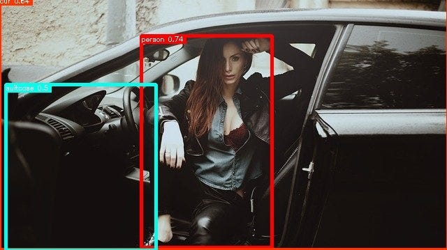
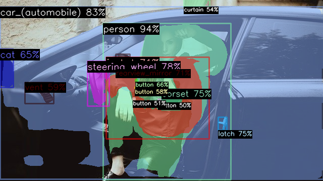
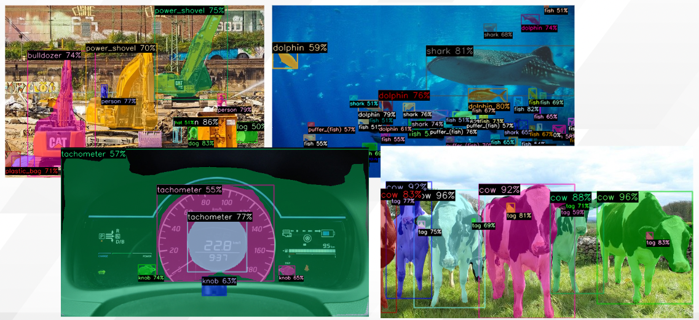
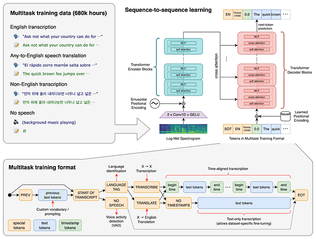
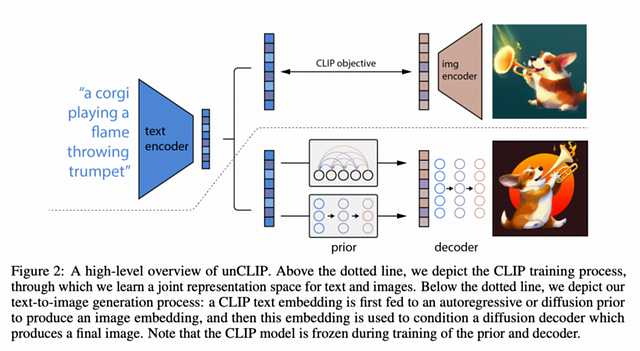
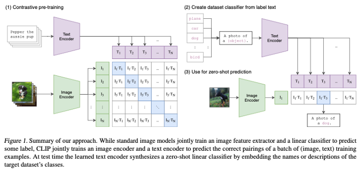
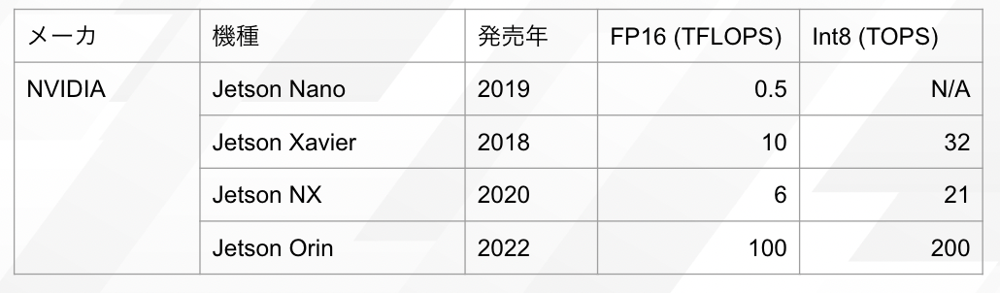
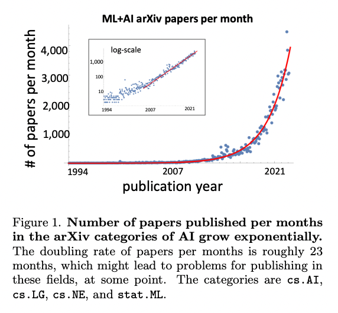

# AIにおける基盤モデルとは何か

# AIにおける基盤モデルとは何か

[Kazuki Kyakuno](https://kyakuno.medium.com/?source=post_page---byline--f3eae44f8bd2---------------------------------------)

10 min read

·

Oct 30, 2022

--

Share

近年、注目を集めている基盤モデルとは何かを解説します。基盤モデルを使用することで、今までできなかったような高精度な認識が可能になってきています。

## 基盤モデルの概要

基盤モデル（Foundation Model）とは、大量のデータから学習することで、高い汎化性能を獲得したAIのことです。Stanford Institute for Human-Centered Artificial Intelligenceによって提唱された概念です。

[## On the Opportunities and Risks of Foundation Models

### AI is undergoing a paradigm shift with the rise of models (e.g., BERT, DALL-E, GPT-3) that are trained on broad data at…

arxiv.org](https://arxiv.org/abs/2108.07258?source=post_page-----f3eae44f8bd2---------------------------------------)

## 基盤モデルの例

論文中、基盤モデルの例として、BERT、GPT-3、CLIPなどが挙げられています。例えば、GPT-3では、1750億個のパラメータを持ち、プロンプトを使用することで、さまざまなタスクの問題を解くことができます。基盤モデルのアーキテクチャ自体は、ディープニューラルネットワークと、自己教師あり学習による一般的なものです。しかし、モデルのパラメータの規模と、学習に使用するデータセットの規模が増大したことで、高い汎化性能を獲得し、基盤モデルとなっています。

## 基盤モデルの効果

基盤モデルの効果を説明するには、COCO2017の11.8万枚で学習されたYOLOXと、ImageNet21Kの1400万枚で自己教師あり学習で学習されたDeticを比較するのがわかりやすいです。

YOLOXはCOCOの80カテゴリの物体を検出します。カテゴリに含まれない物体を検出するには、独自のデータセットを準備して再学習を行う必要がありました。

YOLOXの検出例（画像の出典：Pixabay）

しかし、Deticは21000カテゴリを検出できるため、再学習不要で、大抵のものが学習可能です。

Deticの検出例（画像の出典：Pixabay）

Deticは単一のモデルで分野を問わない多様な認識が可能です。YOLOでは難しかった建設機械の認識や、魚の認識も可能です。また、車のダッシュボードのメータの場所や、牛などの動物、さらには牛の耳のタグも認識可能です。

Press enter or click to view image in full size

Deticの検出例（画像の出典：Pixabay）

[## Detic : 21kクラスを高精度にセグメンテーションできる物体検出モデル

### ailia SDKで使用できる機械学習モデルである「Detic」のご紹介です。「Detic」を使用することで、21kクラスのセグメンテーションを行うことができます。

medium.com](https://medium.com/axinc/detic-21k%E3%82%AF%E3%83%A9%E3%82%B9%E3%82%92%E9%AB%98%E7%B2%BE%E5%BA%A6%E3%81%AB%E3%82%BB%E3%82%B0%E3%83%A1%E3%83%B3%E3%83%86%E3%83%BC%E3%82%B7%E3%83%A7%E3%83%B3%E3%81%A7%E3%81%8D%E3%82%8B%E7%89%A9%E4%BD%93%E6%A4%9C%E5%87%BA%E3%83%A2%E3%83%87%E3%83%AB-1b8f777ee89a?source=post_page-----f3eae44f8bd2---------------------------------------)

## 基盤モデルのモデルアーキテクチャ

従来のConvolutionは画像の2次元構造を人の手によってアーキテクチャとして与えていました。しかし、データセットが十分に大きければ、Convolutionを含む構造自体をAIが獲得可能です。

特に、基盤モデルはデータセットが巨大であるため、ConvolutionよりもVision Transformerを使用する方が性能が高くなっています。そのため、基盤モデルが広がるにつれて、ConvolutionよりもVision Transformerの方が主流になってきています。

[## Vision Transformer: 畳み込み演算を用いない最新画像識別技術

### ailia SDKで使用できる機械学習モデルである「Vision Transformer（以下、ViT）」のご紹介です。 ailia SDKはエッジ向け推論フレームワークであり、ailia…

medium.com](https://medium.com/axinc/vision-transformer-%E7%95%B3%E3%81%BF%E8%BE%BC%E3%81%BF%E6%BC%94%E7%AE%97%E3%82%92%E7%94%A8%E3%81%84%E3%81%AA%E3%81%84%E6%9C%80%E6%96%B0%E7%94%BB%E5%83%8F%E8%AD%98%E5%88%A5%E6%8A%80%E8%A1%93-84f06978a17f?source=post_page-----f3eae44f8bd2---------------------------------------)

## 多様な基盤モデル

大量のデータから学習され、汎化性能を獲得したAIの例となります。

**Whisper**

OpenAIの開発した99言語を認識できる音声認識モデルです。従来、存在すると言われていた日本語の参入障壁を680000時間というデータ量で超えて見せました。日本語に対しても高精度に文字起こしが可能です。

Press enter or click to view image in full size

出典：<https://github.com/openai/whisper>

**DALLE2, Stable Diffusion**

## Get Kazuki Kyakuno’s stories in your inbox

Join Medium for free to get updates from this writer.

Subscribe

Subscribe

Remember me for faster sign in

ノイズに対してデノイズを繰り返す拡散モデルで、画像生成・画像補完などの分野でGANを超える性能を発揮しています。StableDiffusionでは、LAION-5Bの1億7000枚の画像を使用して学習されています。

Press enter or click to view image in full size

出典：<https://cdn.openai.com/papers/dall-e-2.pdf>

[## StableDiffusion : テキストから画像を生成する機械学習モデル

### StableDiffusionはテキストから画像を生成する機械学習モデルです。学習済みモデルが公開されており、PC上で自由に画像を生成することが可能です。

medium.com](https://medium.com/axinc/stablediffusion-%E3%83%86%E3%82%AD%E3%82%B9%E3%83%88%E3%81%8B%E3%82%89%E7%94%BB%E5%83%8F%E3%82%92%E7%94%9F%E6%88%90%E3%81%99%E3%82%8B%E6%A9%9F%E6%A2%B0%E5%AD%A6%E7%BF%92%E3%83%A2%E3%83%87%E3%83%AB-aa3676787a09?source=post_page-----f3eae44f8bd2---------------------------------------)

**CLIP**

任意のテキストを使用して物体識別が行えるモデルです。従来のImage Classificationは、例えば1000カテゴリの認識しか行えませんでしたが、CLIPではZero Shot Classificationが可能であり、任意の単語（例えば”dog”, “cat”）を使用して物体識別が可能です。CLIPはWEB上の4億枚という画像と対応するテキストで学習されています。

DeticもDALLE2もStable Diffusionも、CLIPの特徴ベクトルを使用しており、近年の基盤モデルの基礎となっています。

Press enter or click to view image in full size

出典：<https://arxiv.org/abs/2103.00020>

[## CLIP : 超大規模データセットで事前学習され、再学習なしで任意の物体を識別できる物体識別モデル

### ailia SDKで使用できる機械学習モデルである「CLIP」のご紹介です。「CLIP」を使用することで、任意の物体の識別を行うことが可能です。

medium.com](https://medium.com/axinc/clip-%E8%B6%85%E5%A4%A7%E8%A6%8F%E6%A8%A1%E3%83%87%E3%83%BC%E3%82%BF%E3%82%BB%E3%83%83%E3%83%88%E3%81%A7%E4%BA%8B%E5%89%8D%E5%AD%A6%E7%BF%92%E3%81%95%E3%82%8C-%E5%86%8D%E5%AD%A6%E7%BF%92%E3%81%AA%E3%81%97%E3%81%A7%E4%BB%BB%E6%84%8F%E3%81%AE%E7%89%A9%E4%BD%93%E3%82%92%E8%AD%98%E5%88%A5%E3%81%A7%E3%81%8D%E3%82%8B%E7%89%A9%E4%BD%93%E8%AD%98%E5%88%A5%E3%83%A2%E3%83%87%E3%83%AB-2ebc5c1666f?source=post_page-----f3eae44f8bd2---------------------------------------)

CLIP特徴は画像検索にも使用可能です。

[## Clip front

### Clip front

Clip frontrom1504.github.io](https://rom1504.github.io/clip-retrieval/?back=https%3A%2F%2Fknn5.laion.ai&index=laion5B&useMclip=false&source=post_page-----f3eae44f8bd2---------------------------------------)

## 基盤モデルのコスト

基盤モデルは膨大なデータセットを使用した学習を行う必要があるため、学習には高額の費用が必要です。例えば、Stable Diffusionは学習に60万ドルを必要としており、学習用マシンのGPUメモリは6.9GB必要と言われています。

[## クリエイティブでもAIが力を発揮、進化する画像生成AIの今

### AI（人工知能）が今や、クリエイティブの領域にも進出している。写真や絵画を大量に学習したAIが、新しい画像を生成できるようになったのだ。しかもその腕前は人間に匹敵するか上回るほどであり、本物の写真と見間違えるほどリアルな画像も生成できる。…

xtech.nikkei.com](https://xtech.nikkei.com/atcl/nxt/column/18/02168/082400004/?source=post_page-----f3eae44f8bd2---------------------------------------)

## 基盤モデルの影響

基盤モデルはスーパーコンピュータを使用して高額の費用をかけて学習されています。そのため、小規模なデータセットで学習を行っても、基盤モデルの性能には及ばない可能性があります。

そのため、長期的には学習は行わず、基盤モデルを使用して推論だけを行う、というような利用方法が拡大していくと思われます。基盤モデルに与えるプロンプトを工夫したり、PaDiMのように特徴抽出だけ基盤モデルを使用して後段に従来アルゴリズムを入れるなど、推論における工夫は増加すると考えられます。

ただし、基盤モデルを推論するには高い演算性能が必要です。そのため、AIのハードウェアへの要求性能は今後も増大していくものと考えられます。

Press enter or click to view image in full size

NVIDIAのエッジ端末の処理性能

## 基盤モデルの今後

AI分野の論文数は、23ヶ月ごとに倍になっています。また、2021年のCLIPの登場から、2022年のDETIC、Stable Diffusionなど、一つの基盤モデルから別の基盤モデルが継承的に生み出されていく傾向もあります。

AIの論文数（出典：<https://arxiv.org/pdf/2210.00881.pdf>）

[## Predicting the Future of AI with AI: High-quality link prediction in an exponentially growing…

### A tool that could suggest new personalized research directions and ideas by taking insights from the scientific…

arxiv.org](https://arxiv.org/abs/2210.00881?source=post_page-----f3eae44f8bd2---------------------------------------)

特に、2020年以降、Vision Transformer、Diffusion、NeRFなど、新しいアーキテクチャが続々と登場してきており、AlexNetが登場した2014年のようだという声も聞かれます。さらに、Whisperが登場したことで、従来、難しいと言われていた日本語の壁を、データ量で超えてしまったことも驚きを与えました。

そのため、今後も、コンピューティング資源の増加に伴い、革新的なAIモデルが開発され、その革新的なAIモデルを基礎とする新たなAIモデルが開発されるという連鎖で、かなりのアルゴリズムがAIをベースとしたものに置き換わっていくものと考えられます。

当面、エッジでの計算リソースの関係で、基盤モデルの活用は限定的になる可能性もありますが、計算リソースはハードウェアの進化と共に、増加していくため、どこかのタイミングで基盤モデルが席巻するものと考えられます。

NVIDIAの次世代車載半導体のDRIVE Atlanは1000TOPSと言われていますし、その時は意外と早いのかもしれません。

ax株式会社はAIを実用化する会社として、クロスプラットフォームでGPUを使用した高速な推論を行うことができるailia SDKを開発しています。ax株式会社ではコンサルティングからモデル作成、SDKの提供、AIを利用したアプリ・システム開発、サポートまで、 AIに関するトータルソリューションを提供していますのでお気軽に[お問い合わせ](https://axinc.jp/)ください。