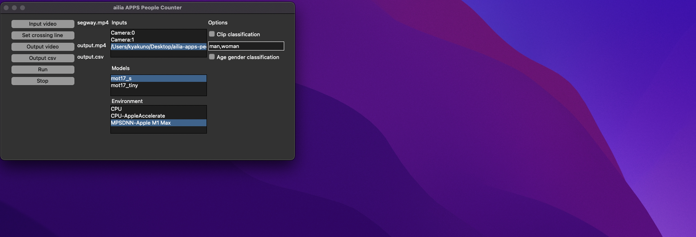
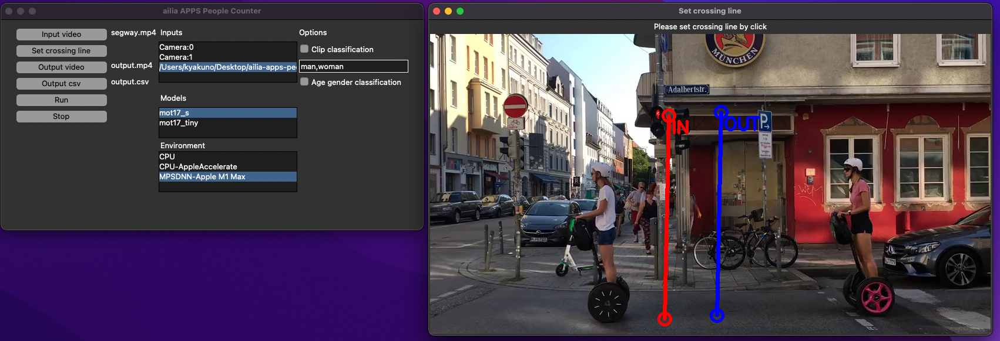
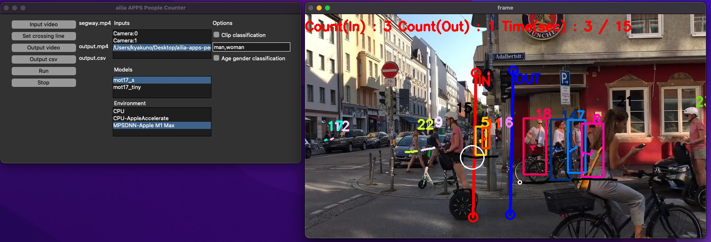
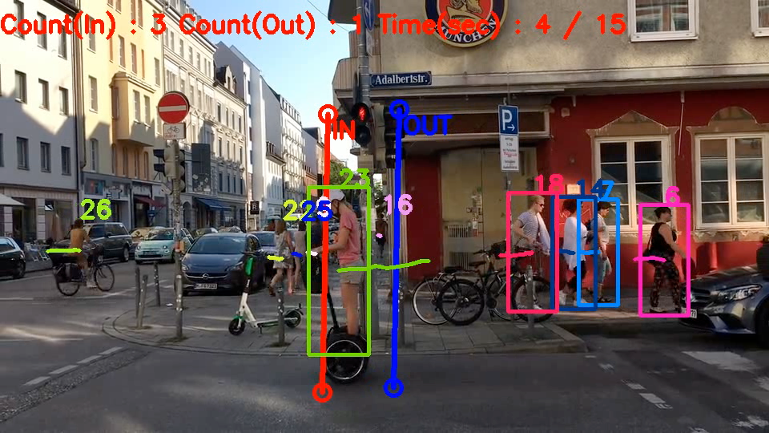
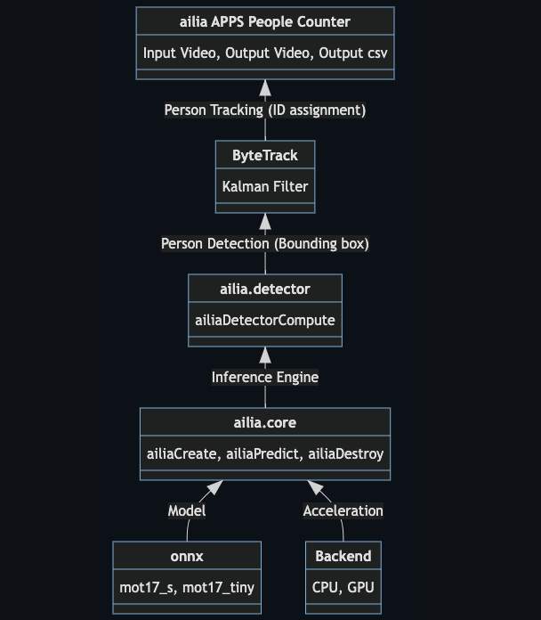
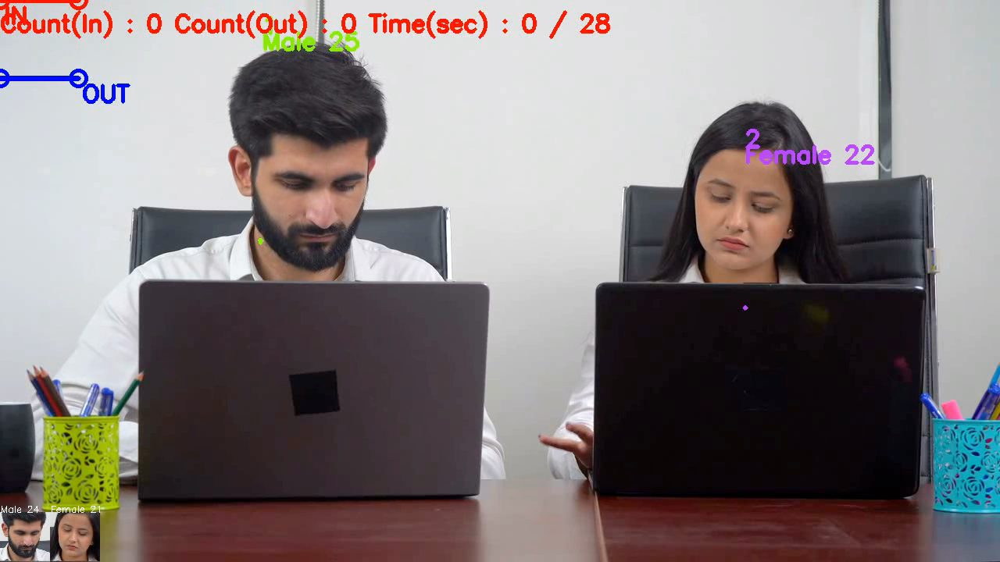
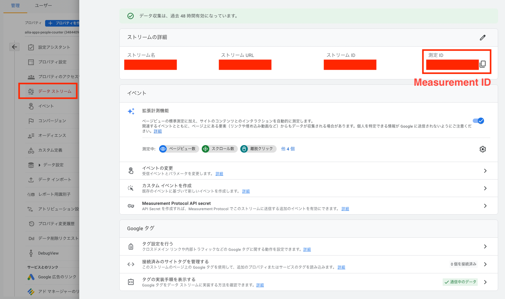
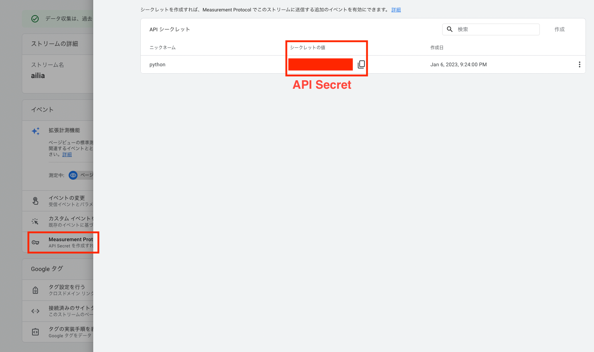
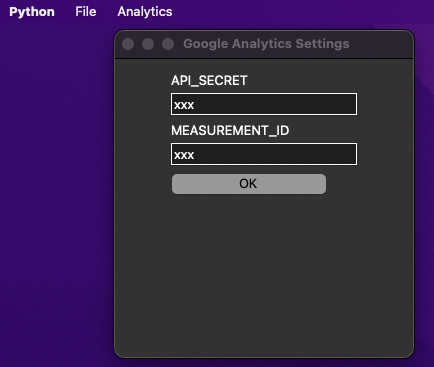
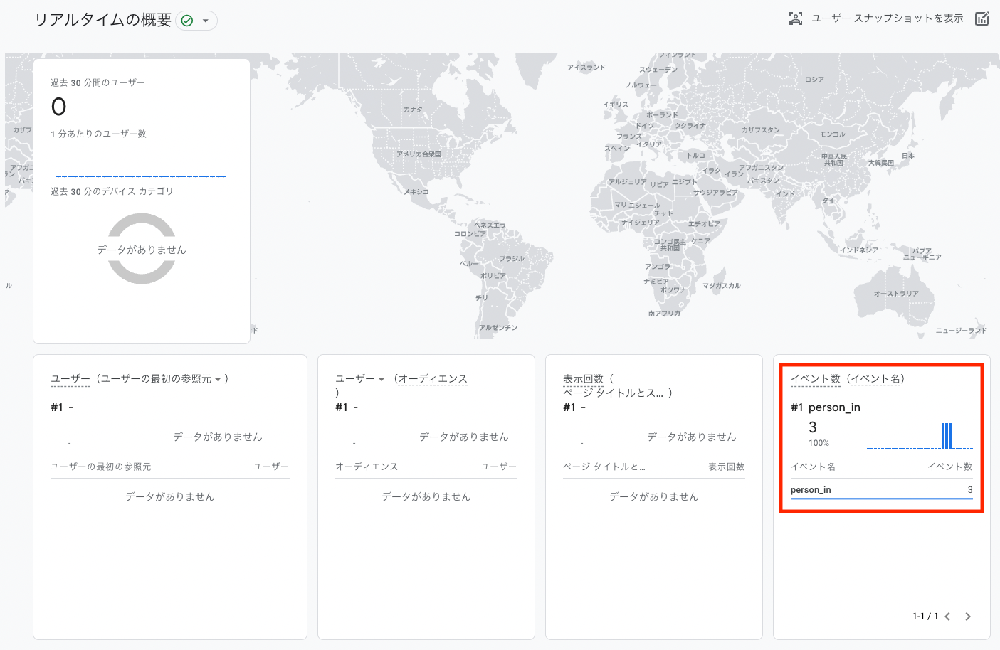

# ailia APPS People Counter : 人流解析を行うことができるAIアプリ

# ailia APPS People Counter : 人流解析を行うことができるAIアプリ

[](https://kyakuno.medium.com/?source=post_page---byline--a914c94f15dc---------------------------------------)

[Kazuki Kyakuno](https://kyakuno.medium.com/?source=post_page---byline--a914c94f15dc---------------------------------------)

9 min read

·

Dec 20, 2022

--

Share

ailia SDKを使用して人流解析を行うことができるailia APPS People Counterのご紹介です。任意の直線をGUIで設定し、入場と退場の人数を数えることができます。

## ailia APPS People Counterについて

ailia APPS People Counterはailia SDKを使用して開発した人流解析を行うことができるAIアプリです。オープンソースで開発しており、ailia SDKのライセンスがあれば自由に使用することが可能です。

## Get Kazuki Kyakuno’s stories in your inbox

Join Medium for free to get updates from this writer.

Subscribe

Subscribe

Remember me for faster sign in

実行例の動画は下記となります。

動画の出典：<https://pixabay.com/ja/videos/%E3%82%BB%E3%82%B0%E3%82%A6%E3%82%A7%E3%82%A4%E3%82%B9%E3%82%AF%E3%83%BC%E3%82%BF%E3%83%BC-%E4%BA%BA%E3%80%85-%E5%8B%95%E3%81%8F-28146/>

## ailia APPS People Counterの動作環境

Windows、macOS、Linux、Jetsonで動作します。実行にはPythonが必要です。

## ailia APPS People Counterの使用方法

ソースコードをcloneします。

```
git clone https://github.com/axinc-ai/ailia-apps-people-counter
```

[## GitHub - axinc-ai/ailia-apps-people-counter: Count the number of people crossing a line from AI…

### Count the number of people crossing a line from a video using an AI model for people detection and tracking. People…

github.com](https://github.com/axinc-ai/ailia-apps-people-counter?source=post_page-----a914c94f15dc---------------------------------------)

依存ライブラリをインストールします。

```
pip3 install lap
```

GUIを起動します。

```
python3 ailia-apps-people-counter.py
```

Press enter or click to view image in full size



起動したGUI

Input videoボタンを押して動画ファイルを選択します。Set crossing lineボタンを押して、画面をクリックすることで、2本の線を引きます。

Press enter or click to view image in full size



計測線の指定

Runボタンを押して、計測を開始します。人物の中心点の軌跡が、OUT -> INの線と交差したら入場、IN -> OUTの線と交差したら退場としてカウントします。

Press enter or click to view image in full size



計測画面

## ailia APPS People Counterの動画出力

Output videoボタンで出力先の動画ファイルを指定することができます。

Press enter or click to view image in full size



出力動画の例

## ailia APPS People CounterのCSV出力

Output csvボタンで出力先のcsvファイルを指定することができます。CSVファイルの出力の例です。1秒ごとに、通過人数が記載されます。

```
time(sec) , count(in) , count(out) , total_count(in) , total_count(out)  
0 , 0 , 0 , 0 , 0  
1 , 1 , 1 , 1 , 1  
2 , 1 , 1 , 2 , 2
```

## ailia APPS People Counterのアーキテクチャ

mot17データセットで学習されたyolox\_sで人物を検出します。次に、bytetrackを使用して人物をトラッキングしてIDを付与します。最後に、IDごとの軌跡と直線との交差判定を行い、カウントアップを行います。AIの高速推論にはailia SDKを使用しています。



アーキテクチャ

mot17\_sは1088x608解像度、mot17\_tinyは416x416解像度で人物検知を行います。

## ailia APPS People Counterのオプション

人が線を横切った際に、人に対して属性推定を行うことができます。属性推定を有効にするには、Clip classificationもしくはAge Gender classificationのチェックボックスを有効にします。

### Clip classification

任意のテキストで属性を指定し、全身の画像を使用して最もマッチしたテキストを属性として反映します。例えば、”man”と”woman”という属性を指定することで、性別推定を行うことが可能です。

[## CLIP : 超大規模データセットで事前学習され、再学習なしで任意の物体を識別できる物体識別モデル

### ailia SDKで使用できる機械学習モデルである「CLIP」のご紹介です。「CLIP」を使用することで、任意の物体の識別を行うことが可能です。

medium.com](https://medium.com/axinc/clip-%E8%B6%85%E5%A4%A7%E8%A6%8F%E6%A8%A1%E3%83%87%E3%83%BC%E3%82%BF%E3%82%BB%E3%83%83%E3%83%88%E3%81%A7%E4%BA%8B%E5%89%8D%E5%AD%A6%E7%BF%92%E3%81%95%E3%82%8C-%E5%86%8D%E5%AD%A6%E7%BF%92%E3%81%AA%E3%81%97%E3%81%A7%E4%BB%BB%E6%84%8F%E3%81%AE%E7%89%A9%E4%BD%93%E3%82%92%E8%AD%98%E5%88%A5%E3%81%A7%E3%81%8D%E3%82%8B%E7%89%A9%E4%BD%93%E8%AD%98%E5%88%A5%E3%83%A2%E3%83%87%E3%83%AB-2ebc5c1666f?source=post_page-----a914c94f15dc---------------------------------------)

CSVには末尾に属性ごとのカウントが付与されます。

```
time(sec) , count(in) , count(out) , total_count(in) , total_count(out) , man , woman  
0 , 0 , 0 , 0 , 0 , 0 , 0  
1 , 1 , 1 , 1 , 1 , 1 , 1
```

### Age gender classification

Intelの開発したAgeGenderRecognitionRetailを使用して、顔の画像を使用して性別と年齢を属性として反映します。顔が検知できなかった場合はUnknownとなります。

Press enter or click to view image in full size



出典：<https://pixabay.com/ja/videos/%E3%82%AA%E3%83%95%E3%82%A3%E3%82%B9-%E4%BC%81%E6%A5%AD-%E4%BB%95%E4%BA%8B-%E9%AD%85%E5%8A%9B%E7%9A%84-95124/>

[## AgeGenderRecognitionRetail : 年齢と性別を予測する機械学習モデル

### ailia SDKで使用できる機械学習モデルである「AgeGenderRecognitionRetail」のご紹介です。「AgeGenderRecognitionRetail」を使用することで顔画像から年齢と性別を識別することができます。

medium.com](https://medium.com/axinc/agegenderrecognitionretail-%E5%B9%B4%E9%BD%A2%E3%81%A8%E6%80%A7%E5%88%A5%E3%82%92%E4%BA%88%E6%B8%AC%E3%81%99%E3%82%8B%E6%A9%9F%E6%A2%B0%E5%AD%A6%E7%BF%92%E3%83%A2%E3%83%87%E3%83%AB-3632935d19ec?source=post_page-----a914c94f15dc---------------------------------------)

CSVには末尾に属性情報が付与されます。

```
time(sec) , count(in) , count(out) , total_count(in) , total_count(out) , age_gender(list)  
0 , 0 , 0 , 0 , 0  
1 , 1 , 0 , 1 , 0 , Male 25  
2 , 1 , 1 , 2 , 1 , Unknown , Male 38
```

### 属性推定の精度検証用のオプション

Always classify for debugのチェックボックスを有効にすることで、線を横切っていない場合も常に属性検出を有効化することができます。このオプションを使用することで、より簡易的にWEBカメラや動画などを使用した属性推定の精度検証が可能です。

### Google Analyticsとの連携

Google Analytics (GA4)のMeasurement APIを使用したGoogle Analyticsへの連携が可能です。

[## Measurement Protocol (Google Analytics 4) | Measurement Protocol for Google Analytics 4 | Google…

### The Google Analytics Measurement Protocol for Google Analytics 4 allows developers to enhance web and app streams by…

developers.google.com](https://developers.google.com/analytics/devguides/collection/protocol/ga4?source=post_page-----a914c94f15dc---------------------------------------)

GA4のデータストリームから測定IDを取得します。

Press enter or click to view image in full size



測定IDの取得

GA4のデータストリームのMeasurement ProtocolからAPI Secretを取得します。

Press enter or click to view image in full size



API Secretの取得

ailia APPS People CounterのメニューバーのAnalyticsに取得したAPI Secretと測定IDを設定します。



IDの設定

ailia APPS People Counterを実行すると、イベントとしてperson\_inとperson\_outが反映されます。

Press enter or click to view image in full size



イベントの確認

## ailia APPS People Counterへの機能追加

ailia APPS People CounterはOSSで開発しているため、自由に機能を拡張することが可能です。また、ax株式会社にご要望いただければ、弊社側で機能を追加することも可能です。

## ailia APPS People Counterの応用

ショッピングセンターやイベントにおける来店客数の計測や、どの入り口が最も使用されているかの計測、交通量調査などにご利用いただけます。

ax株式会社はAIを実用化する会社として、クロスプラットフォームでGPUを使用した高速な推論を行うことができるailia SDKを開発しています。ax株式会社ではコンサルティングからモデル作成、SDKの提供、AIを利用したアプリ・システム開発、サポートまで、 AIに関するトータルソリューションを提供していますのでお気軽に[お問い合わせ](https://axinc.jp/)ください。