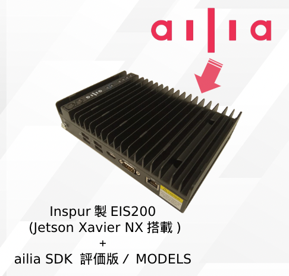
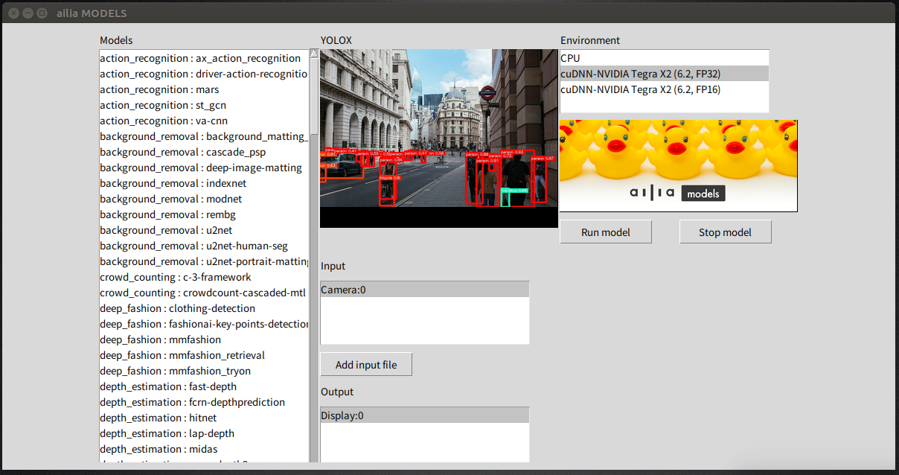

# Jetson NXとailia SDKを搭載したAIハードウェア ailia AI Box

# Jetson NXとailia SDKを搭載したAIハードウェア ailia AI Box

[Kazuki Kyakuno](https://kyakuno.medium.com/?source=post_page---byline--f41daef80e0f---------------------------------------)

Jan 11, 2023

--

Share

Jetson NXとailia SDKを搭載したAIハードウェア ailia AI Boxのご紹介です。ailia AI Boxを使用することで、ailia SDKを使用してすぐに200種類以上のモデルを試すことが可能です。

## ailia AI Boxの概要

ailia AI Boxは株式会社アクセルが販売するAIハードウェアです。NVIDIAのJetson NXと、株式会社アクセルおよびax株式会社が提供するailia SDKを搭載しています。ailia SDKの評価版がプリインストールされているため、すぐに評価と開発を行うことが可能です。

ailia AI Boxの概要

## ailia AI Boxのハードウェア構成

ailia AI Boxのハードウェア構成は下記となります。

> 搭載モジュール：Jetson Xavier NX（21 TOPS）  
> メモリー容量：8GB  
> 内蔵ストレージ：64GB  
> 同梱ACアダプター：AC100V入力 / DC12V出力  
> 同梱シリアル変換ケーブル：シリアルポート RS232 & RS485

ailia AI Boxのインタフェースは下記となります。USB経由でWEBカメラも接続可能です。

> ビデオ出力： 1 × HDMI 2.0  
> ネットワークインターフェース ：1 × RJ45 GbEネットワークインターフェース、IEEE 802.3af対応PoE-PDインターフェース  
> USBポート： 2 × USB 3.0および2 × USB 2.0ポート

## ailia AI Boxでできること

ailia AI BoxにはLinux、Jetpack4.4、Python3、ailia SDKがプリインストールされているため、ailia MODELSに公開されている200種類以上のモデルをすぐに試すことが可能です。

Press enter or click to view image in full size

ailia MODELSの起動

[## GitHub - axinc-ai/ailia-models: The collection of pre-trained, state-of-the-art AI models for ailia…

### The collection of pre-trained, state-of-the-art AI models. ailia SDK is a self-contained cross-platform high speed…

github.com](https://github.com/axinc-ai/ailia-models?source=post_page-----f41daef80e0f---------------------------------------)

## ailia AI Boxの活用例

今後、従来アルゴリズムのAIへの置き換えが進んでいくと考えられており、組み込み機器におけるAI活用の増加が見込まれます。

## Get Kazuki Kyakuno’s stories in your inbox

Join Medium for free to get updates from this writer.

Subscribe

Subscribe

Remember me for faster sign in

そのためには、今、AIで何ができるのか、どれくらいのスペックが必要なのかの見積りが必要です。

組み込み機器に向けたAI開発を行う際、まずは環境の整っているJetsonを搭載したailia AI Boxを使用することで、実際にAIで何がどこまでできるのかを確認していただくことが可能です。

その上で、必要なSoCのスペックを計算し、Jetsonで量産するという方法と、ailia SDKのクロスプラットフォームの特徴を活かして、その他のSoCで量産するという方法を選択いただくことが可能です。

## ailia AI Boxのご購入

ailia AI Boxのご購入については、ax株式会社までお問い合わせください。

[## ax Inc.

### ax株式会社のコーポレートサイトです。あらゆるデバイスにAI が載る未来。そのような未来が来ることを我々は信じています。その未来に向けて我々は高速なSDK を開発し、最新のAI モデルを常に研究し続けます。ax 株式会社は最新のAI…

axinc.jp](https://axinc.jp/?source=post_page-----f41daef80e0f---------------------------------------)

ax株式会社はAIを実用化する会社として、クロスプラットフォームでGPUを使用した高速な推論を行うことができるailia SDKを開発しています。ax株式会社ではコンサルティングからモデル作成、SDKの提供、AIを利用したアプリ・システム開発、サポートまで、 AIに関するトータルソリューションを提供していますのでお気軽に[お問い合わせ](https://axinc.jp/)ください。