# ailia MODELSの用途別の推奨モデル

# ailia MODELSの用途別の推奨モデル

[](https://kyakuno.medium.com/?source=post_page---byline--8a3b54400497---------------------------------------)

[Kazuki Kyakuno](https://kyakuno.medium.com/?source=post_page---byline--8a3b54400497---------------------------------------)

24 min read

·

Nov 7, 2022

--

Share

ailia MODELSはax株式会社が提供するOSSをベースとしたモデルライブラリです。本記事では、用途別の推奨モデルを紹介します。

## ailia MODELSについて

ailia MODELSはax株式会社が提供するOSSをベースとしたモデルライブラリです。240種類以上のモデルをONNXに変換して提供しており、静止画や動画を入力して、簡単に色々なモデルを試すことが可能です。本記事では、用途別の推奨モデルを紹介します。

Press enter or click to view image in full size

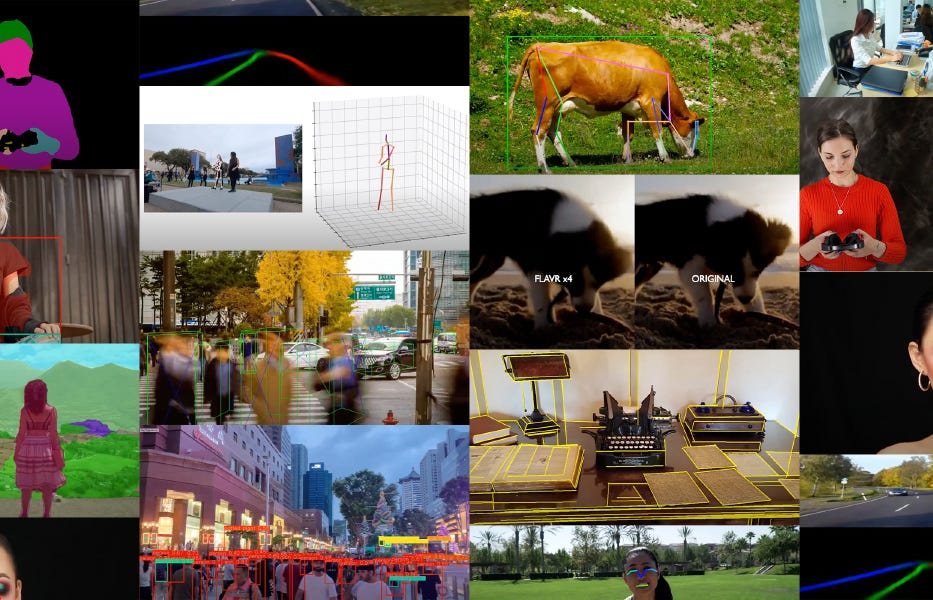

ailia MODELS（画像の出典：Pixabay）

[## ax Inc.

### ax株式会社のコーポレートサイトです。あらゆるデバイスにAI が載る未来。そのような未来が来ることを我々は信じています。その未来に向けて我々は高速なSDK を開発し、最新のAI モデルを常に研究し続けます。ax 株式会社は最新のAI…

axinc.jp](https://axinc.jp/solutions/ailia_models.html?source=post_page-----8a3b54400497---------------------------------------)

## 物体検出

物体検出は、画像から2DのBounding Boxとクラスラベルを計算します。

### YOLOX

物体検出で広く使用されているYOLOの2021年版です。YOLOXはApache Licenseで使用しやすく、学習時にStrong Augumentationが適用されており、汎化性能に優れています。nano、tiny、s、m、l、xの6モデルがあり、要求される精度に応じて切り替え可能です。yolox-sのM1 Mac + ailia SDKでの参考推論速度は20msです。

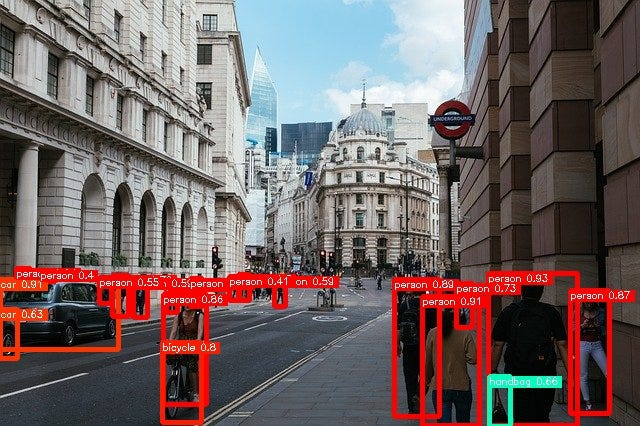

Image from <https://pixabay.com/ja/photos/%E3%83%AD%E3%83%B3%E3%83%89%E3%83%B3%E5%B8%82-%E9%8A%80%E8%A1%8C-%E3%83%AD%E3%83%B3%E3%83%89%E3%83%B3-4481399/>

[## ailia-models/object\_detection/yolox at master · axinc-ai/ailia-models

### (Image from…

github.com](https://github.com/axinc-ai/ailia-models/tree/master/object_detection/yolox?source=post_page-----8a3b54400497---------------------------------------)

少し変わった使い方としては、-dwと-dhオプションを付与することで、認識解像度を変更することが可能です。小さい物体を検出したい場合に使用します。

```
$ python3 yolox.py -dw 1280 -dh 1280
```

### DETIC

YOLOXの80カテゴリに含まれる物体以外を認識したい場合は、DETICが使用可能です。基盤モデルであり、推論には時間がかかりますが、大抵のものを認識可能です。認識対象のクラスは、lvisとin21kから選択可能です。M1 Mac (CPU) + ailia SDKでの参考推論速度は4110msです。

Press enter or click to view image in full size


Image from <https://web.eecs.umich.edu/~fouhey/fun/desk/desk.jpg>

[## ailia-models/object\_detection/detic at master · axinc-ai/ailia-models

### (Image from https://web.eecs.umich.edu/~fouhey/fun/desk/desk.jpg, credit David Fouhey) Automatically downloads the onnx…

github.com](https://github.com/axinc-ai/ailia-models/tree/master/object_detection/detic?source=post_page-----8a3b54400497---------------------------------------)

Deticは重いモデルですが、-dwオプションを付与することで、認識解像度を小さくして高速化することが可能です。

```
$ python3 detic.py -dw 320
```

また、opset16オプションを使用することで、TorchのGridSamplerではなく、ONNXのGridSamplerを使用することが可能です。

```
$ python3 detic.py --opset16
```

## 物体追跡

物体追跡は、画像から2DのBounding Boxを計算し、Bounding Boxを追跡してIDを付与します。

### DeepSort

カルマンフィルタによるSortアルゴリズムと、同一人物かどうかを判定するReIDモデルを併用した物体追跡モデルです。YOLOで人物を検出した後、SortアルゴリズムとReIDモデルで人物にIDを付与します。通過人数をカウントしたり、動線を検知したい場合に使用可能です。ReIDのモデルのM1 Mac + ailia SDKでの参考推論速度は一人の特徴抽出につき4msです。この値にYOLOの推論時間が加算されます。

Press enter or click to view image in full size

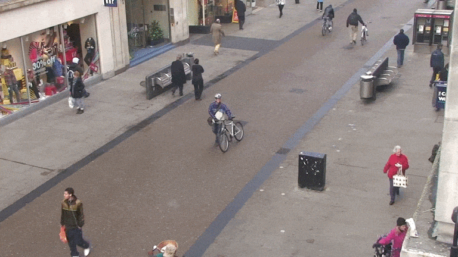

Video from <http://www.robots.ox.ac.uk/~lav/Research/Projects/2009bbenfold_headpose/project.html>

[## ailia-models/object\_tracking/deepsort at master · axinc-ai/ailia-models

### DeepSORT original mode: compare image mode: ['correct\_32\_1.jpg' , 'correct\_32\_2.jpg' ]: SAME person (confidence…

github.com](https://github.com/axinc-ai/ailia-models/tree/master/object_tracking/deepsort?source=post_page-----8a3b54400497---------------------------------------)

### ByteTrack

カルマンフィルタによる追跡に、低いConfidence値を持つBounding Boxとの照合を加えることで高精度化した物体追跡モデルです。追跡対象として人以外にも適用可能であるため、キャリーカートなどの追跡に向いています。ByteTrack自体は非常に高速に動作するため、処理時間はYOLOの処理時間とほぼ等価になります。

Press enter or click to view image in full size

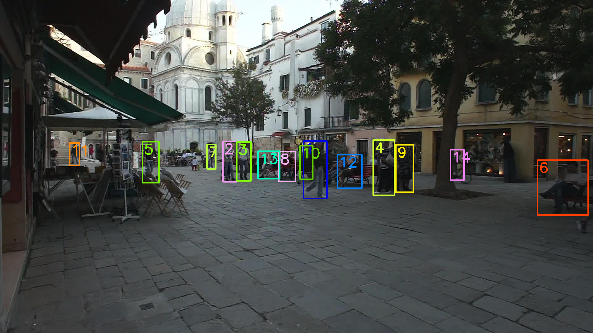

Video from <https://vimeo.com/60139361>

[## ailia-models/object\_tracking/bytetrack at master · axinc-ai/ailia-models

### (Video from https://vimeo.com/60139361) This model requires additional module. Automatically downloads the onnx and…

github.com](https://github.com/axinc-ai/ailia-models/tree/master/object_tracking/bytetrack?source=post_page-----8a3b54400497---------------------------------------)

## セグメンテーション

セグメンテーションは、画像からクラスごとの領域をセグメンテーションします。

### HRNet

高解像度の情報を低解像度に並列に接続することで高精度化したセグメンテーションモデルです。M1 Mac + ailia SDKでの参考推論速度は31.25msです。

Press enter or click to view image in full size

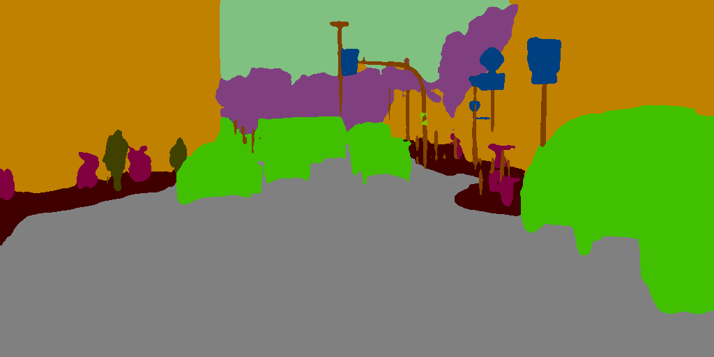

Image from <https://www.cityscapes-dataset.com/>

[## ailia-models/image\_segmentation/hrnet\_segmentation at master · axinc-ai/ailia-models

### (from https://www.cityscapes-dataset.com/) Ailia input shape: (1, 3, 512, 1024) Range:[0, 1] Normal output Smoothed…

github.com](https://github.com/axinc-ai/ailia-models/tree/master/image_segmentation/hrnet_segmentation?source=post_page-----8a3b54400497---------------------------------------)

### PaddleSeg

Baiduの開発した高精度にセグメンテーションを行うモデルです。負荷が高いため、高精度な出力が必要な場合に使用します。道路以外の画像にも適用可能です。M1 Mac + ailia SDKでの参考推論速度は19555msです。

Press enter or click to view image in full size

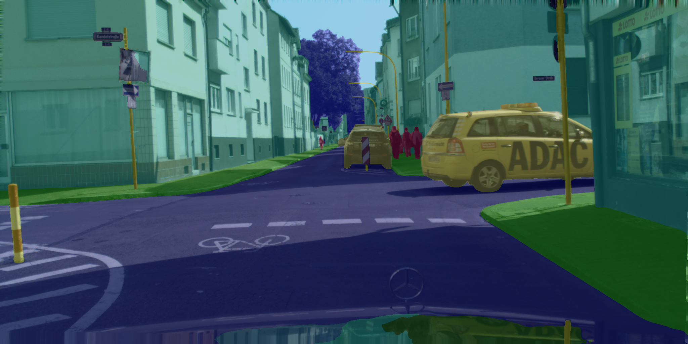

Image from <https://www.cityscapes-dataset.com/downloads/>

[## ailia-models/image\_segmentation/paddleseg at master · axinc-ai/ailia-models

### (Image from https://www.cityscapes-dataset.com/downloads/) Automatically downloads the onnx and prototxt files on the…

github.com](https://github.com/axinc-ai/ailia-models/tree/master/image_segmentation/paddleseg?source=post_page-----8a3b54400497---------------------------------------)

## 2D骨格検出

2D骨格検出は、画像から2Dのキーポイントを計算します。

### LightWeightHumanPoseEstimation

1フレームから複数人のキーポイントを検出し、キーポイントをマージしていくBottomUp型のモデルとなります。推論速度が1フレーム内の人数に依存しないため、速度が重要な用途で使用します。M1 Mac + ailia SDKでの参考推論速度は11msです。


Image from <https://pixabay.com/ja/photos/%E5%A5%B3%E3%81%AE%E5%AD%90-%E7%BE%8E%E3%81%97%E3%81%84-%E8%8B%A5%E3%81%84-%E3%83%9B%E3%83%AF%E3%82%A4%E3%83%88-5204299/>

[## ailia-models/pose\_estimation/lightweight-human-pose-estimation at master · axinc-ai/ailia-models

### (Image from…

github.com](https://github.com/axinc-ai/ailia-models/tree/master/pose_estimation/lightweight-human-pose-estimation?source=post_page-----8a3b54400497---------------------------------------)

### PoseResNet

1人の骨格を検出するTopDown型のモデルとなります。Microsoftの開発したベースラインであり、ResNetベースで安定した出力が得られます。高精度な出力が必要な場合に使用します。M1 Mac + ailia SDKでの参考推論速度は一人当たり27.5msです。この値にYOLOによる物体検出の時間が加算されます。

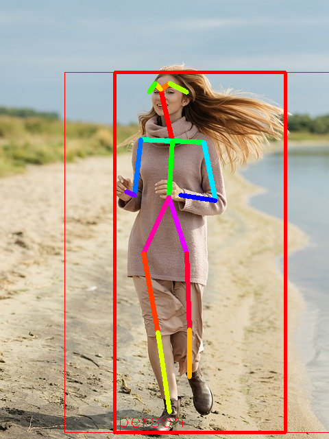

Image from <https://pixabay.com/ja/photos/%E5%A5%B3%E3%81%AE%E5%AD%90-%E7%BE%8E%E3%81%97%E3%81%84-%E8%8B%A5%E3%81%84-%E3%83%9B%E3%83%AF%E3%82%A4%E3%83%88-5204299/>

[## ailia-models/pose\_estimation/pose\_resnet at master · axinc-ai/ailia-models

### (Image from…

github.com](https://github.com/axinc-ai/ailia-models/tree/master/pose_estimation/pose_resnet?source=post_page-----8a3b54400497---------------------------------------)

### MoveNet

1人の骨格を検出するTopDown型のモデルとなります。Googleが開発したモデルであり、動きの速い映像に対してロバストであるため、フィットネスアプリなどに向いたモデルになります。M1 Mac + ailia SDKでの参考推論速度は一人当たりThunderで27.75ms、Lightningで23.25msです。

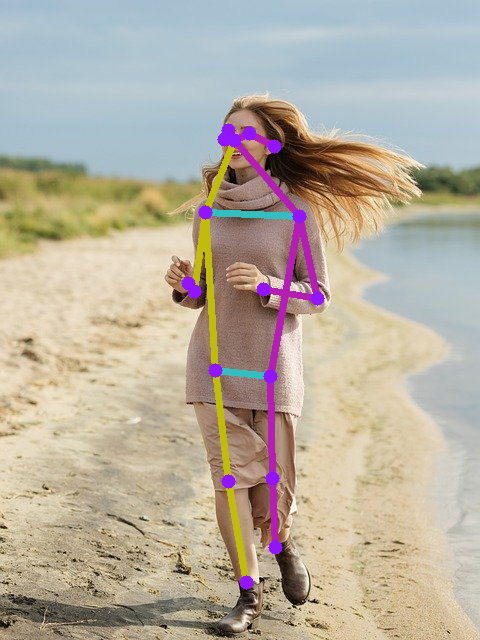

Image from <https://pixabay.com/ja/photos/%E5%A5%B3%E3%81%AE%E5%AD%90-%E7%BE%8E%E3%81%97%E3%81%84-%E8%8B%A5%E3%81%84-%E3%83%9B%E3%83%AF%E3%82%A4%E3%83%88-5204299/>

[## ailia-models/pose\_estimation/movenet at master · axinc-ai/ailia-models

### (Image from…

github.com](https://github.com/axinc-ai/ailia-models/tree/master/pose_estimation/movenet?source=post_page-----8a3b54400497---------------------------------------)

### AnimalPose

動物に対する骨格検出モデルです。犬、猫、牛、馬、羊に適用可能です。YOLOで動物を検出した後、HRNetを使用した骨格検出モデルを適用します。M1 Mac + ailia SDKでの参考推論速度は一体あたり40msです。これにYOLOの処理時間が加算されます。

Press enter or click to view image in full size

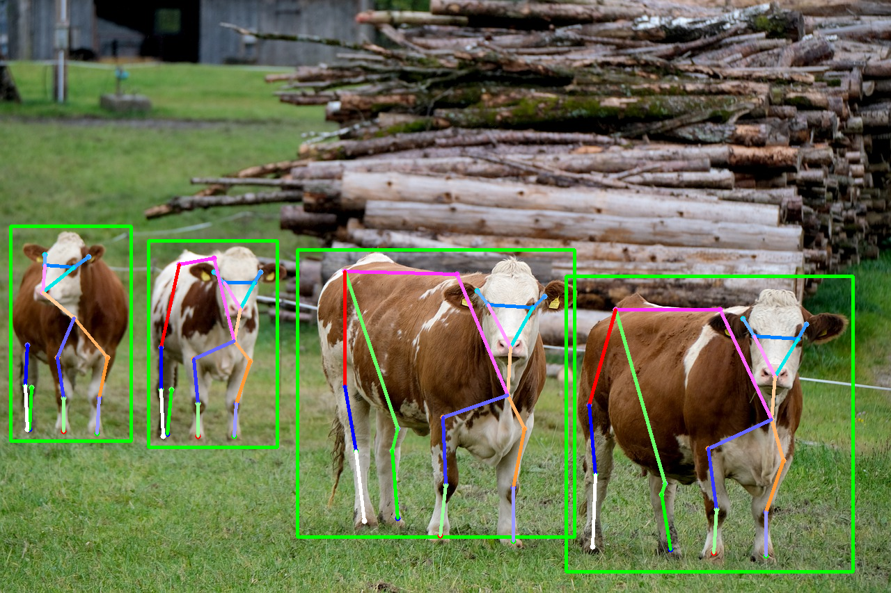

Image from <https://pixabay.com/ja/photos/%e7%89%9b-%e5%ae%b6%e7%95%9c-%e4%b9%b3%e7%89%9b-%e4%b9%b3%e7%94%a8%e7%89%9b-%e5%8b%95%e7%89%a9-5717276/>

[## ailia-models/pose\_estimation/animalpose at master · axinc-ai/ailia-models

### (Image from…

github.com](https://github.com/axinc-ai/ailia-models/tree/master/pose_estimation/animalpose?source=post_page-----8a3b54400497---------------------------------------)

## 3D骨格検出

3D骨格検出は、画像から3Dのキーポイントを計算します。3Dの骨格検出はデータセットのカメラパラメータなどに強く依存しているモデルが多く、実用的なモデルはMediaPipeのモデルとなります。

### BlazePoseFullbody

Googleの開発したモデルで、Z値を含む3Dの骨格を取得可能です。Z値はローカル座標です。M1 Mac + ailia SDKでの参考推論速度は一人当たり59.5msです。

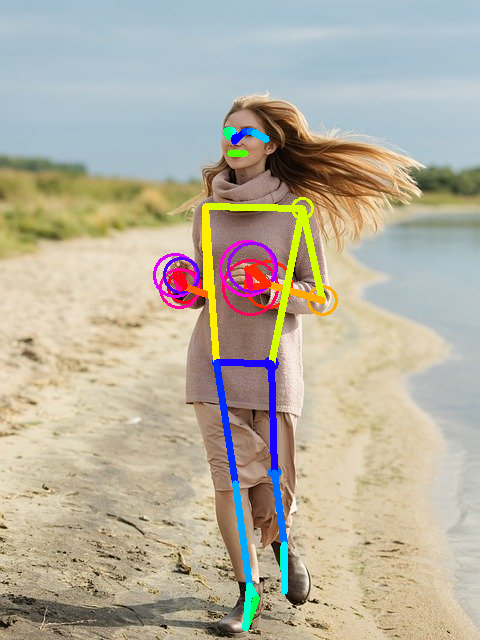

Image from <https://pixabay.com/ja/photos/%E5%A5%B3%E3%81%AE%E5%AD%90-%E7%BE%8E%E3%81%97%E3%81%84-%E8%8B%A5%E3%81%84-%E3%83%9B%E3%83%AF%E3%82%A4%E3%83%88-5204299/>

[## ailia-models/pose\_estimation\_3d/blazepose-fullbody at master · axinc-ai/ailia-models

### (Image from…

github.com](https://github.com/axinc-ai/ailia-models/tree/master/pose_estimation_3d/blazepose-fullbody?source=post_page-----8a3b54400497---------------------------------------)

### MediaPipeWorldLandmarks

Googleの開発したモデルで、メートル単位のワールド座標での3Dの骨格を取得可能です。M1 Mac + ailia SDKでの参考推論速度は一人当たり175.25msです。

Press enter or click to view image in full size

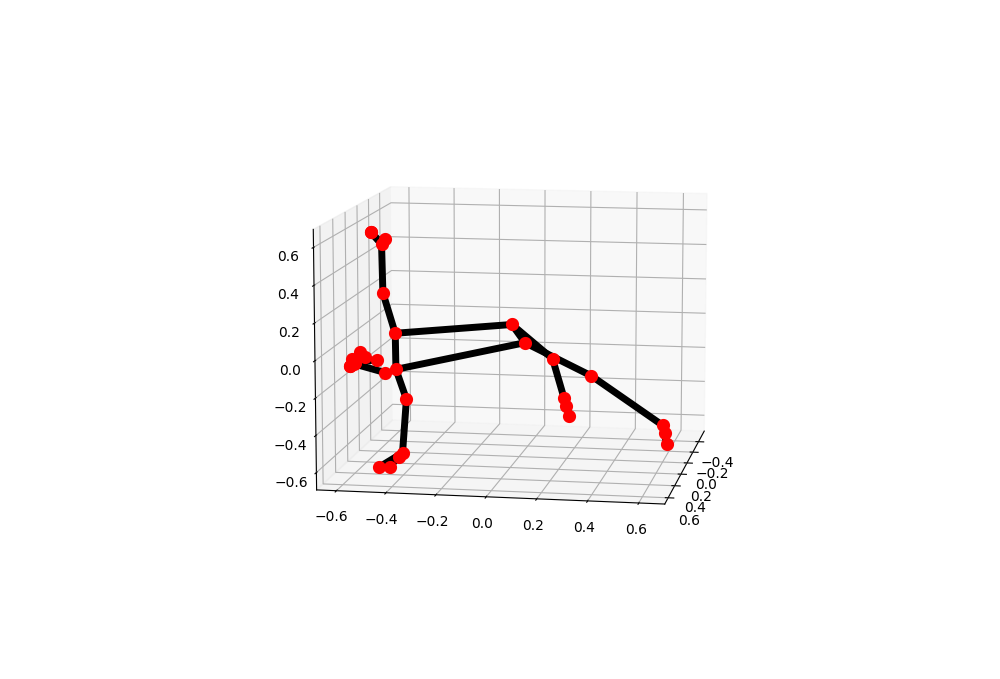

[## ailia-models/pose\_estimation\_3d/mediapipe\_pose\_world\_landmarks at master · axinc-ai/ailia-models

### (Image from https://mediapipe.page.link/pose\_py\_colab) Automatically downloads the onnx and prototxt files on the first…

github.com](https://github.com/axinc-ai/ailia-models/tree/master/pose_estimation_3d/mediapipe_pose_world_landmarks?source=post_page-----8a3b54400497---------------------------------------)

## 顔と手のキーポイント検出

画像から人物の顔と手のキーポイントを計算します。

## Get Kazuki Kyakuno’s stories in your inbox

Join Medium for free to get updates from this writer.

Subscribe

Subscribe

Remember me for faster sign in

### FaceMesh

Googleの開発したモデルで、顔の896点のキーポイントを取得可能です。従来のモデルと、Attentionを使用した新しいモデルを選択可能です。M1 Mac + ailia SDKでの参考推論速度は一人当たり、通常モデルで17.0ms、Attensionモデルで98.0msです。

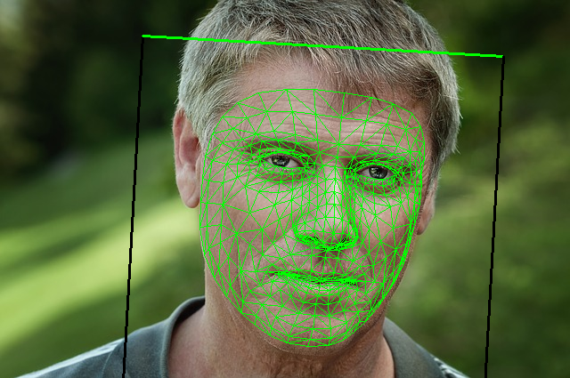

Image from <https://pixabay.com/photos/person-human-male-face-man-view-829966/>

[## ailia-models/face\_recognition/facemesh at master · axinc-ai/ailia-models

### (Image from https://pixabay.com/photos/person-human-male-face-man-view-829966/) ailia input shape: (1, 3, 128, 128) RGB…

github.com](https://github.com/axinc-ai/ailia-models/tree/master/face_recognition/facemesh?source=post_page-----8a3b54400497---------------------------------------)

### BlazeHand

Googleの開発したモデルで、手の位置と、手のキーポイントを取得可能です。M1 Mac + ailia SDKでの参考推論速度は11.75msです。


Image from <https://pixabay.com/photos/stop-no-photo-no-photographing-hand-565609/>

[## ailia-models/hand\_recognition/blazehand at master · axinc-ai/ailia-models

### (Image from https://pixabay.com/photos/stop-no-photo-no-photographing-hand-565609/) ailia input shape: (1, 3, 256, 256)…

github.com](https://github.com/axinc-ai/ailia-models/tree/master/hand_recognition/blazehand?source=post_page-----8a3b54400497---------------------------------------)

### MediapipeHolistic

BlazePose、FaceMesh、BlazeHandを使用して、骨格・顔・手のキーポイントをまとめて取得します。

Press enter or click to view image in full size

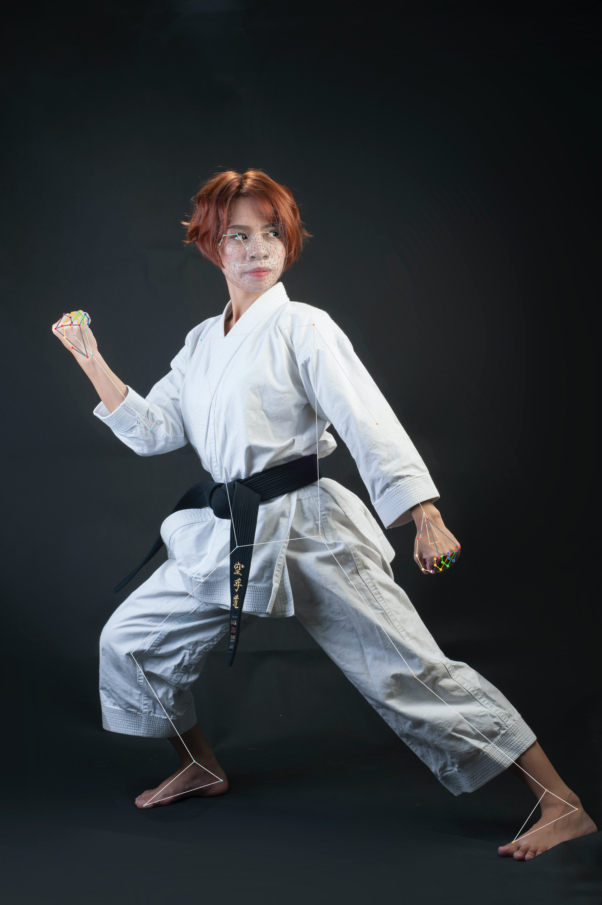

出典：<https://colab.research.google.com/drive/1uCuA6We9T5r0WljspEHWPHXCT_2bMKUy>

[## ailia-models/pose\_estimation/mediapipe\_holistic at master · axinc-ai/ailia-models

### (Image from https://mediapipe.page.link/pose\_py\_colab) Automatically downloads the onnx and prototxt files on the first…

github.com](https://github.com/axinc-ai/ailia-models/tree/master/pose_estimation/mediapipe_holistic?source=post_page-----8a3b54400497---------------------------------------)

detectorオプションを付与することで、複数人検知が可能です。

```
$ python3 mediapipe_holistic.py --detector
```

## 道路検出

道路検出は、画像から道路の領域をセグメンテーションします。

### RoadSegmentationAdas

Intelの開発したモデルで、日本の道路でも高精度に走行可能領域と車線を検知可能です。M1 Mac + ailia SDKでの参考推論速度は43.5msです。

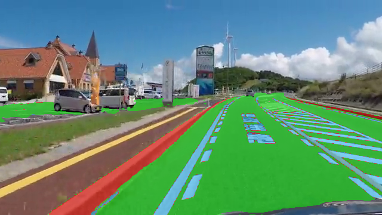

Image from <https://www.pexels.com/ja-jp/video/854669/>

[## ailia-models/road\_detection/road-segmentation-adas at master · axinc-ai/ailia-models

### (Image from https://www.pexels.com/ja-jp/video/854669/) Shape : (1, 512, 896, 3) BGR channel order Shape : (1, 512…

github.com](https://github.com/axinc-ai/ailia-models/tree/master/road_detection/road-segmentation-adas?source=post_page-----8a3b54400497---------------------------------------)

## 不良検知

不良検知は、正常品の画像から学習し、不良箇所の領域をセグメンテーションします。

### PaDiM

200枚程度の正常品の学習でデータの分布を作成し、共分散行列によるマハラノビス距離で不良検知を行えるモデルです。特徴抽出にResNetを使用します。M1 Mac + ailia SDKでの参考推論速度は379.25msです。うち、ResNet18の処理時間が6ms、EmbeddingVectorsの取得が40ms、マハラノビス距離の計算が333msです。

Press enter or click to view image in full size

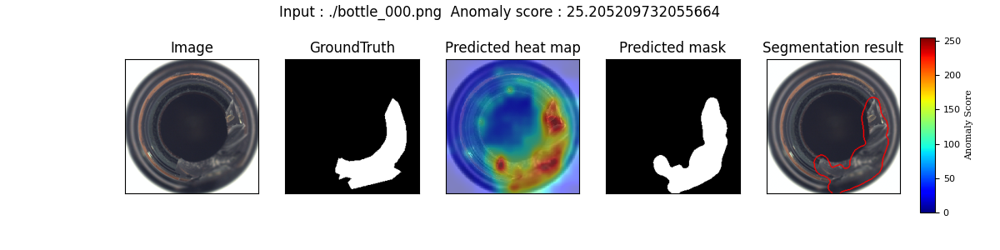

Image from MVTec AD datasets <https://www.mvtec.com/company/research/datasets/mvtec-ad/>

[## ailia-models/anomaly\_detection/padim at master · axinc-ai/ailia-models

### Normal images (Image from MVTec AD datasets https://www.mvtec.com/company/research/datasets/mvtec-ad/) Original image…

github.com](https://github.com/axinc-ai/ailia-models/tree/master/anomaly_detection/padim?source=post_page-----8a3b54400497---------------------------------------)

PaDiMでは、axで独自に開発したGUIによる実行も可能です。Train imagesで正常品画像を与え、Test imagesで不良画像を与え、Trainボタンを押して学習したあと、Testボタンを押すことで、不良検知の結果を取得することが可能です。

Press enter or click to view image in full size

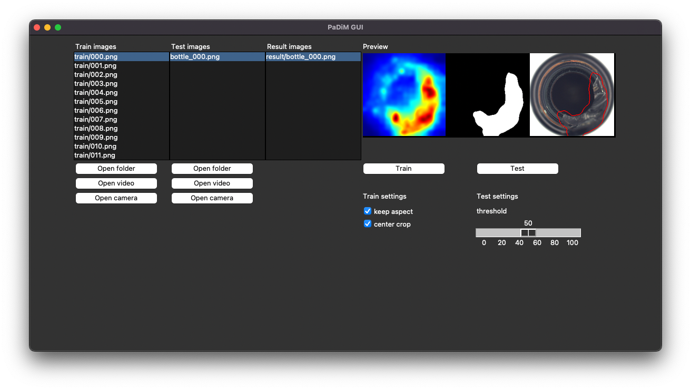

PaDiM GUI

GUIの実行には下記のコマンドを使用します。

```
$ python3 padim_gui.py
```

## 背景切り抜き

背景切り抜きは、画像から前景部分をセグメンテーションし、前景を切り出します。

### U2Net

画像から背景を切り抜けるモデルです。人に限らず、安定して背景分離を行うことが可能です。M1 Mac + ailia SDKでの参考推論速度はU2Netで47.5ms、U2NetP（-a small）で24.0msです。

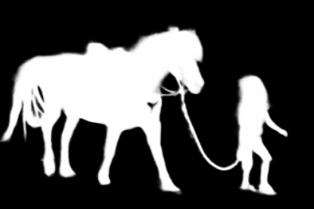

Image from <https://github.com/NathanUA/U-2-Net/blob/master/test_data/test_images/girl.png>

[## ailia-models/background\_removal/u2net at master · axinc-ai/ailia-models

### (Image from https://github.com/NathanUA/U-2-Net/blob/master/test\_data/test\_images/girl.png) Ailia input shape: (1, 3…

github.com](https://github.com/axinc-ai/ailia-models/tree/master/background_removal/u2net?source=post_page-----8a3b54400497---------------------------------------)

compositeオプションを付与すると、背景を切り抜いたPNGを生成することも可能です。

```
$ python3 u2net.py --input input.png --savepath output.png --composite
```

### RemBG

U2Netの出力から、TRIMAP（背景、中間、前景の3値を持つ画像）を作成し、AlphaMattingによって高精度化するモデルです。U2Netに後処理を加えることで、高精度化が可能です。M1 Mac + ailia SDKでの参考推論速度は511.75msです。うち、U2Netの処理時間は50.25msです。

Press enter or click to view image in full size

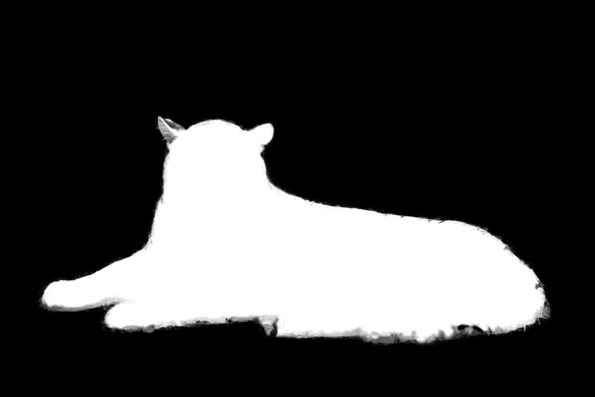

Image from <https://github.com/danielgatis/rembg/blob/main/examples/animal-1.jpg>

[## ailia-models/background\_removal/rembg at master · axinc-ai/ailia-models

### (Image from https://github.com/danielgatis/rembg/blob/main/examples/animal-1.jpg) This model requires additional…

github.com](https://github.com/axinc-ai/ailia-models/tree/master/background_removal/rembg?source=post_page-----8a3b54400497---------------------------------------)

## 深度推定

震度推定は、画像から奥行きを示すデプスマップを計算します。

### Midas

単眼の画像から、奥行きを推定するモデルです。複数のデータセットを混ぜて学習しており、高い汎化性能があります。M1 Mac + ailia SDKでの参考推論速度は60.5msです。


Image from kitti dataset <http://www.cvlibs.net/datasets/kitti/raw_data.php>

[## ailia-models/depth\_estimation/midas at master · axinc-ai/ailia-models

### (Image from kitti dataset http://www.cvlibs.net/datasets/kitti/raw\_data.php) Shape : (1, 3, h, w) Shape : (1, h, w)…

github.com](https://github.com/axinc-ai/ailia-models/tree/master/depth_estimation/midas?source=post_page-----8a3b54400497---------------------------------------)

## OCR

OCRは、画像から文字を読み取ります。

### PaddleOCR

Baiduの開発した日本語も認識できるリアルタイムOCRモデルです。CRAFTを使用して文字の位置を検知し、検出した文字を読み取ります。また、日本語に対しては、axで独自に学習した高精度サーバモデルも使用可能です。M1 Mac + ailia SDKでの参考推論速度は2667msです。うち、文字の位置の検出に148ms、54単語の方向の検出に437ms、54単語の読み取りが1398msです。文字の方向と読み取りの処理時間は、単語数に比例します。

Press enter or click to view image in full size

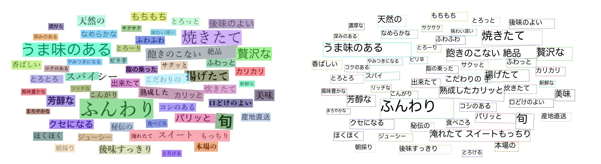

from <https://github.com/PaddlePaddle/PaddleOCR/tree/dygraph/doc/imgs>

[## ailia-models/text\_recognition/paddleocr at master · axinc-ai/ailia-models

### (from https://github.com/PaddlePaddle/PaddleOCR/tree/dygraph/doc/imgs) Automatically downloads the onnx and prototxt…

github.com](https://github.com/axinc-ai/ailia-models/tree/master/text_recognition/paddleocr?source=post_page-----8a3b54400497---------------------------------------)

PaddleOCRでは、axで独自に学習した日本語向けの高精度モデルも使用可能です。

```
$ python paddleocr.py -i input.png -c server
```

## 音声認識

音声認識では、音声ファイルやマイクから文字起こしや個人識別を行います。

### Whisper

OpenAIが開発した日本語を含む99言語の文字起こしを行える音声認識モデルです。音声ファイルを入力として、テキストを出力可能です。680000時間という膨大な音声データから学習することで、日本語を含む99言語で、高精度な音声認識を実現しています。

[## ailia-models/audio\_processing/whisper at master · axinc-ai/ailia-models

### Audio file Recognized speech text He hoped there would be stew for dinner, turnips and carrots and bruised potatoes and…

github.com](https://github.com/axinc-ai/ailia-models/tree/master/audio_processing/whisper?source=post_page-----8a3b54400497---------------------------------------)

### AutoSpeech

声から同一人物判定を行える音声認識モデルです。声から特徴ベクトルを取得し、特徴ベクトル同士の距離計算を行うことで、同一人物判定を行います。Whisperと合わせて使用することで、話者分離に利用することができます。

[## ailia-models/audio\_processing/auto\_speech at master · axinc-ai/ailia-models

### Audio file Wav file from The VoxCeleb1 Dataset https://www.robots.ox.ac.uk/~vgg/data/voxceleb/vox1.html Default input…

github.com](https://github.com/axinc-ai/ailia-models/tree/master/audio_processing/auto_speech?source=post_page-----8a3b54400497---------------------------------------)

## ailia MODELSについて

### セットアップ

ailia MODELSのセットアップ方法については、下記のチュートリアルを参照してください。

[## ailia-models/TUTORIAL\_jp.md at master · axinc-ai/ailia-models

### このチュートリアルでは、python言語からailiaを使用する方法について解説します。…

github.com](https://github.com/axinc-ai/ailia-models/blob/master/TUTORIAL_jp.md?source=post_page-----8a3b54400497---------------------------------------)

### ランチャー

ailia MODELSにはランチャーが含まれており、任意の画像や動画に対して簡単にAI処理が可能です。

```
python3 launcher.py
```

Press enter or click to view image in full size

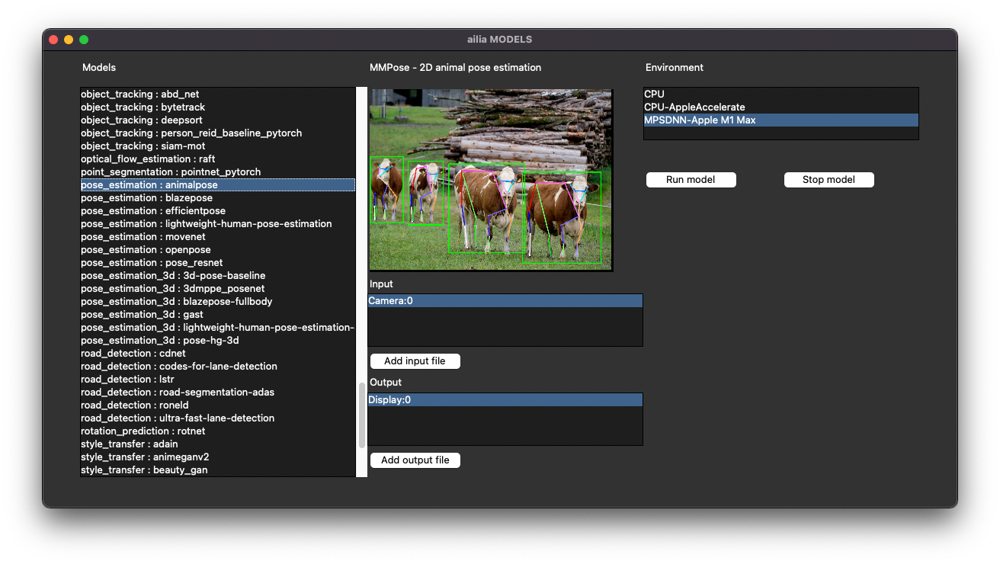

ailia MODELS Launcher

ax株式会社はAIを実用化する会社として、クロスプラットフォームでGPUを使用した高速な推論を行うことができるailia SDKを開発しています。ax株式会社ではコンサルティングからモデル作成、SDKの提供、AIを利用したアプリ・システム開発、サポートまで、 AIに関するトータルソリューションを提供していますのでお気軽に[お問い合わせ](https://axinc.jp/)ください。