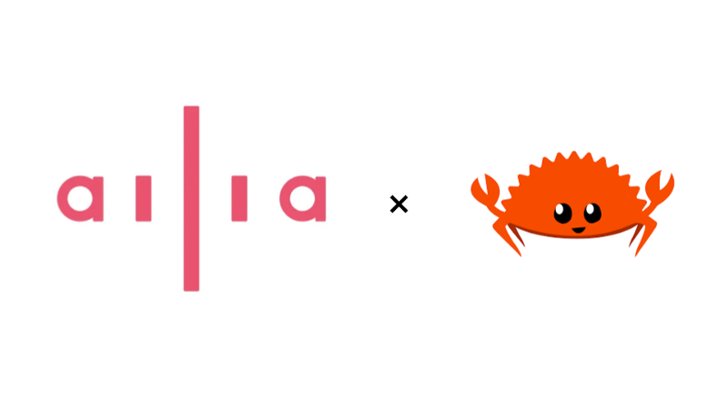
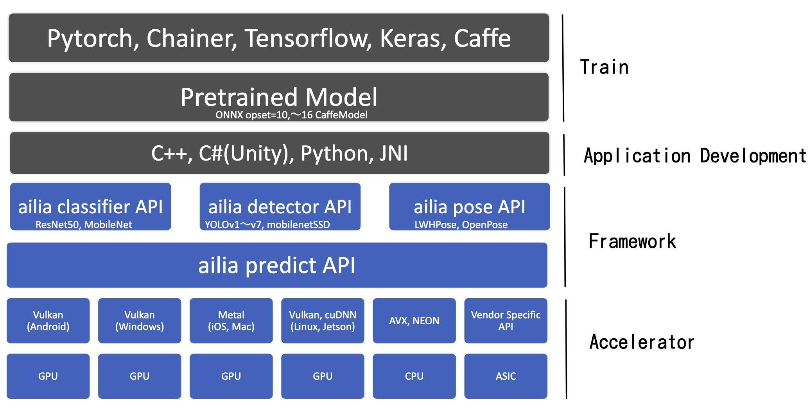

# ailia をRustから使用する

# ailia をRustから使用する

[](https://medium.com/@kondo_98024?source=post_page---byline--9ff51677a469---------------------------------------)

[Kondo](https://medium.com/@kondo_98024?source=post_page---byline--9ff51677a469---------------------------------------)

18 min read

·

Feb 14, 2023

--

Share

ailiaはクロスプラットフォームで利用できる深層学習推論フレームワークです。このブログは、ailiaをRustから利用してYOLOXを動かすチュートリアルになります。

Press enter or click to view image in full size



ailia meets rust

## **ailiaのアーキテクチャ**

ailia SDKのアーキテクチャとしては以下のようになっております。

Press enter or click to view image in full size



ailia SDKのアーキテクチャ

物体識別を補助するAPIである、`ailia classifier API`、物体検出を補助するAPIの`ailia detector API`、姿勢推定の補助APIの`ailia Pose API`が存在します。 このブログではYOLOXを動作させるので、`ailia detector API`を使用します。

## Rustとは

Rustは速度、メモリ安全性、安全な並行性を目指して作られたプログラミング言語です。C++に変わるプログラミング言語を目指しています。

## Rustをインストールする

rustのインストールの手順に関しては[こちら](https://www.rust-lang.org/tools/install)に方法が記載されています。

## YOLOXの実装

### プロジェクトの作成

以下のコマンドを実行してyoloxのプロジェクトを作成してください。

```
cargo new yolox
```

この時、`yolox`プロジェクトのディレクトリは以下のようになっています。

```
.  
└── yolox  
    ├── Cargo.toml  
    └── src  
        └── lib.rs
```

bindingを作成します。以下のコマンドを実行して、`yolox`クレート内で`ailia-sys`クレートを作成してください。

```
cargo new ailia-sys --lib
```

この時作成されたディレクトリ構成は以下のようになっています。

```
.  
├── Cargo.toml  
├── ailia-sys  
│   ├── Cargo.toml  
│   └── src  
│       └── lib.rs  
└── src  
    └── lib.rs
```

ailia-sysのディレクトリに`wrapper.h`を作成します。 `wrapper.h`に以下を記入してください。

```
#include <stddef.h>  
#include <ailia.h>  
#include <ailia_detector.h>
```

`wrapper.h`を作成しましたら、以下のようなディレクトリ構成になります。

```
.  
├── Cargo.toml  
├── ailia-sys  
│   ├── Cargo.toml  
│   ├── src  
│   │   └── lib.rs  
│   └── wrapper.h  
└── src  
    └── main.rs
```

ailia SDKのbindingを作成します。 `bindgen`を使用してbindingを行うので`ailia-sys/Cargo.toml`に以下を追記してください。 `bindgen`のバージョンは最新バージョンを使用しています(2023年2月2日現在)。

```
[build-dependencies]  
bindgen = "0.63.0"
```

`build.rs`に以下のコードを記載してください。

```
extern crate bindgen;  
  
use std::{env, path::PathBuf};  
  
fn main() {  
    let ailia_path = env::var("AILIA_BIN_DIR").expect("Please specify AILIA_BIN_DIR");  
    let ailia_include_dir = env::var("AILIA_INC_DIR").expect("Please set AILIA_INC_DIR");  
  
    println!("cargo:rustc-link-search=native={}", ailia_path);  
    println!("cargo:rustc-link-lib=dylib=ailia");  
    println!("cargo:rerun-if-changed=wrapper.h");  
  
    let bindings = bindgen::Builder::default()  
        .clang_arg(format!("-I{}", ailia_include_dir))  
        .header("wrapper.h")  
        .size_t_is_usize(true)  
        .rustfmt_bindings(true)  
        .parse_callbacks(Box::new(bindgen::CargoCallbacks))  
        .generate()  
        .expect("Unable to bind ailia");  
    let out_path = PathBuf::from("src");  
    bindings  
        .write_to_file(out_path.join("bindings.rs"))  
        .expect("Couldn't write bindings!");  
}
```

`println!("cargo:rustc-link-search=native={}", ailia_path);`はコンパイラの`-L`オプションに当たります。 `println!("cargo:rustc-link-lib=dylib=ailia");`はコンパイラの`-l`オプションに当たります。

## Get Kondo’s stories in your inbox

Join Medium for free to get updates from this writer.

Subscribe

Subscribe

Remember me for faster sign in

`ailia-sys`をbuildするためにはpathを設定する必要があります。 linuxの場合は以下のコマンドを実行してください。

```
export AILIA_INC_DIR=[path/to/ailia.h]  
export AIILA_BIN_DIR=[path/to/libailia.so]  
export LD_LIBRARY_PATH=[path/to/libailia.so]:LD_LIBRARY_PATH
```

macの場合は以下のコマンドを実行してください。

```
export AILIA_INC_DIR=[path/to/ailia.h]  
export AIILA_BIN_DIR=[path/to/libailia.so]  
export DYLD_LIBRARY_PATH=[path/to/libailia.so]:DYLD_LIBRARY_PATH
```

`ailia-sys`がbuildされると`ailia-sys/src`に`bindings.rs`が生成されます。 生成された`bindings.rs`を`ailia-sys/src/lib.rs`にインクルードする必要があります。 以下のコードを`ailia-sys/src/lib.rs`に記載してください。

```
#![allow(non_upper_case_globals)]  
#![allow(non_camel_case_types)]  
#![allow(non_snake_case)]  
  
include!("bindings.rs");
```

### Wrapperの作成

```
[dependencies]  
ailia-sys = { path="./ailia-sys/" }
```

`yolox`の推論に必要なailia SDKの関数は以下になります。

- `ailiaCreate` `AILIANetwork`を初期化する
- `ailiaOpenStreamFileA` `AILIANetwork`にネットワークの構造が記載されているprototxtを読み込む
- `ailiaOpenWeightFileA` `AILIANetwork`にネットワークの重みが記載されているonnxファイルを読み込む
- `ailiaCreateDetector` `AILIADetector`を初期化する
- `ailiaDetectorCompute` `AILIADetector`で推論を行う
- `ailiaDetectorGetObjectCount` 検出された物体の数を数える
- `ailiaDetectorGetObject` 検出された物体を取り出す

`AILIANetwork`に関する関数を`Network`構造体に実装します。 `Network`構造体は以下のように定義します。

```
pub struct Network {  
    ptr: NonNull<AILIANetwork>  
}
```

`Network`を初期化する処理は以下のようになります。

```
struct Network {  
    ptr: NonNull<AILIANetwork>,  
}  
  
impl Network {  
    fn new(env_id: i32, num_threads: i32) -> Network {  
        let mut ptr: *mut AILIANetwork = std::ptr::null::<AILIANetwork>() as *mut _;  
        match unsafe { ailiaCreate(&mut ptr as *mut *mut _, env_id, num_threads) } {  
            0 => Self {  
                ptr: unsafe { NonNull::new_unchecked(ptr) },  
            },  
            _ => panic!("network init failed"),  
        }  
    }  
  
    fn open_stream_file(&self, path: &str) {  
        let path = CString::new(path).unwrap();  
        match unsafe { ailiaOpenStreamFileA(self.as_ptr(), path.as_ptr()) } {  
            0 => {}  
            _ => panic!("cannot open file"),  
        }  
    }  
  
    fn open_wight_file(&self, path: &str) {  
        let path = CString::new(path).unwrap();  
        match unsafe { ailiaOpenWeightFileA(self.as_ptr(), path.as_ptr()) } {  
            0 => {}  
            _ => panic!("cannot open file"),  
        }  
    }  
  
    fn as_ptr(&self) -> *mut AILIANetwork {  
        self.ptr.as_ptr()  
    }  
}
```

デストラクタである`Drop`を実装します。

```
impl Drop for Network {  
  fn drop(&mut self) {  
    unsafe { ailiaDestroy(self.as_ptr()) }  
  }  
}
```

次に、`Detector`に関するメソッドを実装します。 `Detector`の構造体は以下の定義になります。

```
pub struct Detector {  
    ptr: NonNull<AILIADetector>,  
    net: Network,  
}
```

必要なメソッドを定義します。

```
impl Detector {  
    pub fn new(  
        net: Network,   
        format: u32,   
        channel: u32,   
        range: u32,   
        algorithm: u32,   
        category_count: u32,   
        flags: u32  
    ) -> Result<Detector, AiliaError> {  
        let mut ptr: *mut AILIADetector = std::ptr::null() as *mut AILIADetector;  
        match unsafe { ailiaCreateDetector(&mut ptr as *mut *mut _, format, channel, range, algorithm, category_count, flags) } {  
            0 => Ok(Self { ptr: NonNull::new_unchecked(ptr), net}),  
            i => Err(i.into()),  
        }  
    }  
  
    fn as_ptr(&self) -> *mut AILIADetector {  
        self.ptr.as_ptr()  
    }  
  
    pub fn comute(  
        &self,   
        img_ptr: *const u8,   
        stride: u32,   
        width: u32,   
        height: u32,   
        format: u32,   
        threshold: f32,   
        iou: f32  
    ) -> Result<(), AiliaError> {  
        match unsafe { ailiaDetectorCompute(self.as_ptr(), img_ptr, stride, width, height, format, threshold, iou) } {  
            0 => Ok(()),  
            i => Err(i.into()),  
        }  
    }  
      
    pub fn get_object_count(&self) -> Result<u32, AiliaError> {  
        let mut count = 0;  
        match unsafe { ailiaDetectorGetObjectCount(self.as_ptr(), &mut count as *mut u32) } {  
            0 => Ok(count),  
            i => Err(i.into()),  
        }  
    }  
  
    pub fn get_object(&self, idx: u32) -> Result<Object, AiliaError> {  
        let obj: MaybeUninit<AILIADetectorObject> = MaybeUninit::uninit();  
        unsafe { ailiaDetectorGetObject(self.as_ptr() as *mut _, ptr, idx, ailia_sys::AILIA_DETECTOR_OBJECT_VERSION) } {  
            0 => {  
                Ok(Object {   
                    category: obj.category,  
                    prob: obj.prob,  
                    x: obj.x,  
                    y: obj.y,  
                    w: obj.w,  
                    h: obj.h,  
                })  
            },  
            i => Err(i.into()),  
        }  
    }  
}  
  
[derive(Clone, Copy, Debug)]  
pub struct Object {  
    pub category: u32,  
    pub prob: f32,  
    pub x: f32,  
    pub y: f32,  
    pub w: f32,  
    pub h: f32,  
}
```

### YOLOXの推論

yoloxのモデルを使用します。 [onnxファイル](https://storage.googleapis.com/ailia-models/yolox/yolox_s.opt.onnx)と[prototxtファイル](https://storage.googleapis.com/ailia-models/yolox/yolox_s.opt.onnx.prototxt)をyoloxのプロジェクトのディレクトリにダウンロードしてください。 このyoloxの入力としてウェブカメラの画像を使用しますが、webカメラの入力や画像のresize、windowなどで`opencv-rust`を使用します。 使用するバージョンは最新バージョンを使用します(2023年2月2日現在)。 以下を`Cargo.toml`に記入してください。

```
[dependencies]  
ailia-sys = { path="./ailia-sys/" }  
# 以下を追記  
opencv="0.76.3"
```

まず、Networkを定義します。

```
// ネットワークオブジェクトを初期化する  
let net = Network::new(AILIA_ENVIRONMET_AUTO, AILIA_MULTITHREAD_AUOT.try_into().unwrap());  
// prototxtを読み込む  
net.open_stream_file("[path/to/prototxt]");  
// onnxファイルを読み込む  
net.open_weight_file("[path/to/onnx]");
```

次に`Detector`を定義します。

```
let detector = Detector::new(  
    &net,  
    AILIA_NETWORK_IMAGE_FORMAT_BGR,  
    AILIA_NETWORK_IMAGE_CHANNEL_FIRST,  
    AILIA_NETWORK_IMAGE_RANGE_UNSIGNED_INT8,  
    AILIA_DETECTOR_ALGORITHM_YOLOX,  
    COCO_CATEGORY.len().try_into().unwrap(),  
    AILIA_DETECTOR_FLAG_NORMAL,  
);
```

次に、`opencv-rust`を用いてwebカメラのキャプチャとwindowを初期化します。

```
let window = "YOLOX infered by ailia SDK";  
highgui::named_window(window, highgui::WINDOW_AUTOSIZE).unwrap();  
let mut cam = videoio::VideoCapture::new(0, videoio::CAP_ANY).unwrap(); // 0 is the default camera  
let opened = videoio::VideoCapture::is_opened(&cam).unwrap();  
if !opened {  
    panic!("Unable to open default camera!");  
}
```

カメラの動画を受け取って物体認識をしそれを描画します。

```
loop {  
    let mut frame = Mat::default();  
    cam.read(&mut frame).unwrap();  
    if frame.size().unwrap().width > 0 {  
        let size = frame.size().unwrap();  
  
        detector.compute(  
            frame.data(),  
            (size.width * 3).try_into().unwrap(),  
            size.width.try_into().unwrap(),  
            size.height.try_into().unwrap(),  
            AILIA_IMAGE_FORMAT_BGR,  
            0.4,  
            0.45,  
        );  
  
        let num_obj = detector.get_object_count();  
        for i in 0..num_obj {  
            let obj = detector.get_object(i);  
            plot_image(  
                &mut frame,  
                &obj,  
                size.width.try_into().unwrap(),  
                size.height.try_into().unwrap(),  
            );  
        }  
  
        highgui::imshow(window, &frame).unwrap();  
    }  
    let key = highgui::wait_key(10).unwrap();  
    if key > 0 && key != 255 {  
        break;  
    }  
}
```

画像にバウンディングボックを描画する処理としては以下になります。

```
fn object_to_bbox(obj: Object, im_size: Size) -> Rect {  
    let multiply_float_int = |raito, num_pixel| (raito * num_pixel as f32) as i32;  
    let xmin = multiply_float_int(obj.x, im_size.width);  
    let ymin = multiply_float_int(obj.y, im_size.height);  
    let width = multiply_float_int(obj.w, im_size.width);  
    let height = multiply_float_int(obj.h, im_size.height);  
  
    Rect::new(xmin, ymin, width, height)  
}  
  
fn plot_image(img: &mut Mat, obj: &Object, size: Size) {  
    let rect = object_to_bbox(*obj, size);  
    let red = Scalar::new(255., 0., 0., 100.);  
    rectangle(img, rect, red, 1, 0, 0).unwrap();  
    let point = Point::new(rect.x, rect.y - 10);  
    put_text(  
        img,  
        COCO_CATEGORY[obj.category as usize],  
        point,  
        0,  
        0.6,  
        Scalar::new(255., 0., 0., 100.),  
        2,  
        1,  
        false,  
    )  
    .unwrap();  
}
```

今回ご説明したコードをまとめたものを[GitHub](https://github.com/axinc-ai/ailia_yolox_rust)で公開しています。

[## GitHub - axinc-ai/ailia\_yolox\_rust

### Contribute to axinc-ai/ailia\_yolox\_rust development by creating an account on GitHub.

github.com](https://github.com/axinc-ai/ailia_yolox_rust?source=post_page-----9ff51677a469---------------------------------------)

ax株式会社はAIを実用化する会社として、クロスプラットフォームでGPUを使用した高速な推論を行うことができるailia SDKを開発しています。ax株式会社ではコンサルティングからモデル作成、SDKの提供、AIを利用したアプリ・システム開発、サポートまで、 AIに関するトータルソリューションを提供していますのでお気軽に[お問い合わせ](https://axinc.jp/)ください。