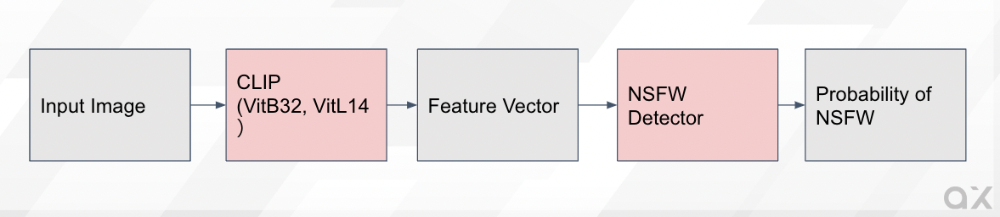
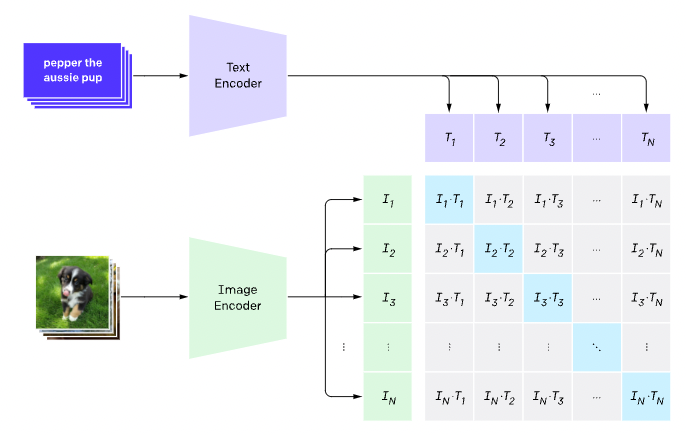

# CLIP-based-NSFW-Detector : 不適切画像を検出できるAIモデル

# CLIP-based-NSFW-Detector : 不適切画像を検出できるAIモデル

[](https://kyakuno.medium.com/?source=post_page---byline--1ea69dbd7c0d---------------------------------------)

[Kazuki Kyakuno](https://kyakuno.medium.com/?source=post_page---byline--1ea69dbd7c0d---------------------------------------)

5 min read

·

Feb 14, 2023

--

Share

[ailia SDK](https://ailia.jp/)で使用できる機械学習モデルである「CLIP-based-NSFW-Detector」のご紹介です。エッジ向け推論フレームワークである[ailia SDK](https://ailia.jp/)と[ailia MODELS](https://github.com/axinc-ai/ailia-models)に公開されている機械学習モデルを使用することで、簡単にAIの機能をアプリケーションに実装することができます。

## CLIP-based-NSFW-Detectorの概要

CLIP-based-NSFW-DetectorはCLIP特徴量を使用した不適切画像検知モデルです。入力画像に対して、CLIP特徴量を計算し、CLIP特徴量を入力とする判定モデルを実行し、不適切画像である確率を出力可能です。NSFWはNot safe for workの略で、職場で見ない方が良いという意味の略語です。

[## GitHub - LAION-AI/CLIP-based-NSFW-Detector

### This 2 class NSFW-detector is a lightweight Autokeras model that takes CLIP ViT L/14 embbedings as inputs. It estimates…

github.com](https://github.com/LAION-AI/CLIP-based-NSFW-Detector?source=post_page-----1ea69dbd7c0d---------------------------------------)

## CLIP-based-NSFW-Detectorのデータセット

CLIP-based-NSFW-Detectorの学習用データは、画像ではなく事前計算済みのCLIP特徴量として公開されています。不適切画像の実データは含まれていませんが、計算済みのCLIP特徴量は入手可能なため、同様に任意の画像に対してCLIP特徴量を計算すれば、追加の再学習が可能です。

## Get Kazuki Kyakuno’s stories in your inbox

Join Medium for free to get updates from this writer.

Subscribe

Subscribe

Remember me for faster sign in

学習用の特徴量は334MBです。カテゴリはdrawing 41370枚、hentai 30367枚、neutral 64491枚、porn 70681枚、sexy 35158枚です。

## CLIP-based-NSFW-Detectorのモデルアーキテクチャ

入力画像に対して、CLIPを適用し特徴ベクトルを取得、分類モデルで、NSFW画像である確率を出力します。

Press enter or click to view image in full size



Architecture of CLIP -based-NFSW-Detector

CLIP特徴は、ViT-L/14の場合は768次元、Vit-B/32の場合は512次元です。



出典：<https://openai.com/blog/clip/>

分類モデルのモデルアーキテクチャはシンプルなLinearモデルです。

```
import torch.nn as nn  
  
class H14_NSFW_Detector(nn.Module):  
    def __init__(self, input_size=1024):  
        super().__init__()  
        self.input_size = input_size  
        self.layers = nn.Sequential(  
            nn.Linear(self.input_size, 1024),  
            nn.ReLU(),  
            nn.Dropout(0.2),  
            nn.Linear(1024, 2048),  
            nn.ReLU(),  
            nn.Dropout(0.2),  
            nn.Linear(2048, 1024),  
            nn.ReLU(),  
            nn.Dropout(0.2),  
            nn.Linear(1024, 256),  
            nn.ReLU(),  
            nn.Dropout(0.2),  
            nn.Linear(256, 128),  
            nn.ReLU(),  
            nn.Dropout(0.2),  
            nn.Linear(128, 16),  
            nn.Linear(16, 1)  
        )  
  
    def forward(self, x):  
        return self.layers(x)
```

## CLIP-based-NSFW-Detectorの使用方法

下記のコマンドで任意の画像を入力します。

```
$ python3 clip-based-nsfw-detector.py --input sexy.jpg
```

スコアが出力されます。

```
### Estimating NSFW confidence ###  
 NSFW: 99.450
```

[## ailia-models/nsfw\_detector/clip-based-nsfw-detector at master · ailia-ai/ailia-models

### The collection of pre-trained, state-of-the-art AI models for ailia SDK …

github.com](https://github.com/ailia-ai/ailia-models/tree/master/nsfw_detector/clip-based-nsfw-detector?source=post_page-----1ea69dbd7c0d---------------------------------------)

## CLIP-based-NSFW-Detectorの応用

ユーザが自由に画像を投稿できるようなサービスに有用です。例えば、SNSに投稿された画像が不適切画像化どうかを判定することに使用可能です。

また、画像生成AIであるStableDiffusionにも同様のNSFW Detectorが搭載されており、生成画像が不適切画像だった場合に黒埋めする処理が入っています。

アイリア株式会社はAIを実用化する会社として、クロスプラットフォームでGPUを使用した高速な推論を行うことができるailia SDKを開発しています。アイリア株式会社ではコンサルティングからモデル作成、SDKの提供、AIを利用したアプリ・システム開発、サポートまで、 AIに関するトータルソリューションを提供していますのでお気軽に[お問い合わせ](https://ailia.ai/contact/)ください。