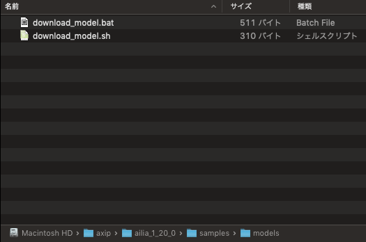
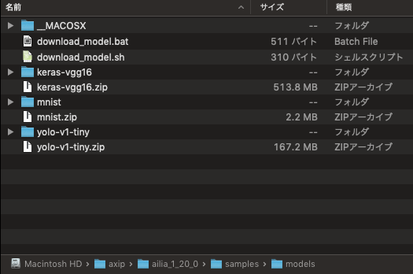
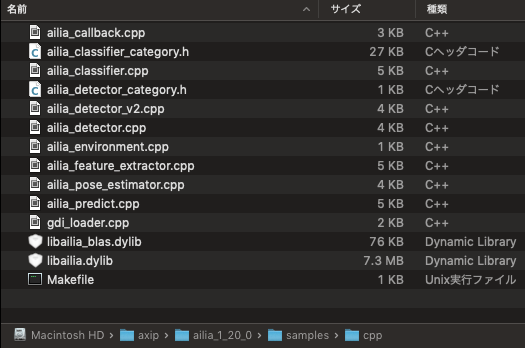
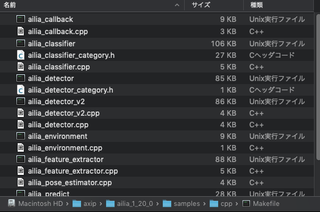
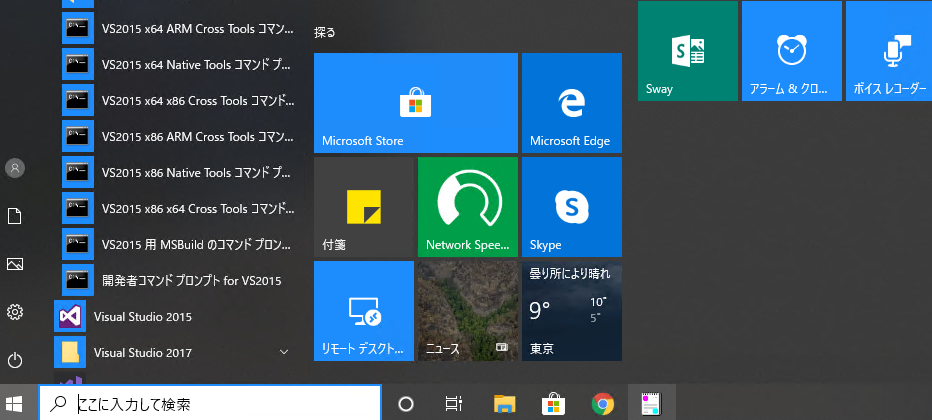
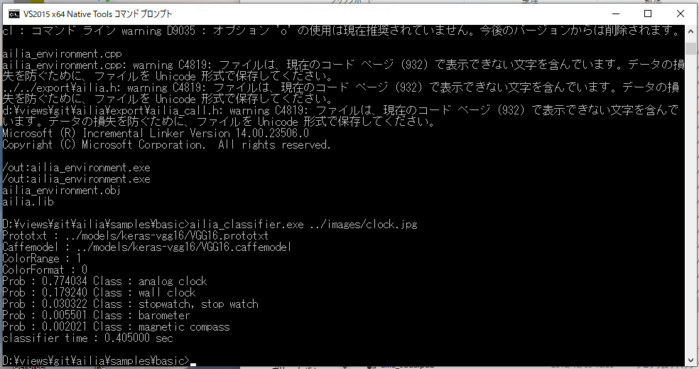
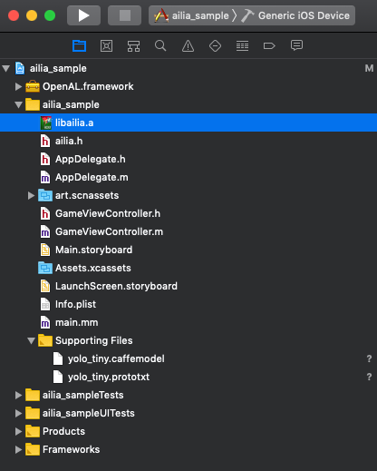
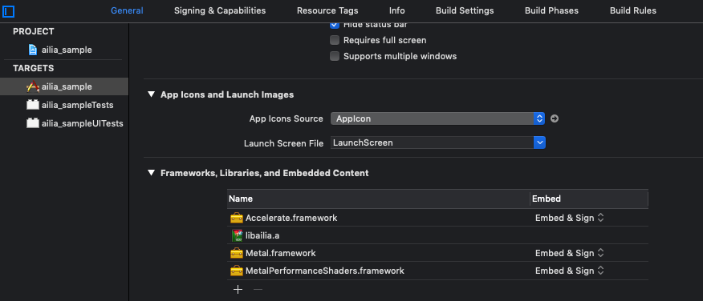

# ailia SDK チュートリアル(C++)

# ailia SDK チュートリアル(C++)

[Kazuki Kyakuno](https://kyakuno.medium.com/?source=post_page---byline--dc949d9dcd28---------------------------------------)

13 min read

·

Jan 13, 2020

--

Share

ailia SDKをC++で使用するチュートリアルです。ailia SDKを利用することでC++を使用したディープラーニングの推論をGPUを使用して高速に行うことができます。ailia SDKについて詳しくは[こちら](https://ailia.jp/)をご覧ください。

## C++ APIの概要

ailia SDKのコアはC++で実装されており、C++ APIを使用して機械学習モデルをクロスプラットフォームで実行することができます。ailia SDKにはC++から各種のAPIを使用するサンプルが含まれています。以降、サンプルのビルドと実行の方法を解説します。

## ライセンスファイルの配置

評価版の場合、Windowsの場合はailia.dllと同じフォルダ、Macの場合は~/Library/SHALO/にライセンスファイルを配置してください。

Macの場合、Finderのメニューの「移動」から、「フォルダの場所を入力」で~/Libraryを指定して移動後、SHALOフォルダを作成し、そこにライセンスファイルを配置します。

ライセンスファイルが存在しない状態でサンプルを実行した場合、エラー（AILIA\_STATUS\_LICENSE\_NOT\_FOUND = -20）が発生します。Linux、Jetson、RaspberryPiの場合はライセンスファイルは不要です。

## 各プラットフォームでのサンプルの実行

### Mac

Macで使用するにはXcodeとXcodeコマンドラインツールのインストールが必要です。XcodeはAppStoreから、Xcodeコマンドラインツールは下記のコマンドでインストールします。

> xcode-select install

サンプルで使用する機械学習モデルをダウンロードするため、samples/modelsフォルダに移動し、download\_model.shを実行します。

ダウンロード前のsamples/modelsフォルダです。

download\_model.shをTerminalで実行します。ダウンロード後のsamples/modelsフォルダです。

次に、ailiaのコアライブラリであるlibrary/mac/libailia.dylibとlibrary/mac/libailia\_blas.dylibをsamples/cppフォルダにコピーします。

サンプルプログラムでは画像読み込みにOpenCVを使用しています。そこで、brew を使用してOpenCVをインストールします。OpenCVは3と4に対応しています。

> brew install opencv

サンプルプログラムでは、/usr/local/libにOpenCVがインストールされていることを期待していますが、環境によっては異なるパスにインストールされ、下記のようなエラーが出ることがあります。

> clang: error: no such file or directory: ‘/usr/local/lib/libopencv\_core.dylib’  
> clang: error: no such file or directory: ‘/usr/local/lib/libopencv\_imgproc.dylib’  
> clang: error: no such file or directory: ‘/usr/local/lib/libopencv\_imgcodecs.dylib’

その場合、下記のコマンドでOpenCVのパスを調べて、Makefileに記載されているパスを書き換えてください。

> find / -name=”opencv\*”

例えば、/usr/local/Cellar/opencv/4.2.0\_1にOpenCVが見つかった場合は、Makefileの内容を下記のように書き換えます。

samples/cppフォルダで下記のコマンドを実行してビルドします。

> export OSTYPE=Mac  
> make

makeに成功すると下記のようになります。

下記のコマンドで物体識別を実行します。

> ./ailia\_classifier ../images/clock.jpg

実行結果は下記となります。

> Prototxt : ../models/keras-vgg16/VGG16.prototxt  
> Caffemodel : ../models/keras-vgg16/VGG16.caffemodel  
> ColorRange : 1  
> ColorFormat : 0  
> Prob : 0.773837 Class : analog clock  
> Prob : 0.179676 Class : wall clock  
> Prob : 0.030096 Class : stopwatch, stop watch  
> Prob : 0.005507 Class : barometer  
> Prob : 0.002026 Class : magnetic compass

### Windows

Windowsで使用するにはVisual Studio 2015以降とgnumakeのインストールが必要です。

Visual Studioは下記からダウンロードしてインストールしてください。

[## Visual Studio 2019 for Windows および Mac のダウンロード

### ダウンロード | IDE、Code、Team Foundation Server | Visual Studio Android、iOS、Windows、Web、クラウド向けのフル機能の統合開発環境 (IDE)…

visualstudio.microsoft.com](https://visualstudio.microsoft.com/ja/downloads/?source=post_page-----dc949d9dcd28---------------------------------------)

gnumakeは下記からダウンロードして下さい。DownloadからComplete package, except sourcesのSetupをインストールした後、環境変数（Path）にインストール先のbinを登録し、コマンドプロンプトからmakeで実行できることを確認してください。

[## make for Windows

### Make: GNU make utility to maintain groups of programs 3.81 Make is a tool which controls the generation of executables…

gnuwin32.sourceforge.net](http://gnuwin32.sourceforge.net/packages/make.htm?source=post_page-----dc949d9dcd28---------------------------------------)

サンプルで使用する機械学習モデルをダウンロードするため、samples/modelsフォルダのdownload\_model.batを実行します。

次に、samples/cppフォルダにlibrary/windows/x64ファイルにあるdllとlibをコピーします。

Windowsの場合は、GDI+経由で画像を読み込むため、OpenCVのインストールは不要です。

## Get Kazuki Kyakuno’s stories in your inbox

Join Medium for free to get updates from this writer.

Subscribe

Subscribe

Remember me for faster sign in

VS2015 x64 NativeTools コマンドプロンプトを起動して、samples/cppフォルダに移動します。

Press enter or click to view image in full size

下記のコマンドでビルドを行います。

> set OSTYPE=Windows  
> make

下記のコマンドで物体識別を実行します。

> ./ailia\_classifier.exe ../images/clock.jpg

Press enter or click to view image in full size

### Linux

Linuxではclangを使用します。ailia SDKの推奨環境であるUbuntu 18.04LTSではclangは標準でインストールされています。

ailia SDKのサンプルの実行にはOpenCVとunzipが必要なため、下記のコマンドでインストールします。

> apt install libopencv-dev  
> apt install unzip

samples/modelsフォルダのdownload\_model.shを実行します。

> ./download\_model.sh

samples/cppフォルダにlibrary/linuxフォルダのsoをコピーします。

samples/cppフォルダでexport OSTYPE=Linuxを実行した後、makeを実行します。

> export OSTYPE=Linux  
> make

下記のコマンドで物体識別を実行します。

> ./ailia\_classifier ../images/clock.jpg

### iOS

iOSではXcodeを使用します。Xcodeで新規のiOSプロジェクトを作成したあと、プロジェクトにlibrary/iosフォルダにあるlibailia.aを登録します。

ビルドセッティングのFrameworksにAccelerate.framework、Metal.framework、MetalPerformanceShaders.frameworkを登録します。

Press enter or click to view image in full size

ailia SDKはC言語のインタフェースであるため、ObjectiveCからC言語を呼び出すため、ailia SDKを呼び出すファイルの拡張子を.mmに設定します。

学習済みモデルはSupporting Filesに登録します。登録した学習済みモデルへのパスはpathForResourceで取得することができます。

以降、ailiaPredict APIを呼び出すことで推論を行うことができます。

Xcodeのプロジェクトサンプルは下記からダウンロードすることができます。

[## axinc-ai/ailia-xcode

### Project sample of ailia SDK for xcode Xcode 11.3 Download u2net\_opset11.onnx in ./u2net folder. wget…

github.com](https://github.com/axinc-ai/ailia-xcode?source=post_page-----dc949d9dcd28---------------------------------------)

### Android

AndroidではAndroid NDKを使用します。Android NDKはr19cを推奨しています。Windowsの場合、Cygwinも必要です。

[## NDK のダウンロード | Android NDK | Android Developers

### 開発プラットフォームに合った NDK パッケージを選択してください。 NDK の最新バージョンと以前のバージョンにおける変更点については、 NDK の変更履歴 をご覧ください。 現在利用可能な Mac NDK…

developer.android.com](https://developer.android.com/ndk/downloads?hl=ja&source=post_page-----dc949d9dcd28---------------------------------------)

Android NDKでailia SDKを使用するには、library/androidフォルダにあるlibailia-VER-libc++\_static.aをリンクします。VERにはライブラリのバージョンが入ります。

Application.mkには以下のような設定を行います。API LEVELは16以降が必要です。また、APP\_STLはc++\_staticに設定する必要があります。

Android.mkには以下のような設定を行うことでライブラリをリンクします。

推論を行うコードはmain.cppに記載します。学習済みモデルはネットワーク経由などで事前にSDカードに転送します。

ビルドを行うと.soが生成されるため、これをJNI経由でJavaから呼び出します。

[## サンプル: hello-jni | Android NDK | Android Developers

### このサンプルでは、NDK を使用して開発された HelloJNI という小さなアプリについて紹介します。このサンプルは、NDK インストール ルート ディレクトリの下の samples/hello-jni/ ディレクトリにあります。 次の…

developer.android.com](https://developer.android.com/ndk/samples/sample_hellojni?hl=ja&source=post_page-----dc949d9dcd28---------------------------------------)

ailia SDKでは標準でJNIのAPIも提供しており、Javaから直接呼び出すことも可能です。また、Cのコードだけで.apkを作成する場合はnative-activityを使用することもできます。

[## サンプル: native-activity | Android NDK | Android Developers

### サンプル native-activity は、NDK のインストール ルートの下の samples/native-activity 内にあります。これは、Java ソースコードを含まない、純粋なネイティブ…

developer.android.com](https://developer.android.com/ndk/samples/sample_na?hl=ja&source=post_page-----dc949d9dcd28---------------------------------------)

## GPUを使用する

ailiaはデフォルトではCPUで実行されます。GPUで実行する場合は、ailiaCreateの引数に与えられている、AILIA\_ENVIRONMENT\_ID\_AUTOをデバイスのenv\_idに置き換えます。例えば、Jetsonでは2（env\_id=2）を指定すると、GPU実行になります。

C++からデバイスを列挙して、デバイスに紐づけられたenv\_idを取得する方法は、samples/cpp/ailia\_environment.cppを参照してください。

## C++のコードサンプル集

C++のコードサンプルは下記からもダウンロードすることができます。

[## axinc-ai/ailia-models-cpp

### The collection of pre-trained, state-of-the-art models for C++. ailia models (Python version) ailia SDK is a…

github.com](https://github.com/axinc-ai/ailia-models-cpp?source=post_page-----dc949d9dcd28---------------------------------------)

ax株式会社はAIを実用化する会社として、クロスプラットフォームでGPUを使用した高速な推論を行うことができるailia SDKを開発しています。ax株式会社ではコンサルティングからモデル作成、SDKの提供、AIを利用したアプリ・システム開発、サポートまで、 AIに関するトータルソリューションを提供していますのでお気軽に[お問い合わせ](https://axinc.jp/)ください。

### 参考記事

[## ailia SDK チュートリアル(Python)

### ailia SDKをPythonで使用するチュートリアルです。Pythonを使用することで様々なモデルの動作を簡単に試すことができます。

medium.com](https://medium.com/axinc/ailia-sdk-%E3%83%81%E3%83%A5%E3%83%BC%E3%83%88%E3%83%AA%E3%82%A2%E3%83%AB-python-28379dbc9649?source=post_page-----dc949d9dcd28---------------------------------------)

[## ailia SDK チュートリアル(Unity)

### ailia SDKをUnityで使用するチュートリアルです。UnityPackageのインポートからアプリケーションのビルドまで解説します。

medium.com](https://medium.com/axinc/ailia-sdk-%E3%83%81%E3%83%A5%E3%83%BC%E3%83%88%E3%83%AA%E3%82%A2%E3%83%AB-unity-257fa1e98777?source=post_page-----dc949d9dcd28---------------------------------------)