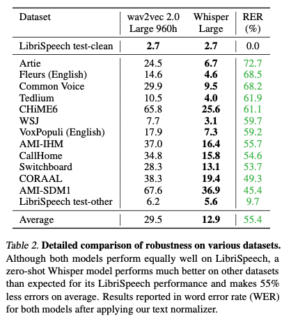

# Whisper : 日本語を含む99言語を認識できる音声認識モデル

# Whisper : 日本語を含む99言語を認識できる音声認識モデル

[](https://kyakuno.medium.com/?source=post_page---byline--b6e578f55c87---------------------------------------)

[Kazuki Kyakuno](https://kyakuno.medium.com/?source=post_page---byline--b6e578f55c87---------------------------------------)

26 min read

·

Nov 24, 2022

--

Share

[ailia SDK](https://ailia.jp/)で使用できる機械学習モデルである「Whisper」のご紹介です。エッジ向け推論フレームワークである[ailia SDK](https://ailia.jp/)と[ailia MODELS](https://github.com/axinc-ai/ailia-models)に公開されている機械学習モデルを使用することで、簡単にAIの機能をアプリケーションに実装することができます。

## Whisperの概要

Whisperは2022年10月にOpenAIが公開した音声認識モデルです。音声ファイルを入力として、テキストを出力可能です。680000時間という膨大な音声データから学習することで、日本語を含む99言語で、高精度な音声認識を実現しています。

[## GitHub - openai/whisper: Robust Speech Recognition via Large-Scale Weak Supervision

### Whisper is a general-purpose speech recognition model. It is trained on a large dataset of diverse audio and is also a…

github.com](https://github.com/openai/whisper?source=post_page-----b6e578f55c87---------------------------------------)

## 従来技術であるWav2VecとWhisperの違い

音声認識の学習において、どのようにデータセットを準備するかが重要です。従来のアカデミックなデータセットは1,000時間程度の音声ファイルしか含んでおらず、十分ではありませんでした。

従来研究のWav2Vec 2.0は、人の手によってアノテーションされていない1,000,000時間の音声データで事前学習し、アノテーションされたデータセットでファインチューニングすることで、State Of The Artの性能を出せることを示しました。

しかし、ファインチューニングを行うと汎化性能が低下するという問題があり、Whisperでは、ファインチューニングを行わずに性能を出すことを目指しています。

## Whisperのデータセット

Whisperはインターネット上に公開されている、膨大な音声ファイルとテキストを使用した弱教師あり学習によって、Encoderを学習します。従来のアカデミックなデータセットよりも多くのデータセットから学習されているため、より高精度になっています。

インターネット上に公開されている音声ファイルのテキストには、何秒目からそのテキストが始まるかの情報が含まれていませんが、弱教師あり学習によって、詳細なアノテーションがなくても学習を可能としています。これにより、従来よりも多くのデータセットを使用した学習が可能となり、ファインチューニングを行わなくても性能を出すことができています。

データセットは全体で680,000時間の音声とテキストです。主要な3言語以外の96言語の認識用には117,000時間の音声とテキストを含みます。データセットのうち、125,000時間のデータは、英語への翻訳機能のための追加のテキストを持っています。

インターネット上に公開されている音声ファイルは、人の手によってテキスト化されたものだけでなく、機械によってテキスト化されたものを含みます。これらのデータを学習に使用すると精度が低下するため、機械によってテキスト化されたものを判別する仕組みを構築して除外します。

## Whisperのモデルアーキテクチャ

Whisperは、EncoderとDecoderから構成されています。Encoderは、音声から潜在表現を取得します。Decoderは、潜在表現からテキストを出力します。

モデルアーキテクチャは、Encoder-Decoder Transformerを使用します。

Press enter or click to view image in full size


出典：<https://github.com/openai/whisper>

音声ファイルは-1〜1のレンジにスケーリングされた16kHzのPCM形式で扱い、80channelのMelSpectrogramで周波数変換します。MelSpectrogram変換のウィンドウサイズは25msで、strideは10msです。

MelSpecrtrogramは30秒ごとのセグメントに分割されて使用されます。

Encoderは、30秒のセグメントにつき、一回だけ実行され、Specrtrogramから潜在表現を抽出します。最初にInputEmbeddingとして、フィルターサイズ3でActivationにGELUを使用したConvolutionを2回適用します。2つ目のConvolutionのstrideは2です。TransformerではSinを使用したPosition Embeddingを行います。Encoderは30秒のセグメントにつき1回だけ実行されるため、負荷はあまり高くありません。

Decoderは、潜在表現から51865個のトークンのそれぞれの出現確率を出力します。出力されたトークンの出現確率に対して、GreedySearch、もしくはBeamSearchを行うことで、トークンを決定します。BeamSearachのビームサイズ（探索分岐数）は5です。

Decoderは30秒のセグメントにつき、最大で224個のトークンを出力するため、最大で224回実行されます。224回の推論の途中のデコード結果に、Consecutive timestamp tokens（2回連続するTimeStamp）が出現した場合は、そこまでの音声認識結果のトークン列を決定し、出力します。

決定されたトークン列に対して、GPT2TokenizerFastのデコードを行うことで、テキストに変換します。アーキテクチャはbyte-level BPE text tokenizerであり、単語を出力しているわけではなく、Unicodeのバイトコードを出力します。

TimeStampから、実際に音声認識した秒数を取得し、未処理のMelSpectrogramのみを切り出し、30秒になるようにMelSpectrogramを追加した後、再度、デコードを行うことを繰り返します。

EncoderとDecoderは同じTransformerのアーキテクチャを持ちます。

## Whisperの実行フローの例

### 全体実行フロー

Whisperの実行フローの例となります。

1. 44.1kHz、音声ファイルを入力  
   （Shape = (168192, ) ) (5秒の場合)
2. 音声ファイル全体にMelSpectrogram変換の実行  
   （Shape = (80, 1051) ) (5秒の場合)
3. 言語識別の実行  
   （N\_FRAMES = 30秒分のMelSpectrogramを取得、  
   encoderで特徴ベクトルに変換、  
   decoderでトークンIDに対する頻度出力、  
   各言語に対応する特殊トークンIDに紐づく頻度から言語を決定）  
   (EncoderInputShape = (1,80,3000), EncoderOutputShape = (1,1500,768))
4. テキスト化の実行  
   （N\_FRAMES = 30秒分のMelSpectrogramを取得、  
   encoderで特徴ベクトルに変換、  
   decoderを最大224回繰り返してトークン列出力）  
   (EncoderInputShape = (1,80,3000), EncoderOutputShape = (1,1500,768))
5. タイムスタンプの取得  
   （decoderの出力のtimestamp tokenを確認、テキスト化した秒数を取得）
6. 次の音声の準備  
   （テキスト化した秒数までのMelSpectrogramを捨てる、残ったMelSpectrogramに次のMelSpectrogramを埋めて30秒のセグメントを作成）
7. 4のテキスト化に戻る

### デコーダの入力と出力の例

デコーダの入力と出力のShapeは下記となります。

言語識別の場合です。推論は1回だけ実行されます。

> 入力：tokens = (1, 1), kv\_cache = (24, 1, 1, 768), offset = (), audio\_features = (1, 1500, 768)  
> 出力：logits = (1, 1, 51865), kv\_cache = (24, 1, 1, 768)

テキスト化の場合です。推論は224回実行されます。

> ステップ1
>
> 入力：tokens = (5, 3), kv\_cache = (24, 5, 3, 768), offset = (1), audio\_features = (1, 1500, 768)  
> 出力：logits = (5, 3, 51865), kv\_cache = (24, 5, 3, 768)
>
> ステップ2
>
> 入力：tokens = (5, 1), kv\_cache = (24, 5, 4, 768), offset = (1), audio\_features = (1, 1500, 768)  
> 出力：logits = (5, 1, 51865), kv\_cache = (24, 5, 4, 768)

### sot\_sequence

デコーダは最大で224回実行されますが、初回はsot\_sequenceを入力します。具体的に、下記の3トークンを与えます。

> [SOT=50258] [LANGURAGE\_ID=50259+LANGUAGE\_IDX] [TRANSCRIBE=50359]

同じセグメント内の2回目以降の実行では、前回デコードした最後の1つのトークンを投入します。

> [GreedySearchもしくはBeamSearchで決定したトークン]

2回目以降のセグメントでは、前回のセグメントのデコード結果のトークン列を最初に与えた後に、通常のsot\_sequenceを入力します。

> [SOT\_PREV=50361] [最大224の前回のトークン、224を超える場合は末尾224個] [SOT=50258] [LANGURAGE\_ID] [TRANSCRIBE=50359]

前回のセグメントのデコード結果のトークン列にはTime Stampも含めます。また、Time Stampは連続して二つ与える必要があります。例えば、前回のセグメントのデコード結果のトークン列において、Time Stamp Tokenは50646で、2回連続するとします。

```
prev_tokens = [50364, 634, 19737, 456, 576, 312, 25203, 4281, 1068, 1193, 11, 1261, 2600, 293, 21005, 293, 25267, 2640, 11811, 293, 4046, 50646, 50646, 5839, 1756, 3755, 281, 312, 6632, 1493, 484, 294, 5060, 11, 8532, 292, 8617, 4046, 1147, 4880, 13, 50872]
```

ここから、sot\_sequenceを作成すると下記となります。SOT=50258の前の50646が2回連続していることがわかります。

```
sot_sequence = [50361, 50364, 634, 19737, 456, 576, 312, 25203, 4281, 1068, 1193, 11, 1261, 2600, 293, 21005, 293, 25267, 2640, 11811, 293, 4046, 50646, 50646, 50258, 50259, 50359]
```

### ビームサイズ

BeamSearchを行う場合は、sot\_sequenceがビームサイズ分だけ拡張されます。

> ステップ1：tokens = [[50258 50259 50359] [50258 50259 50359] [50258 50259 50359] [50258 50259 50359] [50258 50259 50359]]
>
> ステップ2：tokens = [[50364] [50392] [50394] [50396] [50395]]

GreedySearchでは、デコーダが出力するトークンの確率のうち、最も高い確率を選択します。

BeamSearchでは、複数パターンのトークンのつなぎを評価し、最も良いテキストを選択します。Whisperのデフォルトでは、beam\_size=5として、5パターンの探索を行い、最も良い単語の繋ぎを選択します。

[## ビームサーチの基礎知識と機械学習への3つの活用事例

### ビームサーチ（Beam Search）は、探索アルゴリズムの一種でメモリをそれほど必要としない最良優先探索です。…

deepage.net](https://deepage.net/machine_learning/2017/07/06/beam-search.html?source=post_page-----b6e578f55c87---------------------------------------)

ビームサイズを小さくすると、デコーダの推論のバッチ数が減るため、高速化の効果が得られます。ビームサイズが5の場合と2の場合を比較すると、2.35倍、高速に推論が完了します。意外とビームサイズを小さくしても、認識結果は安定しています。

ビームサイズ1のテキスト

> He hoped there would be stew for dinner, turnips and carrots and bruised potatoes and fat mutton pieces to be ladled out in thick, peppered flour fat and sauce.

ビームサイズ2のテキスト

> He hoped there would be stew for dinner, turnips and carrots and bruised potatoes and fat mutton pieces to be ladled out in thick, peppered flour fat and sauce.

ビームサイズ5（公式のWhisperのデフォルト）のテキスト

> He hoped there would be stew for dinner, turnips and carrots and bruised potatoes and fat mutton pieces to be ladled out in thick, peppered flour, fat and sauce.

WhisperのC++実装であるwhisper.cppでは、デフォルトでGreedy Search (ビームサイズ1と同等）を使用しており、ailia MODELSでもデフォルトではGreedy Searchを使用するように変更しています。

[## テキスト生成における decoding テクニック: Greedy search, Beam search, Top-K, Top-p

### Transformer ベースの言語モデルが普及しているのは承知の通りだと思います。 中でも有名なのは BERT で、これは Transformer の Encoder のみを使う Autoencoding models…

zenn.dev](https://zenn.dev/hellorusk/articles/1c0bef15057b1d?source=post_page-----b6e578f55c87---------------------------------------)

### kv\_cache

kv\_cacheは初回は0埋めされ、次回以降では前回の推論結果の値に、新しい0埋めを追加して使用され、推論するたびに単調増加します。

KeyValueStoreであり、末尾に前回のデコード結果が追加されていきます。

[## kv\_cache is only available for cross attention blocks? · Discussion #489 · openai/whisper

### You can't perform that action at this time. You signed in with another tab or window. You signed out in another tab or…

github.com](https://github.com/openai/whisper/discussions/489?source=post_page-----b6e578f55c87---------------------------------------)

初回のセグメントはinitial\_tokensが保存されるため、sot\_sequenceの3要素となり、最大で224回の推論を行うと、226要素となります。offsetは0から開始します。次のセグメントはsot\_prevの1要素、最大224要素の前回のtoken、sot\_sequenceの3要素で最大で228要素となり、offsetは最大で228から開始します。そのため、最大で451要素となります。

## Get Kazuki Kyakuno’s stories in your inbox

Join Medium for free to get updates from this writer.

Subscribe

Subscribe

Remember me for faster sign in

GPU推論の場合、推論ごとにShapeを変更すると、cuDNNハンドルの再確保が発生するため、ailia MODELSで公開しているONNXでは、kv\_cacheを初回に最大サイズの541で確保して処理しています。

### Vocabulary

tokenから単語への変換は、vocab.jsonに定義されている、対応表を使用して変換します。vocab.jsonには、バイトコードと対応するtoken\_idが記載されています。バイトコードはbytes\_to\_unicodeでテキスト化して保存されています。

```
{"!": 0, "\"": 1, "#": 2, "$": 3, ... "Ġs": 262, "ou": 263, "Ġthe": 264, ...}
```

token\_idのリストからテキストに変換するには、token\_idからバイトコードテキストを参照し、バイトコードテキスト列を作ります。次に、バイトコードテキスト列を、バイトコード列に変換し、utf-8でデコードします。

バイトコードテキスト列からテキストへの変換は、convert\_tokens\_to\_stringで実装されています。

convert\_tokens\_to\_stringでは、token\_idのリストからvocab.jsonを参照して作成したバイトコードテキスト列をtokensとして受け取り、bytes\_to\_unicodeで生成したbyte\_encoder配列の転地であるbyte\_decoder配列を使用してbytearrayを作成し、utf-8でデコードすることでテキストを取得しています。

```
def convert_tokens_to_string(self, tokens):  
    """Converts a sequence of tokens (string) in a single string."""  
    text = "".join(tokens)  
    text = bytearray([self.byte_decoder[c] for c in text]).decode("utf-8", errors=self.errors)  
    return text
```

[## transformers/tokenization\_gpt2.py at main · huggingface/transformers

### You can't perform that action at this time. You signed in with another tab or window. You signed out in another tab or…

github.com](https://github.com/huggingface/transformers/blob/main/src/transformers/models/gpt2/tokenization_gpt2.py?source=post_page-----b6e578f55c87---------------------------------------)

[## Which encoding does GPT2 vocabulary file use?

### I wanted to investigate a little, how tokenizer works. But the model trained in Russian language (mostly), and I see…

discuss.huggingface.co](https://discuss.huggingface.co/t/which-encoding-does-gpt2-vocabulary-file-use/8875/2?source=post_page-----b6e578f55c87---------------------------------------)

### Special Token

Whisperでは、下記のSpecial Tokenを使用します。Special Tokenは、通常の単語用のトークンの末尾に追加されています。

> startoftranscript (50258) : テキスト化の開始を示します。SOT\_SEQUENCEの先頭に入ります。  
> languages (50259–50357) : 各言語に対応するTOKEN\_IDです。  
> translate (50358) : 翻訳を行う場合に、SOT\_SEQUENCEに含めます。  
> transcribe (50359) : テキスト化を行う場合に、SOT\_SEQUENCEに含めます。  
> starttoflm (50360) : 未使用。  
> starttofprev (50361) : セグメント2以降を処理する際に、セグメント1のトークンの末尾を与えることを示すため、SOT\_SEQUENCEの前に含めます。  
> nospeech (50362) : セグメントが無音である確率が入ります。  
> notimestamps (50363) : 未使用。  
> timestamp\_begin (50364) : タイムスタンプの開始を示します。

### Time Stamp

Whisperでは、認識したテキストの先頭と末尾にTime Stamp Tokenが付与されます。Time Stamp Tokenはtimestamp\_begin (50364) 以上のtoken\_idを持ち、Time Stampの分解能は0.02secです。

例えば、token\_id=50364の場合は0sec、token\_id=50714の場合は350 \* 0.02sec = 7secの位置を示します。

Time StampはEOTの直前を除いて、必ず連続して出現する必要があります。そのため、Time Stampが出現したら、次のトークンをTime Stampに制約します。また、Time Stampが2回連続したら、次のトークンをNormal Tokenに制約します。

さらに、Time StampのProbablityの総和が、Normal TokenのProbablityを上回っていたら、Time Stampを優先します。

また、notimestamps (50363)にも高い確率値が入っているため、確率値を-np.infにリセットします。

これらの処理は、decode\_utils.pyのApplyTimeStampRuleで行っています。

Time Stampが2回連続すると、そこまでのテキストが確定します。EOTの直前に、Time Stampが1回だけ出現した場合は、そこでセグメント内の処理は全て完了したとみなし、セグメント内の残りのMelSpectrogramをスキップします。

## Whisperのモデルの種類

Whisperには、精度と演算量に応じた5つのモデルがあり、選択可能です。デフォルトはSmallです。なお、BaseよりもSmallの方が高精度になっています。


出典：<https://cdn.openai.com/papers/whisper.pdf>

## Whisperの精度

Whisperは従来のwav2vec 2.0に比べて汎化性能が高く、データセットに依存せず、非常に低いエラーレートを持ちます。

Press enter or click to view image in full size



出典：<https://cdn.openai.com/papers/whisper.pdf>

Whisperは高い汎化性能を持っています。横軸をLibriSpeechでのエラーレート、縦軸をその他のベンチマークでのエラーレートとした場合、LibriSpeechで教師付きで学習したモデルは、LibriSpeechでは高い性能を持ちますが、その他のベンチマークでのエラーレートが高くなります。しかし、Whisperでは、LibriSpeechでもその他のベンチマークでも、エラーレートを低く抑えられています。


Whisperの性能（出典：<https://cdn.openai.com/papers/whisper.pdf>）

## Whisperの処理時間

MacBook Pro 13 (Intel Core i5)でPytorchを使用してCPU推論を行なった場合の処理時間の例です。

> 40secの音声を処理するのに必要な時間と消費メモリ
>
> medium 96.22sec (3.80GB)  
> small 39.16sec (1.68GB)  
> base 17.97sec (1.00GB)  
> tiny 7.87sec (0.84GB)

Windows (RTX3080)でPytorchを使用してGPU推論を行なった場合の処理時間の例です。

> 40secの音声を処理するのに必要な時間
>
> medium 7.155sec  
> small 4.183sec (GPU memory 4GB程度)  
> base 2.906sec  
> tiny 2.657sec

モデル読み込みとインスタンス作成の時間は、smallで6sec程度です。

> 測定条件
>
> 入力：40secの日本語音声ファイル  
> 推論環境A：MacBook Pro 13 2.3 GHz クアッドコア Intel Core i5  
> 推論環境B：Windows11 11th Gen Intel Core i7–11700 + RTX3080  
> 推論フレームワーク：Pytorch 1.9.0 (macOS)、1.13.1 (Windows)  
> beam\_size : 1

## Whisperの使用方法

下記のコマンドで任意の音声ファイルに対してWhisperを適用可能です。

```
$ python3 whisper.py --input demo.wav
```

[## ailia-models/audio\_processing/whisper at master · axinc-ai/ailia-models

### Audio file Recognized speech text He hoped there would be stew for dinner, turnips and carrots and bruised potatoes and…

github.com](https://github.com/axinc-ai/ailia-models/tree/master/audio_processing/whisper?source=post_page-----b6e578f55c87---------------------------------------)

出力例は下記となります。

```
 INFO whisper.py (704) : Start inference...  
 INFO whisper.py (571) : Detected language: English  
 [00:00.000 --> 00:10.000]  He hoped there would be stew for dinner, turnips and carrots and bruised potatoes and fat mutton pieces to be ladled out in thick, peppered, flour-fattened sauce.  
 INFO whisper.py (739) : Script finished successfully.
```

デフォルトではsmallモデルとなっているため、より高速なモデルを使用したい場合はmodel\_typeにbaseを指定します。

```
$ python3 whisper.py --input input.wav -m base
```

ビームサーチを使用する場合は、beam\_sizeを指定します。

```
$ python3 whisper.py --input input.wav --beam_size 5
```

進捗を表示するには、 — debugコマンドを使用します。

```
$ python3 whisper.py --input input.wav --debug
```

下記のコマンドで、pyaudioを使用したマイク入力に対してWhisperを適用可能です。この機能は試験的な実装です。

```
$ python3 whisper.py -V
```

Whisperでは、音声ファイルの読み込みにlibrosaのインストールが必要です。

```
$ pip3 install librosa
```

ailia SDK 1.2.14では公式のPytorch実装よりも高速にCPU推論が可能です。ailia SDK 1.2.13を利用されている場合はailia SDK 1.2.14にアップデートして下さい。

## Whisperの依存ライブラリ

ailia MODELSのWhisperでは、ailia.tokenizerを使用します。これにより、torchのない環境でも推論が可能となり、cuDNNのバージョン問題などを解消することが可能です。

disable\_ailia\_tokenizerオプションを使用することで、torchのtransformersを使用することも可能です。

```
$ python3 whisper.py --input input.wav --disable_ailia_tokenizer
```

その場合、追加で下記のパッケージのインストールが必要です。

```
$ pip3 install transformers
```

M1 Macで使用する場合、TensorFlowがインストールされていると、TransformersがimportするTensorFlowがAVX2を使用しているため、illegal hardware instruction exceptionが発生することがあります。その場合、TensorFlowをアンインストールしてください。

```
$ pip3 uninstall tensorflow
```

## Whisperの関連実装

WhisperのC++実装が公開されています。

[## GitHub - ggerganov/whisper.cpp: Port of OpenAI's Whisper model in C/C++

### High-performance inference of OpenAI's Whisper automatic speech recognition (ASR) model: Plain C/C++ implementation…

github.com](https://github.com/ggerganov/whisper.cpp?source=post_page-----b6e578f55c87---------------------------------------)

## Whisperの応用例

Whisperは高品質に日本語を含む音声をテキスト化できるため、コールセンターの通話のテキスト化、後段にBERTを使用した感情分類などへの応用が期待されています。

[## AIを使って音声を文章化してみよう

### グローバルイノベーションセンター テクニカルスペシャリスト 黒住 好忠 こんにちは。テクニカルスペシャリストの黒住です。 ...

www.idnet.co.jp](https://www.idnet.co.jp/column/page_237.html?source=post_page-----b6e578f55c87---------------------------------------)

WhisperのDiscussionでは、日本のアニメの字幕を、翻訳を含めて自動的に生成するような検討がされています。

[## Whisper WebUI with a VAD for more accurate non-English transcripts (Japanese) · Discussion #397 ·…

### You can't perform that action at this time. You signed in with another tab or window. You signed out in another tab or…

github.com](https://github.com/openai/whisper/discussions/397?source=post_page-----b6e578f55c87---------------------------------------)

コンテンツ制作分野では、音声ファイルからセリフを切り出し、セリフをファイル名として分割して保存するような検討がされています。

[## Whisperを使って素材の自動書き起こし＋素材分割 (ローカル実行) - YTPMV.info

### みなさんごきげんよう。まいまいです。今回の記事では、今話題の音声認識AI、Whisperを使って素材の音声を自動書き起こしして、個別の音声ファイルに分割するスクリプトを作成したので紹介していきます。…

ytpmv.info](https://ytpmv.info/whisper-support-scripts/?source=post_page-----b6e578f55c87---------------------------------------)

ax株式会社はAIを実用化する会社として、クロスプラットフォームでGPUを使用した高速な推論を行うことができるailia SDKを開発しています。ax株式会社ではコンサルティングからモデル作成、SDKの提供、AIを利用したアプリ・システム開発、サポートまで、 AIに関するトータルソリューションを提供していますのでお気軽に[お問い合わせ](https://axinc.jp/)ください。