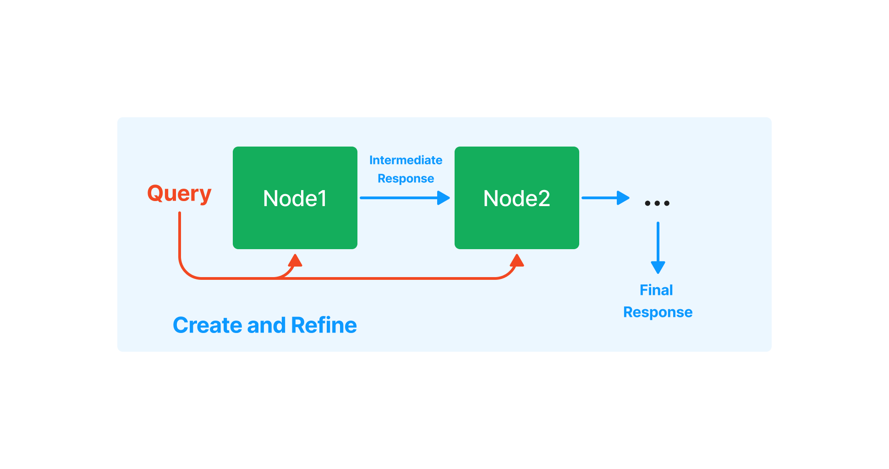

# LlamaIndex : ChatGPTで独自のデータに対して質問するためのフレームワーク

# LlamaIndex : ChatGPTで独自のデータに対して質問するためのフレームワーク

[](https://kyakuno.medium.com/?source=post_page---byline--4f87c82f2f92---------------------------------------)

[Kazuki Kyakuno](https://kyakuno.medium.com/?source=post_page---byline--4f87c82f2f92---------------------------------------)

10 min read

·

Mar 17, 2023

--

Share

ChatGPTで独自のデータに対して質問できるようにすることができるフレームワークであるLlamaIndexのご紹介です。

## LlamaIndexについて

LlamaIndexはChatGPTを使用して独自のデータに対して質問できるようにすることができるフレームワークです。テキストやHTML、PDFなどを入力してインデックスファイルを作り、そのインデックスファイルに対してクエリを投げることで、ChatGPTが学習していない最新の情報に対して質問することが可能です。

[## GitHub - jerryjliu/llama\_index: LlamaIndex (GPT Index) is a project that provides a central…

### LlamaIndex (GPT Index) is a project that provides a central interface to connect your LLM's with external data. …

github.com](https://github.com/jerryjliu/llama_index?source=post_page-----4f87c82f2f92---------------------------------------)

## プロンプトによる知識の外挿

ChatGPTは大規模なテキストデータで学習されていますが、学習されていないデータに関しては知識が乏しいという問題があります。

例えば、特定の製品に対して質問できるチャットボットを作ろうとした場合、ChatGPTはその製品の情報を持っていないため、適切な回答ができません。

この問題は、ChatGPTのPromptに製品の情報を埋め込むという方法で解決できます。例えば、

「Aという製品でCという機能が使えないがなぜか。」

という質問の前に、

「Aという製品はBという機能とCという機能を持っており、Bという機能はCという機能と組み合わせることができない。」

という仕様書のテキストを結合して、

「Aという製品はBという機能とCという機能を持っており、Bという機能はCという機能と組み合わせることができない。Aという製品でCという機能が使えないがなぜか。」

というクエリにすることで、ChatGPTが学習していない内容に対して質問できるようにします。

## プロンプトによる知識の外挿の課題

ChatGPTにはプロンプトが4096トークンまでという制約があります。実際の製品の仕様書のテキストは数MBであり、数KBのテキストしか与えられないプロンプトには限界があります。

LlamaIndexは、この問題に対し、テキストを複数に分割したインデックスに変換し、順番にクエリを投げることで解決します。

## LlamaIndexの動作

LlamaIndexにおけるインデックスの動作は下記にまとめられています。

[## How Each Index Works - LlamaIndex documentation

### Create and refine is an iterative way of generating a response. We first use the context in the first node, along with…

gpt-index.readthedocs.io](https://gpt-index.readthedocs.io/en/latest/guides/index_guide.html?source=post_page-----4f87c82f2f92---------------------------------------)

テキストは複数のノードに分割され、それぞれのノードで埋め込み表現が計算されます。クエリが投げられたら、クエリの埋め込み表現を計算し、最も距離の近いノードをN個抽出、抽出したノードをプロンプトとして、ChatGPTに質問します。

Press enter or click to view image in full size


VectorStoreの動作（出典：<https://gpt-index.readthedocs.io/en/latest/guides/index_guide.html>）

複数のノードに対する質問では、最初のノードの回答を、次のノードに入力し、Refineしていくことで、最終的な出力を得ます。

Press enter or click to view image in full size



Response Synthesisの動作（出典：<https://gpt-index.readthedocs.io/en/latest/guides/index_guide.html>）

## LlamaIndexの使用方法

LlamaIndexを使用するには、python3.8以上が必要です。

## Get Kazuki Kyakuno’s stories in your inbox

Join Medium for free to get updates from this writer.

Subscribe

Subscribe

Remember me for faster sign in

LlamaIndexはpipでインストール可能です。

```
pip install llama-index
```

下記の例では、ailia SDKのPDFからテキストを読み込み、インデックスを作成します。

```
import os  
os.environ["OPENAI_API_KEY"] = 'YOUR_OPENAI_API_KEY'  
  
from llama_index import GPTSimpleVectorIndex, SimpleDirectoryReader  
from llama_index import download_loader  
  
CJKPDFReader = download_loader("CJKPDFReader")  
loader = CJKPDFReader()  
  
documents = loader.load_data("ailia_sdk.pdf")  
index = GPTSimpleVectorIndex(documents)  
index.save_to_disk('index.json')
```

作成したインデックスに対して質問を行います。

```
import os  
os.environ["OPENAI_API_KEY"] = 'YOUR_OPENAI_API_KEY'  
  
from llama_index import GPTSimpleVectorIndex, LLMPredictor  
from langchain import OpenAI  
  
query_text ="ailia SDKが対応しているOSを教えてください。"  
  
llm_predictor = LLMPredictor(llm=OpenAI(temperature=0, max_tokens=350))  
index = GPTSimpleVectorIndex.load_from_disk('index.json')  
response = index.query(query_text, llm_predictor=llm_predictor)  
  
print("Q:", query_text)  
print("A:", str(response))
```

## LlamaIndexの使用例

ailia SDKの仕様書に対してインデックスを作成します。1.2MBのpdfに対して、1.6MBのindexが出力されます。

```
$ python3 create_index.py  
  
INFO:llama_index.token_counter.token_counter:> [build_index_from_documents] Total LLM token usage: 0 tokens  
INFO:llama_index.token_counter.token_counter:> [build_index_from_documents] Total embedding token usage: 72737 tokens
```

クエリを投げてみます。

```
$ python3 query_index.py  
  
INFO:llama_index.token_counter.token_counter:> [query] Total LLM token usage: 3608 tokens  
INFO:llama_index.token_counter.token_counter:> [query] Total embedding token usage: 24 tokens  
Q: ailia SDKが対応しているOSを教えてください。  
A:   
Ailia SDKは、Windows、Mac、Linux、iOS、Android、Jetson、RaspberryPiのOSに対応しています。
```

質問：ailia SDKが対応しているOSを教えてください。

回答：Ailia SDKは、Windows、Mac、Linux、iOS、Android、Jetson、RaspberryPiのOSに対応しています。

## LlamaIndexのエラー

LlamaIndexで日本語のPDFを変化しようとした際、

ValueError: A single term is larger than the allowed chunk size.

というエラーが発生する場合があります。同様のIssueは下記にあります。

[## How to fixed "ValueError: A single term is larger than the allowed chunk size." · Issue #453 ·…

### You can't perform that action at this time. You signed in with another tab or window. You signed out in another tab or…

github.com](https://github.com/jerryjliu/llama_index/issues/453?source=post_page-----4f87c82f2f92---------------------------------------)

これは、英語とは違い、日本語はスペースで分割されていないため、センテンスが長くなりすぎるために発生するエラーです。下記のように、句読点の後にスペースを入れるように変換すると回避可能です。

```
doc.text = doc.text.replace("、", "、 ")  
doc.text = doc.text.replace("。", "。 ")
```

また、日本語を使用した場合、クエリによっては、推論時に

This model’s maximum context length is 4097 tokens, however you requested 4224 tokens

というエラーが発生する場合があります。こちらはフレームワークの修正待ちになります。

[## Chunk size sometimes exceeds max model size · Issue #294 · jerryjliu/llama\_index

### InvalidRequestError: This model's maximum context length is 4097 tokens, however you requested 4229 tokens (3973 in…

github.com](https://github.com/jerryjliu/llama_index/issues/294?source=post_page-----4f87c82f2f92---------------------------------------)

## LlamaIndexを使用した場合の価格

1.2MBのインデックスの作成には72737トークン消費し、$0.002 / 1K tokensなので、$0.14かかります。1.2MBのインデックスに対して質問すると、3632トークン消費し、$0.002 / 1K tokensなので、$0.007かかります。

## LlamaIndexのサンプルプログラム

BLOGで使用したサンプルプログラムは下記にあります。

[## GitHub - axinc-ai/llama-index-sample: The sample program of llama index

### You can't perform that action at this time. You signed in with another tab or window. You signed out in another tab or…

github.com](https://github.com/axinc-ai/llama-index-sample?source=post_page-----4f87c82f2f92---------------------------------------)

ax株式会社はAIを実用化する会社として、クロスプラットフォームでGPUを使用した高速な推論を行うことができるailia SDKを開発しています。ax株式会社ではコンサルティングからモデル作成、SDKの提供、AIを利用したアプリ・システム開発、サポートまで、 AIに関するトータルソリューションを提供していますのでお気軽に[お問い合わせ](https://axinc.jp/)ください。