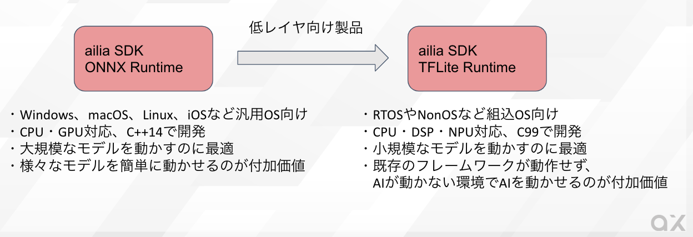
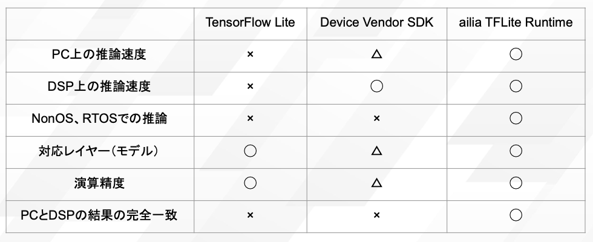
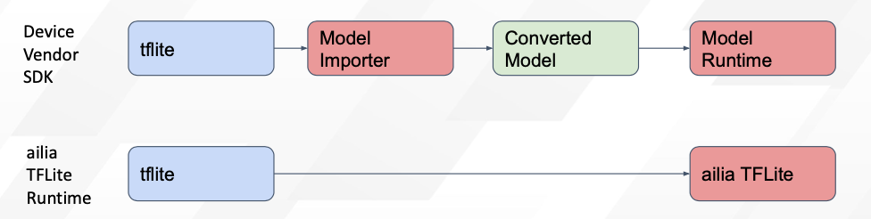
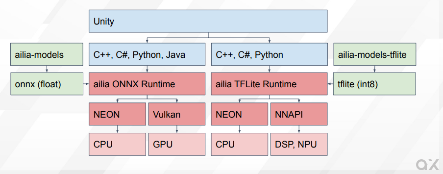

# ailia TFLite Runtime : NonOSやRTOSにAIを実装できるランタイム

# ailia TFLite Runtime : NonOSやRTOSにAIを実装できるランタイム

[](https://kyakuno.medium.com/?source=post_page---byline--db089c961547---------------------------------------)

[Kazuki Kyakuno](https://kyakuno.medium.com/?source=post_page---byline--db089c961547---------------------------------------)

11 min read

·

Jan 12, 2023

--

Share

NonOSやRTOSにAIを実装できるランタイムであるailia TFLite Runtimeのご紹介です。ailia TFLite Runtimeを使用することで、リソースの限られた組込機器にAIを実装することが可能です。

## ailia TFLite Runtimeの概要

ailia TFLite Runtimeは組込み機器に最適なAI推論用フレームワークです。C++ではなくC99で開発しているため、NonOSやRTOSにAIを実装することができます。そのため、公式のTensorFlow Liteが実装できない環境にもAIを実装することが可能です。また、AndroidでNPUを使用した推論に対応しています。

Press enter or click to view image in full size



ailia TFLite Runtimeの概要

## ailia TFLite Runtimeの機能マトリックス

公式のTensorFlow LiteおよびデバイスベンダーのSDKとの比較は下記となります。

Press enter or click to view image in full size



機能マトリックス

また、デバイスベンダーのSDKとは異なり、モデル変換不要で、ランタイムで直接tfliteをパースすることが可能です。これにより、モデル変換による精度劣化や、モデル変換のエラーを回避することが可能です。

Press enter or click to view image in full size



モデル変換が不要

## ailia TFLite Runtimeとailia ONNX Runtime

ailia SDKとして提供しているailia ONNX Runtimeとの関係は下記となります。

Press enter or click to view image in full size



ailia ONNX Runtimeとailia TFLite Runtimeについて

ailia ONNX RuntimeはOSのある汎用プラットフォームをターゲットとしており、CPUとGPUを使用した高速な推論が可能です。モデルフォーマットとしてはONNXに対応しています。

ailia TFLite Runtimeは組込機器をターゲットとしており、NonOSやRTOSなど、公式のTensorFlow Liteが対応していない環境をターゲットとしています。また、GPUではなく、DSPやNPUでの高速推論をターゲットとしています。モデルフォーマットとしてはtfliteに対応しています。

## ailia TFLite RuntimeのAPI

ailia TFLite RuntimeのPython APIでは、TensorFlow Lite互換のAPIを提供しています。そのため、importを書き換えるだけでコードを書き換えずに、ailia TFLite Runtimeに置き換え可能です。

```
#from tensorflow.lite.python.interpreter import Interpreter  
from ailia_tflite import Interpreter  
  
interpreter = Interpreter(model_path="face_detection_front.tflite")  
interpreter.set_tensor(input_details[0]['index'], input_data)  
interpreter.invoke()
```

C APIでは、引数にメモリアロケータを与えられるため、組込機器のメモリ管理に対応可能です。

```
ailiaTFLiteCreate(&instance, tflite, tflite_length, malloc, memcpy, free, AILIA_TFLITE_ENV_REFERENCE, AILIA_TFLITE_MEMORY_MODE_DEFAULT, AILIA_TFLITE_FLAGS_NONE);  
input_tensor_index = ailiaTFLiteGetInputTensorIndex(instance, 0);  
input_buffer = (uint8_t *)ailiaTFLiteGetTensorBuffer(instance, input_tensor_index);  
ailiaTFLiteGetTensorShape(instance, input_shape, input_tensor_index);  
ailiaTFLitePredict(instance);  
output_tensor_index = ailiaTFLiteGetOutputTensorIndex(instance, 0);  
output_buffer = (uint8_t *)ailiaTFLiteGetTensorBuffer(instance, output_tensor_index);  
ailiaTFLiteGetTensorShape(instance, output_shape, output_tensor_index);  
ailiaTFLiteDestroy(instance, free);  
free(tflite);
```

## ailia MODELS for TFLite

ailia Models TFLiteはtflite版のモデルライブラリです。Int8に量子化したtfliteモデルをサンプルコードと共に提供しており、組込機器に簡単にAIの機能を実装することが可能です。

使用可能なモデルの例は下記となります。モデルは今後、順次、拡充していきます。

> BlazeFace（顔検出）  
> FaceMesh（顔キーポイント検出）  
> BlazeHand（手検出）  
> MobileNetV1/V2（物体識別）  
> ResNet50（物体識別）  
> EfficientNetLite（物体識別）  
> DeepLabv3+（セグメンテーション）  
> HRNet（セグメンテーション）  
> YOLOv3 tiny（物体検出）  
> YOLOX tiny（物体検出）  
> EfficientDet（物体検出）  
> ESPCN （超解像）

[## GitHub - axinc-ai/ailia-models-tflite: Quantized version of model library

### Quantized tflite models for ailia TFLite Runtime ailia TFLite Runtime is a TensorFlow Lite compatible inference engine…

github.com](https://github.com/axinc-ai/ailia-models-tflite?source=post_page-----db089c961547---------------------------------------)

## ailia TFLite Runtimeのパフォーマンス

ailia TFLite Runtimeはx86とArmの両方に最適化しています。特に、x86環境のInt8モデルの推論で、公式のTensorFlow Liteに比べて大幅に高速に推論可能です。これは、公式のTensorFlow LiteのInt8実装がナイーブ実装であり、x86に最適化されていないためです。そのため、ailia TFLite RuntimeはPC環境での高速化にも利用可能です。

## Get Kazuki Kyakuno’s stories in your inbox

Join Medium for free to get updates from this writer.

Subscribe

Subscribe

Remember me for faster sign in

Intel Core i7–11700でのパフォーマンスの例です。

> ResNet50の推論時間の例  
> TensorFlow 2.7.0：15984.6ms  
> ailia TFLite Runtime 1.1.8 : 15.01ms

また、エッジデバイスではNNAPIを使用したNPU推論が可能です。NPUを仕様することで、GPU推論の9倍高速に推論可能です。

Qualcomm Snapdragon 8+でのパフォーマンスの例です。

> YOLOX tinyの推論時間の例  
> CPU : 92ms (ailia ONNX Runtime)  
> GPU : 57ms (ailia ONNX Runtime)  
> NNAPI : 6ms (ailia TFLite Runtime)

Google Pixel6 (EdgeTPU)でのパフォーマンスの例です。

> YOLOX tinyの推論時間の例  
> CPU : 120ms (ailia ONNX Runtime)  
> GPU : 60ms (ailia ONNX Runtime)  
> NNAPI : 20ms (ailia TFLite Runtime)

NNAPIを使用した推論では、自動的にサブグラフ分割を行い、NNAPIの対応しているレイヤーはNNAPIで、対応していないレイヤーはCPUで実行します。そのため、NNAPIの非対応レイヤーであるNonMaxSuppressionを使用したYOLOXも推論することが可能です。

NNAPIを使用した推論は、ax株式会社の提供する[ailia AI showcase（バージョン1.8.1以降）](https://play.google.com/store/apps/details?id=jp.axinc.ailia_ai_showcase)で試すことが可能です。

## 量子化モデルへの対応

ailia TFLite RuntimeはFloatだけでなく、Int8のモデルにも対応しています。Int8のモデルを使用することで、メモリ使用量を1/4に削減することが可能です。そのため、メモリの少ない組込機器での使用に適しています。

例えば、ResNet50を使用した場合、Floatでは102.2MB (weight) + 15.82MB (tensor)に対して、Int8では26.3MB (weight) + 11.24MB (tensor)で推論可能です。

## ailia TFLite Runtimeの結果の一貫性

ailia TFLite RuntimeのCPU推論では、PCと組込機器の出力結果のビット単位の一貫性に対応しています。tfliteのモデルフォーマットは、Int8モデルでもスケールがfloatで格納されているため、出力結果は実装依存なのですが、ailia TFLite RuntimeではPCと組込機器で同じ計算式を使用することで一貫性を提供します。

## ailia TFLite Runtimeの評価版のダウンロード

ailia TFLite Runtimeの評価版は下記のURLからダウンロード可能です。評価版ではWindows、macOS、Linux、Android、iOS向けのライブラリを提供しています。組込機器向けのライブラリは、別途、お問い合わせください。

[## AILIA-TFLITE 評価ライセンス申し込み

### Edit description

axip-console.appspot.com](https://axip-console.appspot.com/trial/terms/AILIA-TFLITE?source=post_page-----db089c961547---------------------------------------)

Python環境へのインストールは下記のように行います。

```
cd ailia_tflite_runtime/python  
# ライセンスファイルをbooststrap.pyと同じフォルダに配置  
python3 bootstrap.py  
pip3 install .
```

## ailia TFLite Runtimeへのお問い合わせ

ailia TFLite Runtimeのご購入については、ax株式会社までお問い合わせください。

[## axinc

### AI to the power of X

medium.com](https://medium.com/axinc?source=post_page-----db089c961547---------------------------------------)

## 関連情報

ailia TFLite Runtimeの採用事例となります。

[## アクセル及びエヌエスアイテクス、新たなパートナーとして組込み機器に向けたAIソリューションを共同提案

### DR1000Cは、RISC-Vベースのプロセッサとして、世界初となる自動車向け機能安全規格ISO 26262の安全要求レベルASIL …

prtimes.jp](https://prtimes.jp/main/html/rd/p/000000044.000004053.html?source=post_page-----db089c961547---------------------------------------)

ailia TFLite Runtimeは株式会社アクセルのSoCであるAG903に対応しています。Arm Cortex A5とRTOS（TOPPERS）を使用したAI推論が可能です。

[## AXELL

### エッジへのAI機能実装において、アクセルはエッジの基である半導体から、中間層に当たるOS、ミドルウェアにまで、ビジネス領域を広げています。これは、半導体製品普及への好循環を生むことになります。さらに、子会社axによる学習～アプリ開発までの一…

www.axell.co.jp](https://www.axell.co.jp/business/ag903.html?source=post_page-----db089c961547---------------------------------------)

ax株式会社はAIを実用化する会社として、クロスプラットフォームでGPUを使用した高速な推論を行うことができるailia SDKを開発しています。ax株式会社ではコンサルティングからモデル作成、SDKの提供、AIを利用したアプリ・システム開発、サポートまで、 AIに関するトータルソリューションを提供していますのでお気軽に[お問い合わせ](https://axinc.jp/)ください。