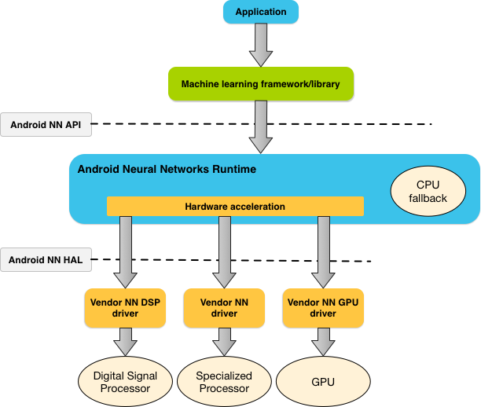
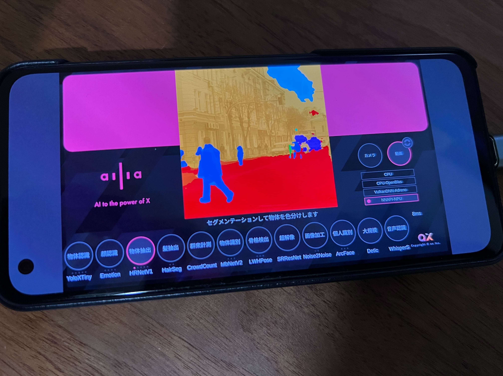

# NNAPI : AndroidでNPUを使用するためのローレベルAPI

# NNAPI : AndroidでNPUを使用するためのローレベルAPI

[](https://kyakuno.medium.com/?source=post_page---byline--df276b62d67b---------------------------------------)

[Kazuki Kyakuno](https://kyakuno.medium.com/?source=post_page---byline--df276b62d67b---------------------------------------)

14 min read

·

Mar 31, 2023

--

Share

AndroidでNPUを使用するためのローレベルAPIであるNNAPIの解説です。NNAPIを使用することで、NPUを使用したAIモデルの高速推論が可能になります。

## NNAPIの概要

NNAPIはAndroidでNPU (Neural Processing Unit)を使用するためのローレベルAPIです。NVIDIA GPUでいうところのcuDNNに相当します。NNAPIを使用することで、Google PixelのEdgeTPUや、QualcommやMediatekのNPUを使用した高速推論が可能になります。

NNAPIを使用することで、Convolutionなどのオペレータを繋いでグラフを構築し、デバイスベンダーのドライバを通じて、NPUを使用したAI推論を行うことが可能です。

NNAPIはC++のAPIで定義されており、Android NDKから使用することが可能です。



NNAPIのアーキテクチャ：（出典 <https://developer.android.com/ndk/guides/neuralnetworks?hl=ja>）

## NNAPIのテンソル形式

NNAPIはtfliteの仕様をベースに設計されています。テンソルはfloatとint8の両方に対応しています。ただし、NPUはint8にのみ対応していることが多く、floatのモデルを与えた場合はCPUもしくはGPUで実行されます。そのため、NPUを使用するには、int8に量子化したモデルを使用する必要があります。

## NNAPIのバージョン

NNAPIにはAndroid10以前で使えるFeatureLevel3 (NNAPI 1.2)と、Android11以降で使えるFeatureLevel4 (NNAPI 1.3)があります。tfliteで一般的に使用されているZERO\_POINT可変量子化のTENSOR\_QUANT8\_ASYMMはFeatureLevel4以上が必要であるため、TensorFlowで量子化した一般的なtfliteモデルを推論する場合、実質的にAndroid11以降が必要です。

Press enter or click to view image in full size


NNAPIのバージョン（出典：<https://www.w3.org/2020/Talks/mlws/mw-androidnn.pdf>）

## NNAPIのデバイス

NNAPIでは、使用するデバイスのリストを与えることで、NNAPIが最適なデバイスを自動的に選択します。

NNAPIには、必ずnnapi\_referenceというソフトウェア実装のデバイスが含まれるため、NNAPIでは定義されているが、NPUでは非対応のレイヤーはnnapi\_referenceによるCPU実装にオフロードされます。

そのため、特定のレイヤーやレイヤーパラメータがNPU非対応だった場合、自動的にnnapi\_referenceにオフロードされた結果、速度が低下する場合があります。

## NNAPIで実行可能なオペレータ

NNAPIで実行可能なオペレータは下記に定義されています。

[## ニューラル ネットワーク API | Android NDK | Android Developers

### Android Neural Networks API（NNAPI）は、Android デバイス上で演算負荷の高い機械学習処理を実行するために設計された Android C API です。NNAPI は、ニューラル…

developer.android.com](https://developer.android.com/ndk/guides/neuralnetworks?hl=ja&source=post_page-----df276b62d67b---------------------------------------)

```
要素ごとの算術演算   
ANEURALNETWORKS_ABS  
ANEURALNETWORKS_ADD  
ANEURALNETWORKS_DIV  
ANEURALNETWORKS_EQUAL  
ANEURALNETWORKS_EXP  
ANEURALNETWORKS_FLOOR  
ANEURALNETWORKS_GREATER  
ANEURALNETWORKS_GREATER_OR_EQUAL  
ANEURALNETWORKS_LESS  
ANEURALNETWORKS_LESS_OR_EQUAL  
ANEURALNETWORKS_LOG  
ANEURALNETWORKS_LOGICAL_AND  
ANEURALNETWORKS_LOGICAL_NOT  
ANEURALNETWORKS_LOGICAL_OR  
ANEURALNETWORKS_MAXIMUM  
ANEURALNETWORKS_MINIMUM  
ANEURALNETWORKS_MUL  
ANEURALNETWORKS_NEG  
ANEURALNETWORKS_NOT_EQUAL  
ANEURALNETWORKS_POW  
ANEURALNETWORKS_RSQRT  
ANEURALNETWORKS_SIN  
ANEURALNETWORKS_SQRT  
ANEURALNETWORKS_SUB  
テンソル操作   
ANEURALNETWORKS_ARGMAX  
ANEURALNETWORKS_ARGMIN  
ANEURALNETWORKS_BATCH_TO_SPACE_ND  
ANEURALNETWORKS_CAST  
ANEURALNETWORKS_CHANNEL_SHUFFLE  
ANEURALNETWORKS_CONCATENATION  
ANEURALNETWORKS_DEPTH_TO_SPACE  
ANEURALNETWORKS_DEQUANTIZE  
ANEURALNETWORKS_EXPAND_DIMS  
ANEURALNETWORKS_GATHER  
ANEURALNETWORKS_MEAN  
ANEURALNETWORKS_PAD  
ANEURALNETWORKS_PAD_V2  
ANEURALNETWORKS_QUANTIZE  
ANEURALNETWORKS_REDUCE_ALL  
ANEURALNETWORKS_REDUCE_ANY  
ANEURALNETWORKS_REDUCE_MAX  
ANEURALNETWORKS_REDUCE_MIN  
ANEURALNETWORKS_REDUCE_PROD  
ANEURALNETWORKS_REDUCE_SUM  
ANEURALNETWORKS_RESHAPE  
ANEURALNETWORKS_SLICE  
ANEURALNETWORKS_SPACE_TO_BATCH_ND  
ANEURALNETWORKS_SPACE_TO_DEPTH  
ANEURALNETWORKS_SPLIT  
ANEURALNETWORKS_SQUEEZE  
ANEURALNETWORKS_STRIDED_SLICE  
ANEURALNETWORKS_TILE  
ANEURALNETWORKS_TOPK_V2  
ANEURALNETWORKS_TRANSPOSE  
画像演算   
ANEURALNETWORKS_RESIZE_BILINEAR  
ANEURALNETWORKS_RESIZE_NEAREST_NEIGHBOR  
検索演算   
ANEURALNETWORKS_EMBEDDING_LOOKUP  
ANEURALNETWORKS_HASHTABLE_LOOKUP  
正規化演算   
ANEURALNETWORKS_INSTANCE_NORMALIZATION  
ANEURALNETWORKS_L2_NORMALIZATION  
ANEURALNETWORKS_LOCAL_RESPONSE_NORMALIZATION  
畳み込み演算   
ANEURALNETWORKS_CONV_2D  
ANEURALNETWORKS_DEPTHWISE_CONV_2D  
ANEURALNETWORKS_GROUPED_CONV_2D  
ANEURALNETWORKS_TRANSPOSE_CONV_2D  
プーリング演算   
ANEURALNETWORKS_AVERAGE_POOL_2D  
ANEURALNETWORKS_L2_POOL_2D  
ANEURALNETWORKS_MAX_POOL_2D  
活性化演算   
ANEURALNETWORKS_LOG_SOFTMAX  
ANEURALNETWORKS_LOGISTIC  
ANEURALNETWORKS_PRELU  
ANEURALNETWORKS_RELU  
ANEURALNETWORKS_RELU1  
ANEURALNETWORKS_RELU6  
ANEURALNETWORKS_SOFTMAX  
ANEURALNETWORKS_TANH  
その他の演算   
ANEURALNETWORKS_AXIS_ALIGNED_BBOX_TRANSFORM  
ANEURALNETWORKS_BIDIRECTIONAL_SEQUENCE_LSTM  
ANEURALNETWORKS_BIDIRECTIONAL_SEQUENCE_RNN  
ANEURALNETWORKS_BOX_WITH_NMS_LIMIT  
ANEURALNETWORKS_DETECTION_POSTPROCESSING  
ANEURALNETWORKS_FULLY_CONNECTED  
ANEURALNETWORKS_GENERATE_PROPOSALS  
ANEURALNETWORKS_HEATMAP_MAX_KEYPOINT  
ANEURALNETWORKS_LSH_PROJECTION  
ANEURALNETWORKS_LSTM  
ANEURALNETWORKS_RANDOM_MULTINOMIAL  
ANEURALNETWORKS_QUANTIZED_16BIT_LSTM  
ANEURALNETWORKS_RNN  
ANEURALNETWORKS_ROI_ALIGN  
ANEURALNETWORKS_ROI_POOLING  
ANEURALNETWORKS_SELECT  
ANEURALNETWORKS_SVDF  
ANEURALNETWORKS_UNIDIRECTIONAL_SEQUENCE_LSTM  
ANEURALNETWORKS_UNIDIRECTIONAL_SEQUENCE_RNN
```

## NNAPIで実行不可能なオペレータ

NON\_MAX\_SUPPRESSION、LEAKY\_RELU、PACK、SHAPE、SPLIT\_Vはサポートされていません。フレームワーク側で対応する必要があります。

## NNAPIで実行可能だが注意が必要なオペレータ

NNAPIはデバイスベンダーが実装を提供する仕組みとなっているため、まだAPIの挙動が安定していません。そのため、特定のデバイス向けのワークアラウンドが必要です。

### Conv

bias\_scaleにはtfliteの制約であるinput\_scale \* filter\_scaleを明示的に指定する必要があります。Snapdragon855では、この値は無視され、input、filter、outputから自動的に判断されます。Snapdragon 8+では、bias\_scaleを参照するため、異なる値を入れた場合は結果が不一致になります。

## Get Kazuki Kyakuno’s stories in your inbox

Join Medium for free to get updates from this writer.

Subscribe

Subscribe

Remember me for faster sign in

また、PerChannelQuantParamsでscalesに0が含まれるとNNAPIはエラーになります。そのため、0を検知した場合は、floatの最小値を設定する必要があります。

### FC

biasが存在しない場合はNNAPIはエラーになります。biasが存在しない場合は明示的にbiasが0のテンソルを生成して与える必要があります。

### Pad

チャンネル方向にパディングする場合、Snapdragon 8+のPADでは不正な値が出力され、PAD\_V2では正しい値が出力されます。ただし、PAD\_V2はPADよりも低速です。

### Mean

tfliteのMeanはinputとoutputのscaleとzero pointが同一であるという制約はありませんが、NNAPIのmeanはinputとoutputのscaleとzero pointが同一であるという制約があります。そのため、Meanの入力と出力でスケール変換を行う必要があります。

## NNAPIのデバッグ

NNAPIに不正なオペレータを供給した場合、logcatにオペレータエラーが出力されることが多いため、まずはlogcatのエラーを確認します。

## NNAPIのベンチマーク

NNAPIのSoCごとのベンチマークは下記にまとめられています。例えば、Snapdragon 8+ Gen1だと、CPU-Fで17506に対して、FP16 NNAPI 1.3だと112237、INT8 NNAPI 1.3だと441100のスコアとなり、25倍高速に動作します。

[## AI-Benchmark

### Have some questions regarding the scores? Faced some issues? Want to discuss the results? Welcome to our new AI…

ai-benchmark.com](https://ai-benchmark.com/ranking_processors?source=post_page-----df276b62d67b---------------------------------------)

実際、弊社でもSnapdragon 8+ Gen1とyolox\_tinyにおいて、CPU（float）に比べてNNAPI NPU（int8）で15倍高速に動作することを確認しています。

## NNAPIのデモ

ax株式会社がGooglePlayで公開しているailia AI showcaseを使用することで、NNAPIとNPUを使用した推論を行うことが可能です。現在、YOLOX\_TINY、YOLOX\_S、HRNET、MobileNetV2、ResNet50、BlazeFace、FaceMeshがNPU推論に対応しています。

Press enter or click to view image in full size



Snapdragon 8+でhrnetをNPU推論する例（CPU 220ms、GPU 130ms、NPU 9ms）

[Google Playからailia AI showcaseをダウンロード](https://play.google.com/store/apps/details?id=jp.axinc.ailia_ai_showcase)

[ailia AI showcase](https://play.google.com/store/apps/details?id=jp.axinc.ailia_ai_showcase)では、ax株式会社と株式会社アクセルが開発するailia TFLite Runtimeを使用してNPU推論を行なっています。ailia TFLite Runtimeはtfliteを推論するためのSDKで、NNAPIで実行不可能なオペレータをサブグラフ分割してCPU実行することで、YOLOXなどの複雑なグラフをNNAPIで実行可能としています。

[## ailia TFLite Runtime : NonOSやRTOSにAIを実装できるランタイム

### NonOSやRTOSにAIを実装できるランタイムであるailia TFLite Runtimeのご紹介です。ailia TFLite Runtimeを使用することで、リソースの限られた組込機器にAIを実装することが可能です。

medium.com](https://medium.com/axinc/ailia-tflite-runtime-nonos%E3%82%84rtos%E3%81%ABai%E3%82%92%E5%AE%9F%E8%A3%85%E3%81%A7%E3%81%8D%E3%82%8B%E3%83%A9%E3%83%B3%E3%82%BF%E3%82%A4%E3%83%A0-db089c961547?source=post_page-----df276b62d67b---------------------------------------)

また、NNAPIで使用できる量子化済みモデルをailia-models-tfliteで公開しています。

[## GitHub - axinc-ai/ailia-models-tflite: Quantized version of model library

### Quantized tflite models for ailia TFLite Runtime ailia TFLite Runtime is a TensorFlow Lite compatible inference engine…

github.com](https://github.com/axinc-ai/ailia-models-tflite?source=post_page-----df276b62d67b---------------------------------------)

ax株式会社はAIを実用化する会社として、クロスプラットフォームでGPUを使用した高速な推論を行うことができるailia SDKを開発しています。ax株式会社ではコンサルティングからモデル作成、SDKの提供、AIを利用したアプリ・システム開発、サポートまで、 AIに関するトータルソリューションを提供していますのでお気軽に[お問い合わせ](https://axinc.jp/)ください。