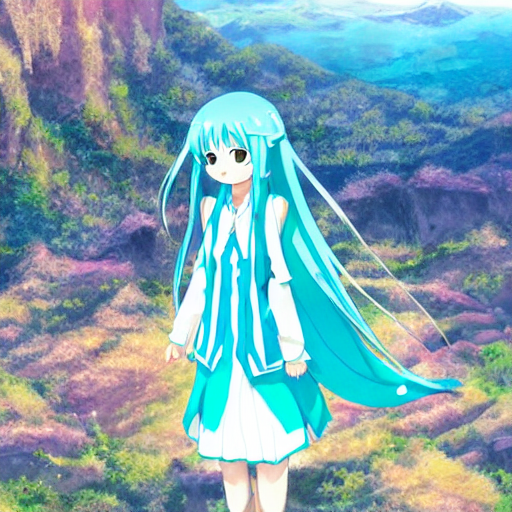
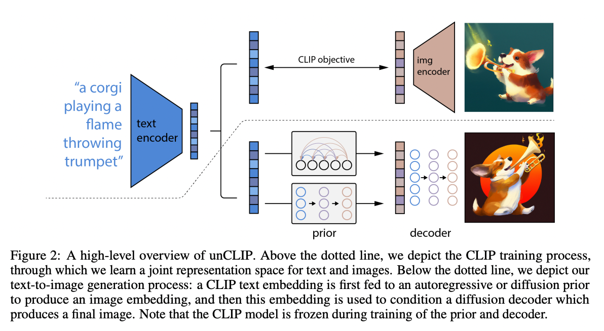

# StableDiffusion : テキストから画像を生成する機械学習モデル

# StableDiffusion : テキストから画像を生成する機械学習モデル

[](https://kyakuno.medium.com/?source=post_page---byline--aa3676787a09---------------------------------------)

[Kazuki Kyakuno](https://kyakuno.medium.com/?source=post_page---byline--aa3676787a09---------------------------------------)

9 min read

·

Aug 25, 2022

--

Share

StableDiffusionはテキストから画像を生成する機械学習モデルです。学習済みモデルが公開されており、PC上で自由に画像を生成することが可能です。

## StableDiffusionの概要

StableDiffusionは2022年8月に公開されたテキストから画像を生成する機械学習モデルです。テキストから画像を生成するサービスとして、DALLE2やMidjourneyが存在しますが、いずれも学習済みモデルが非公開であり、WEBサービスを経由してアクセスする必要がありました。StableDiffusionは学習済みモデルが公開されているため、PC上で自由に画像を生成することが可能です。

[## GitHub - CompVis/stable-diffusion

### Stable Diffusion was made possible thanks to a collaboration with Stability AI and Runway and builds upon our previous…

github.com](https://github.com/CompVis/stable-diffusion?source=post_page-----aa3676787a09---------------------------------------)

[## High-Resolution Image Synthesis with Latent Diffusion Models

### By decomposing the image formation process into a sequential application of denoising autoencoders, diffusion models…

arxiv.org](https://arxiv.org/abs/2112.10752?source=post_page-----aa3676787a09---------------------------------------)

## StableDiffusionの使用方法

WindowsでStable Diffusionを使用するには、GRiskの提供するビルド済みバイナリが便利です。

[## Stable Diffusion GRisk GUI 0.1

### This project require a Nvidia Card that can run CUDA. With a card with 4 vram, it should generate 256X512 images. This…

grisk.itch.io](https://grisk.itch.io/stable-diffusion-gui?source=post_page-----aa3676787a09---------------------------------------)

Stable Diffusion GRisk GUI.rarを解凍した後、Stable Diffusion GRisk GUI.exeを起動します。

デフォルトのパラメータでは正常な画像が生成できないため、Stepsを150、Resolutionを512に設定します。次に、Promptにテキストを入力し、Renderを実行することで画像を生成可能です。生成された画像はresultsフォルダに格納されます。

Press enter or click to view image in full size


Stable Diffusion GRiskのGUIと出力の例

単語数が少ないと、テキストの特徴ベクトルが絵を構成するのに十分な情報量を持たないためか、出力が安定しない傾向にあります。そのため、できるだけ詳細に欲しい絵の情報を入力した方が良いようです。



“hastune miku standing on the mountain anime”


“your name overlooking the city anime”

RTX3080を使用した場合、32秒程度で画像を生成可能です。

## StableDiffusionのデータセット

StableDiffusionはLAION-5Bデータセットで学習されています。LAION-5Bデータセットには58.5億枚の画像とテキストのペアが含まれます。

[## LAION-5B: A NEW ERA OF OPEN LARGE-SCALE MULTI-MODAL DATASETS | LAION

### by: Romain Beaumont, 8 Aug, 2022 We present a dataset of 5,85 billion CLIP-filtered image-text pairs, 14x bigger than…

laion.ai](https://laion.ai/blog/laion-5b/?source=post_page-----aa3676787a09---------------------------------------)

データセットの内容は下記のページから検索可能です。検索にはCLIPのEmbeddingを使用しており、CLIPが画像検索に対しても有効であることがわかります。

[## Clip front

### Clip front

Clip frontrom1504.github.io](https://rom1504.github.io/clip-retrieval/?back=https%3A%2F%2Fknn5.laion.ai&index=laion5B&useMclip=false&source=post_page-----aa3676787a09---------------------------------------)

StableDiffusionでは、LAION-2Bを使用して256x256解像度で学習した後、LAION-5Bの1億7000枚の画像を使用して512x512解像度を学習しています。

[## CompVis/stable-diffusion · Hugging Face

### Edit model card Stable Diffusion is a latent text-to-image diffusion model capable of generating photo-realistic images…

huggingface.co](https://huggingface.co/CompVis/stable-diffusion?source=post_page-----aa3676787a09---------------------------------------)

## StableDiffusionの学習時間

StableDiffusionはAWSのA100 (40GB VRAM)を使用して150,000時間の学習を行なっています。

[## stable-diffusion/Stable\_Diffusion\_v1\_Model\_Card.md at main · CompVis/stable-diffusion

### This model card focuses on the model associated with the Stable Diffusion model, available here. Developed by: Robin…

github.com](https://github.com/CompVis/stable-diffusion/blob/main/Stable_Diffusion_v1_Model_Card.md?source=post_page-----aa3676787a09---------------------------------------)

## StableDiffusionのアーキテクチャ

StableDiffusionでは、CLIPによるText Encoderと、UNetによるAutoEncoderを使用し、LatentDiffusionModel（拡散モデル）によってtext2imageを構築しています。


StableDiffusionのアーキテクチャ（出典：<https://arxiv.org/abs/2112.10752>）

画像生成のアーキテクチャはCLIP特徴と拡散モデルを使用するDALLE-2と同様です。

Press enter or click to view image in full size



出典：<https://cdn.openai.com/papers/dall-e-2.pdf>

CLIPはWeb上の4億枚の画像で学習されており、任意のテキストと画像の類似度を出力することが可能です。従来のClassifierとは異なり、ラベルではなくテキストとのペアで学習しているため、未知の画像に対してもzero-shotでの画像分類を実現します。CLIPの特徴ベクトルは、画像の意味を示す情報を持っているため、画像分類のみならず、画像生成にも応用可能です。

[## CLIP : 超大規模データセットで事前学習され、再学習なしで任意の物体を識別できる物体識別モデル

### ailia SDKで使用できる機械学習モデルである「CLIP」のご紹介です。「CLIP」を使用することで、任意の物体の識別を行うことが可能です。

medium.com](https://medium.com/axinc/clip-%E8%B6%85%E5%A4%A7%E8%A6%8F%E6%A8%A1%E3%83%87%E3%83%BC%E3%82%BF%E3%82%BB%E3%83%83%E3%83%88%E3%81%A7%E4%BA%8B%E5%89%8D%E5%AD%A6%E7%BF%92%E3%81%95%E3%82%8C-%E5%86%8D%E5%AD%A6%E7%BF%92%E3%81%AA%E3%81%97%E3%81%A7%E4%BB%BB%E6%84%8F%E3%81%AE%E7%89%A9%E4%BD%93%E3%82%92%E8%AD%98%E5%88%A5%E3%81%A7%E3%81%8D%E3%82%8B%E7%89%A9%E4%BD%93%E8%AD%98%E5%88%A5%E3%83%A2%E3%83%87%E3%83%AB-2ebc5c1666f?source=post_page-----aa3676787a09---------------------------------------)

まず、CLIPのテキストエンコーダを使用して、テキストから特徴ベクトルを取得します。単語ごとに単語ベクトルに変換した後、Transformerでテキストの意味を示す特徴ベクトルが抽出されます。

## Get Kazuki Kyakuno’s stories in your inbox

Join Medium for free to get updates from this writer.

Subscribe

Subscribe

Remember me for faster sign in

テキストエンコーダで取得した特徴ベクトルから、特徴ベクトルの空間で拡散モデルを使用して、CLIPのイメージエンコーダの特徴ベクトルに変換します。

最後に、イメージデコーダを使用して特徴ベクトルを画像に変換します。

拡散モデルでは、ノイズからスタートし、デノイズを繰り返すことで特徴ベクトルを生成します。デノイズにUNetを使用しています。

生成した画像に対して、CLIPのイメージエンコーダを適用すると、テキストに沿った特徴ベクトルが得られるため、テキストに沿った画像が生成されることになります。

GLIDEと同様にclassfier-free guidanceを使用しています。

[## GLIDE: Towards Photorealistic Image Generation and Editing with Text-Guided Diffusion Models

### Diffusion models have recently been shown to generate high-quality synthetic images, especially when paired with a…

arxiv.org](https://arxiv.org/abs/2112.10741?source=post_page-----aa3676787a09---------------------------------------)

## ailia SDKからStableDiffusionを使用する

ailia SDK 1.2.14から、StableDiffusionに対応しています。下記のコマンドで画像生成が可能です。

```
$ python3 stable-diffusion-txt2img.py --input "a photograph of an astronaut riding a horse"
```

StableDiffusionの画像生成はVRAMを10GB以上使用するため、VRAMが少ない環境では、-e 0オプションを付与してCPU実行してください。

```
$ python3 stable-diffusion-txt2img.py --input "a girl" -e 0
```

[## ailia-models/diffusion/stable-diffusion-txt2img at master · axinc-ai/ailia-models

### Text to render a photograph of an astronaut riding a horse This model requires additional module. pip3 install…

github.com](https://github.com/axinc-ai/ailia-models/tree/master/diffusion/stable-diffusion-txt2img?source=post_page-----aa3676787a09---------------------------------------)

ax株式会社はAIを実用化する会社として、クロスプラットフォームでGPUを使用した高速な推論を行うことができるailia SDKを開発しています。ax株式会社ではコンサルティングからモデル作成、SDKの提供、AIを利用したアプリ・システム開発、サポートまで、 AIに関するトータルソリューションを提供していますのでお気軽に[お問い合わせ](https://axinc.jp/)ください。