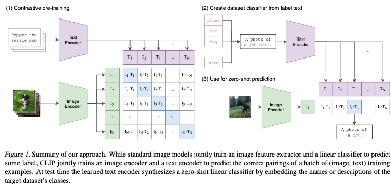
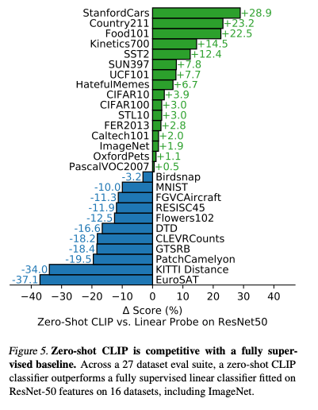

# CLIP : 超大規模データセットで事前学習され、再学習なしで任意の物体を識別できる物体識別モデル

# CLIP : 超大規模データセットで事前学習され、再学習なしで任意の物体を識別できる物体識別モデル

[](https://kyakuno.medium.com/?source=post_page---byline--2ebc5c1666f---------------------------------------)

[Kazuki Kyakuno](https://kyakuno.medium.com/?source=post_page---byline--2ebc5c1666f---------------------------------------)

9 min read

·

Jan 24, 2022

--

Share

[ailia SDK](https://ailia.jp/)で使用できる機械学習モデルである「CLIP」のご紹介です。エッジ向け推論フレームワークである[ailia SDK](https://ailia.jp/)と[ailia MODELS](https://github.com/axinc-ai/ailia-models)に公開されている機械学習モデルを使用することで、簡単にAIの機能をアプリケーションに実装することができます。

## CLIPの概要

CLIPは2021年2月に公開された物体識別モデルです。GPT3で有名なOpenAIが開発しました。通常のImage Classificationでは、ImageNetで公開された1000カテゴリから物体を識別しますが、CLIPはWEB上の4億枚という膨大な画像と対応するテキストデータで学習されており、再学習不要で、ImageNetに含まれていない任意のカテゴリで物体識別を行うことが可能です。

[## Learning Transferable Visual Models From Natural Language Supervision

### State-of-the-art computer vision systems are trained to predict a fixed set of predetermined object categories. This…

arxiv.org](https://arxiv.org/abs/2103.00020?source=post_page-----2ebc5c1666f---------------------------------------)

[## GitHub - openai/CLIP: Contrastive Language-Image Pretraining

### CLIP (Contrastive Language-Image Pre-Training) is a neural network trained on a variety of (image, text) pairs. It can…

github.com](https://github.com/openai/CLIP?source=post_page-----2ebc5c1666f---------------------------------------)

## CLIPの活用方法

画像をCLIP Image Encoderに入力すると、512次元の特徴ベクトルを取得可能です。同様にテキストをCLIP Text Encoderに入力すると、512次元の特徴ベクトルを取得可能です。

例えば、ある画像が”cat”か”dog”かを判定したい場合、画像のImage Encoderの特徴ベクトルと、”cat”のText Encoderの特徴ベクトルの内積、”dog”のText Encoderの特徴ベクトルの内積を計算し、距離が近いラベルを正解とします。

そのため、画像の特徴ベクトルを事前に計算しておき、データベースに格納しておくことで、任意のラベルで検索が可能です。

## CLIPのアーキテクチャ

従来の物体識別モデルは、固定の事前に設定されたカテゴリを予測するものでした。この制約は、他のカテゴリの物体を認識しようとした場合に、新しくラベル付けされたデータを必要とします。CLIPは、ラベルではなく、画像に対して付与されたテキストを学習することで、この問題を解決します。

CLIPでは、インターネット上の4億枚の画像と対応するテキストを使用して事前学習しています。この事前学習済みモデルは、zero-shot transferを可能とし、事前学習していない任意のラベルを使用した識別を可能とします。

このアプローチは、30の異なるベンチマークで評価されます。具体的に、OCR、ビデオからのアクション検出、地名検出、一般的な物体識別などです。

CLIPは、ベンチマークのデータセットを使用しておらず、追加の学習もしていないにも関わらず、ほとんどのタスクで、ベンチマークのデータセットで学習されたモデルと同等の性能を持ちます。

また、ImageNetベンチマークでは、128万枚のトレーニングデータを使用していないにも関わらず、トレーニングデータを使用して学習したResNet-50と同等の性能を獲得します。

CLIPのアーキテクチャは下記となります。

Press enter or click to view image in full size



出典：<https://arxiv.org/abs/2103.00020>

通常のImage Modelsは入力された画像に対してFeature Extractorで特徴抽出を行い、Liner Classifierでラベルを予測します。

CLIPは、Image EncoderとText Encoderを組み合わせて学習を行います。学習データは、(image, text)のバッチとなります。画像をEncodeしたベクトルと、テキストをEncodeしたベクトルの内積が、正しい組み合わせでは1、間違った組み合わせでは0となるように学習を行います。

## Get Kazuki Kyakuno’s stories in your inbox

Join Medium for free to get updates from this writer.

Subscribe

Subscribe

Remember me for faster sign in

推論では、学習されたText Encoderを使用して、ターゲットとなるデータセットのクラス名をEncodeし、Embeddingされたベクトルを取得、画像をEncodeしたベクトルと内積を計算、最も高い値を持つラベルを正解とします。このような手順で、Zero-shot linear classifierを生成します。


出典：<https://arxiv.org/abs/2103.00020>

CLIPは、従来のzero-shot transferの性能を大幅に上回ります。


出典：<https://arxiv.org/abs/2103.00020>

各種の画像分類のベンチマークでの性能差は下記となります。ImageNetではzero-shot transferにも関わらず、ResNet50に比べて1.9%高い性能を持ちます。



出典：<https://arxiv.org/abs/2103.00020>

GPT-3の”prompt engineering”で議論されたように、クエリとして適切な文字列を与える必要があります。例えば、Oxford-IIIT Petsでは、よりコンテキストを適切に与えるために、“A photo of a {label}, a type of pet.”というクエリを使用します。OCRデータセットでは、認識したいテキストや番号の前にquotesを付けることで性能が改善します。Satellite image classificationでは、“a satellite photo of a {label}.”というクエリが有効です。

CLIPは標準のImageNetで事前学習されたモデルに比べて、データセットの分散が変わっても安定した性能を発揮します。

Press enter or click to view image in full size


出典：<https://arxiv.org/abs/2103.00020>

## CLIPのTokenizer

CLIP Text Encoderはトークン列を受け取るため、テキストをトークン列に変換する必要があります。CLIPでは、英語に限定したSimpleTokenizerを使用しています。SimpleTokenizerではUTF8のテキストを下記の手順でトークン化します。

1. 複数スペースを単一スペースに置換
2. 改行を削除
3. 正規表現で単語分割
4. 単語ごとにbyte encoderを通してUTF8のコードの並び替え
5. BPEとvocabを使用して単語2つを再起的に結合してバイグラム化
6. vocab（辞書ファイル）を使用してトークンIDに変換

アーキテクチャはGPT2TokenizerFastに近く、vocabと単語分割の正規表現が異なります。p{L}はUnicode Letter、p{N}はUnicode Numberです。UTF8はマルチバイトであるため、ASCIIの数値にマッチングするdや、文字にマッチングするDが使用できず、pを使用しています。

GPT2TokenizerFast

> pat = re.compile(r”””’s|’t|’re|’ve|’m|’ll|’d| ?\p{L}+| ?\p{N}+| ?[^\s\p{L}\p{N}]+|\s+(?!\S)|\s+”””)

SimpleTokenizer

> self.pat = re.compile(r”””<\|startoftext\|>|<\|endoftext\|>|’s|’t|’re|’ve|’m|’ll|’d|[\p{L}]+|[\p{N}]|[^\s\p{L}\p{N}]+”””,re.IGNORECASE)

## CLIPの使用方法

CLIPを使用するには、下記のコマンドを使用します。input.jpgを入力として、”a human”である確率、”a dog”である確率、”a cat”である確率を出力します。ラベルには任意のテキストを与えることが可能です。

```
$ python3 clip.py -i input.jpg --text "a human" --text "a dog" --text "a cat"
```

[## ailia-models/image\_classification/clip at master · axinc-ai/ailia-models

### (Image from https://scikit-image.org/) ### predicts the most likely top5 labels among input textual labels ### a cat…

github.com](https://github.com/axinc-ai/ailia-models/tree/master/image_classification/clip?source=post_page-----2ebc5c1666f---------------------------------------)

ax株式会社はAIを実用化する会社として、クロスプラットフォームでGPUを使用した高速な推論を行うことができるailia SDKを開発しています。ax株式会社ではコンサルティングからモデル作成、SDKの提供、AIを利用したアプリ・システム開発、サポートまで、 AIに関するトータルソリューションを提供していますのでお気軽に[お問い合わせ](https://axinc.jp/)ください。