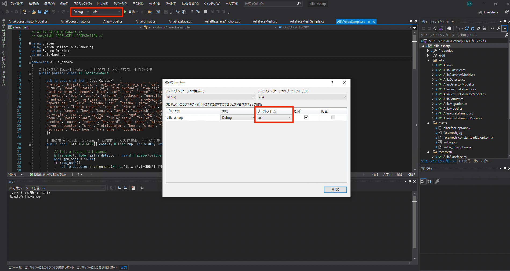
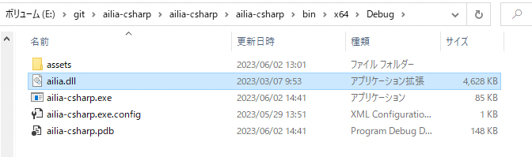
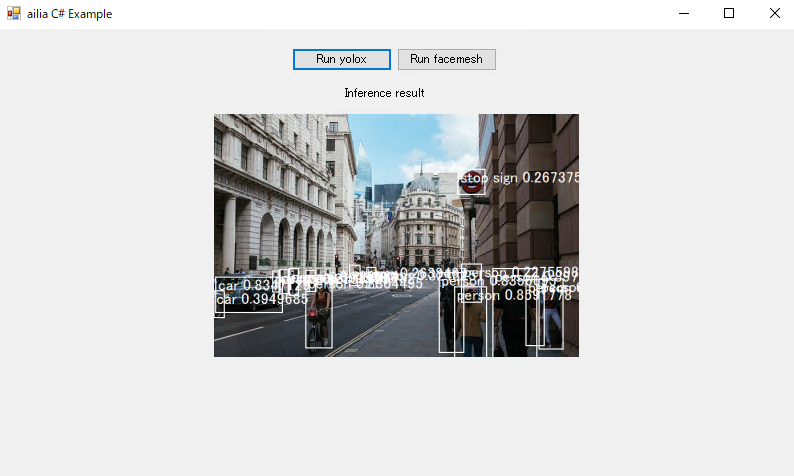
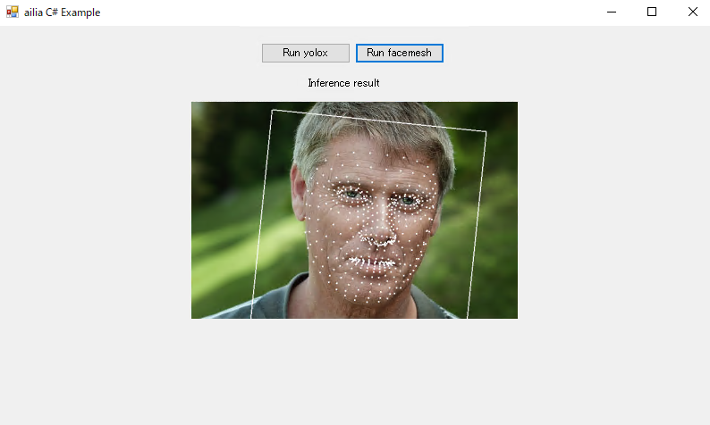

# ailia SDK チュートリアル (C#)

# ailia SDK チュートリアル (C#)

[Kazuki Kyakuno](https://kyakuno.medium.com/?source=post_page---byline--dfa783325134---------------------------------------)

Jun 5, 2023

--

Share

ailia SDKをVisual StudioとC#から使用する方法を解説します。C#で開発された業務アプリなどに簡単にAI機能を取り込むことが可能です。

## プロジェクトファイルのダウンロード

ailia SDKをVisual StudioとC#から使用するサンプルは下記のgithubに公開しています。git cloneするか、ダウンロードしてください。

<https://github.com/axinc-ai/ailia-csharp>

Press enter or click to view image in full size

ailia-csharpのリポジトリ

## ailia SDKのダウンロード

実行に必要なDLLを取得するため、ailia SDKをダウンロードします。

[## ax Inc.

### ax株式会社のコーポレートサイトです。あらゆるデバイスにAI が載る未来。そのような未来が来ることを我々は信じています。その未来に向けて我々は高速なSDK を開発し、最新のAI モデルを常に研究し続けます。ax 株式会社は最新のAI…

axinc.jp](https://axinc.jp/trial/?source=post_page-----dfa783325134---------------------------------------)

## プロジェクトファイルのビルド

ailia-csharp.slnを開き、Active PlatformをAny CPUからx64に変更してビルドします。

Press enter or click to view image in full size

Active Platformの変更

ailia SDKに含まれるailia.dllを/ailia-csharp/ailia-csharp/bin/x64/Debugにコピーします。

DLLのコピー

評価版の場合はライセンスファイルも同じフォルダにコピーします。

## プロジェクトの実行

プロジェクトを実行すると、YOLOXとFaceMeshを実行可能です。デフォルトではCPUで推論します。

Press enter or click to view image in full size

yoloxの実行結果

Press enter or click to view image in full size

facemeshの実行結果

GPUを使用する場合は、ailia.dllだけでなく、ailia\_vulkan.dllもコピーし、AiliaYoloxSample.csとAiliaFaceMeshSample.csのgpu\_mode変数をtrueにしてください。

## Unity向けのC#とVisualStudio向けのC#の違い

### API

VisualStudioのC#向けには、alia SDKのUnity向けに提供している、C#のLowLevel APIとModel Classがそのまま使用可能です。

[## ailia: ailia Unity Plugin Document

### Edit description

axinc-ai.github.io](https://axinc-ai.github.io/ailia-sdk/api/unity/jp/?source=post_page-----dfa783325134---------------------------------------)

### C#のインタフェース定義ファイル

Visual StudioのC#でも、ailia SDKに含まれるUnity向けのインタフェース定義ファイルをそのまま使用可能です。ailia SDKに含まれるUnity向けの定義ファイルと同じものが、サンプルプロジェクトの下記に含まれています。

## Get Kazuki Kyakuno’s stories in your inbox

Join Medium for free to get updates from this writer.

Subscribe

Subscribe

Remember me for faster sign in

<https://github.com/axinc-ai/ailia-csharp/tree/main/ailia-csharp/ailia-csharp/ailia>

### Unityの互換関数

ailiaのUnity向けのインタフェース定義では、UnityEngine名前空間と、Debug、Color32、Vector2、Mathfなど、 一部のC#非標準の関数を使用しています。これらの関数を定義するAiliaMigrattion.csを用意しています。

<https://github.com/axinc-ai/ailia-csharp/blob/main/ailia-csharp/ailia-csharp/ailia/AiliaMigration.cs>

### 画像の並び順

Unityでは画像をB2T（Bottom To Top）で扱います。C#のBitmapクラスはT2B（Top to Bottom）で扱うため、ailia SDKのUnity向けのサンプルで扱うには上下を反転する必要があります。

### ailia MODELS Unityについて

[ailia MODELS Unity](https://github.com/axinc-ai/ailia-models-unity)のコードはUnityのレンダラーおよびテクスチャに依存しているため、レンダラー部分をBitmapのGraphics、テクスチャをBitmapに置き換える必要があります。サンプルプロジェクトでは、YOLOXとFaceMeshにおいて、レンダラーをGraphicsに置き換えたバージョンを提供していますので、書き換える箇所の参考にしていただければと思います。

ax株式会社はAIを実用化する会社として、クロスプラットフォームでGPUを使用した高速な推論を行うことができるailia SDKを開発しています。ax株式会社ではコンサルティングからモデル作成、SDKの提供、AIを利用したアプリ・システム開発、サポートまで、 AIに関するトータルソリューションを提供していますのでお気軽に[お問い合わせ](https://axinc.jp/)ください。