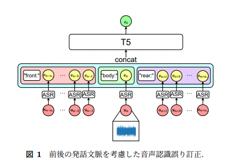
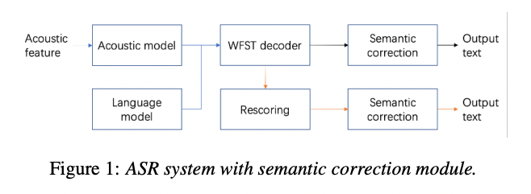
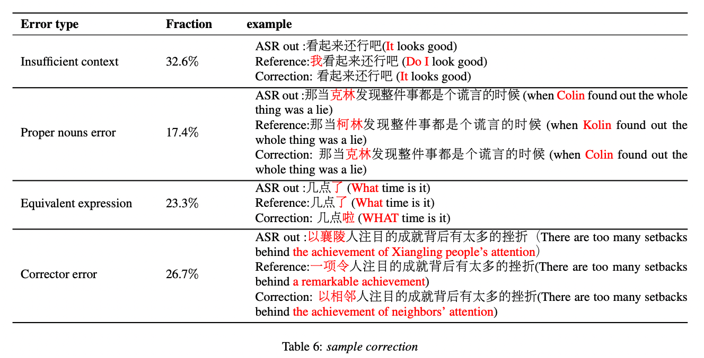
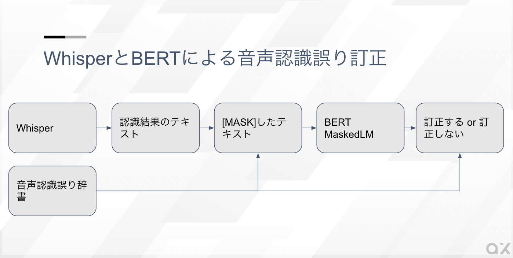

# Whisperに音声認識誤り辞書を適用することで音声認識誤り訂正を行う

# **Whisperに音声認識誤り辞書を適用することで音声認識誤り訂正を行う**

[](https://kyakuno.medium.com/?source=post_page---byline--ab939440a29c---------------------------------------)

[Kazuki Kyakuno](https://kyakuno.medium.com/?source=post_page---byline--ab939440a29c---------------------------------------)

13 min read

·

Jun 2, 2023

--

Share

Whisperの出力するテキストに音声認識誤り辞書を適用することで、音声認識誤り訂正を行う方法を紹介します。また、BERTを併用することで、一般用語が誤って訂正される問題への対策を行います。

## 音声認識誤りとは

音声認識において、未知語に対する認識結果が誤ることがあります。これを音声認識誤りと呼びます。

音声認識誤りを訂正する方法として、音声認識モデルそのものを改良する方法と、音声認識結果のテキストを訂正する方法の2方式があります。

音声認識モデルを改良する方法の代表例はファインチューニング、音声認識後のテキストを訂正する方法の代表例は言語モデルによる訂正です。

## 音声認識モデルそのものを改良する方法

音声認識モデルそのものを改良する方法として、Whisperのファインチューニングを行い、未知語を学習する方法を下記の記事で解説しています。

[## WhisperをFine Tuningして専門用語を認識可能にする

### Whisperを少量のデータセットでFine Tuningして専門用語を認識可能にする方法を解説します。Tacotron2の合成音声でデータセットを作成することで、専門用語を認識可能なWhisperモデルを作成します。

medium.com](https://medium.com/axinc/whisper%E3%82%92fine-tuning%E3%81%97%E3%81%A6%E5%B0%82%E9%96%80%E7%94%A8%E8%AA%9E%E3%82%92%E8%AA%8D%E8%AD%98%E5%8F%AF%E8%83%BD%E3%81%AB%E3%81%99%E3%82%8B-3744e2779c71?source=post_page-----ab939440a29c---------------------------------------)

しかし、ファインチューニングは未知語を獲得できる一方、過学習によって、通常のテキストの誤りが増えるという問題があります。正則化のためにJSUTなどのデータセットを混ぜて学習することで改善はしますが、Whisperの学習用のデータセットが公開されているわけではないため、完全に解決することは困難です。

## 音声認識結果のテキストを訂正する方法

音声認識結果のテキストを訂正する方法では、Whisperの認識したテキストから未知語の誤り位置を検出し、誤り訂正を行うことで、未知語を音声認識可能としています。

下記の論文では、T5を使用して、音声認識の誤りを訂正した発話を出力するテキスト生成タスクとして、音声認識誤り訂正をおこなっています。

[前後の発話を文脈として考慮するニューラル音声認識誤り訂正](https://www.tkl.iis.u-tokyo.ac.jp/new/uploads/publication_file/file/1019/tkchoyo_NL.pdf)

> 学習データが存在するドメインは少なく，学習データ外ドメインにおける音声認識性能には課題がある.そこで本研究では，汎用の音声認識モデルを用いて多様なドメインの音声言語データを書き起こすことを目的とし，前後の発話を文脈として考慮したニューラル音声認識誤り訂正手法を提案する.



下記の論文では、音声認識の後に、BARTによるSemantic correctionを適用することで、中国語の音声認識誤りを訂正する方法が提案されています。

[BART based semantic correction for Mandarin automatic speech recognition system](https://arxiv.org/abs/2104.05507)



Press enter or click to view image in full size



下記のGoogleの論文では、音声認識モデルの後段に、音声合成モデルで作成した音声データを使用してスペル修正モデルを学習し、音声認識誤りを訂正する方法が提案されています。

[A SPELLING CORRECTION MODEL FOR END-TO-END SPEECH RECOGNITION](https://arxiv.org/pdf/1902.07178.pdf)

下記のAI Shiftの論文では、テキストの擬似誤りデータを作成し、その誤りを訂正するモデルを適用することで、音声認識誤りを訂正する方法が提案されています。

[日本語音声認識誤り訂正のための擬似誤りデータ作成と評価](https://www.jstage.jst.go.jp/article/pjsai/JSAI2021/0/JSAI2021_2Yin504/_pdf/-char/ja)

下記のBLOGでは、BERTを使用して、誤り位置を計算するモデルと、MaskedLMによる誤りを訂正するモデルによって、文章の校正を行っています。

[## BERTとChat GPTの精度を比較してみた① - Platinum Data Blog by BrainPad

### このたびブレインパッドは、LLM/Generative AIに関する研究プロジェクトを立ち上げ、この「Platinum Data Blog」を通じてLLM/Generative AIに関するさまざまな情報を発信をしています。…

blog.brainpad.co.jp](https://blog.brainpad.co.jp/entry/2023/05/30/153102?source=post_page-----ab939440a29c---------------------------------------)

下記の音声認識結果から固有表現を抽出する論文では、福井県の道路交通情報に関する対話ログが使用されており、この辞書には固有表現と、それに対する一部の別称や略称、音声認識誤りが登録されています。音声認識誤り辞書から逆引きして固有表現を取り出せるようになっています。

[事前学習モデルを用いた音声認識結果からの固有表現抽出](https://www.anlp.jp/proceedings/annual_meeting/2022/pdf_dir/PT4-7.pdf)

また、誤り訂正からは少し離れますが、BERTを使用して後処理で句読点を挿入する方法が検討されています。

[## BERTベースの句読点モデルによるWhisperの書き起こしの改善

### Whisper は、多言語音声認識システムです。その出力である書き起こしには、句読点が含まれていないことがあるため、自動翻訳の精度に悪影響を与えることがあります。そこで、Whisper…

zenn.dev](https://zenn.dev/yutohub/articles/4304fd9a25e522?source=post_page-----ab939440a29c---------------------------------------)

## 実験に使用するアーキテクチャ

今回の実験では、音声認識誤り辞書とBERTを使用した方法を実装します。

具体的に、Whisperが認識したテキストに対し、音声認識誤り辞書を使用し、誤っている可能性のある単語を見つけ、正しい固有表現に訂正します。

## Get Kazuki Kyakuno’s stories in your inbox

Join Medium for free to get updates from this writer.

Subscribe

Subscribe

Remember me for faster sign in

ただし、そのままだと一般的な単語も置き換えてしまう可能性があるため、BERTを使用し、BERTの候補の中に含まれていれば置換しないようにします。

Press enter or click to view image in full size



WhisperとBERTによる音声認識誤り訂正

## 音声認識誤り辞書の準備

まず、未知語をどのように間違えるかの音声認識誤り辞書を準備します。具体的に、未知語からTacotron2で合成音声を作成し、Whisperで音声認識することで、音声認識誤りをリストアップします。加えて、実際の運用時に出てきた間違えを手動で辞書に登録します。

辞書の例は下記となります。

```
#誤り 正解  
  
#自動生成したもの  
花竹 鼻茸  
花地 鼻血  
ビフェ 鼻閉  
微生息感 鼻閉塞感  
リーガン 鼻閉感  
考え 肝癌  
...  
#合計9113単語  
  
#手動で追加したもの  
心レンズ 心電図  
経連 痙攣  
経営 系  
動機 動悸  
#合計4単語
```

## 音声認識誤り辞書による誤り訂正

音声認識誤り辞書が準備できたら、Whisperで音声認識を行ったテキストから、音声認識誤り辞書に登録されている訂正候補の単語をリストアップします。

リストアップした訂正候補の単語を訂正するためのシンプルな実装は、訂正候補の単語を音声認識誤り辞書にある正しい単語に置換することです。しかし、この方法だと、未知語を一般的な単語に誤っている場合に、一般的な単語を一律で置換してしまい、過剰に置換してしまうという問題があります。

例えば、「肝癌」を「考え」に誤認識する場合、音声認識誤り辞書を使用して一律で置換すると、「考える」という文章が、「肝癌る」になってしまいます。

## BERTによる修正するか修正しないかの判断

そこで、BERTのMaskedLMを適用します。BERTのMaskedLMは、MASK指定した場所に当てはまる単語の候補を計算する言語モデルです。BERTの推論結果の候補に訂正候補の単語が含まれる場合は、訂正しないという処理を行います。正しい用法であれば、MaskedLMの候補に現れるはずで、誤りの場合は現れないはずです。これにより、過剰に訂正してしまう問題を解消します。

例えば、元の文章が「手足の経連と動機がある場合、心臓の問題が考えられます。」だとして、「考え」をMASKして、BERTのMaskedLMを計算すると、下記のようになります。

```
手足の経連と動機がある場合、心臓の問題が[MASK]られます。  
0 考え  
1 見  
2 み  
3 認め  
4 感じ  
5 診  
6 取り上げ  
7 調べ  
8 論じ  
9 見受け
```

この場合、BERTの候補に元の「考え」が含まれるため、「肝癌」には訂正しません。

次に、元の文章が、「あなたの病気は考えである可能性があります。」だとした場合、「考え」をMASKして、BERTのMaskedLMを計算すると、下記のようになります。

```
あなたの病気は[MASK]である可能性があります。  
0 可動  
1 病気  
2 正常  
3 重要  
4 、  
5 一部  
6 手術  
7 患者  
8 稀  
9 関節
```

この場合、BERTの候補に「考え」が含まれないため、「肝癌」に訂正します。

## 長い文章への適用

これらを長い文章に適用した場合の実行例は下記となります。

元の認識結果です。「経連」、「動機」、「血液循環経営」、「心レンズ」が誤りです。

```
こんにちは、先生。最近手足の経連があり、動機も感じます。  
こんにちは。手足の経連と動機がある場合、心臓の問題が考えられます。  
経連や動機の発作がいつ頻繁に起こるかを教えていただけますか?  
経連はほとんど毎日、動機はたまにです。  
経連と動機は日常的に起こる場合は、心臓や血液循環経営などの問題がある可能性があります。  
一度、心臓の検査を受ける必要があります。  
心臓の検査を受ける必要があるのですか?  
どのような検査が必要ですか?  
はい、検査が必要です。まずは、心臓の電気活動を測定するために心レンズを撮影します。  
また、動脈効果の状態を調べるために、エコー検査やMRIを行うことがあります。  
そうですか、わかりました。心臓の検査を予約しましょうか?  
はい、お予約ください。また、心臓病が疑われる場合は、内科医や心臓専門医に紹介することがあります。  
ありがとうございます、先生。どういたしまして、心配なことがあれば、いつでも連絡してください。
```

BERTを使用せずに一括訂正した訂正結果です。「必要」が「非腫瘍」に、「のよ」が「膿瘍」など、過剰に訂正されます。

```
こんにちは、先生。最近手足の痙攣があり、動悸も感じます。  
こんにちは。手足の痙攣と動悸がある場合、心臓の問題が肝癌られます。  
痙攣や動悸の発作がいつ頻繁に起こるかを教えてい多動けますか?  
痙攣はほとんど毎日、動悸はたまにです。  
痙攣と動悸は日常的に起こる場合は、心臓や血液循環系などの問題がある可動性があります。  
一度、心臓の検査を受ける非腫瘍があります。  
心臓の検査を受ける非腫瘍がある呂律か?  
ど膿瘍うな検査が非腫瘍ですか?  
はい、検査が非腫瘍です。まずは、心臓の電気活動を測定するために心電図を撮影します。  
また、動脈硬化の抑鬱状態を調べるために、エコー検査やMRIを行うことがあります。  
欠損ですか、わかりました。心臓の検査を予約しましょうか?  
はい、お予約ください。また、腎臓病が疑われる場合は、内科医や心臓専門医に紹介することがあります。  
ありがとうございます、先生。どういたしまして、心配なことがあれば、いつでも連絡してください。
```

BERTを使用して訂正するかどうかを判断した場合の訂正結果です。過剰に訂正される問題が改善しています。

```
こんにちは、先生。最近手足の痙攣があり、動悸も感じます。  
こんにちは。手足の痙攣と動悸がある場合、心臓の問題が考えられます。  
痙攣や動悸の発作がいつ頻繁に起こるかを教えていただけますか?  
痙攣はほとんど毎日、動悸はたまにです。  
痙攣と動悸は日常的に起こる場合は、心臓や血液循環系などの問題がある可動性があります。  
一度、心臓の検査を受ける必要があります。  
心臓の検査を受ける必要があるのですか?  
どのような検査が必要ですか?  
はい、検査が必要です。まずは、心臓の電気活動を測定するために心電図を撮影します。  
また、動脈硬化の状態を調べるために、エコー検査やMRIを行うことがあります。  
そうですか、わかりました。心臓の検査を予約しましょうか?  
はい、お予約ください。また、心臓病が疑われる場合は、内科医や心臓専門医に紹介することがあります。  
ありがとうございます、先生。どういたしまして、心配なことがあれば、いつでも連絡してください。
```

## まとめ

音声認識誤り辞書とBERTを使用することで、未知語の誤りを訂正することが可能であることを確認しました。

ただし、この方法は、Whisperの誤り方が一律でない場合には適用が難しいため、できるだけ誤り方が一様になるように、高精度な音声認識モデルを使用する必要があります。

## 付録：ChatGPTでの音声認識誤りの訂正例

ChatGPTを使用して音声認識誤りを訂正した例を示します。

訂正前

```
こんにちは、先生。最近手足の経連があり、動機も感じます。  
こんにちは。手足の経連と動機がある場合、心臓の問題が考えられます。  
経連や動機の発作がいつ頻繁に起こるかを教えていただけますか?  
経連はほとんど毎日、動機はたまにです。  
経連と動機は日常的に起こる場合は、心臓や血液循環経営などの問題がある可能性があります。  
一度、心臓の検査を受ける必要があります。  
心臓の検査を受ける必要があるのですか?  
どのような検査が必要ですか?  
はい、検査が必要です。まずは、心臓の電気活動を測定するために心レンズを撮影します。  
また、動脈効果の状態を調べるために、エコー検査やMRIを行うことがあります。  
そうですか、わかりました。心臓の検査を予約しましょうか?  
はい、お予約ください。また、心臓病が疑われる場合は、内科医や心臓専門医に紹介することがあります。  
ありがとうございます、先生。どういたしまして、心配なことがあれば、いつでも連絡してください。
```

訂正後

```
こんにちは、先生。最近手足のけいれんがあり、動悸も感じます。  
こんにちは。手足のけいれんと動悸がある場合、心臓の問題が考えられます。  
けいれんや動悸の発作がいつ頻繁に起こるかを教えていただけますか？  
けいれんはほとんど毎日、動悸はたまにです。  
けいれんと動悸が日常的に起こる場合は、心臓や血液循環に関する問題がある可能性があります。  
一度、心臓の検査を受ける必要があります。  
心臓の検査を受ける必要があるのですか？  
どのような検査が必要ですか？  
はい、検査が必要です。まずは、心臓の電気活動を測定するために心電図を撮影します。  
また、血液循環の状態を調べるために、エコー検査やMRIを行うことがあります。  
そうですか、わかりました。心臓の検査を予約しましょうか？  
はい、予約してください。また、心臓病が疑われる場合は、内科医や心臓専門医に紹介することがあります。  
ありがとうございます、先生。どういたしまして、心配なことがあれば、いつでも連絡してください。
```

ChatGPTも誤植を修正できることから、理論的には、文脈を考慮した後処理だけで、ある程度の未知語の誤りを修正可能であると考えられます。

ax株式会社はAIを実用化する会社として、クロスプラットフォームでGPUを使用した高速な推論を行うことができるailia SDKを開発しています。ax株式会社ではコンサルティングからモデル作成、SDKの提供、AIを利用したアプリ・システム開発、サポートまで、 AIに関するトータルソリューションを提供していますのでお気軽に[お問い合わせ](https://axinc.jp/)ください。