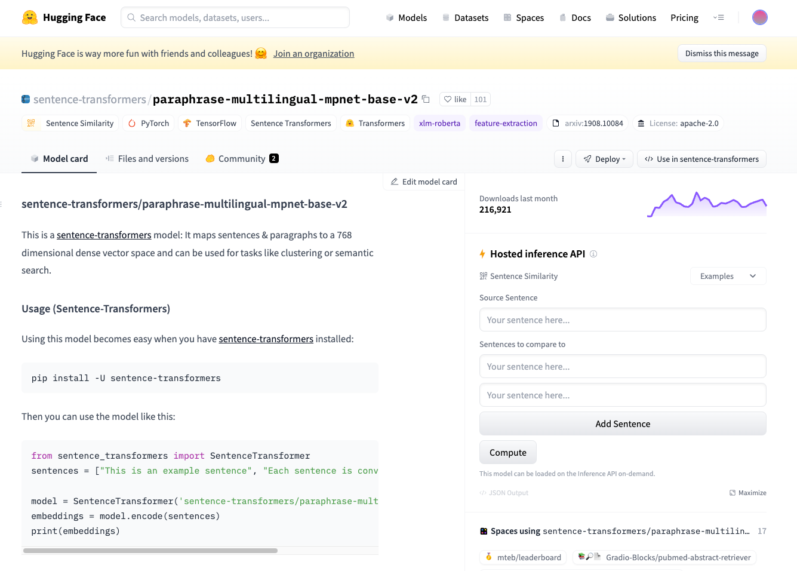
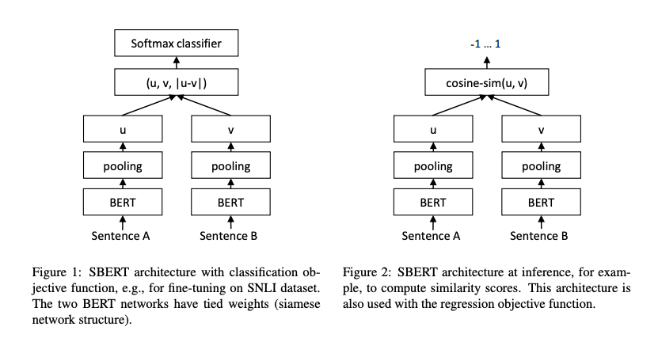
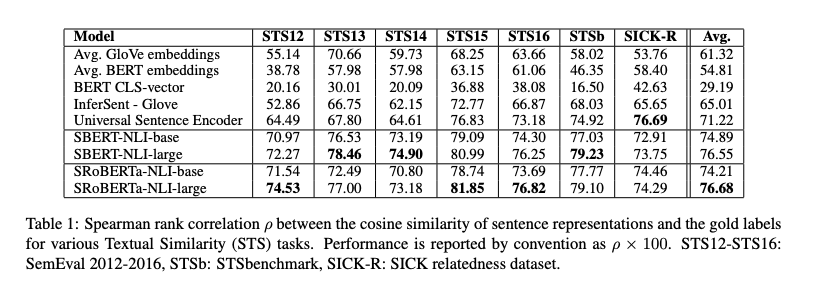
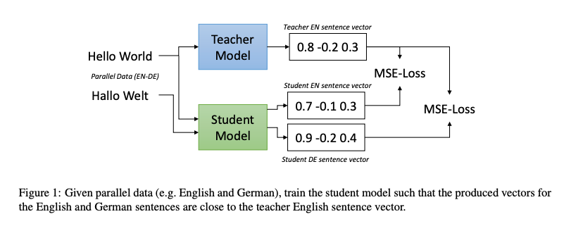
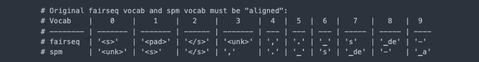

# SentenceTransformer : テキストからEmbeddingを取得する言語処理モデル

# SentenceTransformer : テキストからEmbeddingを取得する言語処理モデル

[](https://kyakuno.medium.com/?source=post_page---byline--b7d2a9bb2c31---------------------------------------)

[Kazuki Kyakuno](https://kyakuno.medium.com/?source=post_page---byline--b7d2a9bb2c31---------------------------------------)

7 min read

·

Jun 12, 2023

--

Share

[ailia SDK](https://ailia.jp/)で使用できる機械学習モデルである「SentenceTransformer」のご紹介です。エッジ向け推論フレームワークである[ailia SDK](https://ailia.jp/)と[ailia MODELS](https://github.com/axinc-ai/ailia-models)に公開されている機械学習モデルを使用することで、簡単にAIの機能をアプリケーションに実装することができます。

## SentenceTransformerの概要

SentenceTransformerはBERTをFineTuningしたモデルです。テキストからテキストの意味を示す特徴ベクトルであるEmbeddingを取得するのに最適な形でFineTuningされています。

テキストのEmbeddingを取得するAPIとしては、OpenAIのtext-embedding-ada-002が有名ですが、そこまでの精度が必要ない場合は、SentenceTransformerを使用することで、オフラインでAPI使用料不要で実行可能になります。

モデルサイズはマルチリンガルモデルで1.1GBです。

Press enter or click to view image in full size



SentenceTransformer

[## sentence-transformers/paraphrase-multilingual-mpnet-base-v2 · Hugging Face

### This is a sentence-transformers model: It maps sentences & paragraphs to a 768 dimensional dense vector space and can…

huggingface.co](https://huggingface.co/sentence-transformers/paraphrase-multilingual-mpnet-base-v2?source=post_page-----b7d2a9bb2c31---------------------------------------)

## SentenceTransformerのアーキテクチャ

SentenceTransformerでは、BERTのトークンごとのEmbeddingをPoolingすることで、テキストのEmbeddingを計算し、同じ意味のテキスト間のEmbeddingの距離を最小化するようにFine Tuningされています。

Press enter or click to view image in full size



出典：<https://arxiv.org/pdf/1908.10084.pdf>

単純にBERTのトークンごとのEmbeddingの平均を使用した場合はAvgで54.81の精度ですが、Fine Tuningすることで、76.68まで精度が改善しています。

Press enter or click to view image in full size



出典：<https://arxiv.org/pdf/1908.10084.pdf>

[## Sentence-BERT: Sentence Embeddings using Siamese BERT-Networks

### BERT (Devlin et al., 2018) and RoBERTa (Liu et al., 2019) has set a new state-of-the-art performance on sentence-pair…

arxiv.org](https://arxiv.org/abs/1908.10084?source=post_page-----b7d2a9bb2c31---------------------------------------)

## マルチリンガルモデル

SentenceTransformerはマルチリンガルモデル（paraphrase-multilingual-mpnet-base-v2）が公開されています。日本語を含む複数の言語（50+ languages）で共通のEmbeddingを取得可能です。Embeddingの次元数は768です。

## Get Kazuki Kyakuno’s stories in your inbox

Join Medium for free to get updates from this writer.

Subscribe

Subscribe

Remember me for faster sign in

マルチリンガルモデルは知識蒸留を用いて、多言語のEmbeddingを単一言語のEmbeddingに変換しています。

Press enter or click to view image in full size



出典：<https://arxiv.org/pdf/2004.09813.pdf>

[## Making Monolingual Sentence Embeddings Multilingual using Knowledge Distillation

### We present an easy and efficient method to extend existing sentence embedding models to new languages. This allows to…

arxiv.org](https://arxiv.org/abs/2004.09813?source=post_page-----b7d2a9bb2c31---------------------------------------)

[## sentence transformersで日本語を扱えるモデルのまとめ

### Sentence Transformers を用いて文章の埋め込みベクトルを作成できます。 以下のように応用できます。 文章埋め込みベクトル Semantic Textual Similarity クラスタリング 言い換えの探索…

tech.yellowback.net](https://tech.yellowback.net/posts/sentence-transformers-japanese-models?source=post_page-----b7d2a9bb2c31---------------------------------------)

## Tokenizer

SentenceTransformerでは、[XLMRoBERTa](https://github.com/huggingface/transformers/blob/main/src/transformers/models/xlm_roberta/tokenization_xlm_roberta.py)のTokenizerを使用しています。Sentence Pieceを使用しており、Sentence PieceのSentencePieceProcessorの主力シンボルを並べ替えることで、XLMRoBERTaのトークンを取得可能です。

Press enter or click to view image in full size



トークンの変換ルール

## ailia SDKから使用する

ailia SDKから使用するには、下記のようにします。

```
$ python3 sentence_transformer_japanese.py -i input.txt
```

入力したテキストに対して質問を行い、質問のEmbeddingと文章のEmbeddingの距離を計算し、最も近いテキストを出力することが可能です。

```
User (press q to exit): nnapiの速度  
Text: 実際、弊社でもSnapdragon 8+ Gen1とyolox_tinyにおいて、CPU（float）に比べてNNAPI NPU（int8）で15倍高速に動作することを確認しています。 (Similarity:0.592)
```

マルチリンガルモデルなため、英語でもクエリすることが可能です。

```
User (press q to exit): How fast nnapi?  
Text: 実際、弊社でもSnapdragon 8+ Gen1とyolox_tinyにおいて、CPU（float）に比べてNNAPI NPU（int8）で15倍高速に動作することを確認しています。 (Similarity:0.691)
```

[## ailia-models/natural\_language\_processing/sentence\_transformers\_japanese at master ·…

### TEXT or PDF file. The sentence closest to the input prompt. This model requires additional module if you want to load…

github.com](https://github.com/axinc-ai/ailia-models/tree/master/natural_language_processing/sentence_transformers_japanese?source=post_page-----b7d2a9bb2c31---------------------------------------)

ax株式会社はAIを実用化する会社として、クロスプラットフォームでGPUを使用した高速な推論を行うことができるailia SDKを開発しています。ax株式会社ではコンサルティングからモデル作成、SDKの提供、AIを利用したアプリ・システム開発、サポートまで、 AIに関するトータルソリューションを提供していますのでお気軽に[お問い合わせ](https://axinc.jp/)ください。