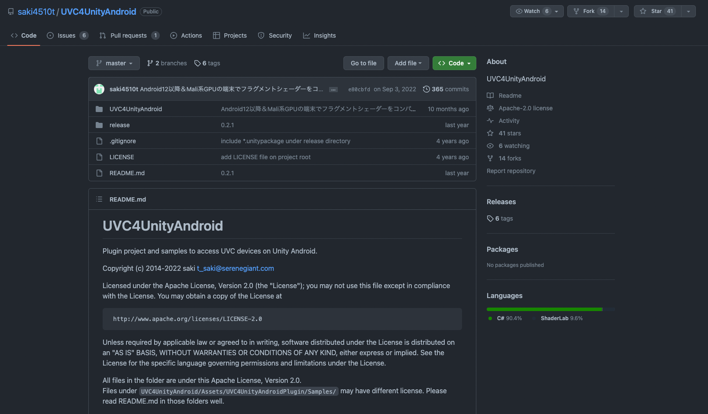
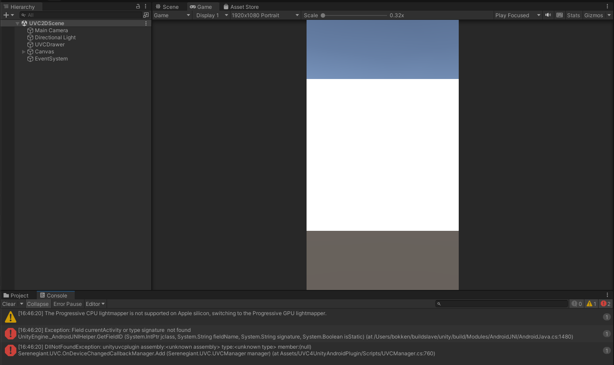
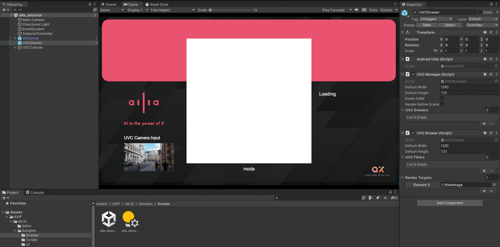
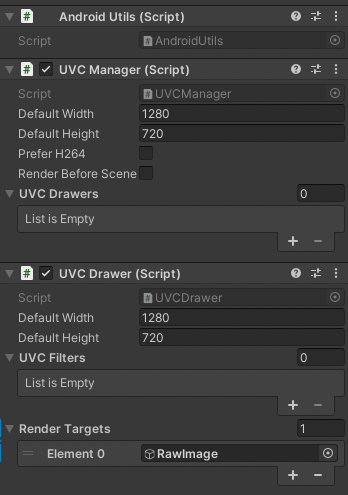
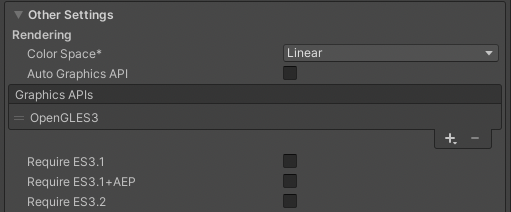
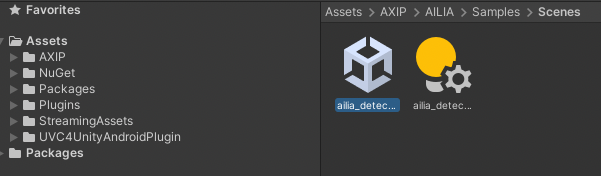
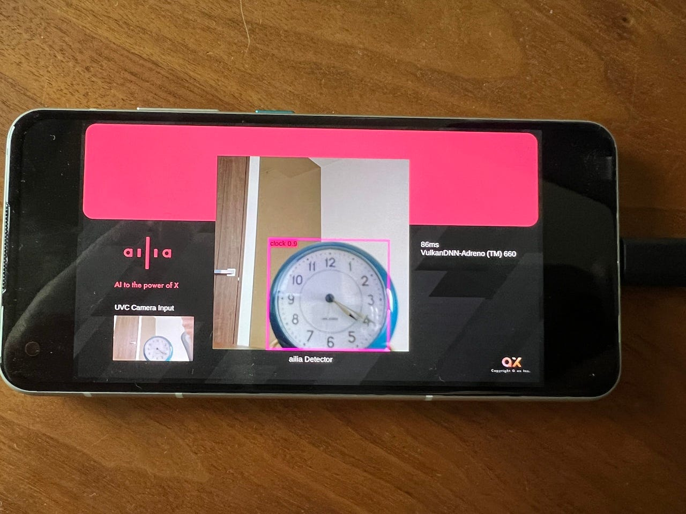
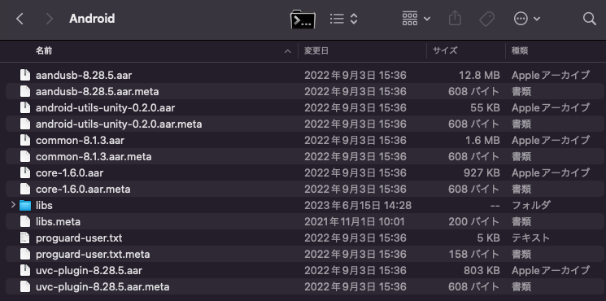

# AndroidとUnityでUSB接続のUVCカメラを使用する

# AndroidとUnityでUSB接続のUVCカメラを使用する

[](https://kyakuno.medium.com/?source=post_page---byline--6bf1087bbf86---------------------------------------)

[Kazuki Kyakuno](https://kyakuno.medium.com/?source=post_page---byline--6bf1087bbf86---------------------------------------)

13 min read

·

Jun 16, 2023

--

Share

AndroidとUnityでUSB接続のUVCカメラを使用して、ailia SDKと連携させる方法を解説します。

## AndroidとUnityにおける外部カメラの扱い

Androidでは一般的にデバイスにカメラが内蔵されており、それを使用することが前提になっています。そのため、USB接続のUVCカメラについては扱いが不十分です。そのため、UnityのWebCamTextureからはUSB接続のUVCカメラを扱うことができません。

実際に、USB接続のUVCカメラを接続した場合、WebCamTextureからは列挙されないか、列挙はするものの、列挙されたものを選択すると、Android OSのCameraManager.javaの中のgetCameraCharacteristicsでinfo.setCameraId(Integer.parseInt(cameraId));が呼び出されて、UVCカメラのIDである/dev/video5をintに変換できずに例外が発生します。

[## fix: filter out non-integer cameraIds by KodyFintak · Pull Request #1428 ·…

### What When using this library with our android device connected to an external display with a camera (I think) the app…

github.com](https://github.com/mrousavy/react-native-vision-camera/pull/1428?source=post_page-----6bf1087bbf86---------------------------------------)

## UnityからUSB接続の外部カメラを扱うアセット

UnityからUSB接続の外部カメラを扱うアセットとして、UVC4UnityAndroidが開発されています。

Press enter or click to view image in full size



UVC4UnityAndroid

[## GitHub - saki4510t/UVC4UnityAndroid: UVC4UnityAndroid

### UVC4UnityAndroid. Contribute to saki4510t/UVC4UnityAndroid development by creating an account on GitHub.

github.com](https://github.com/saki4510t/UVC4UnityAndroid?source=post_page-----6bf1087bbf86---------------------------------------)

このアセットは、Android OSのCameraManagerを使用せず、直接、USBを制御することで、外部カメラを扱うことを可能にしています。

[## 車輪の再発見みたいな？

### 人と技術のすきまに

serenegiant.com](https://serenegiant.com/blog/?p=3719&source=post_page-----6bf1087bbf86---------------------------------------)

そのため、UnityのWebCamTextureでは扱えない、USB接続の外部カメラを扱うことが可能となります。

## UVC4UnityAndroidの使用方法

### NuGetのインストール

NuGetのUnity Packageをインストールします。

[## Releases · GlitchEnzo/NuGetForUnity

### A NuGet Package Manager for Unity. Contribute to GlitchEnzo/NuGetForUnity development by creating an account on GitHub.

github.com](https://github.com/GlitchEnzo/NuGetForUnity/releases?source=post_page-----6bf1087bbf86---------------------------------------)

インストール後、ウィンドウメニューのNuGetから、Manage NuGet Packagesを選択し、System.Text.Jsonをインストールします。

### UVC4UnityAndroidのインストール

UVC4UnityAndroidのUnityPackageをインストールします。

[## UVC4UnityAndroid/release at master · saki4510t/UVC4UnityAndroid

### UVC4UnityAndroid. Contribute to saki4510t/UVC4UnityAndroid development by creating an account on GitHub.

github.com](https://github.com/saki4510t/UVC4UnityAndroid/tree/master/release?source=post_page-----6bf1087bbf86---------------------------------------)

### UVC4UnityAndroidの実行

下記にサンプルシーンがあり、実行可能です。

> UVC4UnityAndroid/Assets/UVC4UnityAndroidPlugin/Samples/Scenes/UVC2DScene.unity

なお、PC上では、DllNotFoundExceptionが発生します。Androidのデバイスで実行する必要があります。

Press enter or click to view image in full size



UVC2DSceneを実行

### UVC4UnityAndroidのシーンへの取り込み

UVC4UnityAndroidは、下記のprefabをシーンに取り込むことで実装可能です。

> UVC4UnityAndroid/Assets/UVC4UnityAndroidPlugin/Prefabs/UVCDrawer.prefab

Press enter or click to view image in full size



Prefabの取り込み

UVCDrawerはRenderTargetsに指定したRawImageに対してレンダリングを行います。



RenderTargetにRawImageを指定

そのため、RawImage.textureからGetPixels32することで、画像を取得可能です。

## Get Kazuki Kyakuno’s stories in your inbox

Join Medium for free to get updates from this writer.

Subscribe

Subscribe

Remember me for faster sign in

なお、RawImage.textureはそのままではReadできないため、一度、RenderTextureにBlitする必要があります。

```
    Texture2D duplicateTexture(Texture2D source)  
    {  
        RenderTexture renderTex = RenderTexture.GetTemporary(  
                    source.width,  
                    source.height,  
                    0,  
                    RenderTextureFormat.Default,  
                    RenderTextureReadWrite.Linear);  
  
        Graphics.Blit(source, renderTex);  
        RenderTexture previous = RenderTexture.active;  
        RenderTexture.active = renderTex;  
        Texture2D readableText = new Texture2D(source.width, source.height);  
        readableText.ReadPixels(new Rect(0, 0, renderTex.width, renderTex.height), 0, 0);  
        readableText.Apply();  
        RenderTexture.active = previous;  
        RenderTexture.ReleaseTemporary(renderTex);  
        return readableText;  
    }
```

### UVC4UnityAndroidのビルド時の注意点

ILCPPを有効にしてGraphics APIがAutoだとVulkanが使用されます。Auto Graphics APIを無効にして、明示的にOpenGLを指定する必要があります。



Player Settings

### UVC4UnityAndroidの動作

UVCUnityAndroidはUVCManager.csとUVCDrawer.cs、NativePluginから構成されます。

UVCManager.csでは、MonoBehaviourのStartでCameraのPermissionを取得し、PERMISSION\_GRANTの場合はInitPluginを呼び出します。InitPluginではAndroidJavaClassを取得し、NativeのinitUVCDeviceDestectorを呼び出します。その後、UVCの状態が変化するとOnDeviceChangedが呼び出され、StartPreviewでUVCの再生が開始します。

UVCManager.csのGetAttachedDevices APIで接続されているデバイスの一覧を取得可能です。

UVCDrawer.csでは、Textureを生成し、RenderTargetsのRawImageに設定します。

### UNITY\_EDITORでの例外の抑制

既存コードでは、PC上での実行時にAndroidUtils.csのAwakeで例外が発生するため、#if UNITY\_ANDROIDを#if UNITY\_ANDROID && !UNITY\_EDITORにすると回避可能です。合わせて、UVCManager.csのStart()でも、#if !UNITY\_ANDROID ||UNITY\_EDITORでyield breakするように、OnDestroy()でも#if !UNITY\_ANDROID ||UNITY\_EDITORでreturnするようにします。

## ailia SDKとの連携

### サンプルプロジェクト

UVC4UnityAndroidをailia SDKと連携してyoloxを推論するサンプルを下記に公開しています。

[## GitHub - axinc-ai/ailia-android-uvc-camera: Example of ailia SDK with UVC Camera

### Example of ailia SDK with UVC Camera. Contribute to axinc-ai/ailia-android-uvc-camera development by creating an…

github.com](https://github.com/axinc-ai/ailia-android-uvc-camera?source=post_page-----6bf1087bbf86---------------------------------------)

### ailia SDKのインストール

git cloneした後、上記の手順に従って、NuGet、UVC4UnityAndroidのUnityPackageをインポートしてください。また、ailia SDKのUnityPackageをPluginsフォルダだけインポートしてください。



インポート後のフォルダ構成

### ビルド済みサンプル

事前ビルドしたAPKファイルは下記にアップロードしています。

[## ailia-android-uvc-camera/Release at main · axinc-ai/ailia-android-uvc-camera

### Example of ailia SDK with UVC Camera. Contribute to axinc-ai/ailia-android-uvc-camera development by creating an…

github.com](https://github.com/axinc-ai/ailia-android-uvc-camera/tree/main/Release?source=post_page-----6bf1087bbf86---------------------------------------)

サンプルのAPKをUSB経由でインストールし、USBを抜き、UVCカメラのUSBをデバイスに接続、アプリを起動してください。初回起動時は承認が求められます。

うまくカメラの映像が出ない時は、一度、アプリを落として、UVCカメラのUSBを抜き差ししてください。UVCカメラを認識すると、自動的にアプリが立ち上がり、カメラ映像が表示されます。

Press enter or click to view image in full size



Androidに外部のUSBカメラを接続した例

## Arm Maliへの対応

公式にリリースされているUnityPackageの0.2.1を使用した場合、Arm MaliでOpenGLのシェーダエラーが発生する場合があります。その場合、githubの[最新のコミット](https://github.com/saki4510t/UVC4UnityAndroid/commit/e80cbfd6fce75f1d8d56a33b27b6cad217114fe9)から0.2.2のバイナリをダウンロードし、Pluginフォルダの内容を置き換えることで、問題が解消する場合があります。

Press enter or click to view image in full size



Androidフォルダのバイナリを0.2.1から0.2.2に置き換え

## 特定デバイスの除外

UVCクラスはdeviceClass = 239、deviceSubClass = 2を持っています。しかし、WEBカメラ以外のUVCデバイスも同じdeviceClassであるため、WEBカメラと一緒に、Bluetoothなどが接続されている場合に、WEBカメラの映像が取得できない場合があります。

その場合、ベンダーIDとプロダクトIDを使用して、特定のデバイスを除外することで、WEBカメラの接続が可能です。具体的に、UVCDrawer.csのOnUVCAttachEventで、vidとpidを確認し、resultにfalseを代入します。

```
  public bool OnUVCAttachEvent(UVCManager manager, UVCDevice device)  
  {  
#if (!NDEBUG && DEBUG && ENABLE_LOG)  
   Console.WriteLine($"{TAG}OnUVCAttachEvent:{device}");  
#endif  
   // XXX 今の実装では基本的に全てのUVC機器を受け入れる  
   // ただしTHETA SとTHETA VとTHETA Z1は映像を取得できないインターフェースがあるのでオミットする  
   // CanDrawと同様にUVC機器フィルターをインスペクタで設定できるようにする  
   var result = !device.IsRicoh || device.IsTHETA;  
  
   result &= UVCFilter.Match(device, UVCFilters);  
  
   ConnectedDeviceName = ""+device.name+"\nClass:"+device.deviceClass+" "+device.deviceSubClass+"\nVid:"+device.vid+" Pid:"+device.pid+"\n";  
   if (device.vid == 3725 && device.pid == 31073){  
    result = false;  
   }  
  
   return result;  
  }
```

## まとめ

UVC4UnityAndroidを使用することで、Androidデバイス上で外部カメラを扱うことが可能になります。また、ailia SDKと連携することで、外部カメラの映像に対してAI推論が可能になります。

ax株式会社はAIを実用化する会社として、クロスプラットフォームでGPUを使用した高速な推論を行うことができるailia SDKを開発しています。ax株式会社ではコンサルティングからモデル作成、SDKの提供、AIを利用したアプリ・システム開発、サポートまで、 AIに関するトータルソリューションを提供していますのでお気軽に[お問い合わせ](https://axinc.jp/)ください。