# MultiControlNetとMov2Movを使用してStableDiffusionで動画を生成する

# MultiControlNetとMov2Movを使用してStableDiffusionで動画を生成する

[Kazuki Kyakuno](https://kyakuno.medium.com/?source=post_page---byline--a1d0cf324d9b---------------------------------------)

12 min read

·

Jun 22, 2023

--

Share

MultiControlNetとMov2Movを使用してStableDiffusionで動画を生成する方法を解説します。MultiControlNetのReference Onlyを使用することで、LoRAを使用せずに、指定した人物で、一貫した動画を出力可能です。

## StableDiffusionによる動画生成

StableDiffusionは画像を生成する技術ですが、複数の画像を生成して繋げることで、動画にすることが可能です。

Stable Diffusionで動画を生成するには、Mov2Movのプラグインを使用します。Mov2Movでは、任意の動画を入力して、その動画に沿って、StableDiffusionで動画を生成します。

生成された動画

また、MultiControlNetを併用することで、入力動画の人物の正確なポーズの反映と、出力する人物を固定して一貫性を持たせることが可能です。

Press enter or click to view image in full size

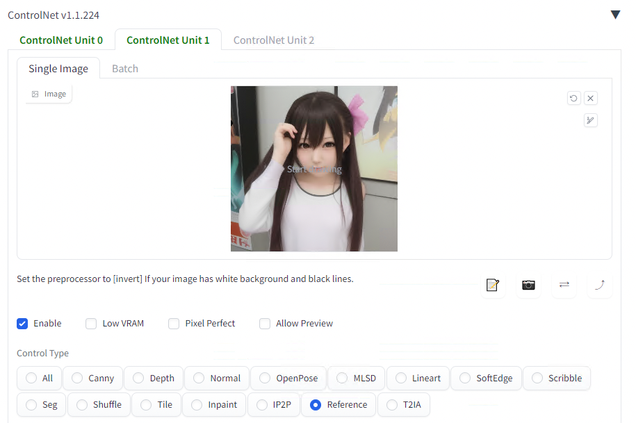

MultiControlNet

## 今回使用する要素技術

### StableDiffusion

StableDiffusionは画像を生成するAIモデルです。

### Mov2Mov

Mov2Movは動画を入力して、フレーム単位でimg2imgで画像を生成し、結合することで動画を生成する拡張機能です。

通常のtxt2imgでは、潜在空間の完全なノイズをデノイズしていくことで画像を生成しますが、img2imgでは入力画像をVAE Encoderで潜在空間に変換したものにノイズを加えたものを初期値として、デノイズしていくことで画像を生成します。

[## How img2img Diffusion Works

### Running Stable Diffusion by providing both a prompt and an initial image (a.k.a." img2img " diffusion) can be a…

mccormickml.com](https://mccormickml.com/2022/12/06/how-img2img-works/?source=post_page-----a1d0cf324d9b---------------------------------------)

img2imgでは、完全なノイズではない値を初期値としてスタートするため、通常のtxt2imgよりも少ないステップ数で収束させることが可能です。そのため、デフォルトのステップ数は50ではなく20になっています。

### MultiControlNet

MultiControlNetはControlNetを複数種類、同時に適用することで、出力動画を制約する機能です。

### ReferenceOnly

ReferenceOnlyは2023年5月のControlNet v1.1.170で追加された機能で、指定したスタイル画像を元に画像を生成する機能です。LoRAと同等のことを、LoRAを使用せずに行うことができます。

ReferenceOnlyでは、ControlModelType.AttentionInjectionを使用しており、スタイル画像をVAE Encoderで潜在空間に変換してused\_hint\_cond\_latentに格納した後、used\_hint\_cond\_latentにq\_sampleでノイズを付与してref\_xtを取得、attention\_auto\_machineにAutoMachine.Writeフラグを付与した上で、ref\_xtを使用して逆拡散過程であるUNetの推論を行います。

その後、attention\_auto\_machineにAutoMachine.Readフラグを付与した上で、img2imgの入力画像をVAEで潜在空間に変換したxを使用した結果を、UNetに入力して繰り返し推論することでデノイズを行います。

attention\_auto\_machineがAutoMachine.Writeの場合、bankにUNetのattn\_weightをコピーします。AutoMachine.Readの場合、bankからattention\_weightを読み込み、既存のUNetのattention\_weightと重み付けします。

[## sd-webui-controlnet/scripts/hook.py at main · Mikubill/sd-webui-controlnet

### WebUI extension for ControlNet. Contribute to Mikubill/sd-webui-controlnet development by creating an account on…

github.com](https://github.com/Mikubill/sd-webui-controlnet/blob/main/scripts/hook.py?source=post_page-----a1d0cf324d9b---------------------------------------)

StableDiffusionは、潜在空間での逆拡散過程のUNetと、潜在空間から画像に戻すVAE Decoderの組み合わせとなっています。PromptのCLIPによるText Encoderの結果はUNetのCrossAttnBlockのキーとバリューに接続されています。これは、AttnBlockのキーとバリューが画像のスタイルを決めることを示しています。Reference Onlyでは、この重みをスタイル画像のSelfAttentionのキーとバリューで置き換えることで、スタイル画像のスタイルを反映しています。

[## 世界に衝撃を与えた画像生成AI「Stable Diffusion」を徹底解説！ - Qiita

### 追記: U-Netの中間層は常にSelf-Attentionとなります。ご指摘いただきました。ありがとうございます。（コード） オミータです。ツイッターで人工知能のことや他媒体の記事など を紹介しています。…

qiita.com](https://qiita.com/omiita/items/ecf8d60466c50ae8295b?source=post_page-----a1d0cf324d9b---------------------------------------)

ちなみに、ReferenceOnlyが登場する前は、画像の下半分にリファレンス画像を入れてinpaintingするという技があったそうです。

> Many professional A1111 users know a trick to diffuse image with references by inpaint. For example, if you have a 512x512 image of a dog, and want to generate another 512x512 image with the same dog, some users will connect the 512x512 dog image and a 512x512 blank image into a 1024x512 image, send to inpaint, and mask out the blank 512x512 part to diffuse a dog with similar appearance. However, that method is usually not very satisfying since images are connected and many distortions will appear.This reference-only ControlNet can directly link the attention layers of your SD to any independent images, so that your SD will read arbitary images for reference. You need at least ControlNet 1.1.153 to use it.

[## GitHub - Mikubill/sd-webui-controlnet: WebUI extension for ControlNet

### WebUI extension for ControlNet. Contribute to Mikubill/sd-webui-controlnet development by creating an account on…

github.com](https://github.com/Mikubill/sd-webui-controlnet?source=post_page-----a1d0cf324d9b---------------------------------------#reference-only-control)

## パイプライン

今回のパイプラインでは、WEBカメラで撮影した動画に、ControlNet (Seg)とControlNet (Reference Only)を適用して、Reference Onlyで指定した別の人物に置き換えます。

## Get Kazuki Kyakuno’s stories in your inbox

Join Medium for free to get updates from this writer.

Subscribe

Subscribe

Remember me for faster sign in

入力した動画の各フレームのセグメンテーション画像の制約の元で画像を生成するとともに、Reference Onlyで参照画像で指定した人物に出力を限定します。

## テスト画像

StableDiffusionで生成した下記の画像をReference Onlyに使用します。WEBカメラの映像を入力として、この人物に置き換えた動画を生成します。

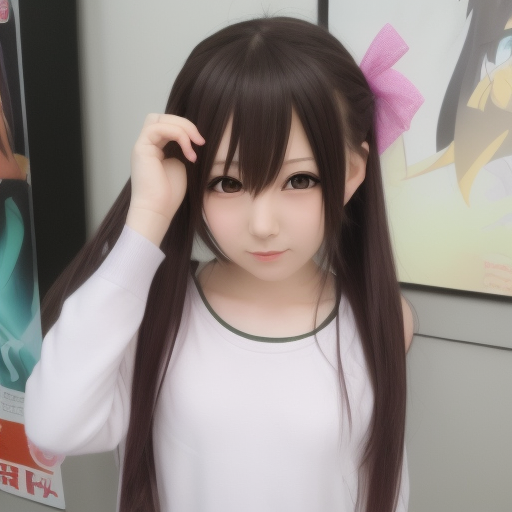

StableDiffusionで生成したReference Only用の画像

## インストール

StableDiffusionのExtentionから[mov2mov](https://github.com/Scholar01/sd-webui-mov2mov.git)をインストールします。

Press enter or click to view image in full size

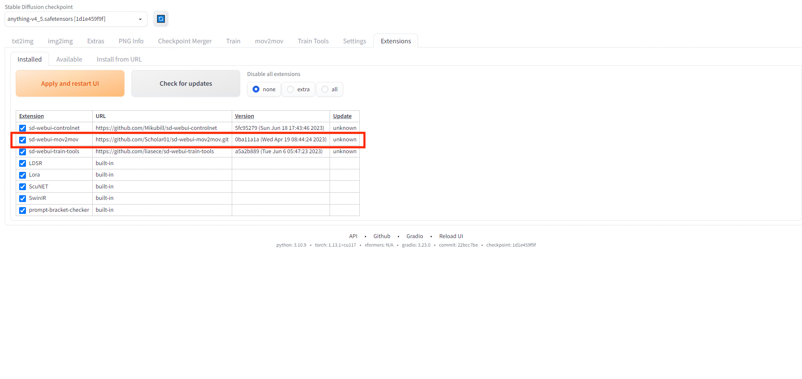

Install mov2mov

[## GitHub - Scholar01/sd-webui-mov2mov: 适用于Automatic1111/stable-diffusion-webui 的 Mov2mov 插件。

### 适用于Automatic1111/stable-diffusion-webui 的 Mov2mov 插件。 - GitHub - Scholar01/sd-webui-mov2mov…

github.com](https://github.com/Scholar01/sd-webui-mov2mov.git?source=post_page-----a1d0cf324d9b---------------------------------------)

SettingsのControlNetでMulti ControlNetの数を3に増やして再起動します。

Press enter or click to view image in full size

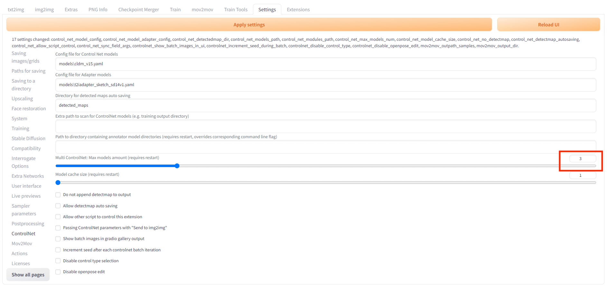

Multi ControlNet

## 動画生成

mov2movのタブでControlNetを有効にします。

Unit0ではSegを有効にします。

Press enter or click to view image in full size

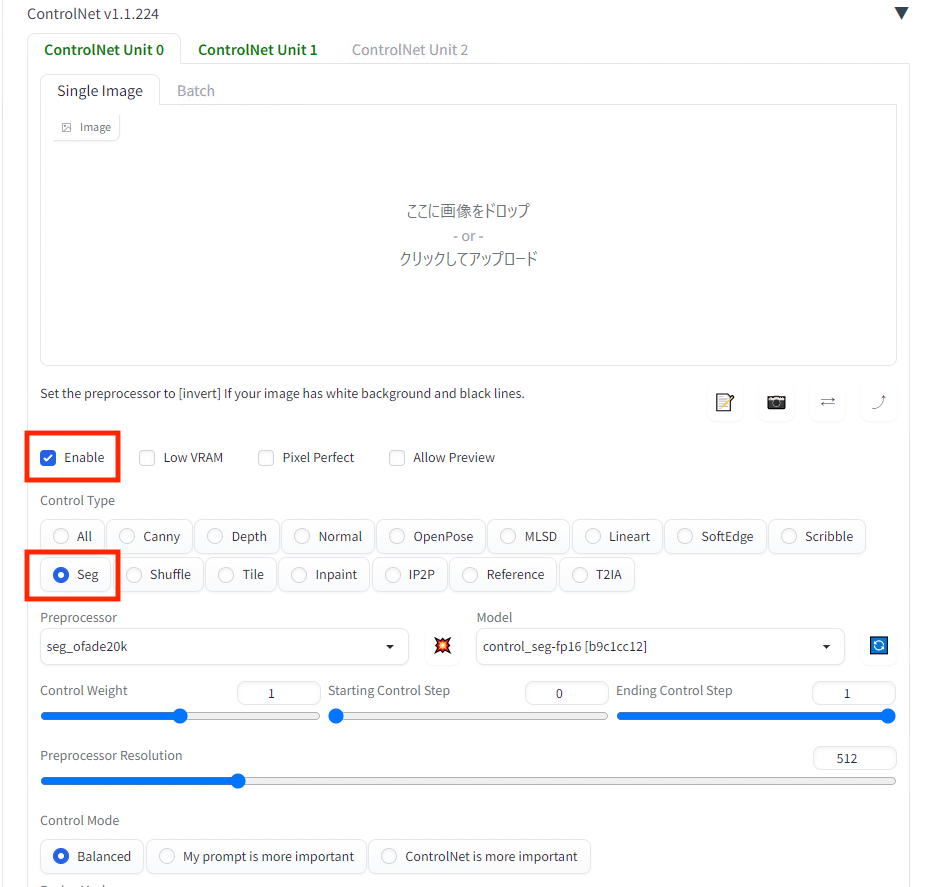

Seg

Unit1ではReference Onlyを指定します。

Press enter or click to view image in full size

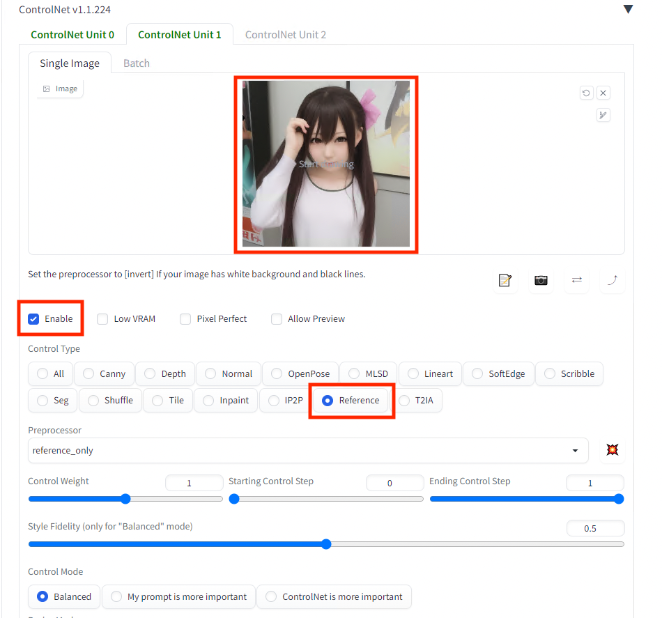

Reference

WEBカメラで撮影した動画を入力して、Promptにa girlと設定、Generateを押します。

Press enter or click to view image in full size

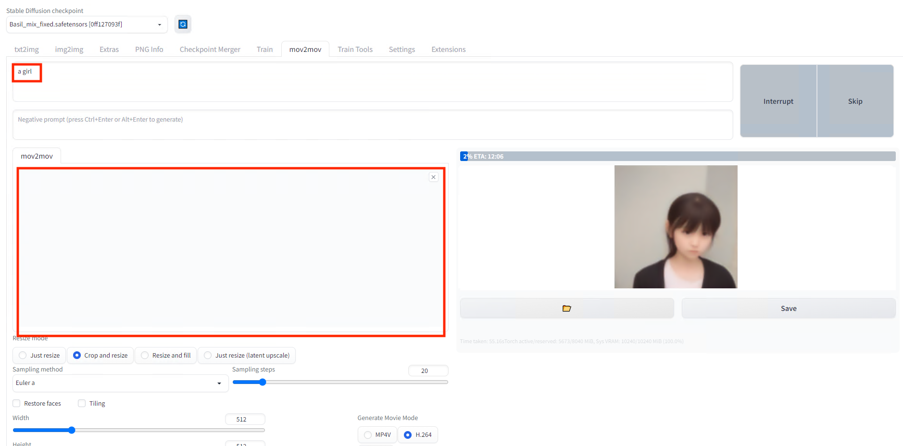

Generate

## 生成された動画

生成された動画は下記となります。Seg + Refernce Onlyを使用しています。Sampling Stepsは20です。RTX3080で4秒の動画の生成に、8分程度かかります。

生成された動画

## ステップ数の比較

ステップ数は直接的に推論時間に影響します。ステップ数が10未満だと画像に破綻が見られるため、10以上で使用するのが良さそうです。

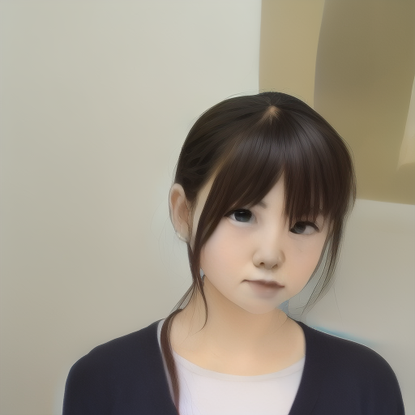

ステップ数8

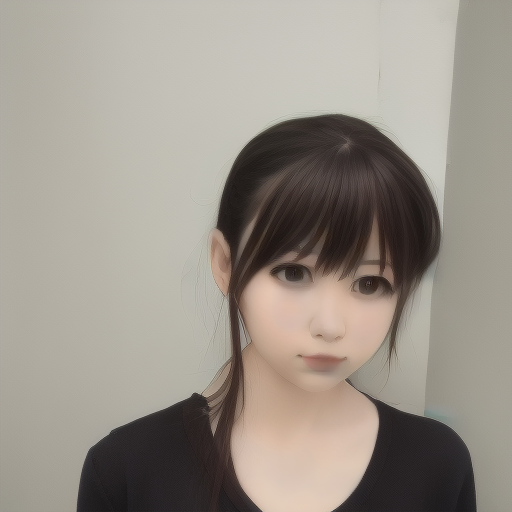

ステップ数10

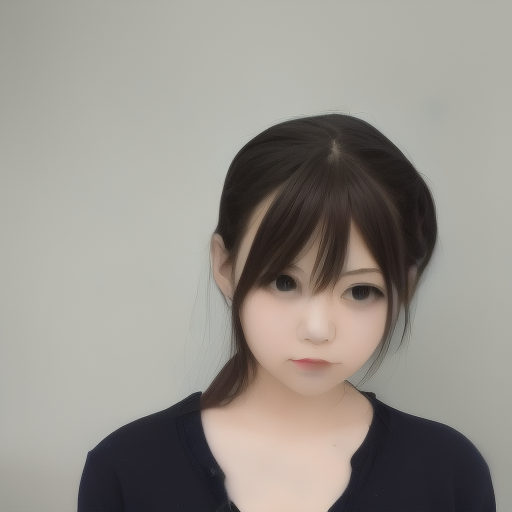

ステップ数20

## スタイル画像の画角

スタイル画像の画角とWEBカメラの映像の画角は合わせた方が精度が高くなります。全身を生成する場合は全身画像、一部部分を生成する場合は一部分を与えた方が良いようです。

画角を合わせていない場合、うまくスタイルが反映できません。

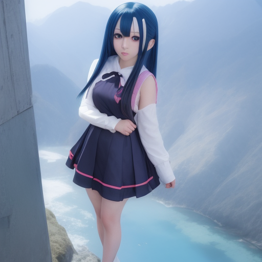

スタイル画像

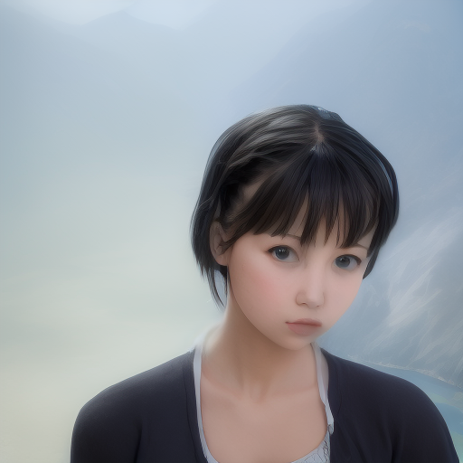

出力

画角を合わせると、より精度が高くなります。

スタイル画像

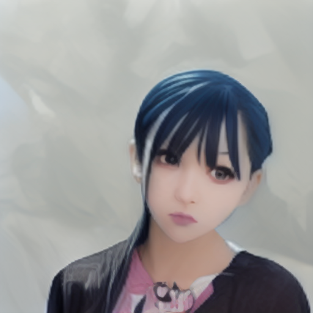

出力

## Mov2MovにおけるLoRA利用

下記のIssueによると、Mov2Movでは、PromptにLoRAタグを直接入力することで、Mov2MovでLoRAも使用できるとのことです。

[## mov2mov支持叠加Lora模型吗 · Issue #42 · Scholar01/sd-webui-mov2mov

### 适用于Automatic1111/stable-diffusion-webui 的 Mov2mov 插件。 - mov2mov支持叠加Lora模型吗 · Issue #42 · Scholar01/sd-webui-mov2mov

github.com](https://github.com/Scholar01/sd-webui-mov2mov/issues/42?source=post_page-----a1d0cf324d9b---------------------------------------)

UnityChan LoRAで試した印象としては、Reference Onlyの方が出力が安定するような気がしています。もう少し、作り込んだLoRAだと、ReferenceOnlyよりもLoRAの方が性能が高くなるかもしれません。

## API経由でのリアルタイムでの動画生成

StableDiffusion WebUIにはAPIがあり、Python経由でアクセスする事例があります。現状では、WEBカメラの映像の画像1枚を生成するのに、RTX3060で解像度を256x256、ステップ数7に下げて、1〜2秒とのことです。

[## もうすぐ実写AITuber登場。Stable Diffusionでリアルタイム画像生成をしてみた | さくらのナレッジ

### こんにちは、テリーです。ChatGPTに並んで進化の激しい「画像生成AI」を使ってみたことはありますか？ほしい画像を文章で指定すると、それに沿った画像を出力するAIです。かなりの計算量を必要とするため、画像1枚を出力する [...]

knowledge.sakura.ad.jp](https://knowledge.sakura.ad.jp/35226/?amp=1&source=post_page-----a1d0cf324d9b---------------------------------------)

## まとめ

MultiControlNetとMov2Movを使用することで、生成する人物の一貫性を保ったまま、生成系AIを使用した動画生成が可能であることを確認しました。

ax株式会社はAIを実用化する会社として、クロスプラットフォームでGPUを使用した高速な推論を行うことができるailia SDKを開発しています。ax株式会社ではコンサルティングからモデル作成、SDKの提供、AIを利用したアプリ・システム開発、サポートまで、 AIに関するトータルソリューションを提供していますのでお気軽に[お問い合わせ](https://axinc.jp/)ください。