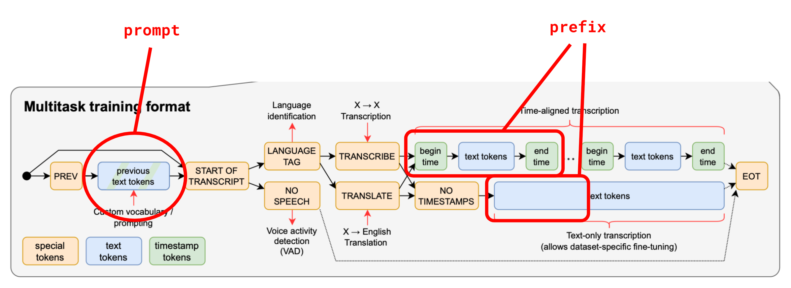

# WhisperにおけるPrompt Engineering

# WhisperにおけるPrompt Engineering

[](https://kyakuno.medium.com/?source=post_page---byline--7d3bbdd22a46---------------------------------------)

[Kazuki Kyakuno](https://kyakuno.medium.com/?source=post_page---byline--7d3bbdd22a46---------------------------------------)

8 min read

·

Mar 22, 2023

--

Share

音声認識を行うAIモデルであるWhisperも言語モデルを使用しているためPrompt Enginneringを適用することが可能です。本記事では、Whisperに対してPrompt Enginneringを適用することで、未知語の認識精度を向上させる方法を解説します。

## Whisperの概要

WhisperはChatGPTを開発したOpenAIの開発した音声認識モデルです。Whisperは、入力された音声を特徴ベクトルに変換し、特徴ベクトルを元にテキストを言語モデルで1文字ずつ生成します。

近年、ChatGPTの登場によってPrompt Engineeringが注目されていますが、Whisperも言語モデルを使用しているため、Prompt Enginneringを適用可能です。

## WhisperにおけるPrompt Enginnering

Whisperにはpromptとprefixという概念があります。Whisperのgithubリポジトリの下記のDiscussionでは、promptを使用したPrompt Enginneringについて議論されています。

[## prompt vs prefix in DecodingOptions · openai/whisper · Discussion #117

### You can't perform that action at this time. You signed in with another tab or window. You signed out in another tab or…

github.com](https://github.com/openai/whisper/discussions/117?source=post_page-----7d3bbdd22a46---------------------------------------#discussioncomment-3727051)

promptは事前情報として与えられるトークン列で、一般的には、現在処理している30秒の音声セグメントの、1つ前の音声セグメントでデコードしたトークン列を与えます。一つ前のセグメントのテキストを事前情報として与えることで、セグメント間で一貫した出力を得るために使用されています。

prefixは現在の音声セグメントのデコード済み情報として与えられるトークン列で、現在の音声セグメントのデコードを途中から再開することに使用されます。prefixは音声のライブ変換のために試験実装されています。

Press enter or click to view image in full size



Whisperにおけるpromptとprefix（出典：<https://github.com/openai/whisper/discussions/117#discussioncomment-3727051>）

公式のWhisperでは、initial\_prompt引数に文字列を与えることで、promptを与えることが可能です。promptに、一つ前の音声セグメントのテキスト以外の情報を埋め込むことで、Whisperをカスタマイズすることが可能です。

## 未知語を与えることで認識精度を向上させる

promptの有用な使用方法として、人名や専門用語をpromptとして与えることで、人名や専門用語の認識精度を向上させることが可能です。

## Get Kazuki Kyakuno’s stories in your inbox

Join Medium for free to get updates from this writer.

Subscribe

Subscribe

Remember me for faster sign in

例えば、Whisper Smallを使用した場合に、下記のような推論結果が得られたとします。専門用語である”ハードウェア”と”ソフトウェア”を、”ハードメア”、”ゾップトメア”と誤認識しています。

```
[00:00.000 --> 00:06.000] 自動運転の未来を加速させるアクセルの取り組み  
[00:06.000 --> 00:12.000] AIをより早く、より使いやすく、すぐに始められる  
[00:12.000 --> 00:17.000] 豊かな未来を想像する企業の良き理解者になる  
[00:17.000 --> 00:23.000] AI実装に必要な学習から推論までトータルソリューションを提供できる  
[00:23.000 --> 00:29.000] アクセルはテクノロジーで未来を加速させる  
[00:29.000 --> 00:36.000] アクセルでは、ハードメア、ゾップトメア、要素技術の3つの開発力を基に  
[00:36.000 --> 00:59.000] 5つの事業領域に展開をしています
```

そこで、promptに”ハードウェア ソフトウェア”を与えると、下記となります。専門用語である”ハードウェア”と”ソフトウェア”を正しく認識できます。

```
[00:00.000 --> 00:06.000] 自動運転の未来を加速させるアクセルの取り組み  
[00:06.000 --> 00:12.000] AIをより早く、より使いやすく、すぐに始められる  
[00:12.000 --> 00:17.000] 豊かな未来を想像する企業の良き理解者になる  
[00:17.000 --> 00:23.000] AI実装に必要な学習から推論までトータルソリューションを提供できる  
[00:23.000 --> 00:29.000] アクセルはテクノロジーで未来を加速させる  
[00:29.000 --> 00:36.000] アクセルではハードウェア、ソフトウェア、要素技術の3つの開発力をもとに  
[00:36.000 --> 00:51.000] 5つの事業領域に展開をしています
```

## Promptのその他の応用例

日本語への適用には成功していませんが、話者分離を行うpromptとして下記のpromptが提案されています。このpromptを使用すると、話者の間にハイフンが挿入されます。

```
initial_prompt="- How are you? - I'm fine, thank you."
```

[## prompt vs prefix in DecodingOptions · openai/whisper · Discussion #117

### You can't perform that action at this time. You signed in with another tab or window. You signed out in another tab or…

github.com](https://github.com/openai/whisper/discussions/117?source=post_page-----7d3bbdd22a46---------------------------------------#discussioncomment-3727051)

## Promptの制約

Whisperのコンテキストのサイズは448です。これは、入力用と出力用のトークンの合計数であり、Whisperの実装では入力用には半分の224トークンまでに制約されています。そのため、未知語の数が多くなってきた場合は、prompt以外の方法を検討する必要があります。

## 公式のWhisperのinitial\_promptの制約

公式のWhisperでは、initial\_prompt引数に文字列を与えることで、promptを与えることが可能です。

```
whisper_model.transcribe(audio_file_path,   
                         initial_prompt=" - How are you? - I'm fine, thank you.",    
                         **other_whisper_options)
```

ただし、反映されるのは最初の30秒のセグメントだけであり、次のセグメントには反映されません。これは、次のセグメントでは、1つ前のセグメントのデコード結果でpromptが上書きされるためです。

[## add always\_use\_initial\_prompt by mercury233 · Pull Request #1040 · openai/whisper

### Add this suggestion to a batch that can be applied as a single commit. This suggestion is invalid because no changes…

github.com](https://github.com/openai/whisper/pull/1040?source=post_page-----7d3bbdd22a46---------------------------------------)

ailia MODELSの実装では、prompt引数を初回以外のセグメントにも適用する実装を行なっているため、初回以外のセグメントにもpromptを反映されることが可能です。

[## ailia-models/audio\_processing/whisper at master · axinc-ai/ailia-models

### Audio file Recognized speech text He hoped there would be stew for dinner, turnips and carrots and bruised potatoes and…

github.com](https://github.com/axinc-ai/ailia-models/tree/master/audio_processing/whisper?source=post_page-----7d3bbdd22a46---------------------------------------)

ailia MODELSにおけるpromptの使用例です。

```
python3 whisper.py -i axell_trim.m4a --prompt "ハードウェア ソフトウェア"
```

## ailia Speechについて

ax株式会社では、Whisperを使用したAI音声認識をUnityやC++のAPIとしてオフラインで実行できるライブラリを提供しています。現在、ailia SpeechにPrompt機能を実装中です。

[## ailia Speech : UnityやC++から使用できるAI音声認識ライブラリ

### UnityやC++から使用できるAI音声認識ライブラリであるailia Speechのご紹介です。ailia Speechを使用することで、簡単にアプリケーションにAI音声認識を実装することが可能です。

medium.com](https://medium.com/axinc/ailia-speech-unity%E3%82%84c-%E3%81%8B%E3%82%89%E4%BD%BF%E7%94%A8%E3%81%A7%E3%81%8D%E3%82%8Bai%E9%9F%B3%E5%A3%B0%E8%AA%8D%E8%AD%98%E3%83%A9%E3%82%A4%E3%83%96%E3%83%A9%E3%83%AA-16a05b5280d2?source=post_page-----7d3bbdd22a46---------------------------------------)

ax株式会社はAIを実用化する会社として、クロスプラットフォームでGPUを使用した高速な推論を行うことができるailia SDKを開発しています。ax株式会社ではコンサルティングからモデル作成、SDKの提供、AIを利用したアプリ・システム開発、サポートまで、 AIに関するトータルソリューションを提供していますのでお気軽に[お問い合わせ](https://axinc.jp/)ください。