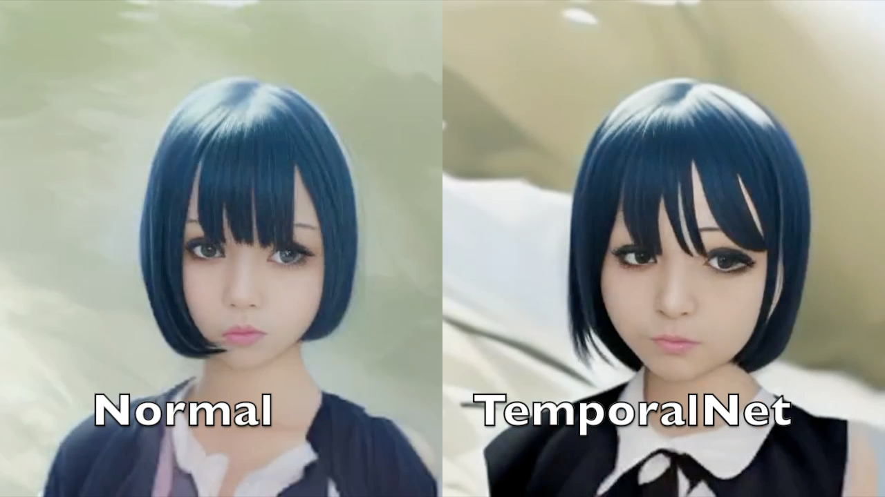
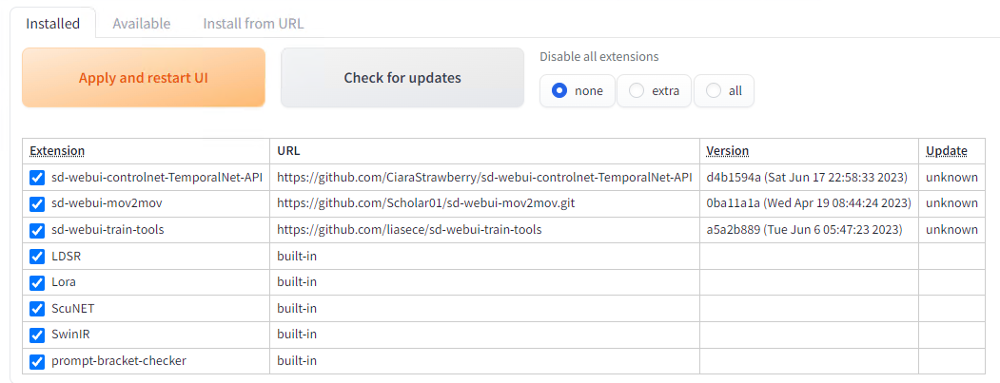
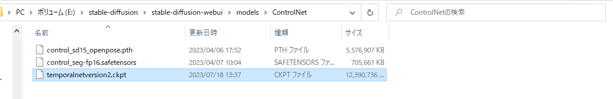
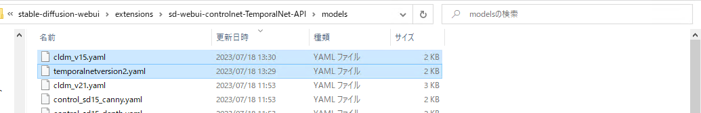
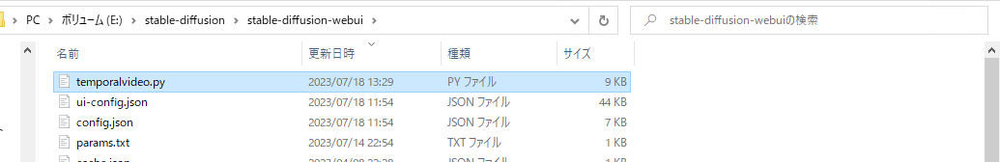
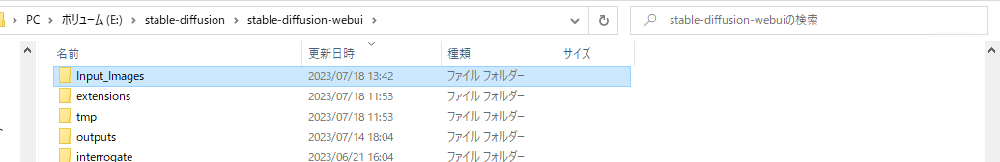
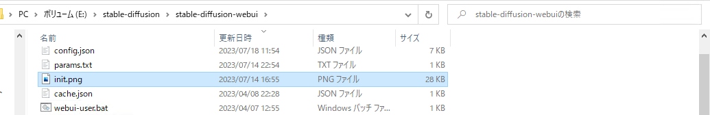
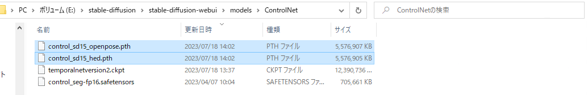
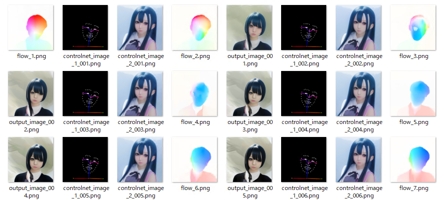
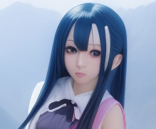

# TemporalNetとStableDiffusionを使用して安定した動画を生成する

# TemporalNetとStableDiffusionを使用して安定した動画を生成する

[](https://kyakuno.medium.com/?source=post_page---byline--e0aaa99fdbd3---------------------------------------)

[Kazuki Kyakuno](https://kyakuno.medium.com/?source=post_page---byline--e0aaa99fdbd3---------------------------------------)

12 min read

·

Jul 19, 2023

--

Share

TemporalNetとStableDiffusionを使用して安定した動画を生成する方法を解説します。

## TemporalNetについて

TemporalNetは2023年3月20日に公開された新しいControlNetモデルです。フレーム間のオプティカルフローをガイドに使用することで、フレーム間で安定した動画を生成することが可能です。

Press enter or click to view image in full size



TemporalNet

[## CiaraRowles/TemporalNet2 · Hugging Face

### We're on a journey to advance and democratize artificial intelligence through open source and open science.

huggingface.co](https://huggingface.co/CiaraRowles/TemporalNet2?source=post_page-----e0aaa99fdbd3---------------------------------------)

## TemporalNetのインストール

TemporalNetのインストール方法は少し複雑です。TemporalNetは、PythonからStableDiffusionWebUIのAPIを呼び出す形で実行します。

まず、StableDiffusionWebUIにおいて、通常のControlNetのExtensionをアンインストールした後、下記のURLのControlNetのForkのExtensionを導入します。

[## CiaraRowles/TemporalNet2 · Hugging Face

### We're on a journey to advance and democratize artificial intelligence through open source and open science.

huggingface.co](https://huggingface.co/CiaraRowles/TemporalNet2?source=post_page-----e0aaa99fdbd3---------------------------------------)

Press enter or click to view image in full size



Extensionの導入

次に、TemporalNet2の各モデルファイルをダウンロードします。

[## CiaraRowles/TemporalNet2 at main

### We're on a journey to advance and democratize artificial intelligence through open source and open science.

huggingface.co](https://huggingface.co/CiaraRowles/TemporalNet2/tree/main?source=post_page-----e0aaa99fdbd3---------------------------------------)

models/ControlNetにtemporalnetversion2.ckptを配置します。

Press enter or click to view image in full size



extensions/sd-webui-controlnet-TemporalNet-API/modelsにcldm\_v15.yamlとtemporalnetversion2.yamlを配置します。

Press enter or click to view image in full size



stable-diffusion-webuiにtemporalvideo.pyを配置します。

Press enter or click to view image in full size



stable-diffusion-webuiにInput\_Imagesフォルダを作成します。

Press enter or click to view image in full size



stable-diffusion-webuiにinit.pngを配置します。これは、512x512解像度の任意の画像で、img2imgの初期値になります。今回は、真っ白の画像を用意しました。

Press enter or click to view image in full size



TemporalNetでは、ControlNetのOpenPoseとHedを使用するため、モデルをmodels/ControlNetに配置します。

[## lllyasviel/ControlNet · Hugging Face

### We're on a journey to advance and democratize artificial intelligence through open source and open science.

huggingface.co](https://huggingface.co/lllyasviel/ControlNet?source=post_page-----e0aaa99fdbd3---------------------------------------)

Press enter or click to view image in full size



## TemporalNetの入力データの作成

下記のコマンドでMP4から連番画像を生成します。

```
ffmpeg -i basic_u2net.mp4 -vcodec png image_%03d.png
```

## TemporalNetの実行

StableDiffusionWebUIをAPIモードで起動します。

```
webui.bat --api
```

temporalvideo.pyを実行します。引数はpromptです。

```
python temporalvideo.py "a girl"
```

Input\_Imagesの画像を入力として、outputに出力が生成されます。

Press enter or click to view image in full size



output folder

## TemporalNetの出力を動画にする

次のコマンドで連番画像をmp4に変換します。

```
ffmpeg -r 30 -i output/output_image_%03d.png -vcodec libx264 -pix_fmt yuv420p -r 30 out.mp4
```

なお、デフォルトでは出力画像のファイル名が0埋めされないため、temporalvideo.pyのコードを下記のように書き換えると、エクスプローラで見やすくなります。

```
output_image_path = os.path.join(args.output_dir, f"output_image_{i:03}.png")
```

## ReferenceOnlyを使用する

デフォルトでは、動画に対して、hed、temporalnet、openpose\_fullが適用されます。

## Get Kazuki Kyakuno’s stories in your inbox

Join Medium for free to get updates from this writer.

Subscribe

Subscribe

Remember me for faster sign in

reference\_onlyを追加するには、temporalvideo.pyを編集します。具体的に、ControlNetのargsに下記を追加します。

```
                    {  
                        "input_image": reference_image,  
                        "model": "none",  
                        "module": "reference_only",  
                        "weight": 1.0,  
                        "resize_mode": 0,  
                        "control_mode": 2  
                    },
```

reference\_imageはsend\_request関数で定義しておきます。

```
    # Load reference image (by ax)  
    with open("./reference.png", "rb") as b:  
       reference_image = base64.b64encode(b.read()).decode("utf-8")
```

同様に、OpenPoseではなくSegmentationを使用する場合、ControlNetのargsに下記を追加します。SEG\_MODELはOpenPoseのコードをベースにget\_controlnet\_modelsを書き換えて取得します。

```
                    {  
                        "input_image": current_image,  
                        "model": SEG_MODEL,  
                        "module": "seg_ofade20k",  
                        "weight": 0.7,  
                        "resize_mode": 0,  
                    },
```

指定できるパラメータは下記を参照してください。

[## API

### WebUI extension for ControlNet. Contribute to Mikubill/sd-webui-controlnet development by creating an account on…

github.com](https://github.com/Mikubill/sd-webui-controlnet/wiki/API?source=post_page-----e0aaa99fdbd3---------------------------------------)

## TemporalNetの出力例

TemporalNetの出力例です。TemporalNetを使用することで、フレーム間で安定した動画が出力されていることがわかります。

TemporalNet + ReferenceOnly + OpenPoseFull（左：TemporalNet無効、右：TemporalNet有効）

変換元はWEBカメラの映像で、リファレンス画像は下記です。



使用した設定は下記です。比較用のTemporalNet無効の動画は、TEMPORALNET\_MODELをコメントアウトして生成しました。

```
    data = {  
        "sd_model_checkpoint": "Basil_mix_fixed.safetensors [0ff127093f]",  
        "init_images": [current_image],  
        "inpainting_fill": 0,  
        "inpaint_full_res": True,  
        "inpaint_full_res_padding": 1,  
        "inpainting_mask_invert": 1,  
        "resize_mode": 1,  
        "denoising_strength": 0.75, # default 0.4  
        "prompt": args.prompt,  
        "negative_prompt": args.negative_prompt,  
        "alwayson_scripts": {  
            "ControlNet":{  
                "args": [  
                    {  
                        "input_image": encoded_image,  
                        "model": TEMPORALNET_MODEL,  
                        "module": "none",  
                        "weight": 0.6,  
                        "guidance": 1,  
                        "threshold_a": 64,  
                        "threshold_b": 64,  
                        "resize_mode": 1,  
                    },  
                    {  
                        "input_image": current_image,  
                        "model": OPENPOSE_MODEL,  
                        "module": "openpose_full",  
                        "weight": 0.7,  
                        "guidance": 1,  
                        "pixel_perfect": False,  
                        "resize_mode": 1,  
                        "control_mode": 2  
                    },  
                    {  
                        "input_image": reference_image,  
                        "model": "none",  
                        "module": "reference_only",  
                        "weight": 1.0,  
                        "resize_mode": 1,  
                    },                      
                    {  
                        "enabled": False,  
                    },                    
                    {  
                        "enabled": False,  
                    }  
                ]  
            }  
        },  
        "seed": 4123457655,  
        "subseed": -1,  
        "subseed_strength": -1,  
        "sampler_index": "Euler a",  
        "batch_size": 1,  
        "n_iter": 1,  
        "steps": 20, # default 20  
        "cfg_scale": 7, # default 6  
        "width": args.width,  
        "height": args.height,  
        "restore_faces": True,  
        "include_init_images": True,  
        "override_settings": {},  
        "override_settings_restore_afterwards": True  
    }
```

現状、Steps20の1フレームの生成にRTX3090で44秒程度必要です。StableDiffusionのWebUIが毎回、モデルをロードしているように見えるので、速度については改善余地はあるかもしれません。

## まとめ

TemporalNetを使用することで、時系列的に安定した動画が生成できることを確認しました。

## トラブルシューティング

### 生成した動画の前髪が長すぎる

reference\_onlyを使用した場合、前髪がとても長く、目が隠れるような画像が生成される場合があります。Promptに”short bangs“を入れることで、影響を軽減しました。

### ‘str’ object has no attribute ‘enabled’

StableDiffusionWebUIのMultiControlNetの数を5に設定していて、StableDiffusionのAPI呼び出しのargsが4つしかない場合などに発生します。空きスロットを”enabled”: Falseで埋めてください。

```
                    {  
                        "input_image": reference_image,  
                        "model": "none",  
                        "module": "reference_only",  
                        "weight": 1.0,  
                        "resize_mode": 1,  
                    },                      
                    {  
                        "enabled": False,  
                    },
```

[## [Bug]: AttributeError: 'str' object has no attribute 'enabled' · Issue #1052 ·…

### Is there an existing issue for this? I have searched the existing issues and checked the recent builds/commits of both…

github.com](https://github.com/Mikubill/sd-webui-controlnet/issues/1052?source=post_page-----e0aaa99fdbd3---------------------------------------)

ax株式会社はAIを実用化する会社として、クロスプラットフォームでGPUを使用した高速な推論を行うことができるailia SDKを開発しています。ax株式会社ではコンサルティングからモデル作成、SDKの提供、AIを利用したアプリ・システム開発、サポートまで、 AIに関するトータルソリューションを提供していますのでお気軽に[お問い合わせ](https://axinc.jp/)ください。