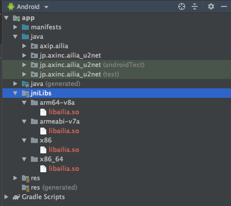
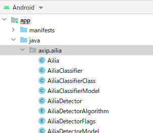
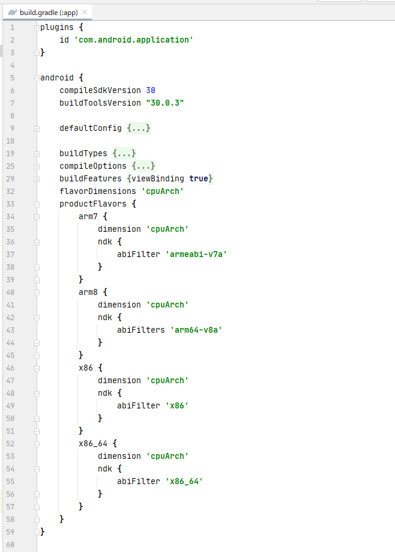

# ailia SDK チュートリアル（JNI）

# ailia SDK チュートリアル（JNI）

[](https://kyakuno.medium.com/?source=post_page---byline--7a11c1da08dc---------------------------------------)

[Kazuki Kyakuno](https://kyakuno.medium.com/?source=post_page---byline--7a11c1da08dc---------------------------------------)

12 min read

·

Sep 15, 2021

--

Share

ailia SDKをJNIで使用するチュートリアルです。ailia SDKを利用することでJavaを使用したディープラーニングの推論をGPUを使用して高速に行うことができます。ailia SDKについて詳しくは[こちら](https://ailia.jp/)をご覧ください。

## ailia SDKをJavaから使用する

ailia SDKはAndroidのJavaに向けたJNI API（Java Native Interface API）を提供しています。Android端末上でONNXを使用した推論を行うことが可能です。

ONNXは特別な変換操作が不要でそのまま利用可能であるため、従来、変換エラーの問題で実行の難しかったようなONNXモデルを、Androidで動作させることが可能になります。

特に、Pytorchで学習したモデルをAndroidで実行するのに最適なソリューションです。

## ailia SDKのダウンロード

ailia SDKの評価版をailiaのWEBサイトからダウンロードします。

[## ailia SDK（アイリア）- ディープラーニングフレームワーク -

### 物体検出・画像分類・特徴抽出。 学習済みモデルを簡単にアプリに組み込み。 高速なディープラーニングがあなたの手に。 エッジ(端末)側での推論に特化したディープラーニングミドルウェア…

ailia.jp](https://ailia.jp/?source=post_page-----7a11c1da08dc---------------------------------------)

## Android Studio プロジェクトのダウンロード

ailia-android-studioのリポジトリをダウンロードします。リポジトリにはAndroid Studioのプロジェクトファイルが含まれています。

[## GitHub - axinc-ai/ailia-android-studio: ailia example for android studio

### ailia example for android studio. Contribute to axinc-ai/ailia-android-studio development by creating an account on…

github.com](https://github.com/axinc-ai/ailia-android-studio?source=post_page-----7a11c1da08dc---------------------------------------)

## ailia SDKのライブラリのコピー

ailia SDKのlibrary/androidフォルダから、ailia SDKのライブラリファイルを、ダウンロードしたプロジェクトファイルのapp/src/main/jniLibsにコピーします。

```
コピー元  
ailia_sdk/library/android/arm64-v8a/libailia.so  
ailia_sdk/library/android/armeabi-v7a/libailia.so  
ailia_sdk/library/android/x86/libailia.so  
ailia_sdk/library/android/x86_64/libailia.soコピー先  
app/src/main/jniLibs/arm64-v8a/libailia.so  
app/src/main/jniLibs/armeabi-v7a/libailia.so  
app/src/main/jniLibs/x86/libailia.so  
app/src/main/jniLibs/x86_64/libailia.so
```

コピーすると下記のようなファイル構成になります。



ライブラリのコピー先

## Android Studioプロジェクトを開く

Android Studioを使用してダウンロードしたプロジェクトを開きます。

Press enter or click to view image in full size


Android Studioを開いた画面

Android端末を接続し、右上の三角印をクリックすることで、ビルドと実行を行うことができます。実行すると、Android端末上で背景切り抜きモデルが動作します。


アプリケーションの実行例

## 1入力1出力モデルの推論

1入力1出力のモデルを推論するにはpredict APIを使用します。res/rawフォルダに配置したonnxとprototxtをAiliaModelクラスに読み込み、getInputShapeとgetOutputShapeから計算したバッファサイズで入出力バッファを確保、predict APIを呼び出すことで推論を実行します。

```
//create ailia instance  
int envId = 0;  
AiliaModel ailia;  
ailia = new AiliaModel(envId, Ailia.MULTITHREAD_AUTO,  
            loadRawFile(R.raw.u2netp_opset11_proto), loadRawFile(R.raw.u2netp_opset11_weight));  
  
//prepare input and output buffer  
AiliaShape input_shape;  
AiliaShape output_shape;  
input_shape = ailia.getInputShape();  
output_shape = ailia.getOutputShape();int input_size = input_shape.x*input_shape.y*input_shape.z*input_shape.w;  
float [] input_buf = new float[input_size];  
  
int preds_size = output_shape.x*output_shape.y*output_shape.z*output_shape.w;  
float [] output_buf = new float[preds_size];//fill input data//compute  
int float_to_byte = 4;  
ailia.predict(output_buf, preds_size * float_to_byte, input_buf, input_size * float_to_byte);
```

Android Studioを使用して1入力1出力を持つモデルを推論するサンプルは下記となります。

[## ailia-android-studio/MainActivity.java at main · axinc-ai/ailia-android-studio

### ailia example for android studio. Contribute to axinc-ai/ailia-android-studio development by creating an account on…

github.com](https://github.com/axinc-ai/ailia-android-studio/blob/main/app/src/main/java/jp/axinc/ailia_u2net/MainActivity.java?source=post_page-----7a11c1da08dc---------------------------------------)

## 複数入出力モデルの推論

複数の入出力を持つモデルを推論するには、update APIを使用します。setInputBlobData APIで全てのBlobにデータを設定し、update APIを呼び出して推論、getBlobData APIで処理結果を取得します。複数の入力を持つモデルをpredict APIで推論しようとした場合、-7（STATUS\_INVALID\_STATE）エラーが返ります。

```
//create ailia instance  
int envId = 0;  
AiliaModel ailia;  
ailia = new AiliaModel(envId, Ailia.MULTITHREAD_AUTO,  
            loadRawFile(R.raw.u2netp_opset11_proto), loadRawFile(R.raw.u2netp_opset11_weight));  
  
//prepare input and output buffer  
AiliaShape input_shape;  
AiliaShape output_shape;  
input_shape = ailia.getBlobShape(ailia.getBlobIndexByInputIndex(0));  
output_shape = ailia.getBlobShape(ailia.getBlobIndexByOutputIndex(0));int input_size = input_shape.x*input_shape.y*input_shape.z*input_shape.w;  
float [] input_buf = new float[input_size];  
  
int preds_size = output_shape.x*output_shape.y*output_shape.z*output_shape.w;  
float [] output_buf = new float[preds_size];//fill input data//compute  
int float_to_byte = 4;  ailia.setInputBlobData(input_buf,input_size*float_to_byte,ailia.getBlobIndexByInputIndex(0)); // if the model has multiple input, please repeat this line  
ailia.update();  
ailia.getBlobData(output_buf,preds_size*float_to_byte,ailia.getBlobIndexByOutputIndex(0));
```

Android Studioを使用して複数の入出力を持つモデルを推論するサンプルは下記となります。

[## Implement multiple input mode by kyakuno · Pull Request #2 · axinc-ai/ailia-android-studio

### Add this suggestion to a batch that can be applied as a single commit. This suggestion is invalid because no changes…

github.com](https://github.com/axinc-ai/ailia-android-studio/pull/2/files?source=post_page-----7a11c1da08dc---------------------------------------)

## Kotlinからの利用

Kotlinからもailia SDKのJNI APIを呼び出すことが可能です。Kotlinを使用したサンプルプロジェクトは下記となります。

[## GitHub - axinc-ai/ailia-android-studio-kotlin: Sample project of kotlin

### Sample project of kotlin. Contribute to axinc-ai/ailia-android-studio-kotlin development by creating an account on…

github.com](https://github.com/axinc-ai/ailia-android-studio-kotlin?source=post_page-----7a11c1da08dc---------------------------------------)

Javaでは、MainActivity.javaの末尾において、下記のコードでlibailia.soを読み込んでいます。

```
//Important : load ailia library  
static {  
    System.loadLibrary("ailia");  
}
```

Kotlinから使用する場合、MainActivity.ktの末尾において、下記のコードでlibailia.soを読み込んでください。

```
//Important : load ailia library  
companion object {  
    init {  
        System.loadLibrary("ailia")  
    }  
}
```

この記述を行わない場合、java.lang.UnsatisfiedLinkErrorが発生します。

## 新規プロジェクトからの利用

Android Studioで新規プロジェクトを作成します。

## Get Kazuki Kyakuno’s stories in your inbox

Join Medium for free to get updates from this writer.

Subscribe

Subscribe

Remember me for faster sign in

次に、ソースフォルダーにailiaのwrapperコードを追加します。  
ailia SDKのjni/java/axipフォルダを、作成したプロジェクトファイルのapp/src/main/javaにコピーします。  
コピーすると下記のようなファイル構成になります。



次に、「ailia SDKのライブラリのコピー」を参考に、ailia SDKのライブラリファイルを、作成したプロジェクトファイルのapp/src/main/jniLibsにコピーします。

次に、アプリケーションのGradle Script build.gradle(:app)のandroidブロックに以下のコードを追加します。

```
flavorDimensions 'cpuArch'  
productFlavors {  
    arm7 {  
        dimension 'cpuArch'  
        ndk {  
            abiFilter 'armeabi-v7a'  
        }  
    }  
    arm8 {  
        dimension 'cpuArch'  
        ndk {  
            abiFilters 'arm64-v8a'  
        }  
    }  
    x86 {  
        dimension 'cpuArch'  
        ndk {  
            abiFilter 'x86'  
        }  
    }  
    x86_64 {  
        dimension 'cpuArch'  
        ndk {  
            abiFilter 'x86_64'  
        }  
    }  
}
```

build.gradleの全体は以下のような形になります。



最後にMainActivityのクラスに以下のコードを追加してアプリケーション起動時にailiaをロードするようにします。

```
public class MainActivity extends AppCompatActivity {  
    static {  
        System.loadLibrary("ailia");  
    }  
    ...  
}
```

なお、Kotlinをお使いの場合は「Kotlinからの利用」を参照してください。

ax株式会社はAIを実用化する会社として、クロスプラットフォームでGPUを使用した高速な推論を行うことができるailia SDKを開発しています。ax株式会社ではコンサルティングからモデル作成、SDKの提供、AIを利用したアプリ・システム開発、サポートまで、 AIに関するトータルソリューションを提供していますのでお気軽に[お問い合わせ](https://axinc.jp/)ください。