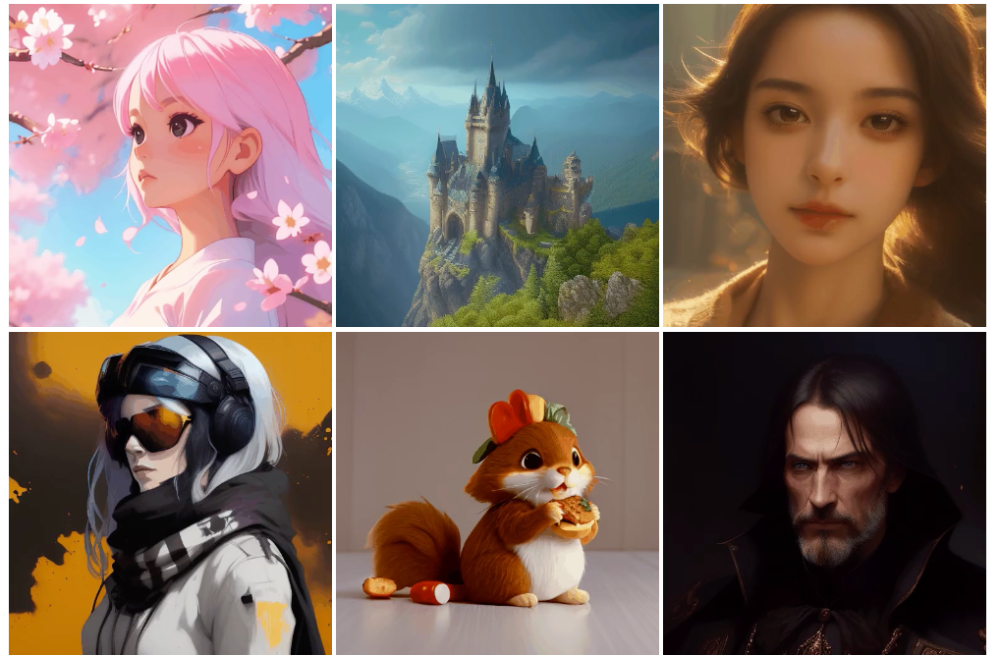
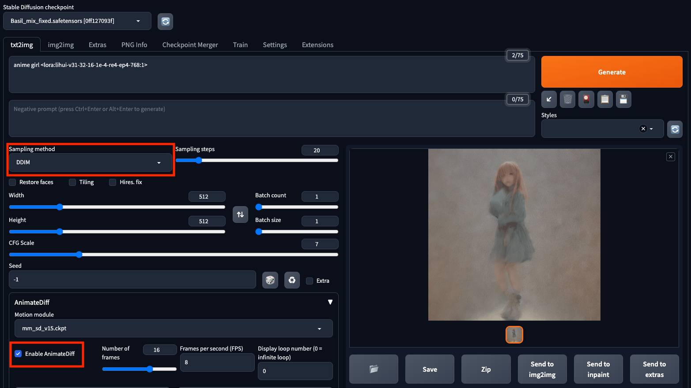
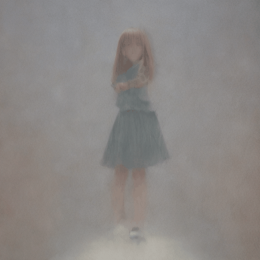
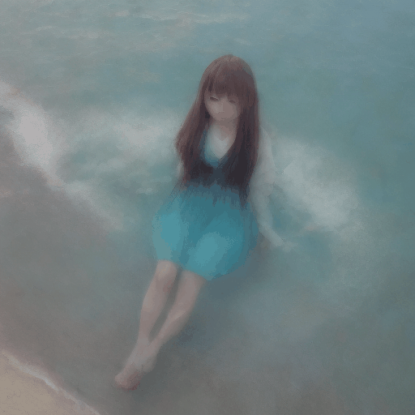
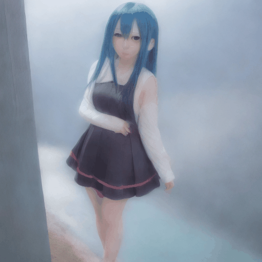
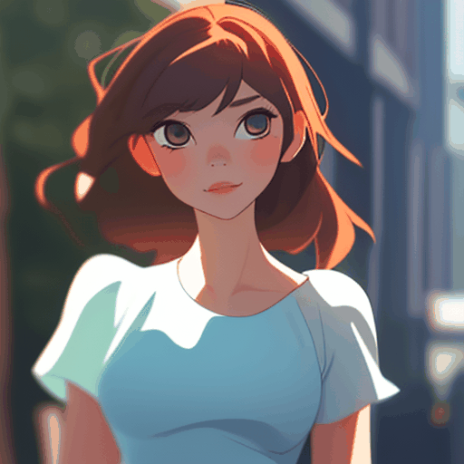
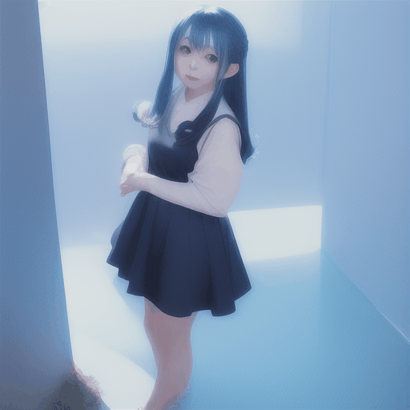

# AnimateDiffとStableDiffusionを使用してテキストや静止画から動画を生成する

# AnimateDiffとStableDiffusionを使用してテキストや静止画から動画を生成する

[](https://kyakuno.medium.com/?source=post_page---byline--76dcc8f924c6---------------------------------------)

[Kazuki Kyakuno](https://kyakuno.medium.com/?source=post_page---byline--76dcc8f924c6---------------------------------------)

15 min read

·

Jul 24, 2023

--

Share

AnimateDiffとStableDiffusionを使用してテキストや静止画から動画を生成する方法を解説します。

## AnimateDiffの概要

AnimateDiffは2023年7月に公開された、静止画から動画を生成するStableDiffusionのExtenstionです。実行にはRTX3090世代以降の12GB以上のVRAMが必要です。

Press enter or click to view image in full size



出典：<https://animatediff.github.io/>

[## AnimateDiff

### Methodology With the advance of text-to-image models (e.g., Stable Diffusion) and corresponding personalization…

animatediff.github.io](https://animatediff.github.io/?source=post_page-----76dcc8f924c6---------------------------------------)

[## GitHub - talesofai/AnimateDiff: Forked version of AnimateDiff, attempts to add init images. If you…

### Forked version of AnimateDiff, attempts to add init images. If you are look into original repo, please go to…

github.com](https://github.com/talesofai/AnimateDiff?source=post_page-----76dcc8f924c6---------------------------------------)

## AnimateDiffをStableDiffusionWebUIから使用する

### RedHatへのインストール

VRAMが12GB以上必要なため、RTX A4000のVRAM 16GBのマシンにStableDiffusionWebUIをインストールします。このマシンにはRedHat Linuxが入っています。

まずはPython3.10をインストールします。

## Get Kazuki Kyakuno’s stories in your inbox

Join Medium for free to get updates from this writer.

Subscribe

Subscribe

Remember me for faster sign in

Python3.10をそのままmakeすると、OpenSSLがインストールされず、pipで「HTTPS URL because the SSL module is not available」というエラーが発生するため、OpenSSLをインストールします。

```
sudo dnf install openssl-devel
```

また、pipで「ModuleNotFoundError: No module named ‘\_ctypes’」というエラーが発生するため、libffi-develをインストールします。

```
sudo dnf install libffi-devel
```

「ModuleNotFoundError: No module named ‘\_bz2’」というエラーが発生するため、bzip2-develをインストールします。

```
sudo dnf install -y bzip2-devel
```

これらの依存関係のインストール後に、Python3.10をmakeしてinstallします。altinstallを指定すると、Python3の複数のバージョンを共存させることが可能です。

```
wget https://www.python.org/ftp/python/3.10.2/Python-3.10.2.tgz  
tar -xzf Python-3.10.2.tgz  
cd Python-3.10.2  
./configure --enable-optimizations --with-ssl  
sudo make altinstall
```

Python3.10のインストール後に、StableDiffusionWebUIをインストールします。

```
git clone https://github.com/AUTOMATIC1111/stable-diffusion-webui.git
```

StableDiffusionWebUIは、デフォルトだとlocal URLでlistenするため、同じPC内でしかアクセスできません。webui.shに — server-nameオプションでサーバ名を指定して、listenします。 — server-nameを指定するとExtensionをインストールできないため、 — enable-insecure-extension-accessも付与します。

```
./webui.sh --sever-name=xxx --enable-insecure-extension-access
```

webui.shのpython\_cmdをpython3からpython3.10に変更します。

### AnimeteDiffのインストール

AnimateDiffのExtensionのインストール手順は下記となります。

StableDiffusionWebUIに下記のExtentionをインストールします。今回は[2023/7/20のバージョン](https://github.com/continue-revolution/sd-webui-animatediff/commit/88a04c329e07654fe3f389aeaebda1df5fff5c9f)をインストールしました。

[## GitHub - continue-revolution/sd-webui-animatediff: AnimateDiff for AUTOMATIC1111 Stable Diffusion…

### AnimateDiff for AUTOMATIC1111 Stable Diffusion WebUI - GitHub - continue-revolution/sd-webui-animatediff: AnimateDiff…

github.com](https://github.com/continue-revolution/sd-webui-animatediff?source=post_page-----76dcc8f924c6---------------------------------------)

AnimateDiffを実行すると、Please download models manuallyと表示されるため、sd-webui-animatediff/model/にmm\_sd\_v15.ckptをダウンロードして配置します。

[## animatediff - Google Drive

### Edit description

drive.google.com](https://drive.google.com/drive/folders/1EqLC65eR1-W-sGD0Im7fkED6c8GkiNFI?source=post_page-----76dcc8f924c6---------------------------------------)

### AnimateDiffによる動画の生成

txt2imgかimg2imgでAnimateDiffのEnableにチェックボックスを入れて動画を生成します。Sampling methodにはDDIMを指定することが推奨されています。

Press enter or click to view image in full size



### txt2img

Prompt

```
anime girl <lora:lihui-v31-32-16-1e-4-re4-ep4-768:1>
```

出力動画



txt2img

Prompt

```
anime girl, on the sea,  <lora:lihui-v31-32-16-1e-4-re4-ep4-768:1>
```

出力動画



txt2img

### img2img

入力画像


Input

Prompt

```
anime girl <lora:lihui-v31-32-16-1e-4-re4-ep4-768:1>
```

出力動画



img2img

## AnimateDiffをCUIから使用する

### 概要

AnimateDiffのWebUIはFlickerが発生しやすいという情報があったため、CUIから使用してみます。

### インストール

リポジトリをcloneします。

```
git clone https://github.com/guoyww/animatediff/  
rm -rf models/StableDiffusion/  
git clone https://huggingface.co/runwayml/stable-diffusion-v1-5 models/StableDiffusion/
```

git lfs pullを実行します。実行しないと、推論時に「safetensors\_rust.SafetensorError: Error while deserializing header: HeaderTooLarge」が発生します。

```
cd models/StableDiffusion/  
sudo yum install git lfs  
git lfs pull
```

モデルをダウンロードします。

```
wget -c https://huggingface.co/camenduru/AnimateDiff/resolve/main/mm_sd_v14.ckpt \  
      -O ./models/Motion_Module/mm_sd_v14.ckpt  
wget -c https://huggingface.co/camenduru/AnimateDiff/resolve/main/mm_sd_v15.ckpt \  
      -O ./models/Motion_Module/mm_sd_v15.ckpt  
bash download_bashscripts/1-ToonYou.sh
```

依存ライブラリをインストールします。

```
pip3.10 install diffusers[torch]==0.11.1  
pip3.10 install xformers==0.0.16
```

推論すると「huggingface\_hub.utils.\_validators.HFValidationError: Repo id must be in the form ‘repo\_name’ or ‘namespace/repo\_name’: ‘models/StableDiffusion/stable-diffusion-v1–5’. Use `repo\_type` argument if needed.」というエラーになるので、animate.pyのpretrained\_model\_pathを書き換えます。

```
parser.add_argument("--pretrained_model_path", type=str, default="models/StableDiffusion/",)
```

[## huggingface\_hub.utils.\_validators.HFValidationError: Repo id must be in the form 'repo\_name' or…

### huggingface\_hub.utils.\_validators.HFValidationError: Repo id must be in the form 'repo\_name' or 'namespace/repo\_name'…

github.com](https://github.com/guoyww/AnimateDiff/issues/14?source=post_page-----76dcc8f924c6---------------------------------------)

推論すると「TypeError: The keyword `fps` is no longer supported. Use `duration`(in ms) instead, e.g. `fps=50` == `duration=20` (1000 \* 1/50).」というエラーが発生するため、util.pyを書き換えます。

```
imageio.mimsave(path, outputs, duration=1000 / fps)
```

### tex2img

下記のコマンドで推論します。

```
python3.10 -m scripts.animate --config configs/prompts/1-ToonYou.yaml
```

推論結果です。2分程度で推論可能です。



デフォルトの設定での推論

プロンプトとLoRAを変更するために、configs/promptsにax.yamlを作成します。

```
AnimeGirl:  
  base: "models/StableDiffusion/Basil_mix_fixed.safetensors"  
  path: "models/DreamBooth_LoRA/gachaSplashLORA_gachaSplash31.safetensors"  
  motion_module:  
    - "models/Motion_Module/mm_sd_v14.ckpt"  
    - "models/Motion_Module/mm_sd_v15.ckpt"  
  
  seed:           [-1]  
  steps:          25  
  guidance_scale: 7  
  lora_alpha: 1  
  
  prompt:  
    - "anime girl"  
  
  n_prompt:  
    - ""
```

また、必要に応じてanimate.pyのVAEを置き換えます。

```
#vae          = AutoencoderKL.from_pretrained(args.pretrained_model_path, subfolder="vae")  
vae          = AutoencoderKL.from_pretrained("stabilityai/sd-vae-ft-ema")
```

推論します。

```
python3.10 -m scripts.animate --config configs/prompts/ax.yaml
```

推論結果です。Flickerは消えて、Blurも抑制されました。


Anime girl with LoRA

### img2img

img2imgを使用するには、fork版を使用します。

```
git clone https://github.com/talesofai/AnimateDiff
```

リポジトリを切り替えます。

```
git remote set-url origin　https://github.com/talesofai/AnimateDiff.git  
git pull --rebase
```

ax\_init\_image.yamlにimg2imgの設定ファイルを作成します。init\_imageが追加された項目です。

```
AnimeGirl:  
  base: "models/StableDiffusion/Basil_mix_fixed.safetensors"  
  path: "models/DreamBooth_LoRA/gachaSplashLORA_gachaSplash31.safetensors"  
  motion_module:  
    - "models/Motion_Module/mm_sd_v14.ckpt"  
    - "models/Motion_Module/mm_sd_v15.ckpt"  
  init_image: "configs/prompts/anime_girl.png"  
  
  seed:           [-1]  
  steps:          25  
  guidance_scale: 7  
  lora_alpha: 1  
  
  prompt:  
    - "anime girl, wind"  
  
  n_prompt:  
    - ""
```

下記のコマンドで推論します。

```
python3.10 -m scripts.animate --config configs/prompts/ax_init_image.yaml
```

推論結果です。



Anime Girl Wind

## まとめ

AnimateDiffを使用してテキストから動画を生成できることを確認しました。AnimateDiffのWebUIはまだ初期段階ということもあり、Flickerが発生するため、CUIから実行した方が高精度な動画が生成できました。

まだ完全な動画ではありませんが、フレーム間の破綻が少なく、未来を感じる技術だと思います。

## トラブルシューティング

### 出力画像がぼやける

StableDiffusionWebUIではSampling methodをDDIM以外に設定していると、出力画像がぼやけやすいようです。Sampling methodをDDIMに設定してください。ただ、それでもぼやけるので、WebUIではなくCUIから叩いた方が良いようです。

### RuntimeErrorが発生する

StableDiffusionWebUIが古いと下記のRuntimeErrorが発生します。

```
File "E:\stable-diffusion\stable-diffusion-webui\venv\lib\site-packages\torch\nn\functional.py", line 2528, in group_norm  
return torch.group_norm(input, num_groups, weight, bias, eps, torch.backends.cudnn.enabled)  
RuntimeError: Expected weight to be a vector of size equal to the number of channels in input, but got weight of shape [2560] and input of shape [2, 5120, 8, 8]
```

StableDiffusionWebUIをgit pullして最新版にすると解消します。2023/3/29のバージョンだと問題が発生し、2023/7/19のバージョンだと問題が解消しました。

[## RuntimeError · Issue #3 · continue-revolution/sd-webui-animatediff

### Expected weight to be a vector of size equal to the number of channels in input, but got weight of shape [1280] and…

github.com](https://github.com/continue-revolution/sd-webui-animatediff/issues/3?source=post_page-----76dcc8f924c6---------------------------------------)

### VRAMが12GB以上あるのにOut Of Memoryになる

nvidia-smiで稼働中のプロセスを確認します。

ax株式会社はAIを実用化する会社として、クロスプラットフォームでGPUを使用した高速な推論を行うことができるailia SDKを開発しています。ax株式会社ではコンサルティングからモデル作成、SDKの提供、AIを利用したアプリ・システム開発、サポートまで、 AIに関するトータルソリューションを提供していますのでお気軽に[お問い合わせ](https://axinc.jp/)ください。