# StableDiffusionWebUIとKohya’s GUIで生成したLoRAを使って特定のキャラクターの画像を生成する

# StableDiffusionWebUIとKohya’s GUIで生成したLoRAを使って特定のキャラクターの画像を生成する

[](https://kyakuno.medium.com/?source=post_page---byline--61382e0dcc51---------------------------------------)

[Kazuki Kyakuno](https://kyakuno.medium.com/?source=post_page---byline--61382e0dcc51---------------------------------------)

21 min read

·

Apr 19, 2023

--

Share

PC上で簡単にイラストを生成できるStableDiffusionWebUIと、特定のキャラクターに特化したLoRAをKohya’sGUIで生成して、特定のキャラクターの画像を生成します。

## StableDiffusionWebUIについて

StableDiffusionWebUIはPC上で簡単にイラストを生成できるフレームワークです。StableDiffusionWebUIのインストール方法は下記の記事を参照してください。

[## StableDiffusionWebUIとControlNetを使って任意ポーズの画像を生成する

### PC上で簡単にイラストを生成するStableDiffusionWebUIと、イラストに制約をかけるControlNetを使用することで、任意ポーズの画像を生成する方法を解説します。

medium.com](https://medium.com/axinc/stablediffusionwebui%E3%81%A7controlnet%E3%82%92%E4%BD%BF%E3%81%A3%E3%81%A6%E4%BB%BB%E6%84%8F%E3%83%9D%E3%83%BC%E3%82%BA%E3%81%AE%E7%94%BB%E5%83%8F%E3%82%92%E7%94%9F%E6%88%90%E3%81%99%E3%82%8B-bc91563cf7f3?source=post_page-----61382e0dcc51---------------------------------------)

今回の検証環境のバージョンは下記です。

```
Windows 10  
Python 3.10.9  
StableDiffusionWebUI = 22bcc7be428c94e9408f589966c2040187245d81
```

## LoRAについて

LoRAはStableDiffusionの一部の重みだけを再学習することで、LoRAの学習に使用した画像に沿った画像を出力するように制御することができる仕組みです。LoRAはStableDiffusionのモデルのうち、Attentionレイヤーのウエイトだけを再学習します。

> Also, not all of the parameters need tuning: they found that often, Q,K,V,O (i.e., attention layer) of the transformer model is enough to tune. (This is also the reason why the end result is so small). This repo will follow the same idea.

LoRAを使用することで、自分の絵柄のキャラクターや、特定の構図の画像を生成することが可能です。

[## GitHub - cloneofsimo/lora: Using Low-rank adaptation to quickly fine-tune diffusion models.

### Using LoRA to fine tune on illustration dataset : $W = W\_0 + \alpha \Delta W$, where $\alpha$ is the merging ratio…

github.com](https://github.com/cloneofsimo/lora?source=post_page-----61382e0dcc51---------------------------------------)

LoRAとControlNetは併用可能です。LoRAはStableDiffusionの一部のWeightを静的に変更するものであり、ControlNetはStableDiffusionの一部のFeatureVectorに動的に値を加算するものです。変更する箇所が異なるため、競合せず、併用可能です。

なお、LoRAはStableDiffusion固有の技術というわけではなく、大規模な基盤モデルを、忘却なく効率的に再学習する手法として広く使用されています。

例えば、下記はWhisperやLlamaにLoRAを適用する例です。

[## Parameter-Efficient Fine-Tuning of Whisper-Large V2 in Colab on T4 GPU using 🤗 PEFT+INT8 training…

### Attention ASR developers and researchers! 🚀 Great news, with the latest update of 🤗 PEFT, you can now fine-tune your…

github.com](https://github.com/openai/whisper/discussions/988?source=post_page-----61382e0dcc51---------------------------------------)

[## Add LoRA support by slaren · Pull Request #820 · ggerganov/llama.cpp

### This change allows applying LoRA adapters on the fly without having to duplicate the model files. Instructions: Obtain…

github.com](https://github.com/ggerganov/llama.cpp/pull/820?source=post_page-----61382e0dcc51---------------------------------------)

## LoRAの適用

LoRAを適用するためのプラグインはStableDiffusionWebUIに標準でインストールされています。

学習済みのLoRAファイルはCivitaiからダウンロード可能です。

[## Civitai | Stable Diffusion models, embeddings, hypernetworks and more

### Civitai is a platform for Stable Diffusion AI Art models. We have a collection of over 1,700 models from 250+ creators…

civitai.com](https://civitai.com/?query=lora&source=post_page-----61382e0dcc51---------------------------------------)

今回は、Gacha splach LORAをダウンロードします。このLoRAは、ガチャのスプラッシュスクリーン風の構図の画像を生成するためのものです。

[## Gacha splash LORA | Stable Diffusion LORA | Civitai

### 13,638 Mar 21, 2023 3.0 version is released. I rebuilt the entire training set for this version. Notes: Please avoid…

civitai.com](https://civitai.com/models/13090/gacha-splash-lora?source=post_page-----61382e0dcc51---------------------------------------)

ダウンロードしたLoRAは、stable-diffusion-webui/models/Loraに配置します。

Press enter or click to view image in full size

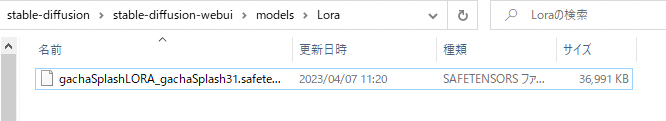

ダウンロードしたLoraの配置

LoRAを適用するには、Generateの下にある、赤いアイコンを押します。

Press enter or click to view image in full size

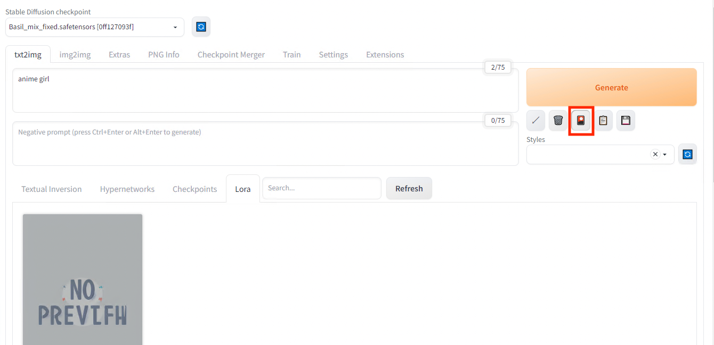

Loraの設定

適用したいLoRAを選択すると、プロンプトにLoRAが追加されます。

Press enter or click to view image in full size

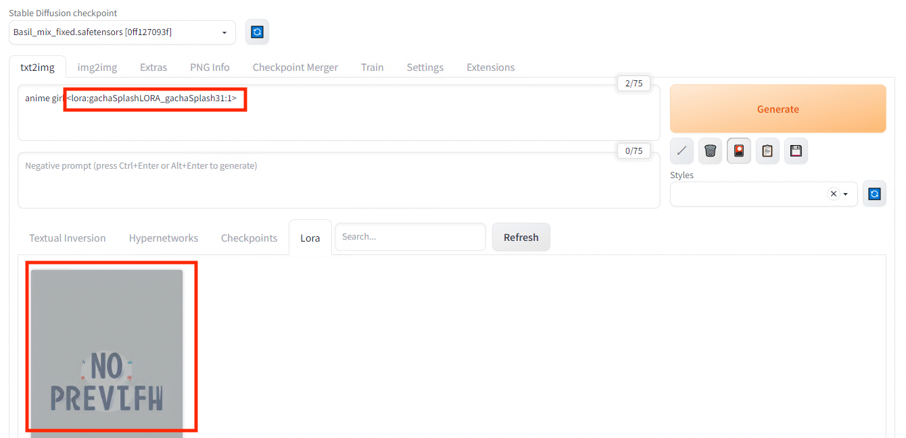

LoraのPromptへの適用

この状態で画像を生成すると、LoRAを適用した画像が出力されます。出力される画像がガチャのスプラッシュスクリーン風になっていることを確認することができます。

Press enter or click to view image in full size

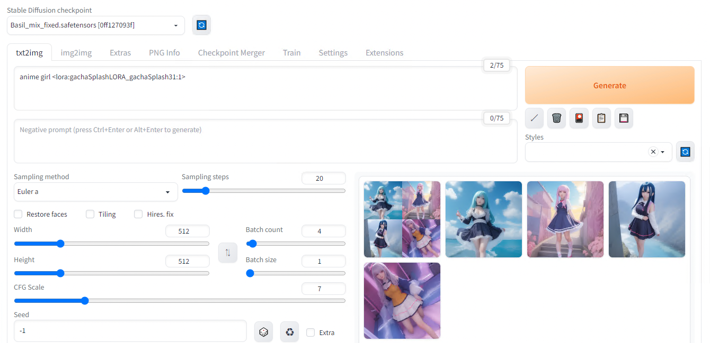

LoRAによる生成

Press enter or click to view image in full size

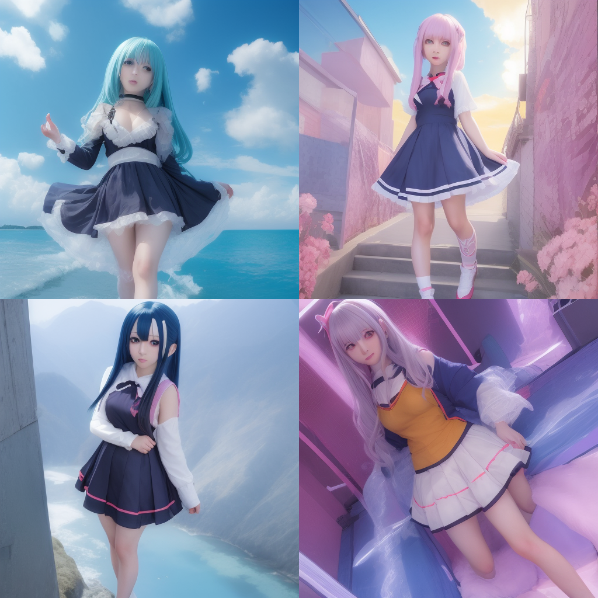

anime girl + LoRAによる生成結果

## SdWebUITrainToolsとKohya’s GUIについて

特定のキャラクターの画像を入力して、LoRAを作成する方法として、SdWebUITrainToolsを使う方法と、Kohys’s GUIを使う方法があります。

今回の検証では、Unity Chanの画像を生成するLoRAを作成することを目標とします。今回の検証では、SdWebUITrainToolsよりもKohya’s GUIを使った方が期待する結果が得られました。

今回、使用したSdWebUITrainToolsのバージョンは下記です。

```
sd-webui-train-tools = d2d984d8 (Fri Mar 31 15:14:28 2023)
```

Kohya’s GUIのバージョンは下記です。

```
kohya's gui = v21.5.2 cc52c73  (2023/4/13 3:19)
```

以降、SdWebUITrainToolsの使用方法と、Kohya’s GUIの使用方法を解説します。

## SdWebUITrainToolsの使用方法

StableDiffusionWebUIでLoRAの学習を行うには、 <https://github.com/liasece/sd-webui-train-tools> をExtensionsのInstall from URLからインストールします。

[## GitHub - liasece/sd-webui-train-tools: The stable diffusion webui training aid extension helps you…

### The stable diffusion webui training aid extension helps you quickly and visually train models such as Lora.

github.com](https://github.com/liasece/sd-webui-train-tools?source=post_page-----61382e0dcc51---------------------------------------)

Press enter or click to view image in full size

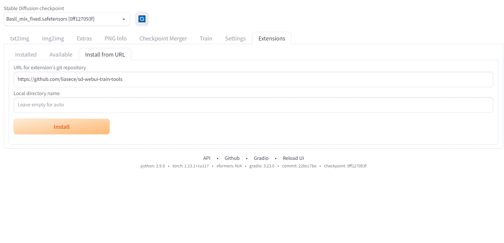

sd-webui-train-toolsのインストール

SdWebUITrainToolsをインストールすると、Train Toolsタブが増えています。Train Toolsたぶで、Create Projectを押し、新規プロジェクトを作成します。今回はunity\_chanというプロジェクトを作成します。その後、Create versionでv1を作成します。

Press enter or click to view image in full size

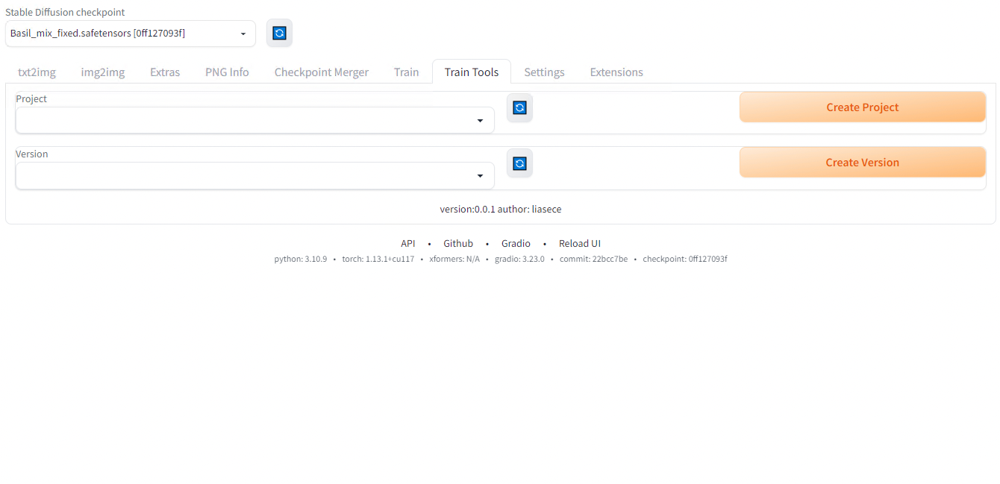

Train Toolsタブ

学習に使用するデータセットとして、ユニティちゃんHD画像パックVol.1をダウンロードします。（© Unity Technologies Japan/UCL）

[## ダウンロード - UNITY-CHAN!

### 【ユニティちゃんトゥーンシェーダー 2.0 / UTS2 v.2.0.9】 「ユニティちゃんトゥーンシェーダー」は、セル風3DCGアニメーションの制作現場での要望に応えるような形で設計された、映像志向のトゥーンシェーダーです。…

unity-chan.com](https://unity-chan.com/download/index.php?source=post_page-----61382e0dcc51---------------------------------------)

Press enter or click to view image in full size

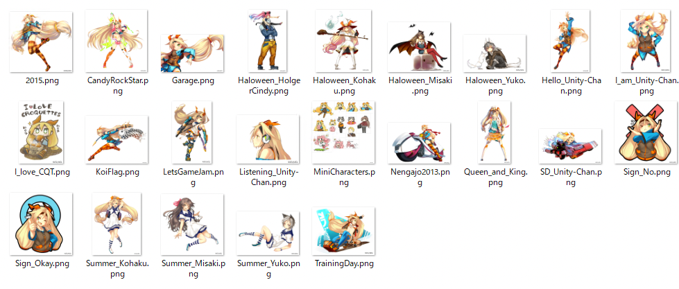

学習に使用するデータセット

Upload Datasetに画像をドロップします。LoRAの学習には、20枚以上の画像が必要であると言われています。

Press enter or click to view image in full size


画像のドロップ

下にスクロールしてUpdate Datasetを押します。

Press enter or click to view image in full size

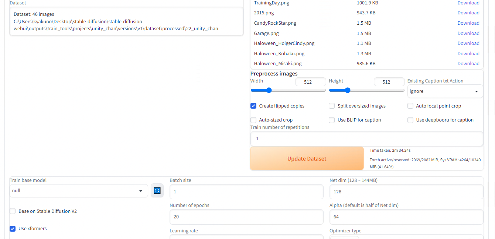

Update Dataset

下にスクロールしてTrain base modelを選択して、Begin trainを押します。

Press enter or click to view image in full size

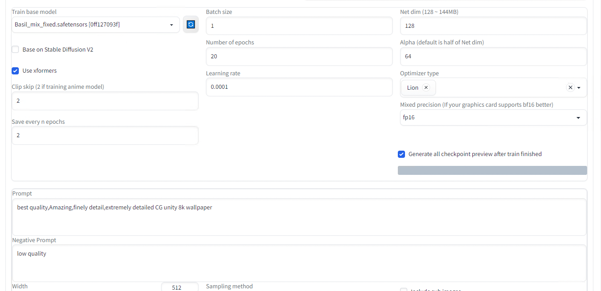

学習の実行中

学習にはRTX3080で2時間程度かかります。

## Get Kazuki Kyakuno’s stories in your inbox

Join Medium for free to get updates from this writer.

Subscribe

Subscribe

Remember me for faster sign in

学習が完了すると、下記にLoRAファイルが出力されます。

> stable-diffusion-webui\outputs\train\_tools\projects

Press enter or click to view image in full size

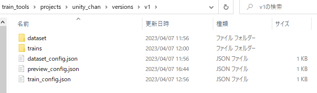

出力先フォルダ

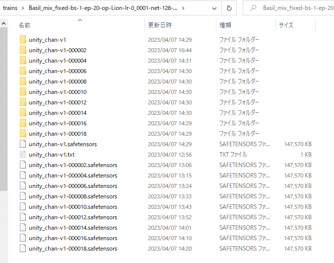

出力されたLoraファイル

学習が終わったファイルをstable-diffusion-webui/models/Loraにコピーします。

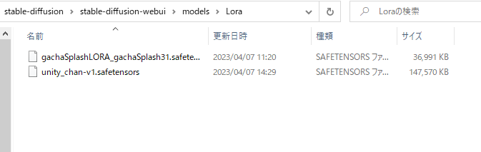

modelフォルダにコピーしたLora

txt2imgでGenerateの下の赤いボタンからLoRAを適用します。

Press enter or click to view image in full size

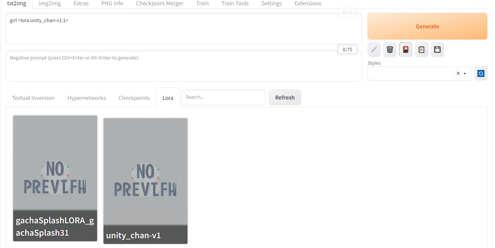

Loraの適用

Generateで生成します。LoRAの強度が弱いのかいまいちUnityChanっぽくないです。

Press enter or click to view image in full size


重み1

Promptでunity\_chanに1000の重みを適用します。

Press enter or click to view image in full size


重み1000

データセットからUnityChanのツインテールとリボンの概念は獲得できているように見えます。


UnityChanの概念は獲得できている気がする

次に、データセットの最適化を行います。データセットにUnityChanじゃないものが混ざっているので削除します。また、データセットを増やしてみます。

Press enter or click to view image in full size


v2のデータセット

v2では、下記のようになりました。服装が近くなった気がします。

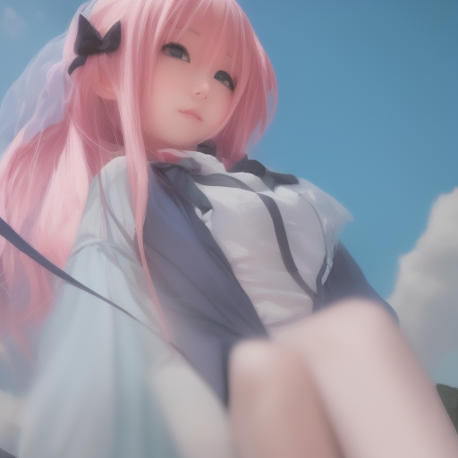

v2の出力

やはり実写になってしまうのは、ベースモデル（Basil\_mix）が実写向けに最適化されているのではということで、アニメ調のデータを生成するため、モデルをAnything-v4に置き換えてみます。

[## andite/anything-v4.0 · Hugging Face

### Edit model card Fantasy.ai is the official and exclusive hosted AI generation platform that holds a commercial use…

huggingface.co](https://huggingface.co/andite/anything-v4.0?source=post_page-----61382e0dcc51---------------------------------------)

Anything-v4に置き換えると下記のようになりました。現代風のアニメキャラになりました。ただ、まだUnity Chanには遠いです。


v5の出力

下記を見ると、キャラクターの再現にはPromptにできるだけキャラクターの特徴を記載した上で、学習した方がいいという記載がありました。

[## 【アプリ開発日記59週目】狙ったキャラを自分の絵柄＆好きなポーズで作成する〈SD後編〉｜ちゅーりん｜note

### 「自分の絵柄でキャラ絵をいろいろ創りたい！」 いよいよ今回で最初の区切りにしようと思います。というのもこの分野、毎日のように新技術が生まれてきているので、同じ目標にしていても次々と試す余地が出てきてキリがないのです笑…

note.com](https://note.com/churin_1116/n/n4e9456256c2f?source=post_page-----61382e0dcc51---------------------------------------#6936112b-b2fc-4b37-a28c-4a578e3a889a)

そこで、学習に使用するPromptをUnity Chanを示すものに変更します。女性、イエローの髪、ツインテール、オレンジのリボン、ブルーのヘッドバンド、グリーンの目、ロングヘアーなどを指定します。生成にも学習に使用したものと同じPromptを入力します。

> 変更前 : anime girl,best quality,Amazing,finely detail,extremely detailed CG unity 8k wallpaper  
> 変更後：1 girl, yellow hair, twin tail, orange ribbon, blue head band, green eye, long hair

v6は下記のようになりました。Unity Chanに近づいてきた気はします。ただ、Unity Chanにはなりませんでした。


v6の出力

SdWebUITrainToolsだとこれ以上、追い込めなかったため、Kohya’s GUIを試します。

## Kohya’s GUIの使用方法

学習に使用するデータセットとして、ユニティちゃんの画像をダウンロードします。（© Unity Technologies Japan/UCL）

[## ダウンロード — UNITY-CHAN!

### 【ユニティちゃんトゥーンシェーダー 2.0 / UTS2 v.2.0.9】 「ユニティちゃんトゥーンシェーダー」は、セル風3DCGアニメーションの制作現場での要望に応えるような形で設計された、映像志向のトゥーンシェーダーです。…

unity-chan.com](https://unity-chan.com/download/index.php?source=post_page-----61382e0dcc51---------------------------------------)

使用するデータセットは下記です。

Press enter or click to view image in full size


学習に使用するデータセット

Kohya’s GUIをインストールします

```
git clone https://github.com/bmaltais/kohya_ss  
setup.bat  
gui-user.bat
```

[## GitHub - bmaltais/kohya\_ss

### This repository provides a Windows-focused Gradio GUI for Kohya's Stable Diffusion trainers. The GUI allows you to set…

github.com](https://github.com/bmaltais/kohya_ss?source=post_page-----61382e0dcc51---------------------------------------)

WEB UIを開いて、DreamboothLoRAを選択します。Source modelにベースモデルを指定します。今回はアニメ画像なので、AnythingV4を指定します。

Press enter or click to view image in full size


モデル指定

Foldersに学習させる画像のフォルダを指定します。画像のフォルダではなく、一階層上のフォルダを指定します。画像のフォルダ名が、ステップ数と、キャラクターの召喚用のPromptになります。今回は、20\_unitychanというフォルダの中に画像を入れます。Outputに出力先のフォルダを指定します。

Press enter or click to view image in full size

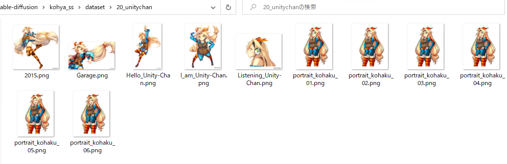

学習画像のフォルダ構成

Press enter or click to view image in full size

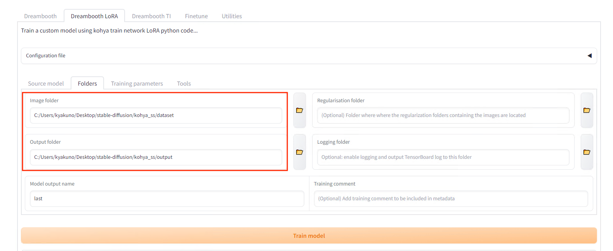

入出力フォルダ指定

設定でEpochsを5にします。

Press enter or click to view image in full size


Epochsの設定

Train modelを押します。学習は10分ほどで完了します。

生成されたlast.safetensorsをStable Diffusion WebUIのmodels/LoRAにコピーして、LoRAの適用の手順で画像を生成します。

Promptにはフォルダ名のunitychanを指定します。

Press enter or click to view image in full size


Promptの設定


生成されたUnity Chan

Unity Chanが生成できました。


ControlNetでポーズ指定

ControlNetでポーズ指定も可能です。

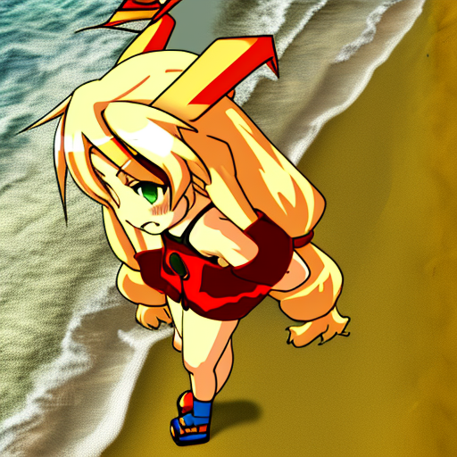

Promptで背景指定

Ptomptをunity\_chan, on the beachにすると、海にいるUnity Chanを生成可能です。

（© Unity Technologies Japan/UCL）

## まとめ

StableDiffusionとKohya’s GUIを使用することで、特定のイラストからLoRAを作成し、期待するキャラクターを生成できることを確認しました。また、ControlNetを適用して、好きなポーズのキャラクターを生成できることを確認しました。

## トラブルシューティング

### SdWebUITrainToolsの実行時にエラーが出る

Python3.10ではなく、Python3.9を使用している場合は下記のエラーが出ます。

> def readImages(inputPath: str, level: int = 0, include\_pre\_level: bool = False, endswith :str | list[str] = [“.png”,”.jpg”,”.jpeg”,”.bmp”,”.webp”]) -> list[Image.Image]:  
> TypeError: unsupported operand type(s) for |: ‘type’ and ‘types.GenericAlias’

これは、|がPython3.10から追加された演算子なためです。その場合、[Python3.10.9](https://www.python.org/downloads/release/python-3109/)で環境を作り直す必要があります。環境を作り直す際は、Python3.10.9をインストールした後、stable-diffusion-webuiのフォルダにあるvenvフォルダを削除した上で、webui.batを実行します。

[## CAN NOT find the training tool tab: TypeError: unsupported operand type(s) for |: · Issue #1 ·…

### You can’t perform that action at this time. You signed in with another tab or window. You signed out in another tab or…

github.com](https://github.com/liasece/sd-webui-train-tools/issues/1?source=post_page-----61382e0dcc51---------------------------------------)

### SdWebUITrainToolsの学習時にxformersがインストールされていないというエラーが発生する

学習時に下記のエラーが発生した場合は、webui-user.batのCOMMANDLINE\_ARGSに — xformersを追加してください。train-toolsのxformersを無効にした場合、VRAMを多く消費し、cudaOutOfMemoryになるため、xformersは有効にすることが望ましいようです。

> Train Tools: train.train error No xformers / xformersがインストールされていないようです  
> Traceback (most recent call last):  
>  File “C:\Users\kyakuno\Desktop\stable-diffusion\stable-diffusion-webui\extensions\sd-webui-train-tools\liasece\_sd\_webui\_train\_tools\sd\_scripts\library\train\_util.py”, line 1672, in replace\_unet\_cross\_attn\_to\_xformers  
>  import xformers.ops  
> ModuleNotFoundError: No module named ‘xformers.ops’; ‘xformers’ is not a package
>
> During handling of the above exception, another exception occurred:

[## Xformersを導入する

### Xformersを有効化すると、画像生成速度の大幅な向上と、使用するVRAM量の大幅削減という2つの効果を得ることができます。…

wikiwiki.jp](https://wikiwiki.jp/sd_toshiaki/Xformers%E3%82%92%E5%B0%8E%E5%85%A5%E3%81%99%E3%82%8B?source=post_page-----61382e0dcc51---------------------------------------)

### Kohya’s GUIでTypeError: argument of type ‘WindowsPath’ is not iterableというエラーが発生する

Windowsの場合下記のようにbitsandbytesのバイナリを上書きする必要があるようです。

```
copy .\bitsandbytes_windows\*.dll .\venv\Lib\site-packages\bitsandbytes\  
copy .\bitsandbytes_windows\cextension.py .\venv\Lib\site-packages\bitsandbytes\cextension.py  
copy .\bitsandbytes_windows\main.py .\venv\Lib\site-packages\bitsandbytes\cuda_setup\main.py
```

[## failing to train LORA and getting these errors ( libcudart.so not found , 'WindowsPath' is not…

### hi, this is my 3rd clean install to kohya\_ss with all the requirements but still having the same problem... i have…

github.com](https://github.com/kohya-ss/sd-scripts/issues/195?source=post_page-----61382e0dcc51---------------------------------------)

### Kohya’s GUIのxformersでエラーが発生する

新しいxformers（0.0.18）だとエラーが発生します。

```
RuntimeError: xformers::efficient_attention_forward_cutlass() expected at most 8 argument(s) but received 13 argument(s). Declaration: xformers::efficient_attention_forward_cutlass(Tensor query, Tensor key, Tensor value, Tensor? cu_seqlens_q, Tensor? cu_seqlens_k, int? max_seqlen_q, bool compute_logsumexp, bool causal) -> (Tensor, Tensor)
```

xformersの0.0.14をインストールする必要があります。

```
pip install -U -I --no-deps https://github.com/C43H66N12O12S2/stable-diffusion-webui/releases/download/f/xformers-0.0.14.dev0-cp310-cp310-win_amd64.whl
```

[## ModuleNotFoundError: No module named 'xformers' · Issue #420 · kohya-ss/sd-scripts

### I can't train a model with LoRA... ..... [Dataset 0] loading image sizes…

github.com](https://github.com/kohya-ss/sd-scripts/issues/420?source=post_page-----61382e0dcc51---------------------------------------)

ax株式会社はAIを実用化する会社として、クロスプラットフォームでGPUを使用した高速な推論を行うことができるailia SDKを開発しています。ax株式会社ではコンサルティングからモデル作成、SDKの提供、AIを利用したアプリ・システム開発、サポートまで、 AIに関するトータルソリューションを提供していますのでお気軽に[お問い合わせ](https://axinc.jp/)ください。