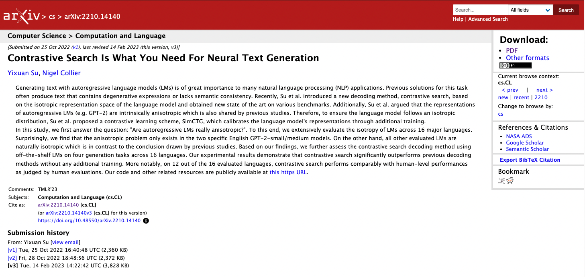
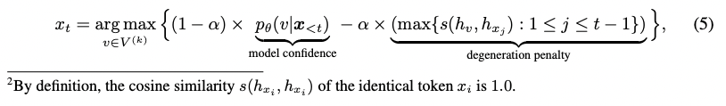
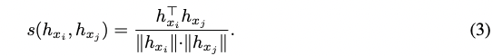

# Contrastive Search : 言語生成の繰り返しを抑制できるトークン選択アルゴリズム

# Contrastive Search : 言語生成の繰り返しを抑制できるトークン選択アルゴリズム

[Kazuki Kyakuno](https://kyakuno.medium.com/?source=post_page---byline--69d6f90c950---------------------------------------)

Aug 8, 2023

--

Share

言語生成のトークン選択アルゴリズムであるContrastive Searchを紹介します。Greedy SearchやBeam Searchの繰り返しの問題を解消するアルゴリズムです。

## 言語生成におけるトークン選択とは

言語生成モデルでは、モデルの推論の出力は次のトークンの確率値です。例えば、32000種類のトークンを持つモデルの場合、それぞれのトークンの確率値が出力されます。

出力された確率値から、何らかのアルゴリズムで最良のトークンを選択し、選択したトークンをモデルの入力として、再び推論することで、次のトークンを得ます。

これを連続的に繰り返すことで、トークン列を取得し、トークン列をトークナイザでデコードすることで文字列に変換します。

## Greedy Search

貪欲法と呼ばれるGreedy Searchでは、最も高い確率のトークンを選択します。この方法は、最も高速ですが、文字列の繰り返しが発生しやすいという問題があります。

## Beam Search

文字列の繰り返しを抑制する方法として、Beam Searchが広く使用されています。これは、最も高い確率のトークンだけでなく、TOP-Kのトークンを選択することで、複数の候補を作成し、最終的に最も高い確率値を持つトークン列を選択します。

Beam Searchは品質の高い出力を得ることができますが、Beam Sizeをbatchサイズとしてモデルの推論を行う必要があるため、演算負荷が高いという問題があります。これは、モデルが前回の出力を入力として取るため、複数の候補のトークン列を生成するには、候補の数だけ推論する必要があるためです。

## Get Kazuki Kyakuno’s stories in your inbox

Join Medium for free to get updates from this writer.

Subscribe

Subscribe

Remember me for faster sign in

また、Beam Searchを行ったとしても、完全には繰り返しを抑制できないという問題があります。

## Contrastive Search

Contrastive Searchは、2022年に提案された手法で、過去に出力したトークン列と同じトークン列に対して、ペナルティを与えて選択しにくくすることで、文字列の繰り返しを抑制する方式です。Beam Searchと同等の演算量で、Beam Search以上の繰り返しの抑制を行うことが可能です。

Press enter or click to view image in full size

[## A Contrastive Framework for Neural Text Generation

### Text generation is of great importance to many natural language processing applications. However, maximization-based…

arxiv.org](https://arxiv.org/abs/2202.06417?source=post_page-----69d6f90c950---------------------------------------)

時刻tのトークンx\_tを計算するために、トークン候補V^kからvを選択する際、下記の評価関数に沿って決定します。model confidenceがモデルの出力する確率値であり、modelは、過去のトークンx\_<tから、トークン候補vの確率値を出力します。Greedy Searchではこの項のみから出力を決定します。

Press enter or click to view image in full size

Contrasrtive Search (出典：<https://arxiv.org/pdf/2202.06417.pdf>)

Contrastive Searchでは、ペナルティとしてdegeneration penaltyが追加されており、過去のトークン列x\_jと、現在の候補トークンvから、ペナルティを計算し、モデルの出力する確率値から減算します。

sはトークンのHidden Statesのコサイン距離です。候補のvを入力として、モデルの推論を再度行い、Hidden Stateを取得します。過去のHidden Stateとの内積を行い、意味的に近ければペナルティが高くなります。

Cos距離 (出典：<https://arxiv.org/pdf/2202.06417.pdf>)

全ての候補に対してHidden Stateを計算するためにモデルの推論を行った場合、演算量が大きくなるため、実際はTOP-Kの確率の高い候補に対してだけペナルティを計算します。

αはペナルティを制御するためのパラメータであり、0だとGreedy Searchと等価になります。

実際の実装例は下記にあります。

[## Adding State-of-the-art Contrastive Search to the Codebase of model.generate() · Issue #19182 ·…

### Feature request Catalogue: 1. Abstract 2. Introduction 3. Demonstration of the Awesome Results from Contrastive Search…

github.com](https://github.com/huggingface/transformers/issues/19182?source=post_page-----69d6f90c950---------------------------------------#code_snippet)

## まとめ

新しいトークン生成アルゴリズムであるContrastive Searchを紹介しました。演算量はBeam Searchと同等ですが、Beam Searchよりもシンプルに実装することが可能です。

## 関連情報

Transformersのサーチアルゴリズムがまとめられています。

[## Transformers の generate()のテキスト生成戦略｜npaka

### 以下の記事が面白かったので、簡単にまとめました。 ・Text generation strategies 1. generate() の テキスト生成戦略 「テキスト生成」は、自由形式のテキスト生成、要約、翻訳など、多くの NLP…

note.com](https://note.com/npaka/n/n9a8c85f2ef7a?source=post_page-----69d6f90c950---------------------------------------)

ax株式会社はAIを実用化する会社として、クロスプラットフォームでGPUを使用した高速な推論を行うことができるailia SDKを開発しています。ax株式会社ではコンサルティングからモデル作成、SDKの提供、AIを利用したアプリ・システム開発、サポートまで、 AIに関するトータルソリューションを提供していますのでお気軽に[お問い合わせ](https://axinc.jp/)ください。