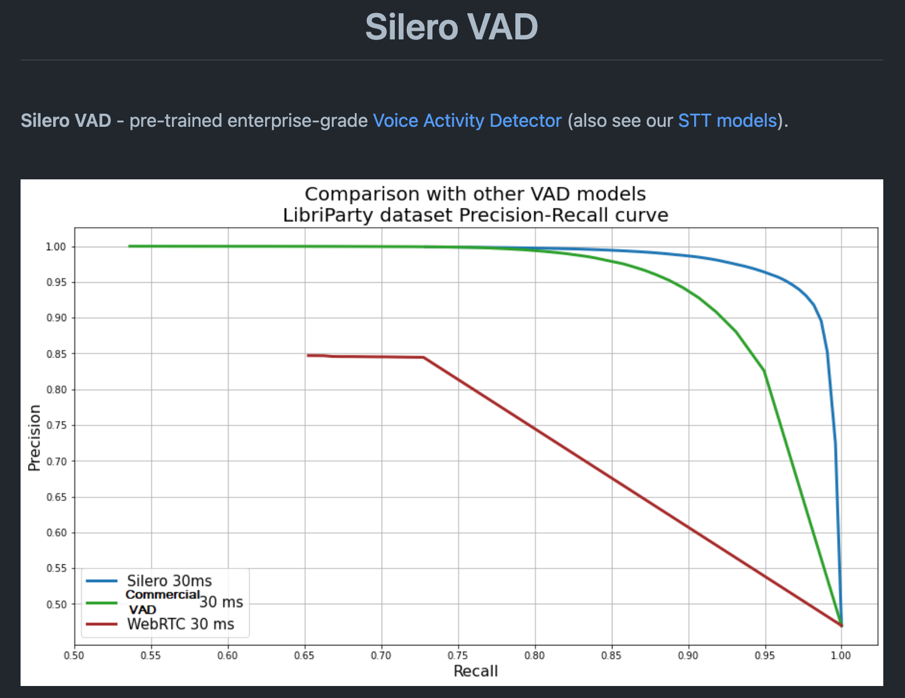
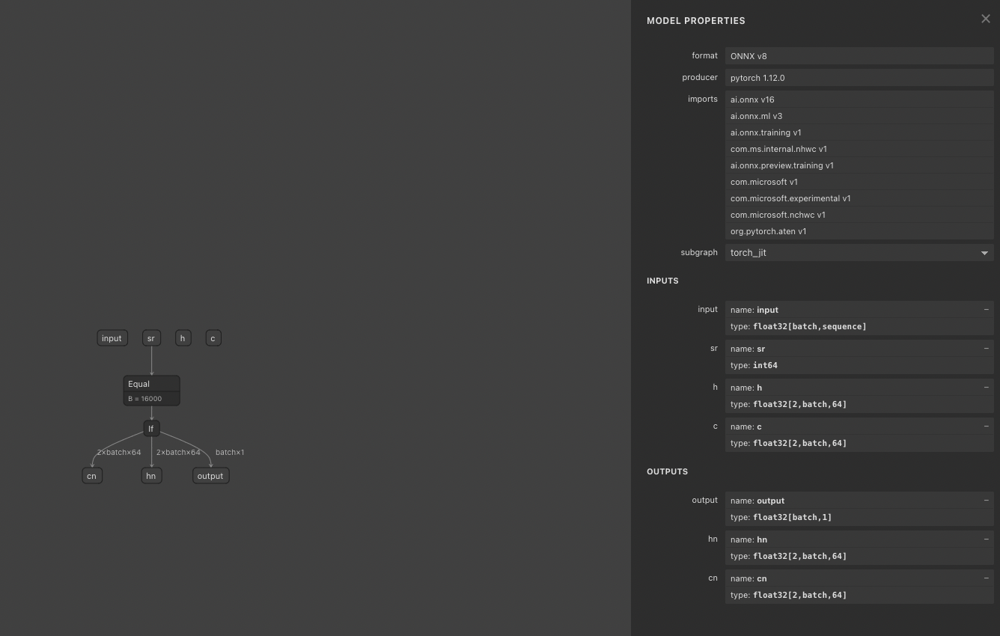
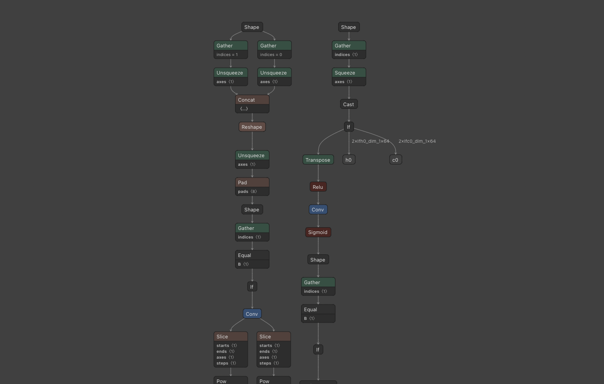
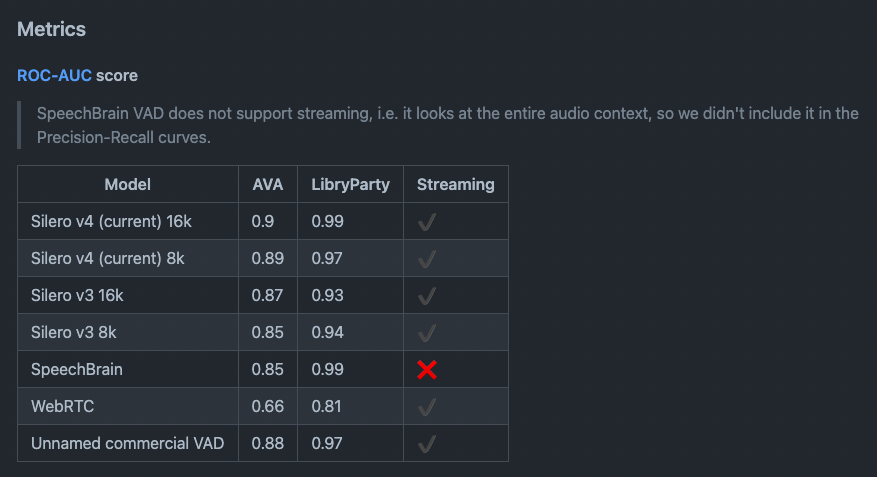
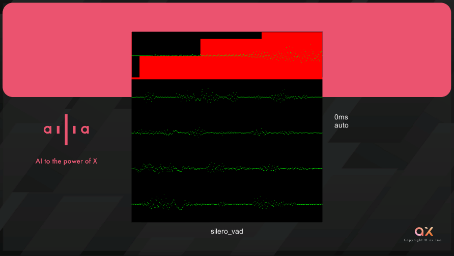

# SileroVAD : 発話区間を検出する機械学習モデル

# SileroVAD : 発話区間を検出する機械学習モデル

[](https://kyakuno.medium.com/?source=post_page---byline--2ad6cf395703---------------------------------------)

[Kazuki Kyakuno](https://kyakuno.medium.com/?source=post_page---byline--2ad6cf395703---------------------------------------)

9 min read

·

Aug 16, 2023

--

Share

[ailia SDK](https://ailia.jp/)で使用できる機械学習モデルである「SileroVAD」のご紹介です。エッジ向け推論フレームワークである[ailia SDK](https://ailia.jp/)と[ailia MODELS](https://github.com/axinc-ai/ailia-models)に公開されている機械学習モデルを使用することで、簡単にAIの機能をアプリケーションに実装することができます。

## SileroVADの概要

SileroVADは発話区間を検出する機械学習モデルです。音声ファイルから無音か有音かを検知するのは意外と難しく、AIを使用しない方法の[webrtc-vad](https://github.com/wiseman/py-webrtcvad)が使用されていましたが、近年はAIベースのSileroVADが広く使われるようになってきています。

Press enter or click to view image in full size



SileroVAD

SileroVADは1.8MBと軽量で、30msのchunkを1ms程度で処理でき高速で、高精度です。また、MITライセンスで使用可能です。

[## GitHub - snakers4/silero-vad: Silero VAD: pre-trained enterprise-grade Voice Activity Detector

### Silero VAD: pre-trained enterprise-grade Voice Activity Detector - GitHub - snakers4/silero-vad: Silero VAD…

github.com](https://github.com/snakers4/silero-vad?source=post_page-----2ad6cf395703---------------------------------------)

特に、音声認識AIであるWhisperは、無音を入れると、「ご清聴ありがとうございました。」などと表示されることが多く、Whisperに入れる前にVADで発話判定を行うのが重要になっています。そのため、SileroVADはfaster-whisperにも導入されています。faster-whisperでは、2秒以上の無音区間を除去します。

[## Feature : Add support for VAD filter · Issue #39 · guillaumekln/faster-whisper

### Thank you for releasing the code since this implementation require less memory than other implementation adding VAD…

github.com](https://github.com/guillaumekln/faster-whisper/issues/39?source=post_page-----2ad6cf395703---------------------------------------)

また、AIとの対話システムを作成する場合も、発話の終了をエッジ側で認識する必要があり、発話の終了を高精度に検知する方法として、SileroVADが使用可能です。

## SileroVADの入出力

SileroVADでは、16kHzのPCM波形を扱います。処理単位のWindow Sizeは1536 sampleで、入力されたPCM波形を1536 sampleのchunkごとにオーバラップせずにSileroVADに供給します。出力値はchunkが無音でない確率値となります。

SileroVADの入力は、(batch, sequence)のPCM、(1)のサンプリングレート、(2, batch, 64)のh、(2, batch, 64)のcです。出力は、(batch, 1)の確率値、(2, batch, 64)のhn、(2, batch, 64)のcnです。

hとcは内部ステートで、最初のchunkは0で初期化、2番目以降のchunkは前回の出力のhnとcnを、今回の入力のhとcに与えます。

テストする音声ファイルを入れた場合、0.3〜2.0secが発話区間とします。16kHzで0.3secは4800 sample、2.0secは32000 sampleになります。

1536 sampleごとの確率値の例は下記のようになります。確率値が高いほど、発話であることを示しています。

> INFO silero-vad.py (100) : 0.0 sec 0.06508361548185349  
> INFO silero-vad.py (100) : 0.096 sec 0.4314267337322235  
> INFO silero-vad.py (100) : 0.192 sec 0.9363511204719543  
> INFO silero-vad.py (100) : 0.288 sec 0.9912925362586975  
> INFO silero-vad.py (100) : 0.384 sec 0.9910984039306641
>
> INFO silero-vad.py (100) : 1.824 sec 0.9369962811470032  
> INFO silero-vad.py (100) : 1.92 sec 0.23795287311077118  
> INFO silero-vad.py (100) : 2.016 sec 0.044181931763887405  
> INFO silero-vad.py (100) : 2.112 sec 0.03219963237643242  
> INFO silero-vad.py (100) : 2.208 sec 0.034886687994003296  
> INFO silero-vad.py (100) : 2.304 sec 0.040618717670440674

SileroVADの標準では、0.5以上の値は発話区間と判定します。

## SileroVADのアーキテクチャ

SileroVADは学習コードは公開されておらず、Pytorchのjitファイルと、ONNXファイルが提供されています。

## Get Kazuki Kyakuno’s stories in your inbox

Join Medium for free to get updates from this writer.

Subscribe

Subscribe

Remember me for faster sign in

ONNXファイルはSubgraphを使った、少し複雑な構成となっています。内部的にはConvとLSTMを使用したモデルになっています。

Press enter or click to view image in full size



ONNXを開くとSubgraphが19個含まれている

Press enter or click to view image in full size



subgraph10の表示

## SileroVADの精度

SileroVADはLibryParty datasetとAVA Spoken Activiti Datasetsで評価されており、WebRTCのVADを大幅に上回る精度を持っています。16kは16kHz、8kは8kHzで推論することを指しています。

Press enter or click to view image in full size



SileroVADの精度

[## Quality Metrics

### Silero VAD: pre-trained enterprise-grade Voice Activity Detector - Quality Metrics · snakers4/silero-vad Wiki

github.com](https://github.com/snakers4/silero-vad/wiki/Quality-Metrics?source=post_page-----2ad6cf395703---------------------------------------#vs-other-available-solutions)

## SileroVADを使用する

### Python

ailia SDKでSileroVADを使用するには、下記のコマンドを使用します。入力した音声ファイルから、無音区間を削除した音声ファイルを作成します。

```
$ python3 sileo-vad.py --input ex_example.wav --output only_speech.wav
```

なお、SileroVADの使用にはailia SDK 1.2.15以降が必要です。

[## ailia-models/audio\_processing/silero-vad at master · axinc-ai/ailia-models

### The collection of pre-trained, state-of-the-art AI models for ailia SDK - ailia-models/audio\_processing/silero-vad at…

github.com](https://github.com/axinc-ai/ailia-models/tree/master/audio_processing/silero-vad?source=post_page-----2ad6cf395703---------------------------------------)

### C++

下記にC++から使用するサンプルがあります。Waveファイルを読み込んで、各セグメントの確率値を計算します。

[## ailia-models-cpp/silero-vad at master · axinc-ai/ailia-models-cpp

### C++ version of ailia models repository. Contribute to axinc-ai/ailia-models-cpp development by creating an account on…

github.com](https://github.com/axinc-ai/ailia-models-cpp/tree/master/silero-vad?source=post_page-----2ad6cf395703---------------------------------------)

### Unity

下記にUnityから使用するサンプルがあります。C#のコードでPCMの各サンプルの確率値を計算します。また、WhisperのWEB APIと連携する際に便利なように、切り出したAudioClipを生成します。

[## ailia-models-unity/Assets/AXIP/AILIA-MODELS/AudioProcessing at master · axinc-ai/ailia-models-unity

### Unity version of ailia models repository. Contribute to axinc-ai/ailia-models-unity development by creating an account…

github.com](https://github.com/axinc-ai/ailia-models-unity/tree/master/Assets/AXIP/AILIA-MODELS/AudioProcessing?source=post_page-----2ad6cf395703---------------------------------------)

一行目の赤が各サンプルの確率値で、値が大きいほど発話である確率が高くなります。1536サンプル単位で確率値が計算されます。

二行目以降はVADで切り出した発話区間です。

Press enter or click to view image in full size



SileroVADの実行例

ax株式会社はAIを実用化する会社として、クロスプラットフォームでGPUを使用した高速な推論を行うことができるailia SDKを開発しています。ax株式会社ではコンサルティングからモデル作成、SDKの提供、AIを利用したアプリ・システム開発、サポートまで、 AIに関するトータルソリューションを提供していますのでお気軽に[お問い合わせ](https://axinc.jp/)ください。