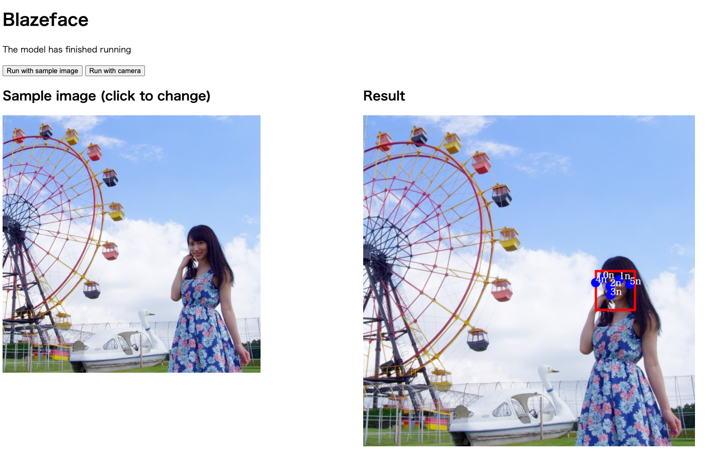

# ailia.js : ブラウザ上で機械学習モデルを実行可能にするライブラリ

# ailia.js : ブラウザ上で機械学習モデルを実行可能にするライブラリ

[](https://kyakuno.medium.com/?source=post_page---byline--bcddf5aed057---------------------------------------)

[Kazuki Kyakuno](https://kyakuno.medium.com/?source=post_page---byline--bcddf5aed057---------------------------------------)

8 min read

·

Aug 23, 2023

--

Share

ブラウザ上で機械学習モデルを推論することができるailia.jsのご紹介です。ailia.jsを使用することで、ブラウザ上で任意の機械学習モデルを実行可能です。

## ailia.jsについて

ailia.jsはブラウザでONNXを推論するためのランタイムです。wasmを使用しており、JavaScriptからailiaの全てのAPIを使用可能です。

Press enter or click to view image in full size


ailia meets web assembly

## ailia.jsのデモ

下記のURLからデモを実行可能です。画像もしくはWEBカメラに対して、顔検出、手検出、物体検出を試すことが可能です。

[## ailia.js Demo

### Edit description

ailia.jp](https://ailia.jp/ailia-js/?source=post_page-----bcddf5aed057---------------------------------------)

Press enter or click to view image in full size



ailia.jsによるブラウザでの顔検出

## ailia.jsのAPI

ailia.jsのAPIの使用方法は下記のページを参照してください。

[## Tutorial: Get Started

### Edit description

axinc-ai.github.io](https://axinc-ai.github.io/ailia-sdk/api/js/en/tutorial-get_started.html?source=post_page-----bcddf5aed057---------------------------------------)

ailia.jsを読み込んだ後、ONNXをダウンロードしてインスタンスを作成し、run APIで推論を実行可能です。

```
import {Ailia} from './ailia.js';  
import {readFileAsync, distinguishModelFiles, readImageData} from './demoUtils.js';  
  
await Ailia.initialize();  
let ailia = new Ailia();  
  
modelfiles.addEventListener('change', async () => {  
    await loadModel();  
    myResult.innerText = '';  
});  
  
async function loadModel() {  
    if (modelFiles.files.length !== 2) {  
       return;  
    }  
  
    let {modelFile, weightsFile} = distinguishModelFiles(modelFiles.files);  
  
    if (modelFile === undefined) {  
        console.log('Error: could not find a model file with the extension .onnx.prototxt');  
        return;  
    }  
    if (weightsFile === undefined) {  
        console.log('Error: could not find a weights file with the extension .onnx');  
        return;  
    }  
  
    console.log(`model file: ${modelFile.name}`);  
    console.log(`weights file: ${weightsFile.name}`);  
  
    let [modelFileContents, weightsFileContents] = await Promise.all([  
        readFileAsync(modelFile),  
        readFileAsync(weightsFile)  
    ]);  
  
    let loadStatus = ailia.loadModelAndWeights(modelFileContents, weightsFileContents);  
    if (loadStatus) {  
        console.log('model files loaded');  
        document.querySelector('button.myButton').removeAttribute("hidden");  
    }  
}  
  
function buttonClicked() {  
    return new Promise((resolve) =>  
        document.querySelector('.myButton').addEventListener('click', () => resolve())  
    );  
}  
  
await buttonClicked();  
console.log('button clicked');  
  
let inputPicturePath = 'testmnist.jpg';  
let inputPicData = await readImageData(inputPicturePath);  
  
let preprocessFactory = function (inputPictureData) {  
    let preprocessingFunc = function (inputBuffers) {  
        for (let y = 0; y<inputPictureData.height; ++y) {  
            const lineOffset = y * inputPictureData.width;  
            for (let x = 0; x<inputPictureData.width; ++x) {  
                let red = inputPictureData.data[(lineOffset + x) * 4];  
                inputBuffers.byIndex[0].buffer.Float32[lineOffset + x] = red - 128;  
            }  
        }  
    };  
    return preprocessingFunc;  
};  
  
let postprocessCb = function (outputBuffers) {  
    let result = [];  
    for (const floatValue of outputBuffers.byIndex[0].buffer.Float32) {  
        result.push(floatValue);  
    }  
    return result;  
};  
  
  
try {  
  
    let result = ailia.run(preprocessFactory(inputPicData), postprocessCb, [[1, 1, inputPicData.width, inputPicData.height]]);  
  
    for (const [index, resultItem] of Object.entries(result)) {  
        console.log(`prediction score of ${index}: ${resultItem}`);  
    }  
  
} catch (e) {  
    console.log(e);  
} finally {  
    ailia.destroy();  
}
```

## ailia.jsのビルド設定

ailia.jsはSIMD無効のailia\_s.wasmと、SIMD有効のailia\_simd\_s.wasmの2バージョンでビルドしています。ailia.jsの中で、自動的にSIMDの有効・無効が切り替わります。

## Get Kazuki Kyakuno’s stories in your inbox

Join Medium for free to get updates from this writer.

Subscribe

Subscribe

Remember me for faster sign in

BlazeFaceの例だと、M2 MacとChromeで、SIMD無効の場合21ms、SIMD有効の場合は8msで推論可能です。

Windows、macOS、AndroidはSIMDが使用可能です。iOSは16.2の段階ではSIMDは使用できません。

ブラウザがSIMDに対応しているかどうかは、下記のコードで判定可能です。このコードは[webassembly-feature](https://unpkg.com/browse/webassembly-feature@1.3.0/lib/index.js)をベースに記述しています。

```
function simd(){  
    const buf = new Uint8Array([0,97,115,109,1,0,0,0,1,6,1,96,1,123,1,123,3,2,1,0,10,10,1,8,0,32,0,32,0,253,44,11]);  
    return WebAssembly.validate(buf);  
}
```

## ブラウザにおけるAI推論の応用例

ブラウザにおけるAI推論は、WebRTCなどのネットワークコミュニケーションにおける、カメラやマイクの前処理や後処理に利用されています。

具体的に、ビデオチャットによる背景切り抜きや、マイクのノイズ除去、アバターチャットにおけるVAD（Voice Activity Detection）などでブラウザでのAI推論が利用されています。

また、ブラウザベースの業務SaaSにおける、顔検知および顔認証、QRコード検知などでもAI推論は活用可能です。

## ailia.jsの評価版

現在、ailia SDK 1.2.15に対応するailia.jsを個別に提供中です。ご興味あるお客様はax株式会社までご連絡ください。また、ailia.jsは、ailia SDK 1.2.16から、ailia SDKの標準パッケージに含まれる予定です。

ax株式会社はAIを実用化する会社として、クロスプラットフォームでGPUを使用した高速な推論を行うことができるailia SDKを開発しています。ax株式会社ではコンサルティングからモデル作成、SDKの提供、AIを利用したアプリ・システム開発、サポートまで、 AIに関するトータルソリューションを提供していますのでお気軽に[お問い合わせ](https://axinc.jp/)ください。