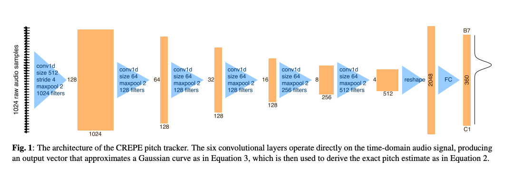
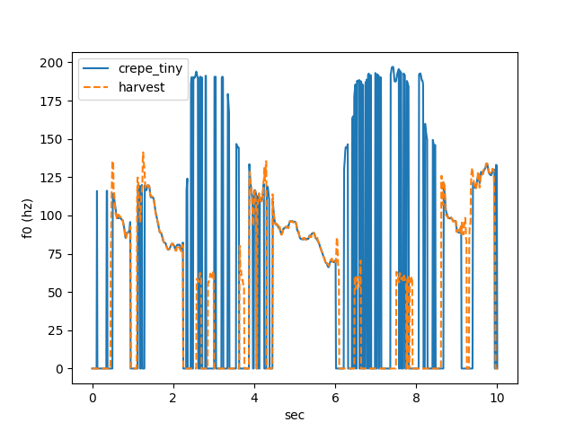

# Crepe : 高精度なピッチ推定を行う機械学習モデル

# Crepe : 高精度なピッチ推定を行う機械学習モデル

[](https://kyakuno.medium.com/?source=post_page---byline--dfb09b5e1f6b---------------------------------------)

[Kazuki Kyakuno](https://kyakuno.medium.com/?source=post_page---byline--dfb09b5e1f6b---------------------------------------)

7 min read

·

Aug 23, 2023

--

Share

[ailia SDK](https://ailia.jp/)で使用できる機械学習モデルである「Crepe」のご紹介です。エッジ向け推論フレームワークである[ailia SDK](https://ailia.jp/)と[ailia MODELS](https://github.com/axinc-ai/ailia-models)に公開されている機械学習モデルを使用することで、簡単にAIの機能をアプリケーションに実装することができます。

## Crepeの概要

Crepeは音声波形から基本周波数（F0）を推定するピッチ推定アルゴリズムです。

ピッチ推定においては、従来、pYINやSWIPEが使用されています。しかし、これらの方法は、雑音環境ではF0を推定するのが難しいという問題がありました。Crepeでは、CNNを使用することで、雑音耐性のあるF0推定機を構築しています。

CrepeはRVCにおける歌唱合成のPitchGuidanceに使用されています。

Press enter or click to view image in full size


Crepeが推定したピッチ（出典：<https://github.com/marl/crepe>）

[## CREPE: A Convolutional Representation for Pitch Estimation

### The task of estimating the fundamental frequency of a monophonic sound recording, also known as pitch tracking, is…

arxiv.org](https://arxiv.org/abs/1802.06182?source=post_page-----dfb09b5e1f6b---------------------------------------)

[## GitHub — marl/crepe: CREPE: A Convolutional REpresentation for Pitch Estimation — pre-trained…

### CREPE: A Convolutional REpresentation for Pitch Estimation — pre-trained model (ICASSP 2018) — GitHub — marl/crepe…

github.com](https://github.com/marl/crepe?source=post_page-----dfb09b5e1f6b---------------------------------------)

## Crepeのアーキテクチャ

Crepeは1024サンプルの16kHzのPCMを入力し、F0の確率値を出力します。F0は360のbinに対数スケールで量子化されており、それぞれの周波数の確率値が出力されます。最終的なF0値は50Hz (bin = 39)〜2006Hz (bin = 308)の範囲で、確率値をベースに選択します。hop\_sizeは10msで、10msごとに1つのF0値を計算可能です。

Crepeはバッチサイズ512で処理します。約5秒分のデータをまとめて処理します。後述する平滑化はこのバッチサイズで行います。

Crepeの前処理では、バッチ単位でPCMから平均を引いた後、標準偏差で除算することで正規化します。正規化したPCMをCrepeのモデルに入力することで、全バッチのF0値を取得します。

Crepeのモデル構造は下記となります。PCM波形に対してConv1Dを繰り返すことで、最終的なF0値を取得します。

Press enter or click to view image in full size



出典：<https://arxiv.org/pdf/1802.06182.pdf>

## Crepeの後処理

Crepeの後処理として、どのF0値を採用するかどうかは、ArgMax、WeightedArgMax、Viterbiの三種類から選択することができます。スムージングした出力を得たい場合は、Viterbiアルゴリズムを使用します。

Viterbiアルゴリズムでは、F0値をバッチ内で平滑化します。Viterbiアルゴリズムは、通常のargmaxに、時系列的に前後の値に近い場合は選択されやすいようにするような動きをします。具体的に、F0値が+-12の範囲で選択されやすいようにするTransition行列を作成し、Confidence値とTransition行列を元にt=0〜batch\_size-1までの各遷移パターンのスコアを計算、最終的に最も高いスコアの遷移をbackwardで辿ることで最終的なF0値の系列を取得します。

## Get Kazuki Kyakuno’s stories in your inbox

Join Medium for free to get updates from this writer.

Subscribe

Subscribe

Remember me for faster sign in

実際のアルゴリズムはlibrosaのViterbiアルゴリズムを参照してください。

[## librosa/librosa/sequence.py at main · librosa/librosa

### Python library for audio and music analysis. Contribute to librosa/librosa development by creating an account on…

github.com](https://github.com/librosa/librosa/blob/main/librosa/sequence.py?source=post_page-----dfb09b5e1f6b---------------------------------------)

Viterbiアルゴリズムを使用せずにArgMaxやWeightedArgMaxでConfidence値を使用した場合、F0値が平滑化されないため、RVCで使用すると、生成された音声に、クリップノイズのような急に高い音が混じります。

RVCでは、F0値と同時に、Periodicityも計算します。Periodicityは平滑化された後のbinのモデル出力の確率値です。Periodicityが0.1未満の場合は無音区間として、F0値に0を入れます。この処理を行わない場合、RVCの出力で無音部分に前の音が伸びたような音が入り、ロボのような声になります。

## Crepeの精度

pYINは2014に考案された、波形の相関を用いた方法です、SWIPEは、パワースペクトルの特徴に着目した方法です。

CrepeにはFullとTinyの2つのモデルがあります。Fullのモデルの場合、pYINアルゴリズムよりも高い性能を獲得しています。

Press enter or click to view image in full size


Crepeの性能（出典：<https://github.com/marl/crepe>）

## Harvestとの比較

pYINやSWIPEよりも高い雑音耐性と推定精度を持つ、[harvest](http://www.isc.meiji.ac.jp/~mmorise/lab/publication/paper/SP2016-62.pdf)のF0値との比較は下記となります。

CrepeのFullモデルでは、harvestと近い出力が得られます。Tinyモデルでは、無音部分のピッチが変動しますが、有音部分はharvestと近い出力が得られます。


Fullモデル



Tinyモデル

## Crepeの使用方法

ailia SDKでPythonからCrepeを使用するには下記のようにします。

```
$ python3 crepe.py --input input.wav
```

[## ailia-models/audio\_processing/crepe at master · axinc-ai/ailia-models

### The collection of pre-trained, state-of-the-art AI models for ailia SDK - ailia-models/audio\_processing/crepe at master…

github.com](https://github.com/axinc-ai/ailia-models/tree/master/audio_processing/crepe?source=post_page-----dfb09b5e1f6b---------------------------------------)

RVC向けにUnity向けの実装も提供しています。

[## ailia-models-unity/Assets/AXIP/AILIA-MODELS/AudioProcessing/AiliaRvcCrepe.cs at master ·…

### Unity version of ailia models repository. Contribute to axinc-ai/ailia-models-unity development by creating an account…

github.com](https://github.com/axinc-ai/ailia-models-unity/blob/master/Assets/AXIP/AILIA-MODELS/AudioProcessing/AiliaRvcCrepe.cs?source=post_page-----dfb09b5e1f6b---------------------------------------)

ax株式会社はAIを実用化する会社として、クロスプラットフォームでGPUを使用した高速な推論を行うことができるailia SDKを開発しています。ax株式会社ではコンサルティングからモデル作成、SDKの提供、AIを利用したアプリ・システム開発、サポートまで、 AIに関するトータルソリューションを提供していますのでお気軽に[お問い合わせ](https://axinc.jp/)ください。