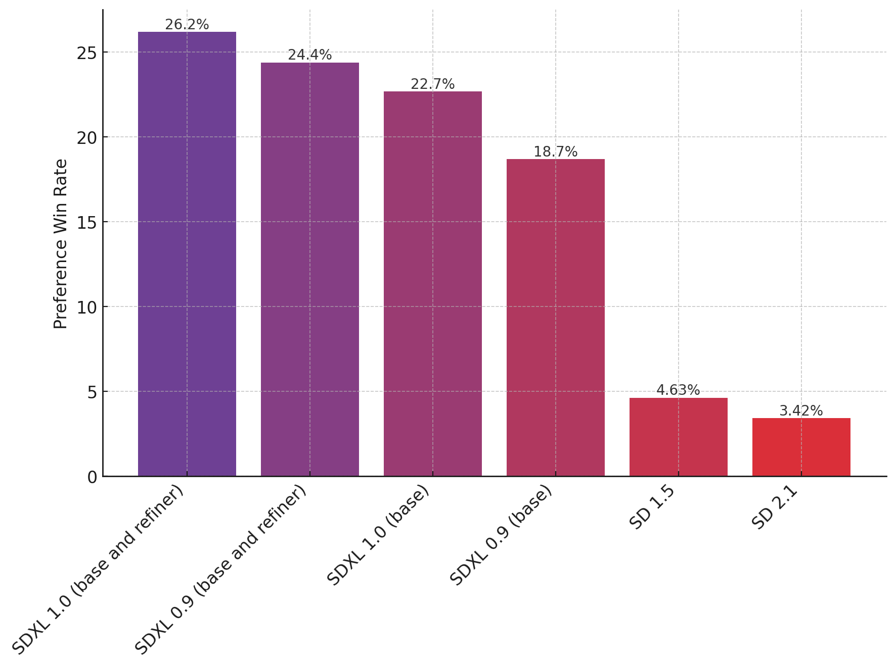
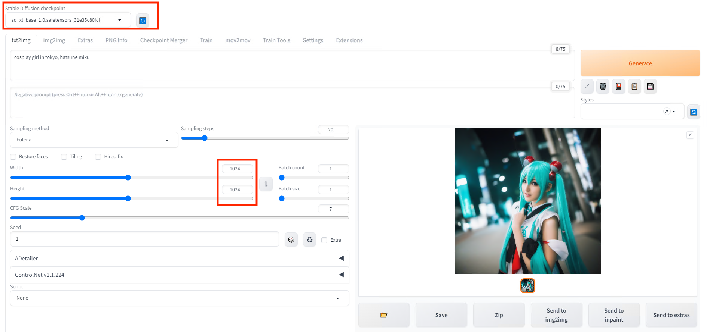
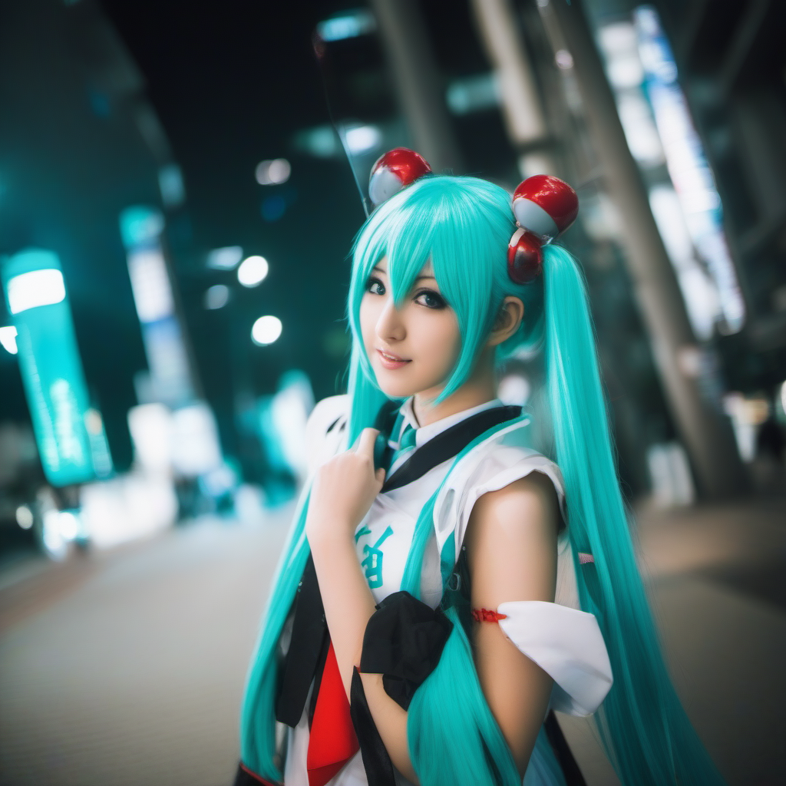
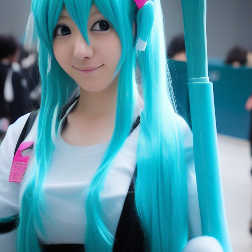
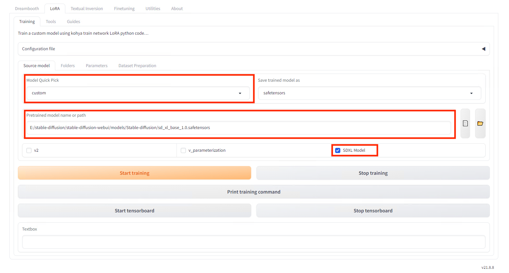
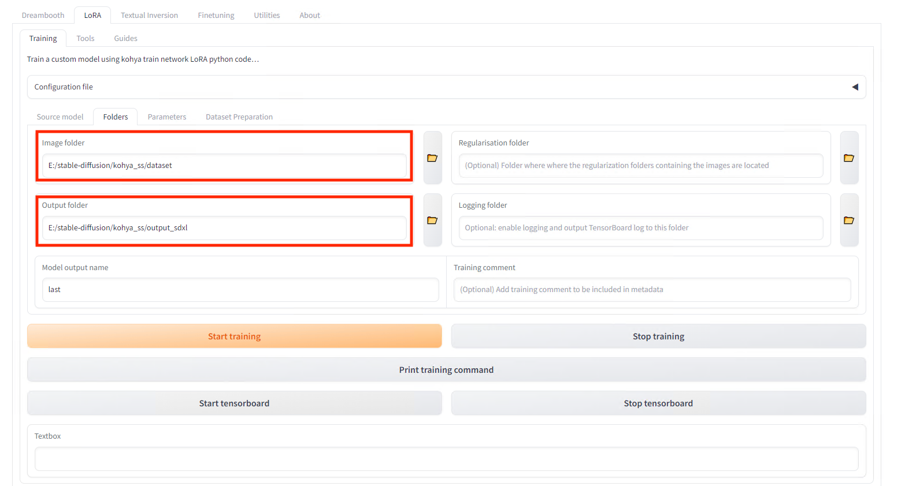
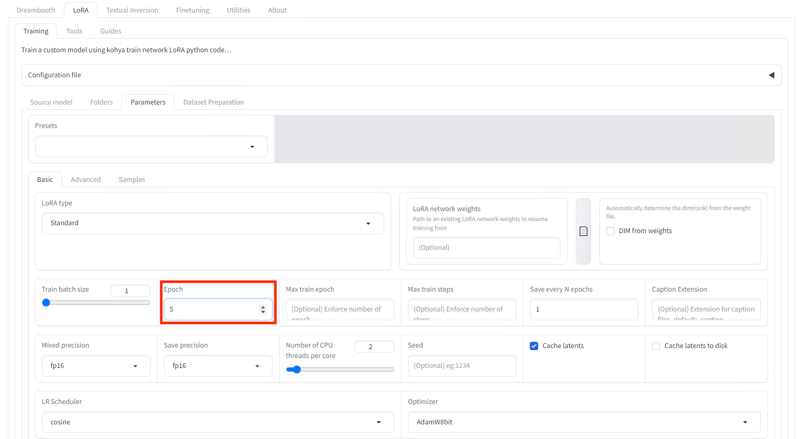
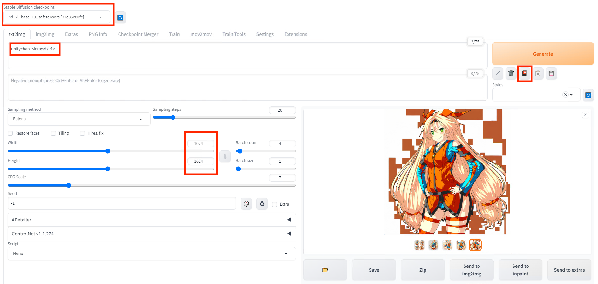
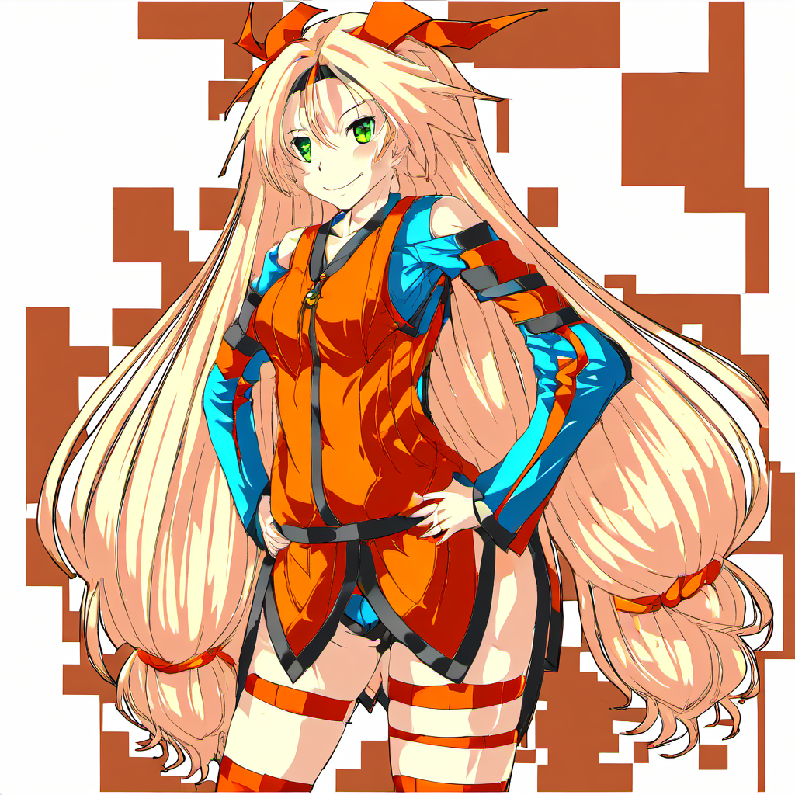

# SDXLで高品質な画像を生成する

# SDXLで高品質な画像を生成する

[Kazuki Kyakuno](https://kyakuno.medium.com/?source=post_page---byline--ed7bca60e426---------------------------------------)

Aug 24, 2023

--

Share

StableDiffusionの最新モデルであるSDXLを使用して高品質な画像を生成する方法を解説します。

## SDXLについて

SDXLはstability.aiが開発した最新の画像生成モデルです。

[## SDXL: Improving Latent Diffusion Models for High-Resolution Image Synthesis

### We present SDXL, a latent diffusion model for text-to-image synthesis. Compared to previous versions of Stable…

arxiv.org](https://arxiv.org/abs/2307.01952?source=post_page-----ed7bca60e426---------------------------------------)

SDXLはStableDiffusion 1.5に比べて3倍のパラメータのUNetバックボーンを使用するとともに、潜在空間の解像度を64x64から128x128に、生成画像の解像度を512x512から1024x1024に拡大しています。

SDXLの仕様（出典：<https://arxiv.org/pdf/2307.01952.pdf>）

SDXLはSD1.5に比べて主観品質が大幅に向上しています。

Press enter or click to view image in full size

SDXLの主観画質評価（出典：<https://huggingface.co/stabilityai/stable-diffusion-xl-base-1.0>）

SDXLはbaseモデルとrefinerモデルの2モデル構成ですが、baseモデルだけでも使用可能です。本記事では、baseモデルのみを使用します。

Press enter or click to view image in full size

SDXLのアーキテクチャ（出典：<https://huggingface.co/stabilityai/stable-diffusion-xl-base-1.0>）

## StableDiffusionWebUIからSDXLを使用する

2023/07/27のStableDiffusionWebUIのmasterでSDXLに対応済みです。StableDiffusionWebUI自体の使い方は[過去のBLOG](https://medium.com/axinc/stablediffusionwebui%E3%81%A7controlnet%E3%82%92%E4%BD%BF%E3%81%A3%E3%81%A6%E4%BB%BB%E6%84%8F%E3%83%9D%E3%83%BC%E3%82%BA%E3%81%AE%E7%94%BB%E5%83%8F%E3%82%92%E7%94%9F%E6%88%90%E3%81%99%E3%82%8B-bc91563cf7f3)を参照してください。SDXLを使用するため、git pullすることで最新版にします。

sd\_xl\_base\_1.0.safetensorsをダウンロードしてmodels/Stable-diffusionに配置します。容量は6.7GBで、StableDiffusion1.5の4.1GBよりも大きくなっています。

[## stabilityai/stable-diffusion-xl-base-1.0 at main

### We're on a journey to advance and democratize artificial intelligence through open source and open science.

huggingface.co](https://huggingface.co/stabilityai/stable-diffusion-xl-base-1.0/tree/main?source=post_page-----ed7bca60e426---------------------------------------)

WebUIのモデルリストからSDXLを選択し、生成解像度を1024に設定、SettingsにVAEを設定していた場合はNoneに設定します。

Press enter or click to view image in full size

プロンプトには「cosplay girl in tokyo, hatsune miku」を使用しました。

生成した画像は下記になります。非常に高品質です。

Press enter or click to view image in full size

SDXLの出力

比較用にStableDiffusion1.5で同じプロンプトで生成した画像は下記となります。

StableDiffusion 1.5の出力

ただし、RTX3080を使用した場合、StableDiffusion 1.5では3秒程度で生成できる画像が、SDXLでは30秒程度必要です。

## Get Kazuki Kyakuno’s stories in your inbox

Join Medium for free to get updates from this writer.

Subscribe

Subscribe

Remember me for faster sign in

なお、StableDifffusionWebUIのdevブランチでは、refinerモデル対応も進んでいます。もう少ししたらrefinerモデルも後処理に使用できるかと思います。

## Koyha’s UIでLoRAを作成する

Kohya’s UIは2023/08/21にdev2ブランチにSDXL対応がマージされています。Kohya’s UI自体の使用方法は[過去のBLOG](https://medium.com/axinc/stablediffusionwebui%E3%81%A8kohyas-gui%E3%81%A7%E7%94%9F%E6%88%90%E3%81%97%E3%81%9Flora%E3%82%92%E4%BD%BF%E3%81%A3%E3%81%A6%E7%89%B9%E5%AE%9A%E3%81%AE%E3%82%AD%E3%83%A3%E3%83%A9%E3%82%AF%E3%82%BF%E3%83%BC%E3%81%AE%E7%94%BB%E5%83%8F%E3%82%92%E7%94%9F%E6%88%90%E3%81%99%E3%82%8B-61382e0dcc51)を参照してください。

Kohya’s UIでSDXLのLoRAを作る方法のチュートリアルは下記の動画になります。

SDXL対応版を使用するため、gitでdev2ブランチに切り替え、venvフォルダを削除した後、setup.batを再実行します。なお、venvフォルダを削除してsetup.batを再実行しない場合、「AttributeError: module ‘tensorflow’ has no attribute ‘io’」というエラーが発生することがあります。

[## AttributeError: module 'tensorflow' has no attribute 'io' · Issue #904 · bmaltais/kohya\_ss

### Just did an update and installed dadaptation and im getting this. I've included the full log from launch. `FINDSTR…

github.com](https://github.com/bmaltais/kohya_ss/issues/904?source=post_page-----ed7bca60e426---------------------------------------)

モデルタイプはCustomを設定し、SDXLのsafetensorを指定し、SDXL Modelにチェックを入れます。

Press enter or click to view image in full size

SDXLのモデルの指定

学習元の画像と、出力先フォルダを指定、Epochsを5に変更し、学習を行います。

Press enter or click to view image in full size

フォルダ指定

Press enter or click to view image in full size

Epochs指定

学習時間は11枚の画像を5Epochで1時間程度です。StableDiffusion1.5だと6分程度なため、学習時間は長くなっています。作成したLoRAのファイルサイズは56MBです。StableDiffusion1.5だと9.3MB程度なため、こちらも大きくなっています。学習時、VRAMは9.8GB使用します。

作成したLoRAをStableDiffusionWebUIのmodels/Loraフォルダにコピーして推論します。

Promptには学習に使用したフォルダ名を入れます。今回は、「unitychan <lora:sdxl:1>」を使用しました。

Press enter or click to view image in full size

画像生成の設定

非常に高品質なUnity Chanが生成できました。

Press enter or click to view image in full size

生成された画像

（© Unity Technologies Japan/UCL）

## まとめ

SDXLを使用して高品質な画像が生成できることを確認しました。また、SDXL向けのLoRAを作成し、特定の絵柄の高品質な画像が生成できることを確認しました。

ax株式会社はAIを実用化する会社として、クロスプラットフォームでGPUを使用した高速な推論を行うことができるailia SDKを開発しています。ax株式会社ではコンサルティングからモデル作成、SDKの提供、AIを利用したアプリ・システム開発、サポートまで、 AIに関するトータルソリューションを提供していますのでお気軽に[お問い合わせ](https://axinc.jp/)ください。