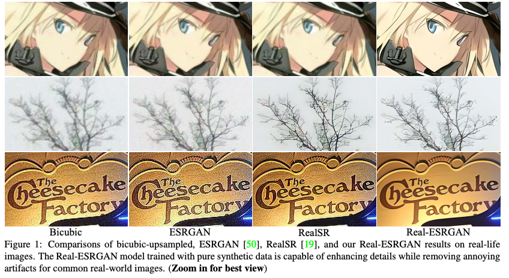
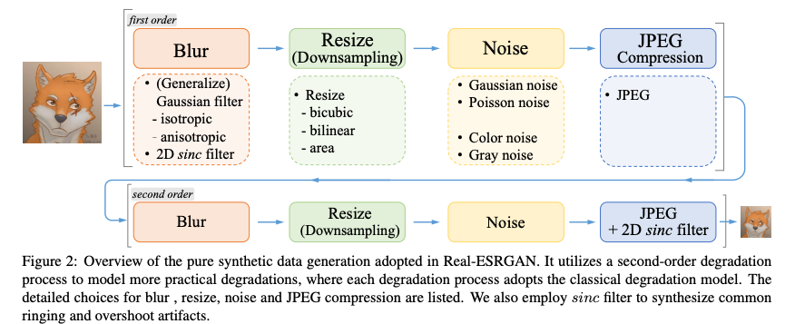
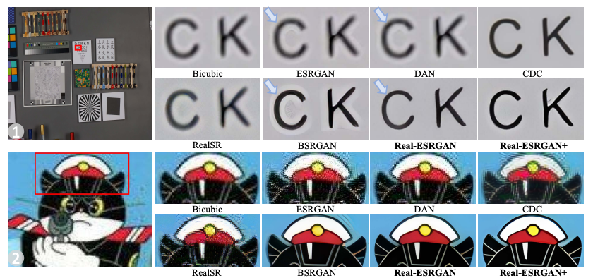

# Real ESRGAN : デノイズを強化した超解像モデル

# Real ESRGAN : デノイズを強化した超解像モデル

[](https://kyakuno.medium.com/?source=post_page---byline--91a434b3683b---------------------------------------)

[Kazuki Kyakuno](https://kyakuno.medium.com/?source=post_page---byline--91a434b3683b---------------------------------------)

7 min read

·

Sep 8, 2023

--

Share

[ailia SDK](https://ailia.jp/)で使用できる機械学習モデルである「Real ESRGAN」のご紹介です。エッジ向け推論フレームワークである[ailia SDK](https://ailia.jp/)と[ailia MODELS](https://github.com/axinc-ai/ailia-models)に公開されている機械学習モデルを使用することで、簡単にAIの機能をアプリケーションに実装することができます。

## Real ESRGANの概要

Real ESRGANは画像を高精度に拡大する超解像モデルです。Real ESRGANはESRGANのアーキテクチャをベースにデータセットとモデルアーキテクチャを改良することで、デノイズ性能を強化しています。画像を高品質に拡大する際に、元画像のノイズを強く除去するため、従来よりも鮮明な画像を取得することが可能です。

Press enter or click to view image in full size



Real ESRGANの画質（出典：<https://arxiv.org/pdf/2107.10833.pdf>）

[## GitHub - xinntao/Real-ESRGAN: Real-ESRGAN aims at developing Practical Algorithms for General…

### Real-ESRGAN aims at developing Practical Algorithms for General Image/Video Restoration. - GitHub …

github.com](https://github.com/xinntao/Real-ESRGAN?source=post_page-----91a434b3683b---------------------------------------)

[## Real-ESRGAN: Training Real-World Blind Super-Resolution with Pure Synthetic Data

### Though many attempts have been made in blind super-resolution to restore low-resolution images with unknown and complex…

arxiv.org](https://arxiv.org/abs/2107.10833?source=post_page-----91a434b3683b---------------------------------------)

## Real ESRGANのアーキテクチャ

インターネット上の画像に超解像を適用しようとした場合、元画像にはノイズが含まれているため、リサイズによるダウンサンプリングの他に、様々なノイズを考慮して、超解像処理を行う必要があります。

ノイズには、ブラーや、一般ノイズ（Gaussian、Poisson、Color、Gray）、JPEG圧縮によるブロッキングノイズやリンギングノイズなどがあります。

従来のESRGANでは、これらのノイズは一回だけ適用されていると仮定していました。しかし、実際のインターネット上の画像は、複数回の圧縮が施されていることが多く、強いノイズへの考慮が不十分でした。

そこで、Real ESRGANでは、データセット作成時のノイズ付与処理を2回行うことで、従来よりも強力なノイズを付与した画像から、元画像を復元することを試みます。また、アニメ画像で発生しやすい輪郭付近のリンギングノイズをシミュレートするため、2D sinc filterを適用し、ランダムな周波数で高周波成分をカットすることで、リンギングノイズを発生させます。

Press enter or click to view image in full size



データセット作成フロー（出典：<https://arxiv.org/pdf/2107.10833.pdf>）

モデルアーキテクチャはESRGANを改良したものを使用します。具体的に、UNetのVGGベースのBackboneを、ResNetのようなSkip Connection付きに変更、また、Batch NormalizationをSpectral Normalizationに変更します。


Real ESRGANのアーキテクチャ（出典：<https://arxiv.org/pdf/2107.10833.pdf>）

縮小前のデータセットとしては、DIV2K、Flickr2K、OutdoorSceneTraningデータセットを使用します。学習パッチの解像度は256x256です。

## Get Kazuki Kyakuno’s stories in your inbox

Join Medium for free to get updates from this writer.

Subscribe

Subscribe

Remember me for faster sign in

学習時のLoss関数としては、L1 loss、Perceptual loss、GAN lossのコンビネーションを使用します。

## Real ESRGANの画質

従来方式のESRGANとReal-ESRGANの比較です。ESRGANは、元画像に含まれる輪郭周辺のリンギングノイズを維持してしまいますが、Real ESRGANはリンギングノイズの除去を行うことができています。これにより、Real ESRGANはよりシャープな印象の画像を生成することが可能です。

Press enter or click to view image in full size



Real ESRGANの画質（出典：<https://arxiv.org/pdf/2107.10833.pdf>）

## Real ESRGANの使用方法

ailia SDKを使用すると、下記のコマンドでReal ESRGANを使用することが可能です。

```
$ python3 real_esrgan.py -i input_anime.jpg -s output.jpg
```

デフォルトでは実写向けのモデルとなっており、-m オプションを付与することでアニメモデルも使用可能です。

```
$ python3 real_esrgan.py -m RealESRGAN_anime -i input_anime.jpg -s output_anime.jpg
```

[## ailia-models/super\_resolution/real-esrgan at master · axinc-ai/ailia-models

### The collection of pre-trained, state-of-the-art AI models for ailia SDK - ailia-models/super\_resolution/real-esrgan at…

github.com](https://github.com/axinc-ai/ailia-models/tree/master/super_resolution/real-esrgan?source=post_page-----91a434b3683b---------------------------------------)

## Real ESRGANをUnityやC#から使用する

Unityから下記のサンプルを使用することで、Real ESRGANを使用することが可能です。

[## ailia-models-unity/Assets/AXIP/AILIA-MODELS/SuperResolution at master · axinc-ai/ailia-models-unity

### Unity version of ailia models repository. Contribute to axinc-ai/ailia-models-unity development by creating an account…

github.com](https://github.com/axinc-ai/ailia-models-unity/tree/master/Assets/AXIP/AILIA-MODELS/SuperResolution?source=post_page-----91a434b3683b---------------------------------------)

また、Visual Studioから下記のサンプルを使用することで、Real ESRGANを使用することが可能です。

[## GitHub - axinc-ai/ailia-csharp: ailia SDK example for Visual Studio C#

### ailia SDK example for Visual Studio C#. Contribute to axinc-ai/ailia-csharp development by creating an account on…

github.com](https://github.com/axinc-ai/ailia-csharp?source=post_page-----91a434b3683b---------------------------------------)

ax株式会社はAIを実用化する会社として、クロスプラットフォームでGPUを使用した高速な推論を行うことができるailia SDKを開発しています。ax株式会社ではコンサルティングからモデル作成、SDKの提供、AIを利用したアプリ・システム開発、サポートまで、 AIに関するトータルソリューションを提供していますのでお気軽に[お問い合わせ](https://axinc.jp/)ください。