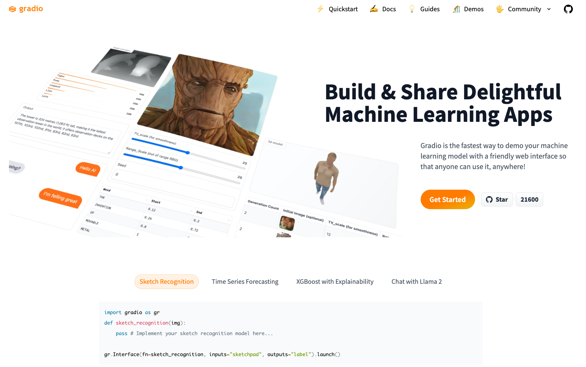
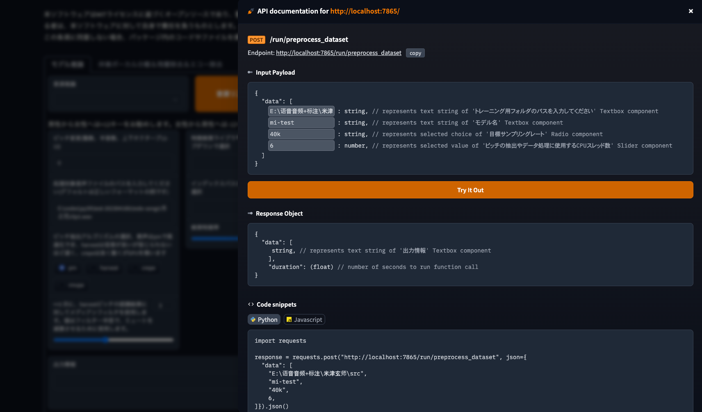

# Gradioで生成されたWEBアプリにAPI経由でアクセスする

# Gradioで生成されたWEBアプリにAPI経由でアクセスする

[](https://kyakuno.medium.com/?source=post_page---byline--2572aa88361a---------------------------------------)

[Kazuki Kyakuno](https://kyakuno.medium.com/?source=post_page---byline--2572aa88361a---------------------------------------)

8 min read

·

Sep 11, 2023

--

Share

Gradioで生成されたWEBアプリにAPI経由でアクセスする方法を解説します。

## Gradioの概要

Gradioは機械学習モデルを簡単にWEBアプリ化することができるフレームワークです。PythonとGradioを使用することで、簡単にローカルサーバを起動することができ、ブラウザから操作することができるUIを生成することが可能です。GradioはRVCなどで使用されています。

Press enter or click to view image in full size



Gradio（出典：<https://www.gradio.app/>）

## GradioのAPI経由でのアクセス

Gradioで作られたWEBページにブラウザでアクセスするのではなく、Rest APIで処理を自動化したい場合があります。そのような場合、GradioにあるAPIの公開機能を使用することが可能です。

[## Sharing Your App

### A Step-by-Step Gradio Tutorial

www.gradio.app](https://www.gradio.app/guides/sharing-your-app?source=post_page-----2572aa88361a---------------------------------------)

通常、Gradioでは、btn.clickなどに関数をbindingします。

```
def preprocess_dataset(trainset_dir, exp_dir, sr, n_p):  
  ...  
  yield log  
  
but1.click(  
preprocess_dataset, [trainset_dir4, exp_dir1, sr2, np7], [info1]  
)
```

この時、clickの引数にapi\_nameを指定すると、公開APIにすることが可能です。

例えば、RVCのpreprocess\_datasetを公開APIにするには下記のように、api\_nameを追加します。

```
def preprocess_dataset(trainset_dir, exp_dir, sr, n_p):  
  ...  
  yield log  
  
but1.click(  
preprocess_dataset, [trainset_dir4, exp_dir1, sr2, np7], [info1], api_name="preprocess_dataset"  
)
```

公開したAPIはhttp://localhost:7865/?view=apiで確認可能です。

Press enter or click to view image in full size



Gradioで公開されたAPIの確認

公開したAPIはREST APIとしてアクセス可能です。引数はjsonで渡し、引数順にdataフィールドに配列で与えます。

```
curl -X POST -H "Content-Type: application/json" --data '{"data":["/Users/kyakuno/Desktop/dataset_min","dataset_min_exp","48k","1"]}' http://localhost:7865/api/preprocess_dataset/
```

GradioでPOSTした内容はキューイングされ、非同期で実行されます。

## GradioのAPIの返値を取得する

GradioのAPIをcurlで実行した場合、非同期で実行されるため、返値を取得することができません。同期的に実行するには、GradioのPython Clientを使用する必要があります。

## Get Kazuki Kyakuno’s stories in your inbox

Join Medium for free to get updates from this writer.

Subscribe

Subscribe

Remember me for faster sign in

Python Clientでは、Web Socketを使用してAPIにアクセスし、結果を非同期で取得することができます。ブロッキングしたい場合は、result APIを呼び出します。

```
from gradio_client import Client  
client = Client(space="abidlabs/en2fr")  
job = client.submit("Hello", api_name="/predict")  # This is not blocking  
job.result()  # This is blocking  
>> Bonjour
```

[## Getting Started With The Python Client

### A Step-by-Step Gradio Tutorial

www.gradio.app](https://www.gradio.app/guides/getting-started-with-the-python-client?source=post_page-----2572aa88361a---------------------------------------)

Gradioにおいて、predict APIは同期的である必要があるように規定されていますが、predict APIでは、クライアントの中で内部的にresult()を呼び出してブロッキングする実装となっており、サーバのAPIとしては非同期で動いています。

そのため、Web Socketを使用せずに結果を取得するようなブロッキングAPIを作成する場合は、GradioのPython ClientをFlaskなどでラップして、ブロッキングAPIを構築することになります。

## Generator Endpointの返値を取得する

Gradio側でyield returnをしているGenerator Endpointの返値を取得する場合、Gradio Clientのjob.doneとjob.outputsを使用します。

```
from gradio_client import Client  
  
client = Client(src="gradio/count_generator")  
job = client.submit(3, api_name="/count")  
while not job.done():  
    time.sleep(0.1)  
job.outputs()  
  
>> ['0', '1', '2']
```

[## Getting Started With The Python Client

### A Step-by-Step Gradio Tutorial

www.gradio.app](https://www.gradio.app/guides/getting-started-with-the-python-client?source=post_page-----2572aa88361a---------------------------------------)

例えば、RVCのpreprocess\_datasetをブロッキングで呼び出すには下記のようにします。

```
RVC_SERVER = "http://localhost:7865"  
client = Client(RVC_SERVER)  
job = client.submit("/Users/kyakuno/Desktop/dataset_min","dataset_min_exp","48k","1", api_name="/preprocess_dataset")  
while not job.done():  
  time.sleep(0.1)  
result = job.outputs()  
print(result)
```

Jobの引数が間違っている場合などは、job.statusのsuccessがFalseになり、job.resultでエラーの内容を確認可能です。

```
RVC_SERVER = "http://localhost:7865"  
client = Client(RVC_SERVER)  
job = client.submit("/Users/kyakuno/Desktop/dataset_min","dataset_min_exp","48k","1", api_name="/preprocess_dataset") status = job.status()  
status = job.status()  
if status.success == False:  
  print(job.result())
```

## ファイルの扱い

GradioのPythonファイルでgr.Fileを指定されている項目は、API出力時、ファイル属性の引数であるとマークされます。ファイル属性の引数の場合、gradio\_clientは、ファイルパスの文字列ではなく、ローカルファイルのバイナリをGradioのサーバにアップロードします。

また、出力としてgrAudioが指定されている項目は、gradio\_clientがローカルファイルに保存し、ローカルファイルのパスが出力されます。

## まとめ

Gradioを使用してWEBアプリにAPIアクセスする方法を解説しました。

## サンプルプロジェクト

RVCの学習スクリプトにAPI経由でアクセスできるようにしたブランチは下記にアップロードしています。

[## GitHub - axinc-ai/Retrieval-based-Voice-Conversion-WebUI at ax/api

### Voice data <= 10 mins can also be used to train a good VC model! - GitHub …

github.com](https://github.com/axinc-ai/Retrieval-based-Voice-Conversion-WebUI/tree/ax/api?source=post_page-----2572aa88361a---------------------------------------)

ax株式会社はAIを実用化する会社として、クロスプラットフォームでGPUを使用した高速な推論を行うことができるailia SDKを開発しています。ax株式会社ではコンサルティングからモデル作成、SDKの提供、AIを利用したアプリ・システム開発、サポートまで、 AIに関するトータルソリューションを提供していますのでお気軽に[お問い合わせ](https://axinc.jp/)ください。