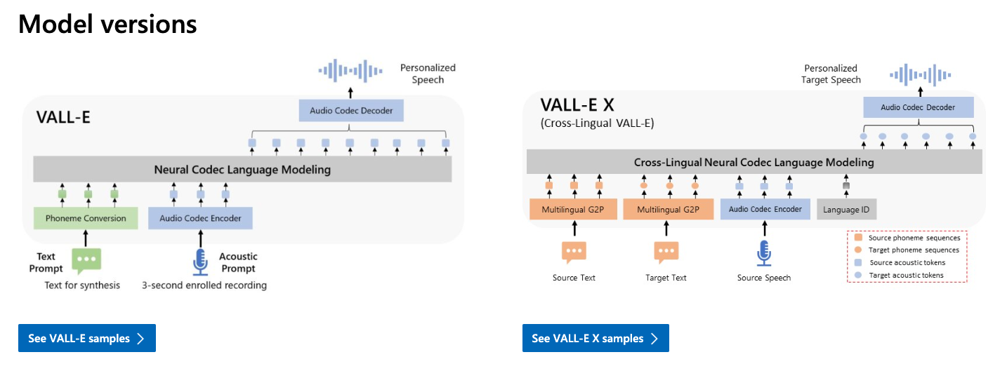
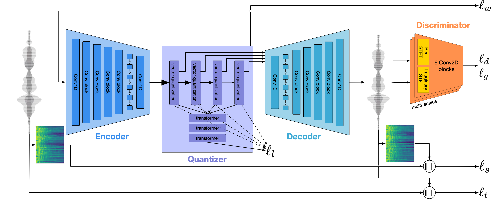

# VALL-E-X : 再学習不要で声質を変更できる音声合成モデル

# **VALL-E-X : 再学習不要で声質を変更できる音声合成モデル**

[](https://kyakuno.medium.com/?source=post_page---byline--977efc19ac84---------------------------------------)

[Kazuki Kyakuno](https://kyakuno.medium.com/?source=post_page---byline--977efc19ac84---------------------------------------)

15 min read

·

Sep 19, 2023

--

1

Share

再学習不要で声質を変更できる音声合成モデルであるVALL-E-Xのご紹介です。VALL-E-Xを使用することで数秒の音声から同じ声質の音声合成が可能になります。

## VALLE-E-Xの概要

VALL-E-XはMicrosoftが開発した音声合成モデルのOSS実装です。Microsoftのものは論文は公開されていますが、ソースコードと学習済みモデルはMicrosoftから公開されていないため、非公式の実装となっています。単一言語の音声合成モデルのVALL-Eを、多言語対応した音声合成モデルがVALL-E-Xとなります。

Press enter or click to view image in full size



VALL-EとVALL-E-X（出典：<https://www.microsoft.com/en-us/research/project/vall-e-x/>）

[## GitHub - Plachtaa/VALL-E-X: An open source implementation of Microsoft's VALL-E X zero-shot TTS…

### An open source implementation of Microsoft's VALL-E X zero-shot TTS model. Demo is available in…

github.com](https://github.com/Plachtaa/VALL-E-X?source=post_page-----977efc19ac84---------------------------------------)

[## Speak Foreign Languages with Your Own Voice: Cross-Lingual Neural Codec Language Modeling

### We propose a cross-lingual neural codec language model, VALL-E X, for cross-lingual speech synthesis. Specifically, we…

arxiv.org](https://arxiv.org/abs/2303.03926?source=post_page-----977efc19ac84---------------------------------------)

## VALL-E-Xの特徴

VALL-E-Xは英語、中国語、日本語のテキストからの音声合成が可能です。また、任意の数秒の音声ファイルから、オーディオプロンプトを取得して、その音声に似せた声質と感情で音声合成が可能です。

従来、ボイスチェンジャーを行う場合、RVCが利用されており、RVCでは事前に、10分程度の音声を使用した学習が必要でした。VALL-E-Xでは学習不要で、数秒の音声のみで声質の変更が可能です。

RVCは音声to音声のモデルであり、ゲームのライブチャットなどに使用可能です。

VALL-E-Xはテキストto音声のモデルであり、音声to音声を行う場合はWhisperなどで音声をテキスト化した後、音声合成をする形になります。

VALL-E-Xに最も最適なのは言語変換です。例えば、英語で喋っている文章と音声が与えられた場合、センテンスごとに同じイントネーションで日本語で喋っている音声を出力可能です。

実際の合成音声のデモです。ページ末尾の日本語の声質の入力による、英語の音声合成の結果が分かりやすいです。元音声の声質に加えて、感情も反映できていることがわかります。

[## VALL-E

### VALL-E X can synthesize personalized speech in another language for a monolingual speaker. Taking the phoneme sequences…

plachtaa.github.io](https://plachtaa.github.io/?source=post_page-----977efc19ac84---------------------------------------)

## VALL-E-Xのアーキテクチャ

### VALL-E-Xの背景技術

VALL-E-XはMetaの開発した音声合成アルゴリズムの[AudioGen](https://audiocraft.metademolab.com/audiogen.html)と、Googleの開発した[AudioLM](https://google-research.github.io/seanet/audiolm/examples/)をベースとしています。

AudioGenは、Audio Encoder、Text Encoder、Transformer Encoder、Audio Decoderの4つのモデルで構成されており、Audio DecoderはAuto Regressive Audio Generation Modelを使用して、テキストからの音声合成を行います。

AudioLMは、入力された音声をw2v-BERTを使用してSemantic Tokenに変換した後、SoundStream（Encodecと同等のモデル）を使用してAcoustic Tokenに変換し、入力された音声の続きの音声を生成します。

VALL-E-Xはこれらの近代的なNetural Codec Language Modelを使用します。音声をEncodecでトークン列に変換することで、自然言語処理のSeq2Seqの枠組みで音声合成を扱っています。

### VALL-E-Xのアーキテクチャ

VALL-E-Xのアーキテクチャは下記となります。合成対象のテキストと、声質のためのターゲットテキストと音声ファイルを与えます。テキストはG2Pによって音素に変換され、トークン化されます。これらのトークンをまとめて、2つのTransformer（AR、NAR）で処理した後、最後にトークンからニューラルボコーダで音声波形を出力します。

Press enter or click to view image in full size


VALL-E-Xのアーキテクチャ（出典：<https://arxiv.org/abs/2303.03926>）

考え方としては、Seq2Seq2で入力テキストから続きのテキストを生成するのと同じ構成になります。声質のテキスト、音声合成したいテキスト、声質の音声から構成される入力トークン列から、続きの音声のトークン列を出力し、トークン列を音声波形に戻す形になります。このように、音声をトークン化することで、音声をテキストのように扱え、テキストと同じ枠組みで音声を生成することが可能になっています。

デコーダでは、Auto Regressive Audio Generation Modelを使用して、トークンをステップごとに生成し、次にNon Auto Regressive Audio Generation Modelを使用してトークンをまとめて処理します。

## Get Kazuki Kyakuno’s stories in your inbox

Join Medium for free to get updates from this writer.

Subscribe

Subscribe

Remember me for faster sign in

SourceText（音声合成テキスト）であるS^s、TargetText（音声ファイルのTranscript）であるS^t、Source SpeechであるA^s\_1を入力として、AR Decoderで中間表現のA^t\_1を生成します。次に、S^t、A^s、A^t\_1を入力として、NAR Decoderで最終的な中間表現のA^t\_2〜8を計算します。

Press enter or click to view image in full size


ARとNAR（出典：<https://arxiv.org/abs/2303.03926>）

中間表現1から中間表現2〜8を生成するのは、Encodecの中間表現がQuantizerによって多層表現されるためです。

Press enter or click to view image in full size



EncodecのQuantizer（出典：<https://github.com/facebookresearch/encodec>）

最後にVocosを使用してトークンからistftの入力に変換し、istftによって音声波形に変換します。

### VALL-E-Xの中間表現

従来の音声合成モデルでは、中間表現としてMel Spectrogramを使用していましたが、VALL-E-Xでは、中間表現としてMetaの開発した音声圧縮技術であるEncodecのトークンを使用します。デコーダでは、Encodecのトークンから、Vocosによってistftの入力値に直接的に変換します。トークンをEmbeddingしたEncodecの潜在表現の次元数は1024です。

Press enter or click to view image in full size


VALL-E-Xの特徴（出典：<https://arxiv.org/abs/2303.03926>）

### VALL-E-Xのテキストトークン

テキストからテキストトークンの取得には、OpenJtalkを使用したルールベースのアルゴリズムで音素変換をした上で、BPEでトークナイズしています。音素変換では、pyopenjtalk.extract\_fullcontextで取得したフルコンテキストをベースに、アクセント記号を↑と↓に、chとshとclをそれぞれ中国語の該当記号に変換します。テキストに対してG2Pを適用した場合の変換例は下記となります。

```
G2P Input 水をマレーシアから買わなくてはならないのです  
G2P Output mi↑zɯo ma↑ɾe↓eʃiakaɾa ka↑wanakɯ*tewa na↑ɾa↓nai no↑de↓sɯ*  
G2P Input 音声合成のテストを行なっています。  
G2P Output o↑Nseego↓oseeno te↓sɯ*too o↑konat#te i↑ma↓sɯ*.
```

これをBPEでトークナイズとすると下記のようになります。BPEではあるのですが、トークナイズに使用するbpe\_69.jsonのmergesが空配列となっているため、実際はvocabに応じて1文字ずつ、トークンに変換する形となります。

```
Input o↑Nseego↓oseeno te↓sɯ*too o↑konat#te i↑ma↓sɯ*.  
Tokens [[31. 67. 13. 33. 21. 21. 23. 31. 69. 31. 33. 21. 21. 30. 31. 16. 34. 21.  69. 33. 53.  7. 34. 31. 31. 16. 31. 67. 27. 31. 30. 18. 34.  6. 34. 21.  16. 25. 67. 29. 18. 69. 33. 53.  7. 10.]]
```

このトークン列をText Embeddingすると、(1, num\_sequence, 1024)のベクトルになります。

### VALL-E-Xのオーディオプロンプト

入力音声からオーディオプロンプトの取得には、Encodecのエンコーダを使用します。

### VALL-E-Xの位置埋め込み

位置受け込みには正弦波を使用します。正弦波には学習パラメータであるalphaが一つ存在します。

### VALL-E-Xのサンプリング

ARDecoderでは、トークンのLogitsからArgMaxではなく[torch.multinomial](https://pytorch.org/docs/stable/generated/torch.multinomial.html)でサンプリングします。troch.multinomialは確率分布に応じて乱数を用いてトークンを決定する手法です。

例えば、トークン1が0.6、トークン2が0.4だった場合、ArgMaxでは常にトークン1が選択されますが、torch.multinomialでは確率的に選択するため、60%の確率でトークン1、40%の確率でトークンで2になります。

しかし、そのまま用いると、確率が極めて低いシンボルが選択される場合があるため、前処理としてtop\_kフィルタリングを行います。VALL-E-Xではtop\_kフィルタリングはデフォルト値-100で無効になっていますが、generation.pyのinferenceの引数に明示的に値を設定すると使用可能です。

### kv\_cacheによる高速化

VALL-E-Xでは、ARDecoderのTransformerにkv\_cacheを用いた高速化を使用しています。

kv\_cacheを使用しないTransformerは過去N個のトークンを入力して次のトークンを出力しますが、毎回、過去N個のトークンをEmbeddingする必要があります。

そこで、毎回計算するのではなく、過去N個のEmbedding後のkvをキャッシュしておき、入力には過去1個のトークンだけを入れるようにしたのがkv\_cacheです。

これによりTransformerの動作が高速になっています。

[## Speeding up the GPT — KV cache

### The common optimization trick for speeding up transformer inference is KV caching 1 2. This technique is so prominent…

www.dipkumar.dev](https://www.dipkumar.dev/becoming-the-unbeatable/posts/gpt-kvcache/?source=post_page-----977efc19ac84---------------------------------------)

### VALL-E-Xのモデルサイズ

ダウンロードされるweightは下記となります。whisperはオーディオプロンプトを計算するための音素を取得するために使用されます。

・vallex 1.48GB  
・encodec\_24khz 93.2MB  
・vocos 40.4MB  
・whisper medium 1.42GB

## PytorchからVALL-E-Xを使用する

それては、実際にPytorchを使用してVALL-E-Xを動作させてみます。

リポジトリをCloneします。

```
git clone git@github.com:Plachtaa/VALL-E-X.git  
cd VALL-E-X  
pip3 install -r requirements.txt
```

下記のスクリプトで、JSUTのBASIC5000\_0001.wavからオーディオプロンプトを計算し、指定したテキストの日本語音声を出力することが可能です。

```
# generate audio embedding  
from utils.prompt_making import make_prompt  
model_name="jsut"  
make_prompt(name=model_name, audio_prompt_path="BASIC5000_0001.wav")  
  
# generate audio  
from utils.generation import SAMPLE_RATE, generate_audio, preload_models  
from scipy.io.wavfile import write as write_wav  
  
preload_models()  
  
text_prompt = """  
音声合成のテストを行なっています。  
"""  
audio_array = generate_audio(text_prompt, prompt=model_name)  
  
write_wav(model_name+"_cloned.wav", SAMPLE_RATE, audio_array)
```

make\_promptでは入力音声に対してtokenize\_audioが実行され、Encodecのエンコーダが実行されます。また、Whisperでテキストが生成され、生成されたテキストはtext\_promptとして保存されます。generate\_audioでは、生成したいテキストプロンプトと、声色の音声のオーディオプロンプト、声色の音声のテキストプロンプトを入力として、音声合成を行います。

VALL-E-XはRVCとは異なり、短い音声の特徴をそのまま反映します。そのため、感情やイントネーション別に、何種類かオーディオプロンプトを用意しておいて切り替えることが望ましいかもしれません。

## ailia SDKからVALL-E-Xを使用する

ailia SDK 1.2.15以降を使用することでONNX経由でVALL-E-Xを実行可能です。

[## ailia-models/audio\_processing/vall-e-x at master · axinc-ai/ailia-models

### The collection of pre-trained, state-of-the-art AI models for ailia SDK - ailia-models/audio\_processing/vall-e-x at…

github.com](https://github.com/axinc-ai/ailia-models/tree/master/audio_processing/vall-e-x?source=post_page-----977efc19ac84---------------------------------------)

下記のコマンドで音声合成が可能です。現状、macOSではGPUよりもBLASの方が高速に動作するため、必要に応じて-e 1を付与してBLASで実行してください。

```
python3 vall-e-x.py -i "音声合成のテストを行なっています。" -e 1
```

任意の声色を使用するには、audioオプションに音声ファイルを、transcriptオプションに音声ファイルの書き起こしを入力します。音声ファイルの書き起こしは、必要に応じてWhisperなどで生成してください。

```
python3 vall-e-x.py -i "音声合成のテストを行なっています。" --audio BASIC5000_0001.wav --transcript "水をマレーシアから買わなくてはならないのです" -e 1
```

ax株式会社はAIを実用化する会社として、クロスプラットフォームでGPUを使用した高速な推論を行うことができるailia SDKを開発しています。ax株式会社ではコンサルティングからモデル作成、SDKの提供、AIを利用したアプリ・システム開発、サポートまで、 AIに関するトータルソリューションを提供していますのでお気軽に[お問い合わせ](https://axinc.jp/)ください。