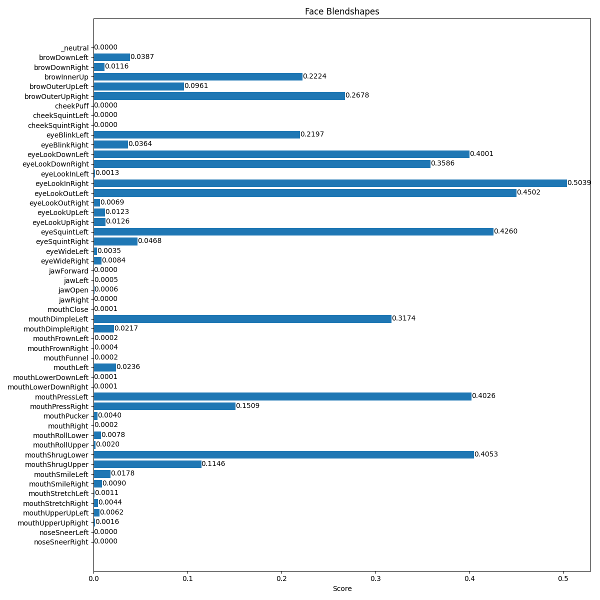
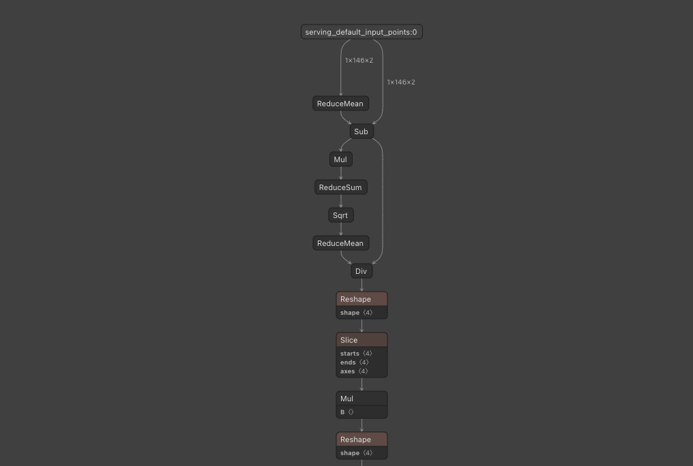

# FaceMeshV2 : BlendShapeも計算可能な顔のキーポイント検出モデル

# FaceMeshV2 : BlendShapeも計算可能な顔のキーポイント検出モデル

[](https://kyakuno.medium.com/?source=post_page---byline--3198898dccdd---------------------------------------)

[Kazuki Kyakuno](https://kyakuno.medium.com/?source=post_page---byline--3198898dccdd---------------------------------------)

8 min read

·

Oct 2, 2023

--

Share

BlendShapeも計算可能な機械学習モデルであるFaceMeshV2のご紹介です。FaceMeshV2を使用することで、顔画像からキーポイントとBlendShapeを計算可能です。

## FaceMeshV2の概要

FaceMeshV2はGoogleの開発した顔画像からキーポイントを検出するモデルです。2023年3月24日にリリースのMediaPipe v0.9.2.1から導入されました。FaceMeshV2を使用することで、従来のFaceMeshV1よりも高精度なキーポイントを取得可能です。また、新たにBlendShapeを取得可能になりました。

Press enter or click to view image in full size


出典：<https://developers.google.com/mediapipe/solutions/vision/face_landmarker>

[## Face landmark detection guide | MediaPipe | Google for Developers

### The MediaPipe Face Landmarker task lets you detect face landmarks and facial expressions in images and videos. You can…

developers.google.com](https://developers.google.com/mediapipe/solutions/vision/face_landmarker?source=post_page-----3198898dccdd---------------------------------------)

## FaceMeshV2の実行例

FaceMeshV2の実行例です。入力解像度の拡張により顔のキーポイントが従来より正確になり、さらに目のIrisに関するキーポイントが追加されました。また、BlendShapeのパラメータとして、瞬きしているか、口を開いているかなどを取得可能になりました。


入力画像


出力画像

Press enter or click to view image in full size



BlendShapeの出力

## FaceMeshV2のアーキテクチャ

FaceMeshV1では192x192x3の画像を入力しますが、FaceMeshV2では256x256x3の画像を入力します。また、FaceMeshV1では468だったキーポイントがFaceMeshV2では478に増加しています。追加されたのは目に関するキーポイントで、新たにLEFT\_IRISとRIGHT\_IRISが追加されています。

FaceMeshV1では、画像を+-1.0にスケーリングしますが、FaceMeshV2では0–1.0にスケーリングしています。

FaceMeshV2の出力フォーマットはFaceMeshV1と同様で、各キーポイントごとに(x,y,z)が出力されます。

## FaceMeshV2のBlendShape

FaceMeshV2ではBlendShapeを計算するモデルが追加されています。検知可能な内容は下記の52種類で、それぞれ0–1の確率値が格納されます。

```
  public static string [] BlendshapeLabels = {  
   "_neutral",  
   "browDownLeft",  
   "browDownRight",  
   "browInnerUp",  
   "browOuterUpLeft",  
   "browOuterUpRight",  
   "cheekPuff",  
   "cheekSquintLeft",  
   "cheekSquintRight",  
   "eyeBlinkLeft",  
   "eyeBlinkRight",  
   "eyeLookDownLeft",  
   "eyeLookDownRight",  
   "eyeLookInLeft",  
   "eyeLookInRight",  
   "eyeLookOutLeft",  
   "eyeLookOutRight",  
   "eyeLookUpLeft",  
   "eyeLookUpRight",  
   "eyeSquintLeft",  
   "eyeSquintRight",  
   "eyeWideLeft",  
   "eyeWideRight",  
   "jawForward",  
   "jawLeft",  
   "jawOpen",  
   "jawRight",  
   "mouthClose",  
   "mouthDimpleLeft",  
   "mouthDimpleRight",  
   "mouthFrownLeft",  
   "mouthFrownRight",  
   "mouthFunnel",  
   "mouthLeft",  
   "mouthLowerDownLeft",  
   "mouthLowerDownRight",  
   "mouthPressLeft",  
   "mouthPressRight",  
   "mouthPucker",  
   "mouthRight",  
   "mouthRollLower",  
   "mouthRollUpper",  
   "mouthShrugLower",  
   "mouthShrugUpper",  
   "mouthSmileLeft",  
   "mouthSmileRight",  
   "mouthStretchLeft",  
   "mouthStretchRight",  
   "mouthUpperUpLeft",  
   "mouthUpperUpRight",  
   "noseSneerLeft",  
   "noseSneerRight"  
  };
```

BlendShapeへの入力は、FaceMeshの出力を画像空間にラスタライズした(x,y)座標です。478点のうち、146点を入力します。zは使用しません。

## Get Kazuki Kyakuno’s stories in your inbox

Join Medium for free to get updates from this writer.

Subscribe

Subscribe

Remember me for faster sign in

BlendShapeのモデルには、最初に平均除去と正規化が含まれています。ここで、ピクセル座標から内部座標への変換が行われ、ラスタライズした後の画素を入力しても問題なく動作するようになっています。

Press enter or click to view image in full size



## MediaPipeからFaceMeshV2を使用する

MediaPipeからFaceMeshV2を使用するには、下記のColabを使用します。face\_landmarker\_v2\_with\_blendshapes.taskをダウンロードした上で、base\_optionにface\_landmarker\_v2\_with\_blendshapes.taskを与え、output\_face\_blendshapes=Trueにすると、BlendShapeを取得可能です。

[## mediapipe/examples/face\_landmarker/python/[MediaPipe\_Python\_Tasks]\_Face\_Landmarker.ipynb at main ·…

### Contribute to googlesamples/mediapipe development by creating an account on GitHub.

github.com](https://github.com/googlesamples/mediapipe/blob/main/examples/face_landmarker/python/%5BMediaPipe_Python_Tasks%5D_Face_Landmarker.ipynb?source=post_page-----3198898dccdd---------------------------------------)

## ailia SDKからFaceMeshV2を使用する

ailia SDKからFaceMeshV2を使用するには、下記のコマンドを使用します。

```
$ python3 facemesh_v2.py --input input.jpg
```

BlendShapeの計算を行う場合は、 — blendshapeオプションを付与します。

```
$ python3 facemesh_v2.py --input input.jpg --blendshape
```

[## ailia-models/face\_recognition/facemesh\_v2 at master · axinc-ai/ailia-models

### The collection of pre-trained, state-of-the-art AI models for ailia SDK - ailia-models/face\_recognition/facemesh\_v2 at…

github.com](https://github.com/axinc-ai/ailia-models/tree/master/face_recognition/facemesh_v2?source=post_page-----3198898dccdd---------------------------------------)

## UnityからFaceMeshV2を使用する

下記にUnityとailia SDKでFaceMeshV2を使用するサンプルがあります。

[## ailia-models-unity/Assets/AXIP/AILIA-MODELS/FaceDetection at master · axinc-ai/ailia-models-unity

### Unity version of ailia models repository. Contribute to axinc-ai/ailia-models-unity development by creating an account…

github.com](https://github.com/axinc-ai/ailia-models-unity/tree/master/Assets/AXIP/AILIA-MODELS/FaceDetection?source=post_page-----3198898dccdd---------------------------------------)

Press enter or click to view image in full size


UnityからFaceMeshV2を実行した例

ax株式会社はAIを実用化する会社として、クロスプラットフォームでGPUを使用した高速な推論を行うことができるailia SDKを開発しています。ax株式会社ではコンサルティングからモデル作成、SDKの提供、AIを利用したアプリ・システム開発、サポートまで、 AIに関するトータルソリューションを提供していますのでお気軽に[お問い合わせ](https://axinc.jp/)ください。