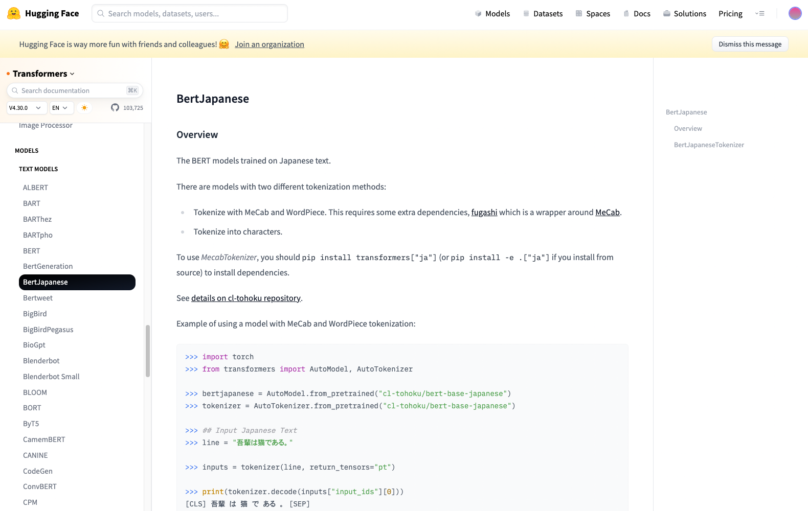

# BertJapaneseTokenizer : 日本語BERT向けトークナイザ

# BertJapaneseTokenizer : 日本語BERT向けトークナイザ

[](https://kyakuno.medium.com/?source=post_page---byline--7b54120aa245---------------------------------------)

[Kazuki Kyakuno](https://kyakuno.medium.com/?source=post_page---byline--7b54120aa245---------------------------------------)

13 min read

·

Jun 14, 2023

--

Share

東北大学の日本語BERTで使用されているBertJapaneseTokenizerのアルゴリズムを解説します。

## 日本語向けのトークナイズ処理の概要

BERTで日本語を処理する場合、日本語のテキストを単語に分割し、AIが扱えるトークンIDに変換する必要があります。

テキストを単語分割する際、英語の場合は、ホワイトスペースで単語分割が可能です。しかし、日本語は単語と単語が連続して記載されるため、単純な処理では単語分割ができません。

そのため、東北大学の日本語BERTで使用されているBertJapaneseTokenizerでは、Mecabを使用した形態素解析を行なって単語に分割した後、WordPieceもしくはCharacterでサブワード分割し、トークン番号に変換しています。

Press enter or click to view image in full size



Transformersに統合されている東北大学の日本語Bert

## トークナイズ方法の定義

Transformersの各モデルがどのようにトークナイズしているかどうかは、config.jsonとtokenizer\_config.jsonに記載されています。

[## cl-tohoku/bert-base-japanese-whole-word-masking at main

### We're on a journey to advance and democratize artificial intelligence through open source and open science.

huggingface.co](https://huggingface.co/cl-tohoku/bert-base-japanese-whole-word-masking/tree/main?source=post_page-----7b54120aa245---------------------------------------)

cl-tohoku/bert-base-japanese-whole-word-maskingでは、tokenizer\_classとしてBertJapaneseTokenizerが使用されており、word\_tokenizer\_typeにmecab、subword\_tokenizer\_typeにwordpieceが指定されています。

[## cl-tohoku/bert-base-japanese-char-whole-word-masking at main

### We're on a journey to advance and democratize artificial intelligence through open source and open science.

huggingface.co](https://huggingface.co/cl-tohoku/bert-base-japanese-char-whole-word-masking/tree/main?source=post_page-----7b54120aa245---------------------------------------)

cl-tohoku/bert-base-japanese-char-whole-word-maskingでは、tokenizer\_classとしてBertJapaneseTokenizerが使用されており、word\_tokenizer\_typeにmecab、subword\_tokenizer\_typeにcharacterが指定されています。

## Word Tokenizer

BertJapaneseTokenizerは、最初に、日本語のテキストを形態素解析し、単語に分割します。形態素解析にはMecabを使用しています。Mecabは日本語向けの形態素解析ソフトウェアです。MecabのCのAPIを使用するサンプルは下記にあります。

[## mecab/example.c at master · AaronZhangL/mecab

### Yet another Japanese morphological analyzer. Contribute to AaronZhangL/mecab development by creating an account on…

github.com](https://github.com/AaronZhangL/mecab/blob/master/mecab/example/example.c?source=post_page-----7b54120aa245---------------------------------------)

「太郎は次郎が持っている本を花子に渡した。」という文章をMecabに与えると、以下のような出力を得ることができます。一番左が、分割された単語です。

```
太郎    名詞,固有名詞,人名,名,*,*,タロウ,タロウ,太郎,タロー,太郎,タロー,固,*,*,*,*,タロウ,タロウ,タロウ,タロウ,*,*,1,*,*  
は      助詞,係助詞,*,*,*,*,ハ,は,は,ワ,は,ワ,和,*,*,*,*,ハ,ハ,ハ,ハ,*,*,*,"動詞%F2@0,名詞%F1,形容詞%F2@-1",*  
次郎    名詞,固有名詞,人名,名,*,*,ジロウ,ジロウ,次郎,ジロー,次郎,ジロー,固,*,*,*,*,ジロウ,ジロウ,ジロウ,ジロウ,*,*,1,*,*  
が      助詞,格助詞,*,*,*,*,ガ,が,が,ガ,が,ガ,和,*,*,*,*,ガ,ガ,ガ,ガ,*,*,*,"動詞%F2@0,名詞%F1",*  
持っ    動詞,一般,*,*,五段-タ行,連用形-促音便,モツ,持つ,持っ,モッ,持つ,モツ,和,*,*,*,*,モッ,モツ,モッ,モツ,*,*,1,C1,*  
て      助詞,接続助詞,*,*,*,*,テ,て,て,テ,て,テ,和,*,*,*,*,テ,テ,テ,テ,*,*,*,"動詞%F1,形容詞%F2@-1",*  
いる    動詞,非自立可能,*,*,上一段-ア行,連体形-一般,イル,居る,いる,イル,いる,イル,和,*,*,*,*,イル,イル,イル,イル,*,*,0,C4,*  
本      名詞,普通名詞,一般,*,*,*,ホン,本,本,ホン,本,ホン,漢,ホ濁,基本形,*,*,ホン,ホン,ホン,ホン,*,*,1,C3,*  
を      助詞,格助詞,*,*,*,*,ヲ,を,を,オ,を,オ,和,*,*,*,*,ヲ,ヲ,ヲ,ヲ,*,*,*,"動詞%F2@0,名詞%F1,形容詞%F2@-1",*  
花子    名詞,固有名詞,人名,名,*,*,ハナコ,ハナコ,花子,ハナコ,花子,ハナコ,固,*,*,*,*,ハナコ,ハナコ,ハナコ,ハナコ,*,*,1,*,*  
に      助詞,格助詞,*,*,*,*,ニ,に,に,ニ,に,ニ,和,*,*,*,*,ニ,ニ,ニ,ニ,*,*,*,名詞%F1,*  
渡し    動詞,一般,*,*,五段-サ行,連用形-一般,ワタス,渡す,渡し,ワタシ,渡す,ワタス,和,*,*,*,*,ワタシ,ワタス,ワタシ,ワタス,*,*,0,C2,*  
た      助動詞,*,*,*,助動詞-タ,終止形-一般,タ,た,た,タ,た,タ,和,*,*,*,*,タ,タ,タ,タ,*,*,*,"動詞%F2@1,形容詞%F4@-2",*  
。      補助記号,句点,*,*,*,*,,。,。,,。,,記号,*,*,*,*,,,,,*,*,*,*,*
```

PytorchのTransformersからは、MecabのラッパーであるFugashi経由で使用しています。具体的に、FugashiのGenericTriggerを呼び出し、Mecabのmecab\_sparse\_tonodeを呼び出し、surface（単語）をlistにappendします。

[## fugashi/fugashi.pyx at master · polm/fugashi

### A Cython MeCab wrapper for fast, pythonic Japanese tokenization and morphological analysis. - fugashi/fugashi.pyx at…

github.com](https://github.com/polm/fugashi/blob/master/fugashi/fugashi.pyx?source=post_page-----7b54120aa245---------------------------------------)

Mecabの形態素解析には辞書が必要です。辞書が異なると、分割方法が異なるため、辞書は厳密に一致させる必要があります。

bert-base-japanese-whole-word-maskingはipadicを使用しています。bert-base-japanese-v3はunidic-liteを使用しています。

## Subword Tokenizer

Mecabで分割した単語をそのままトークンに変換した場合、トークンの種類が膨大になるという問題があります。また、未知語が来た場合にトークンに変換できないという問題があります。

そこで、単語をさらにSubwordに分割します。Subword分割にWordPieceを使用する場合、学習時に単語を尤度（ゆうど）に応じて分割します。トークン数は学習時に決定し、BertJapaneseの場合は32000になります。

## Get Kazuki Kyakuno’s stories in your inbox

Join Medium for free to get updates from this writer.

Subscribe

Subscribe

Remember me for faster sign in

WordpieceTokenizerは下記に実装されています。推論時は、トークンに対応する単語表であるVocabが与えられた場合、貪欲な最長一致優先戦略でSubword分割が可能です。

[## transformers/tokenization\_bert\_japanese.py at main · huggingface/transformers

### 🤗 Transformers: State-of-the-art Machine Learning for Pytorch, TensorFlow, and JAX. …

github.com](https://github.com/huggingface/transformers/blob/main/src/transformers/models/bert_japanese/tokenization_bert_japanese.py?source=post_page-----7b54120aa245---------------------------------------)

Subword分割にCharacterを使用する場合、単語をUTF32の各文字に分割します。トークン数は、BertJapaneseの場合、4000になります。入力されたテキストは最初にMecabを通して単語に分割するのですが、最終的にSubword分割で1文字単位まで分割してしまうため、実はMecabを使用しなくても実装が可能です。

## トークンIDへの変換

Subwordに分割後、vocab.txtの内容と照合してトークンIDを取得します。

## Unicode正規化

BertJapaneseTokenizerでは、[NFKC形式](https://qiita.com/fury00812/items/b98a7f9428d1395fc230)で日本語を扱います。入力されたUTF8の文字列は、BertJapaneseTokenizerの内部でunicodedata.normalize(“NFKC”, text)が呼ばれた後、トークンへの変換処理が実行されます。

Unicode正規化の例です。NFKC形式では、全角の英数は半角に、半角のカタカナは全角にするような変換を行います。

```
入力したUTF8文字列：ｸﾞｰｸﾞﾙ㍿  
正規化されたUTF8文字列：グーグル株式会社
```

## 実際のトークンの例

トークナイズを行うPythonコードです。

```
from transformers import BertTokenizer, BertJapaneseTokenizer  
  
tokenizer = BertJapaneseTokenizer.from_pretrained(  
    'cl-tohoku/'+'bert-base-japanese-whole-word-masking'  
)  
text = "太郎は次郎が持っている本を花子に渡した。"  
tokenized_text = tokenizer.tokenize(text)  
indexed_tokens = tokenizer.convert_tokens_to_ids(tokenized_text)  
  
print(tokenized_text)  
print(indexed_tokens)
```

トークナイズ結果の最終的なSubwordとトークンIDです。

```
['太郎', 'は', '次郎', 'が', '持っ', 'て', 'いる', '本', 'を', '花', '子', 'に', '渡し', 'た', '。']  
[5250, 9, 10833, 14, 1330, 16, 33, 108, 11, 1172, 462, 7, 9427, 10, 8]
```

Mecabの単語とSubwordです。IPADICでは単語とSubwordが一致します。

```
Mecab : 太郎 SubWord : 太郎(5250)   
Mecab : は SubWord : は(9)   
Mecab : 次郎 SubWord : 次郎(10833)   
Mecab : が SubWord : が(14)   
Mecab : 持っ SubWord : 持っ(1330)   
Mecab : て SubWord : て(16)   
Mecab : いる SubWord : いる(33)   
Mecab : 本 SubWord : 本(108)   
Mecab : を SubWord : を(11)   
Mecab : 花 SubWord : 花(1172)   
Mecab : 子 SubWord : 子(462)   
Mecab : に SubWord : に(7)   
Mecab : 渡し SubWord : 渡し(9427)   
Mecab : た SubWord : た(10)   
Mecab : 。 SubWord : 。(8)
```

Mecabの辞書にUnidicLiteを使うと、花子のWordがSubword分割されます。Subwordに含まれる##は前の単語とスペースなしで連結するという意味となります。

```
Mecab : 太郎 SubWord : 太郎(5250)   
Mecab : は SubWord : は(9)   
Mecab : 次郎 SubWord : 次郎(10833)   
Mecab : が SubWord : が(14)   
Mecab : 持っ SubWord : 持っ(1330)   
Mecab : て SubWord : て(16)   
Mecab : いる SubWord : いる(33)   
Mecab : 本 SubWord : 本(108)   
Mecab : を SubWord : を(11)   
Mecab : 花子 SubWord : 花(1172) ##子(28601)   
Mecab : に SubWord : に(7)   
Mecab : 渡し SubWord : 渡し(9427)   
Mecab : た SubWord : た(10)   
Mecab : 。 SubWord : 。(8)
```

## まとめ

日本語BERTの内部で行われているトークナイズの処理を解説しました。シンプルなトークナイズ処理も、内部では、従来の自然言語処理をベースとした複雑な処理を行なっていることがわかります。

近年は、形態素解析を用いないSentencePieceなども登場してきており、マルチリンガルモデルのXLM\_ROBERTAなどで採用されています。MecabもSentencePieceも実は同じ作者で、[Googleの工藤拓さん](https://github.com/taku910)が開発しています。

## ailia Tokenizerについて

iOSやAndroidで自然言語処理を行う場合、AIの推論部分以外に、テキストとトークンを相互変換するためのTokenizerを実装する必要があります。ax株式会社では、Python不要でC++やUnityから変換を行えるailia Tokenizerを提供しています。

[## ailia Tokenizer : UnityやC++から使用できるNLP向けトークナイザ

### UnityやC++から使用できるNLP向けトークナイザのailia Tokenizerのご紹介です。ailia Tokenizerを使用することで、Python不要で、NLPのトークナイズを行うことが可能です。

medium.com](https://medium.com/axinc/ailia-tokenizer-unity%E3%82%84c-%E3%81%8B%E3%82%89%E4%BD%BF%E7%94%A8%E3%81%A7%E3%81%8D%E3%82%8Bnlp%E5%90%91%E3%81%91%E3%83%88%E3%83%BC%E3%82%AF%E3%83%8A%E3%82%A4%E3%82%B6-b60b68c46b06?source=post_page-----7b54120aa245---------------------------------------)

ax株式会社はAIを実用化する会社として、クロスプラットフォームでGPUを使用した高速な推論を行うことができるailia SDKを開発しています。ax株式会社ではコンサルティングからモデル作成、SDKの提供、AIを利用したアプリ・システム開発、サポートまで、 AIに関するトータルソリューションを提供していますのでお気軽に[お問い合わせ](https://axinc.jp/)ください。