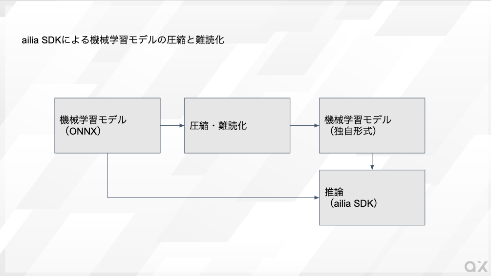

# ailia SDKを使用した機械学習モデルの圧縮と難読化

# ailia SDKを使用した機械学習モデルの圧縮と難読化

[](https://kyakuno.medium.com/?source=post_page---byline--f4c9933eb97c---------------------------------------)

[Kazuki Kyakuno](https://kyakuno.medium.com/?source=post_page---byline--f4c9933eb97c---------------------------------------)

7 min read

·

Sep 15, 2020

--

Share

クロスプラットフォームで利用できるGPU対応の高速AI推論フレームワークであるailia SDKを使用して機械学習モデルの圧縮と難読化を行うチュートリアルです。ailia SDKについては[こちら](https://ailia.jp/)をご覧ください。

## ailia SDKによる機械学習モデルの圧縮と難読化

ailia SDKには、機械学習モデルを圧縮して容量を削減する機能と、難読化してモデル構造の解析を難しくする機能があります。本記事では、それぞれの機能の使用方法を解説します。

## 機械学習モデルの圧縮（容量削減）

### モデル圧縮の概要

機械学習モデルは容量が大きくなるという課題があります。例えば、ResNet50では102.7MBのモデル容量となり、ネットワークの通信量や、ユーザのストレージを圧迫するという課題があります。

この問題を解決するため、ailia SDKでは機械学習を圧縮する機能を持っています。ailia SDKを使用することで、機械学習モデルを、概ね1/3の容量まで圧縮することができます。

圧縮したモデルは、通常のONNXと同様に、ailia SDKで読み込ませることが可能です。

Press enter or click to view image in full size



機械学習モデルの圧縮・難読化のワークフロー

### モデル圧縮のパラメータ

ONNXはデフォルトでFP32の精度を持っており、モデルに含まれる1係数につき32bit消費します。ailia SDKでは、これを、FP16〜FP12まで任意の精度で量子化して容量を削減しています。

圧縮のパラメータとして、ビット数を16〜12の範囲で指定可能です。具体的に、例えば、FP12にすることで、1係数につき12bitになり、1/2.66の容量に削減することができます。さらに、量子化した後にエントロピー符号化を行なっているため、単純にFP12に変換した場合よりも容量は小さくなり、概ね1/3の容量になります。

### モデル圧縮の実行

モデル圧縮には、ailia SDKのtools/compressフォルダに含まれるailia\_convert\_cを使用します。

実際にResNet50を圧縮する例は下記となります。prototxtとonnxを与え、FP12指定で圧縮されたonnxを生成します。

```
./ailia_convert_c -p resnet50.onnx.prototxt -w resnet50.onnx -o resnet50.fp12.onnx -q 12
```

圧縮結果は下記となります。

```
Source Size : 102709764  
Compressed Size : 30968282
```

102.7MBが31MBまで圧縮されました。

### 圧縮されたファイルからの推論

圧縮されたファイルから推論を行うには、resnet50.onnxの代わりに、resnet50.fp12.onnxをailia SDKに与えます。prototxtファイルは圧縮前、圧縮後で共通に使用可能です。

## Get Kazuki Kyakuno’s stories in your inbox

Join Medium for free to get updates from this writer.

Subscribe

Subscribe

Remember me for faster sign in

実際に推論して精度を確認してみます。


入力画像

圧縮前の1000クラス分類の処理結果

```
idx=0  
 category=963 [ pizza, pizza pie ]  
 prob=0.8775978088378906  
idx=1  
 category=927 [ trifle ]  
 prob=0.049756914377212524  
idx=2  
 category=567 [ frying pan, frypan, skillet ]  
 prob=0.011284342966973782  
idx=3  
 category=923 [ plate ]  
 prob=0.010335126891732216  
idx=4  
 category=909 [ wok ]  
 prob=0.007396741304546595
```

圧縮後の1000クラス分類の処理結果

```
idx=0  
 category=963 [ pizza, pizza pie ]  
 prob=0.8633084893226624  
idx=1  
 category=927 [ trifle ]  
 prob=0.05590188130736351  
idx=2  
 category=567 [ frying pan, frypan, skillet ]  
 prob=0.01421405654400587  
idx=3  
 category=923 [ plate ]  
 prob=0.010400247760117054  
idx=4  
 category=909 [ wok ]  
 prob=0.008665699511766434
```

ほぼ精度の劣化なく、容量の削減ができていることがわかります。

弊社の経験では、classifierやdetectionのモデルでは、FP12で十分な精度が出ています。最初はFP12を試して、精度が出ない場合にFP14かFP16を試すのがおすすめです。

推論時には、GPUに合わせてFP32もしくはFP16に復元してから処理するため、推論速度には影響はありません。

## 機械学習モデルの難読化（保護）

### モデル難読化の概要

機械学習モデルのコピーを防ぐため、機械学習モデルを難読化して保護したいというニーズがあります。ailia SDKには、機械学習モデルの難読化の機能があります。具体的に、AESを使用して機械学習モデルを暗号化することが可能です。難読化した機械学習モデルは、通常のONNXと同様に、ailia SDKに読み込ませて推論が可能です。

### モデル難読化の使用方法

モデル難読化を行うには、ailia SDKのtools/obfuscateフォルダにある、ailia\_obfuscate\_cを使用します。下記のコマンドで、prototxtや、onnxを個別に難読化することができます。

```
ailia_obfuscate_c resnet50.prototxt resnet50.obf.prototxt  
ailia_obfuscate_c resnet50.onnx resnet50.obf.onnx
```

### 難読化したモデルの推論

難読化した機械学習モデルは、通常のONNXの代わりに難読化したONNXをailia SDKに与えるだけで推論可能です。ailia SDKが自動的に難読化を検知し、内部で復号した後に推論を行います。難読化することで、ailia SDK以外では推論することが不可能になります。また、ailia SDKの内部情報取得機能が無効になり、内部構造の解析を防止することができます。

### ハードウェアドングルの使用

株式会社アクセルの提供するSHALO LICENSINGのアセット暗号化機能を併用することで、USBドングルを使用した機械学習モデルの暗号化にも対応しています。

[## SHALO LICENSING

### アプリケーションを保護し、簡単にライセンス管理できるソリューションです。

shalo.jp](http://shalo.jp/licensing/?source=post_page-----f4c9933eb97c---------------------------------------)

ax株式会社はAIを実用化する会社として、クロスプラットフォームでGPUを使用した高速な推論を行うことができるailia SDKを開発しています。ax株式会社ではコンサルティングからモデル作成、SDKの提供、AIを利用したアプリ・システム開発、サポートまで、 AIに関するトータルソリューションを提供していますのでお気軽に[お問い合わせ](https://axinc.jp/)ください。