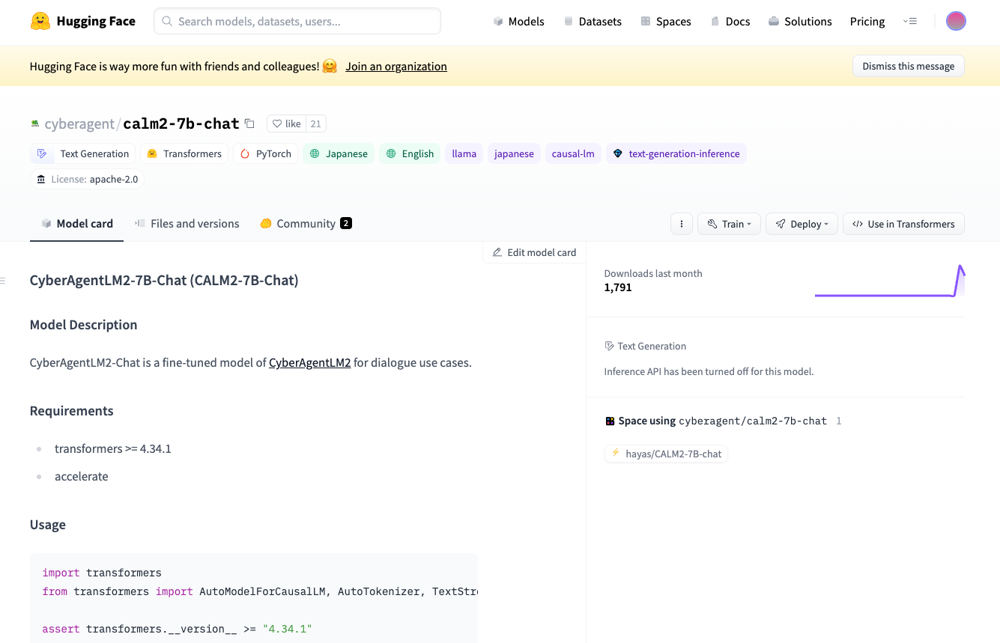
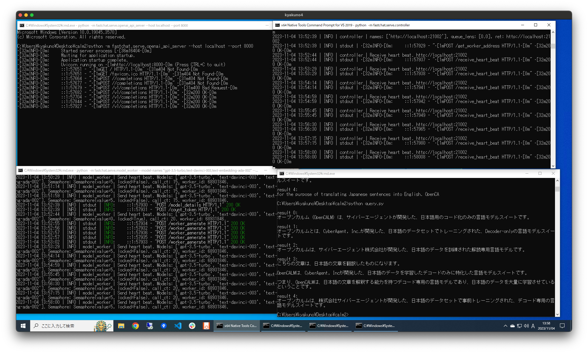
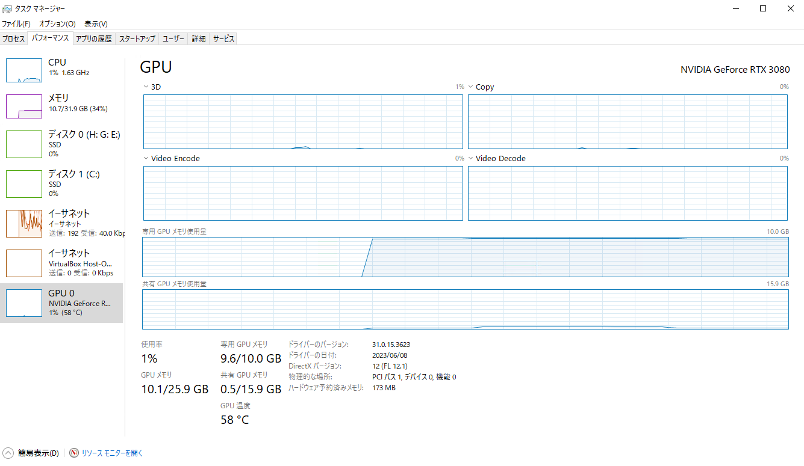

# CALM2–7B-CHATのOpenAI互換サーバを立てる

# CALM2–7B-CHATのOpenAI互換サーバを立てる

[](https://kyakuno.medium.com/?source=post_page---byline--8a62c2833bec---------------------------------------)

[Kazuki Kyakuno](https://kyakuno.medium.com/?source=post_page---byline--8a62c2833bec---------------------------------------)

13 min read

·

Nov 4, 2023

--

Share

サイバーエージェントの公開した最新のローカルLLMであるCALM2–7B-CHATのOpenAI互換サーバを立てる方法を解説します。

## CALM2-7B-CHATの概要

CALM2-7B-CHATはサイバーエージェントが2023年11月2日に公開した最新のLLMです。日本語と英語に対応しており、ローカルLLMとして実行することが可能です。

Press enter or click to view image in full size



<https://huggingface.co/cyberagent/calm2-7b-chat>

従来のCALM-7Bはベースモデルのみの提供となっていましたが、CALM2-7Bはチャットモデルも提供されており、非常に使い勝手がよくなっています。また、最大トークン数が32Kと大きく、RAGなどでの利用も行いやすくなっています。

[## 独自の日本語LLM（大規模言語モデル）のバージョン2を一般公開 ―32,000トークン対応の商用利用可能なチャットモデルを提供―

### サイバーエージェントの新たな取り組みやサービス情報など、当社のニュースリリースを掲載しています。

www.cyberagent.co.jp](https://www.cyberagent.co.jp/news/detail/id=29479?source=post_page-----8a62c2833bec---------------------------------------)

[## cyberagent/calm2-7b-chat · Hugging Face

### We're on a journey to advance and democratize artificial intelligence through open source and open science.

huggingface.co](https://huggingface.co/cyberagent/calm2-7b-chat?source=post_page-----8a62c2833bec---------------------------------------)

## CALM2–7B-CHATの利用

CALM2–7B-CHATはPythonのtransformersを使用することで、簡単に使用可能です。しかし、7BのパラメータはFP16換算で14GBであり、RTX3080の10GBのVRAMに乗りません。そこで、[AutoModelForCausalLMのload\_in\_8bitオプション](https://note.com/npaka/n/n6fe8d930b114)を使用することで、10GBのVRAMでも動作するようになります。

実行スクリプト（公式のものにload\_in\_8bitと時間計測を追加）

```
import transformers  
from transformers import AutoModelForCausalLM, AutoTokenizer, TextStreamer  
  
assert transformers.__version__ >= "4.34.1"  
  
model = AutoModelForCausalLM.from_pretrained("cyberagent/calm2-7b-chat", device_map="auto", torch_dtype="auto", load_in_8bit=True)  
tokenizer = AutoTokenizer.from_pretrained("cyberagent/calm2-7b-chat")  
streamer = TextStreamer(tokenizer, skip_prompt=True, skip_special_tokens=True)  
  
prompt = """USER: AIによって私達の暮らしはどのように変わりますか？  
ASSISTANT: """  
  
import time  
start = int(round(time.time() * 1000))  
  
token_ids = tokenizer.encode(prompt, return_tensors="pt")  
output_ids = model.generate(  
    input_ids=token_ids.to(model.device),  
    max_new_tokens=300,  
    do_sample=True,  
    temperature=0.8,  
    streamer=streamer,  
)  
  
end = int(round(time.time() * 1000))  
print(f'\tprocessing time {end - start} ms')
```

実行例（推論時間は61秒程度）

```
C:\Users\kyakuno\Desktop\calm2>python calm2.py  
  
===================================BUG REPORT===================================  
Welcome to bitsandbytes. For bug reports, please submit your error trace to: https://github.com/TimDettmers/bitsandbytes/issues  
For effortless bug reporting copy-paste your error into this form: https://docs.google.com/forms/d/e/1FAIpQLScPB8emS3Thkp66nvqwmjTEgxp8Y9ufuWTzFyr9kJ5AoI47dQ/viewform?usp=sf_link  
================================================================================  
CUDA SETUP: Loading binary C:\Users\kyakuno\AppData\Local\Programs\Python\Python310\lib\site-packages\bitsandbytes\libbitsandbytes_cuda116.dll...  
Loading checkpoint shards: 100%|█████████████████████████████████████████████████████████| 2/2 [00:14<00:00,  7.35s/it]  
C:\Users\kyakuno\AppData\Local\Programs\Python\Python310\lib\site-packages\bitsandbytes\autograd\_functions.py:231: UserWarning: MatMul8bitLt: inputs will be cast from torch.bfloat16 to float16 during quantization  
  warnings.warn(f"MatMul8bitLt: inputs will be cast from {A.dtype} to float16 during quantization")  
C:\Users\kyakuno\AppData\Local\Programs\Python\Python310\lib\site-packages\bitsandbytes\autograd\_functions.py:231: UserWarning: MatMul8bitLt: inputs will be cast from torch.bfloat16 to float16 during quantization  
  warnings.warn(f"MatMul8bitLt: inputs will be cast from {A.dtype} to float16 during quantization")  
1. 便利で快適になる：AIは便利なデバイスの開発や、スマートホームの実現に寄与します。例えば、音声で操作できるAIスピーカー は、家の中での使用に便利で、朝起きる時間になったら自動的に音楽をかけたり、温度調節をしたりすることができます。  
  
2. ビジネス効率の向上：AIはビジネス分野での業務効率を高めます。例えば、AIを用いた自動翻訳によって、外国語のビジネス文書 の翻訳が容易になります。また、AIは製造工程の最適化にも役立つため、生産効率が向上します。  
  
3. 労働力不足の解消：AIは労働力不足を補うことができます。例えば、ロボットによる作業が増えることで、人手不足が解消されま す。  
  
4. 医療現場での導入：AIは医療現場で導入が進んでいます。例えば、AIを用いた画像診断技術によって、医師が患部を観察する際の 視覚的な負担を軽減することができます。  
  
5. 個人のライフスタイルの変化：AIは個人にも影響を及ぼします。例えば、AIによって個人の趣味嗜好を学習し、適切な情報や商品 を提供することができるようになります。  
  
6. 地球環境の改善：AIは地球環境の改善にも寄与します。例えば、AIによって大気汚染の予測や、作物の育成に必要な天候の予測が できます。これにより、農産物の生産量を適正に保つことができ、環境負荷を低減することができます。  
        processing time 61293 ms
```

## OpenAI互換サーバの作成

CALM2–7B-CHATをローカルLLMとして使用する場合、OpenAI互換サーバを作成すると便利です。OpenAI互換サーバを使用することで、Pythonのopenaiのライブラリや、langchainから使用することが可能です。OpenAI互換サーバの作成には、fschatが便利です。

## Get Kazuki Kyakuno’s stories in your inbox

Join Medium for free to get updates from this writer.

Subscribe

Subscribe

Remember me for faster sign in

fschatを使用して、OpenAI互換サーバを立てるには、下記のようにします。3つのターミナルが必要ですが、非常に簡単にサーバが立ち上がります。

```
pip -m pip install fschat  
python -m fastchat.serve.controller  
python -m fastchat.serve.model_worker --model-names "gpt-3.5-turbo,gpt-3.5-turbo-16k,text-davinci-003,text-embedding-ada-002" --model-path cyberagent/calm2-7b-chat --load-8bit  
python -m fastchat.serve.openai_api_server --host localhost --port 8000
```

PythonのOpenAIのライブラリからは、openai.api\_baseにローカルLLMのURLを指定するだけで接続可能です。

```
import os  
import openai  
  
openai.api_key = "EMPTY"  
openai.api_base = "http://localhost:8000/v1"  
  
# プロンプトの設定  
prompt = """USER: 下記の文章を日本語に翻訳してください。 OpenCALM is a suite of decoder-only language models pre-trained on Japanese datasets, developed by CyberAgent, Inc.  
ASSISTANT: """  
  
# APIリクエストの設定  
response = openai.Completion.create(  
    model="text-davinci-003",  # GPTのエンジン名を指定します  
    prompt=prompt,  
    max_tokens=100,  # 生成するトークンの最大数  
    n=5,  # 生成するレスポンスの数  
    stop=None,  # 停止トークンの設定  
    temperature=0.7,  # 生成時のランダム性の制御  
    top_p=1,  # トークン選択時の確率閾値  
)  
  
# 生成されたテキストの取得  
for i, choice in enumerate(response.choices):  
    print(f"\nresult {i}:")  
    print(choice.text.strip())
```

fschatの実行例です。左上、右上、左下の3つのターミナルでコマンドを実行してサーバを作成し、右下のターミナルでクエリを投げています。

Press enter or click to view image in full size



f schatの実行例

実行結果です。

```
C:\Users\kyakuno\Desktop\calm2>python query.py  
  
result 0:  
オープンカルム（OpenCALM）は、サイバーエージェントが開発した、日本語用のコード化のみの言語モデルスイートです。  
  
result 1:  
オープンカルムとは、CyberAgent, Inc.が開発した、日本語のデータセットでトレーニングされた、Decoder-onlyの言語モデルスイートです。  
  
result 2:  
オープンカルムは、サイバーエージェント株式会社が開発した、日本語のデータを訓練された解読専用言語モデルです。  
  
result 3:  
こちらの文章は、日本語の文章を翻訳したものになります。  
  
OpenCALMは、CyberAgent, Incが開発した、日本語のデータを学習したデコードのみに特化した言語モデルスイートです。  
  
つまり、OpenCALMは、日本語の文章を解釈する能力を持つデコード専用の言語モデルであり、日本語のデータを大量に学習させているということです。  
  
result 4:  
オープンカルムは、株式会社サイバーエージェントが開発した、日本語のデータセットで事前トレーニングされた、デコード専用の言語モデルスイートです。
```

英語から日本語への翻訳も動作しており、非常に性能が高いです。

実行時のVRAM消費量です。専用GPUメモリで9.6GB、共有GPUメモリで0.5GB使用しています。

Press enter or click to view image in full size



## まとめ

CALM2–7BのOpenAI互換サーバを立ち上げる方法を紹介しました。[ChatGPT 3.5 Turboが10〜30B程度という噂](https://torpid-stem-c48.notion.site/LMM-ChatGPTjp-8b0218dad4b14c41b28a00437d326132)もあるので、日本語と英語に特化すると7Bでも近い性能が出る可能性があります。そのため、機密情報などをローカルLLMで扱うということも現実的になってきている気がします。

## 関連情報

[## CALM2で長い文章をまるごと取り扱う｜あるふ

### こんばんは、あるふです。 GPTQ版CALM2が長い文章に思ったよりか強かったので、これは宣伝と忘備録がてら、使い方を整理していきます。 まず動かしてみる CALM2とはサイバーエージェントが作った大規模言語モデルのことです。…

note.com](https://note.com/alfredplpl/n/n5ed2ea2b78ec?source=post_page-----8a62c2833bec---------------------------------------)

ax株式会社はAIを実用化する会社として、クロスプラットフォームでGPUを使用した高速な推論を行うことができるailia SDKを開発しています。ax株式会社ではコンサルティングからモデル作成、SDKの提供、AIを利用したアプリ・システム開発、サポートまで、 AIに関するトータルソリューションを提供していますのでお気軽に[お問い合わせ](https://axinc.jp/)ください。