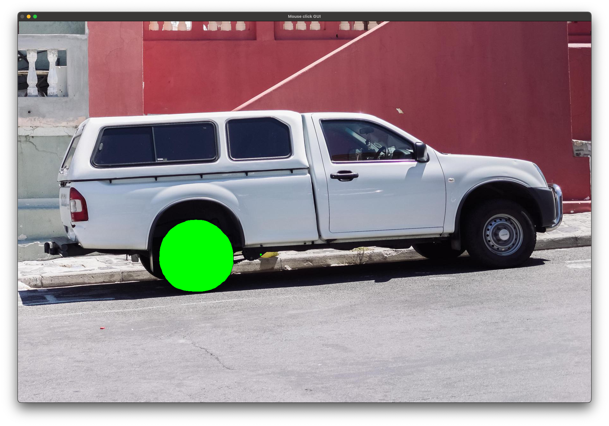
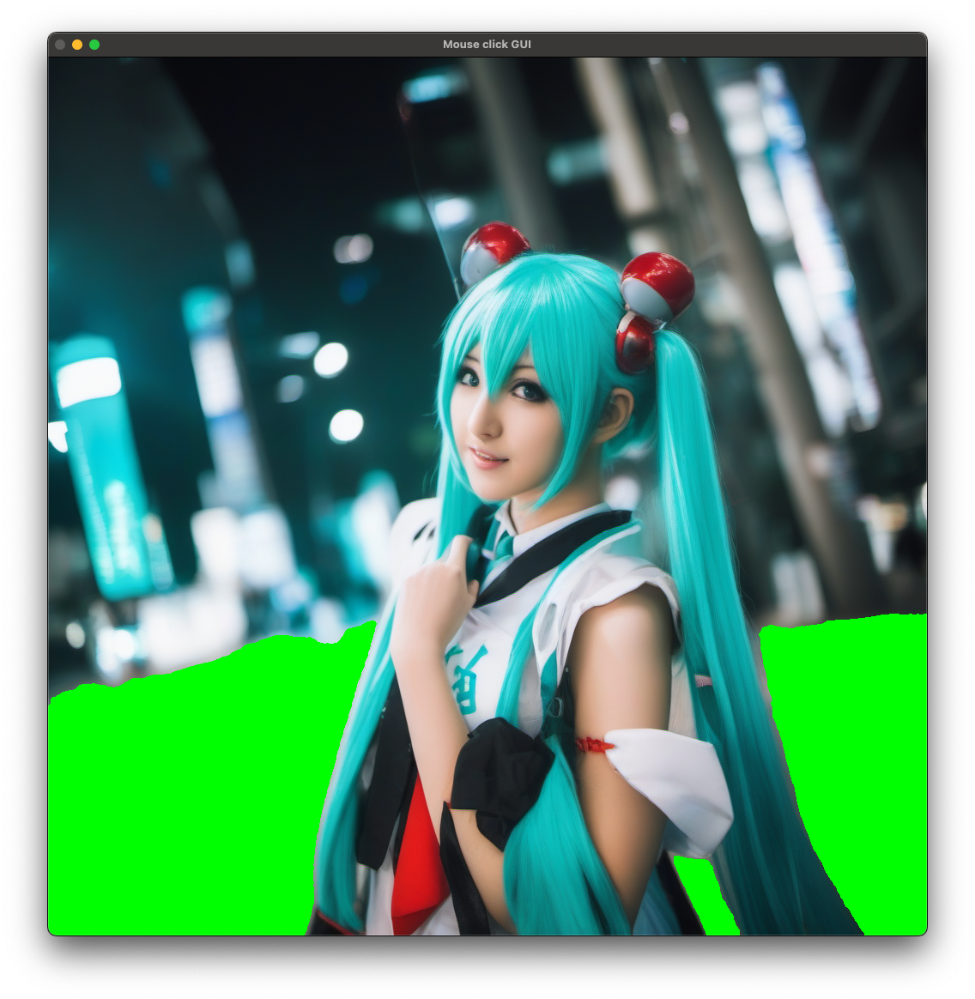
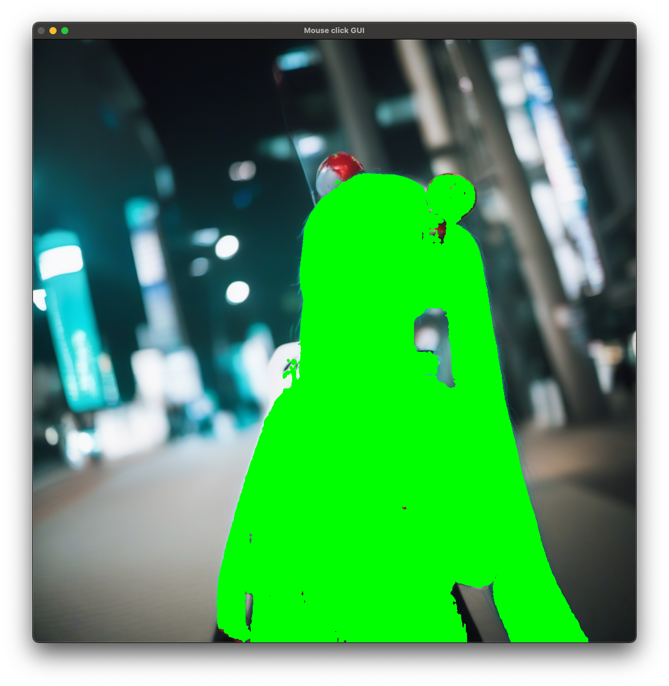
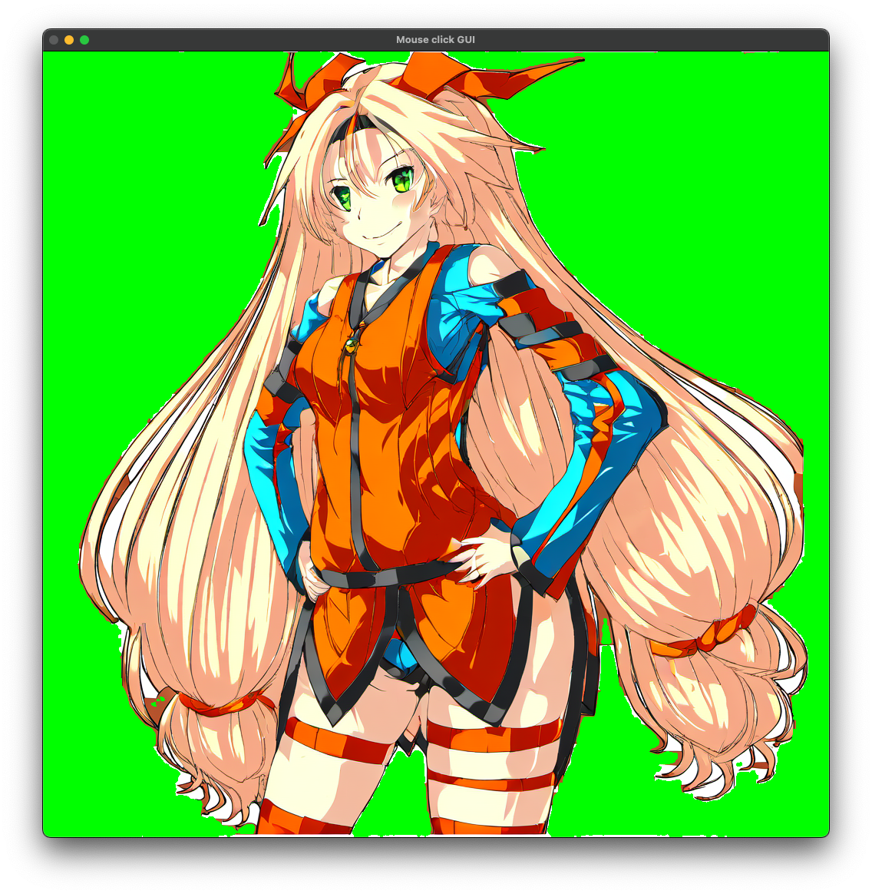
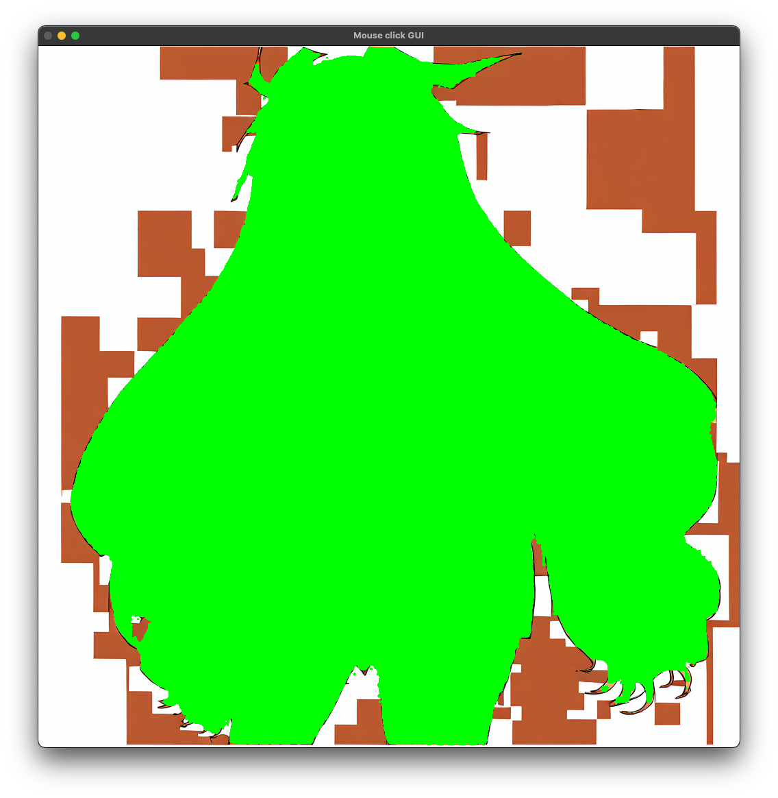

# SegmentAnything : セグメンテーションの対象を座標で指定できるセグメンテーションモデル

# SegmentAnything : セグメンテーションの対象を座標で指定できるセグメンテーションモデル

[](https://kyakuno.medium.com/?source=post_page---byline--fa6c917c3e51---------------------------------------)

[Kazuki Kyakuno](https://kyakuno.medium.com/?source=post_page---byline--fa6c917c3e51---------------------------------------)

Nov 29, 2023

--

Share

セグメンテーションの対象を座標で指定できるセグメンテーションモデルであるSegmentAnythingのご紹介です。

## SegmentAnythingの概要

SegmentAnythingはMetaが開発したセグメンテーションモデルです。2023年4月に公開されました。任意の座標を指定して、その周辺領域をセグメンテーションすることが可能です。背景切り抜きなどの画像編集に最適です。

[## GitHub - facebookresearch/segment-anything: The repository provides code for running inference with…

### The repository provides code for running inference with the SegmentAnything Model (SAM), links for downloading the…

github.com](https://github.com/facebookresearch/segment-anything?source=post_page-----fa6c917c3e51---------------------------------------)

[## Segment Anything

### We introduce the Segment Anything (SA) project: a new task, model, and dataset for image segmentation. Using our…

ai.meta.com](https://ai.meta.com/research/publications/segment-anything/?source=post_page-----fa6c917c3e51---------------------------------------)

## Segment Anythingのアーキテクチャ

近年、WEB上の大量のデータで学習することで、従来よりも飛躍的に高精度な言語モデルや基盤モデルが登場しています。しかし、セグメンテーションのための大規模なデータセットは存在しませんでした。Segment Anythingでは、1100万枚以上の画像と、10億以上のマスクを含む大規模なデータセットを新規に構築することで、セグメンテーションの基盤モデルを構築しています。

Segmeny Anythingでは、この新しい大規模なデータセットで学習することで、位置やボックス、テキストなどをPromptとしたセグメンテーションを実現しています。

Segment Anythingのアーキテクチャです。Image EncoderでEmbeddingに変換した後、Promptを元にMask Decoderでセグメンテーションを生成します。Image encoderにはViT、Prompt EncoderにはCLIPのText Encoder、Mask DecoderはTransformerとMLPを使用しています。

Press enter or click to view image in full size


SegmentAnythingのアーキテクチャ（出典：<https://github.com/facebookresearch/segment-anything>）

ボックスを元にセグメンテーションした例です。指定したボックスの中にあるタイヤだけをセグメンテーションすることが可能です。

Press enter or click to view image in full size


座標を指定したセグメンテーション（出典：<https://github.com/facebookresearch/segment-anything>）

Image Encoderの出力は画像に対して一意なため、一度、Image EncoderでEmbeddingを計算すれば、Mask Decoderは座標を変えながら複数回実行することが可能です。演算負荷はImage Encoderの方が高く、Mask Decoderは比較的軽量となっています。

デフォルトでは、長辺が1024になるようにリサイズされてから、Image Encoderに入力されます。前処理はImageNet形式で、meanを引いてからstdで除算します。画像はRGB順です。

## Get Kazuki Kyakuno’s stories in your inbox

Join Medium for free to get updates from this writer.

Subscribe

Subscribe

Remember me for faster sign in

Mask Decoderの出力は複数のマスクとなっており、デフォルトでは最もスコアの高いマスクが選択されます。

## SegmentAnythingの応用

物体検出や骨格検出と併用し、セグメンテーション対象を自動選択して処理を行うことで、レイヤー分けの自動化などに応用が可能です。

## SegmentAnythingの使用方法

ailia SDKでは1.2.16からSegmentAnythingに対応しています。SegmentAnythingを使用するには、下記のコマンドを使用します。

```
$ python3 segment-anything.py - input intput.jpg - savepath output.jpg
```

guiオプションを付与することで、画像をクリックした場所をインタラクティブにセグメンテーションすることも可能です。

```
$ python3 segment-anything.py --gui
```

[## ailia-models/image\_segmentation/segment-anything at master · axinc-ai/ailia-models

### The collection of pre-trained, state-of-the-art AI models for ailia SDK …

github.com](https://github.com/axinc-ai/ailia-models/tree/master/image_segmentation/segment-anything?source=post_page-----fa6c917c3e51---------------------------------------)

Press enter or click to view image in full size



タイヤをクリック

Press enter or click to view image in full size


車をクリック

## 様々な画像でのテスト

SDXLで生成した画像に対して、GUIモードで背景や人物をクリックしてテストしてみます。

Press enter or click to view image in full size



背景を選択

Press enter or click to view image in full size



人物を選択

Press enter or click to view image in full size



背景を選択

Press enter or click to view image in full size



キャラクターを選択

（© Unity Technologies Japan/UCL）

ax株式会社はAIを実用化する会社として、クロスプラットフォームでGPUを使用した高速な推論を行うことができるailia SDKを開発しています。ax株式会社ではコンサルティングからモデル作成、SDKの提供、AIを利用したアプリ・システム開発、サポートまで、 AIに関するトータルソリューションを提供していますのでお気軽に[お問い合わせ](https://axinc.jp/)ください。