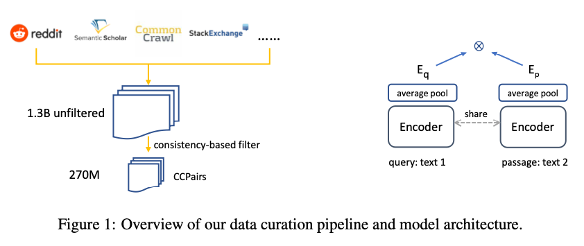
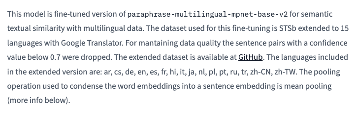
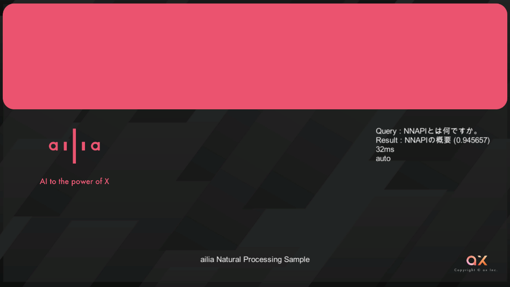

# Multilingual E5 : 多言語のテキストをEmbeddingする機械学習モデル

# Multilingual E5 : 多言語のテキストをEmbeddingする機械学習モデル

[](https://kyakuno.medium.com/?source=post_page---byline--71f1dec7c4f0---------------------------------------)

[Kazuki Kyakuno](https://kyakuno.medium.com/?source=post_page---byline--71f1dec7c4f0---------------------------------------)

6 min read

·

Oct 19, 2023

--

Share

多言語のテキストをEmbeddingする機械学習モデルであるMultilingual E5のご紹介です。Multilingual E5を使用することで、多言語間のテキストの類似度を高精度に計算可能です。

## Multilingual E5の概要

Multilingual E5は2022年12月に公開されたテキストのEmbeddingを行うモデルです。従来、オンプレミス環境での多言語の埋め込みでは2019年に公開されたSentenceTransformerの[paraphrase-multilingual-mpnet-base-v2](https://huggingface.co/AIDA-UPM/mstsb-paraphrase-multilingual-mpnet-base-v2)が使用されていましたが、Multilingual E5はそれよりも最新の高精度なモデルになります。

[## intfloat/multilingual-e5-base · Hugging Face

### We're on a journey to advance and democratize artificial intelligence through open source and open science.

huggingface.co](https://huggingface.co/intfloat/multilingual-e5-base?source=post_page-----71f1dec7c4f0---------------------------------------)

[## Text Embeddings by Weakly-Supervised Contrastive Pre-training

### This paper presents E5, a family of state-of-the-art text embeddings that transfer well to a wide range of tasks. The…

arxiv.org](https://arxiv.org/abs/2212.03533v1?source=post_page-----71f1dec7c4f0---------------------------------------)

## Multilingual E5のアーキテクチャ

テキストのEmbeddingはキーワードの不一致の問題を解消し、効率的な情報検索を可能にします。しかし、従来のモデルは、限定的なラベル付きデータや、低品質な機械翻訳のデータで学習されていたため、十分な精度が得られていませんでした。

## Get Kazuki Kyakuno’s stories in your inbox

Join Medium for free to get updates from this writer.

Subscribe

Subscribe

Remember me for faster sign in

E5では、CCPairsデータセットと呼ばれる、インターネット上のテキストペアをクリーニングしたデータセットで学習します。CCPairsデータセットは、CommunityQA、CommonCrawl、ScientificPapersなどのデータソースを組み合わせた後、フィルタリングを行なって構築します。

Press enter or click to view image in full size



CCPairsデータセットの概要

## Multilingual E5のデータセット

実際のMultilingual E5のデータセットは下記となります。

Press enter or click to view image in full size


<https://huggingface.co/intfloat/multilingual-e5-base>

従来のSentenceTransformerのparaphrase-multilingual-mpnet-base-v2のデータセットは[STSb（Semantic Textual Similarity Benchmark）](https://paperswithcode.com/sota/semantic-textual-similarity-on-sts-benchmark)となります。Multilingual E5は、より多くのデータで学習されていることがわかります。

Press enter or click to view image in full size



[paraphrase-multilingual-mpnet-base-v2](https://huggingface.co/AIDA-UPM/mstsb-paraphrase-multilingual-mpnet-base-v2)

## SentenceTransformerとMultilingual E5の互換性

Multilingual E5の埋め込みの次元数はbaseで768、largeで1024です。トークナイザにはXLMRobertaが使用されており、SentenceTransformerと全く同じSentencePieceのモデルファイルが使用されているため、トークナイザはそのままで、モデルを差し替えるだけで、SentenceTransformerをE5に置き換えることが可能です。

## Multilingual E5の制約

Multilingual E5の入力可能なトークン長は最大で512となります。これを超えると推論時にエラーになります。OpenAIのtext-embedding-ada-002の最大のトークン長は8191であるため、これよりも短いことに注意する必要があります。

## Multilingual E5の使用方法

ailia SDKでMultilingual E5を使用するには下記のようにします。

```
$ python3 multilingual-e5.py -i sample.txt
```

[## ailia-models/natural\_language\_processing/multilingual-e5 at master · axinc-ai/ailia-models

### The collection of pre-trained, state-of-the-art AI models for ailia SDK …

github.com](https://github.com/axinc-ai/ailia-models/tree/master/natural_language_processing/multilingual-e5?source=post_page-----71f1dec7c4f0---------------------------------------)

sample.txtから各行をEmbeddingし、入力したQueryに最も近いテキストを表示します。

## Unityからの使用

下記にUnityからMultilingual E5を使用するサンプルがあります。ailia SDKを使用し、PC上でクエリと文章の関連度を計算することで、サーバレスでlangchainやllama-indexのようなRAGを実装可能です。

[## ailia-models-unity/Assets/AXIP/AILIA-MODELS/NaturalLanguageProcessing at master ·…

### Unity version of ailia models repository. Contribute to axinc-ai/ailia-models-unity development by creating an account…

github.com](https://github.com/axinc-ai/ailia-models-unity/tree/master/Assets/AXIP/AILIA-MODELS/NaturalLanguageProcessing?source=post_page-----71f1dec7c4f0---------------------------------------)

Press enter or click to view image in full size



QueryとQueryに対応する検索結果

ax株式会社はAIを実用化する会社として、クロスプラットフォームでGPUを使用した高速な推論を行うことができるailia SDKを開発しています。ax株式会社ではコンサルティングからモデル作成、SDKの提供、AIを利用したアプリ・システム開発、サポートまで、 AIに関するトータルソリューションを提供していますのでお気軽に[お問い合わせ](https://axinc.jp/)ください。