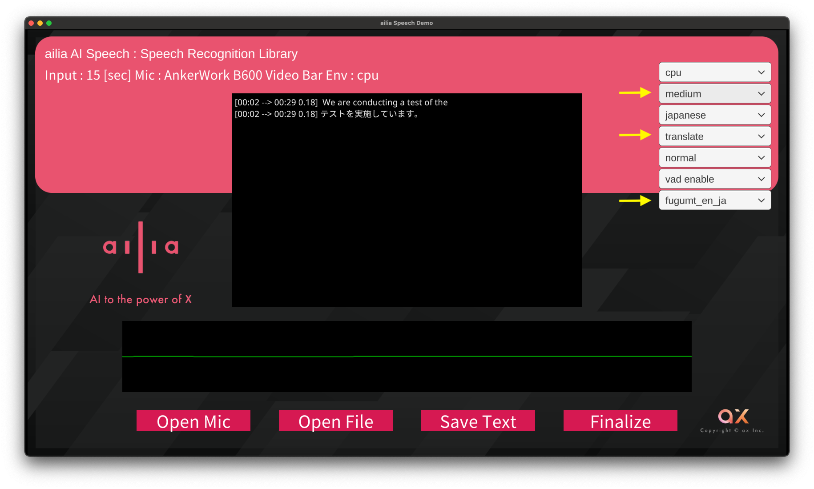

# ailia AI Speech 1.1.0をリリース

# ailia AI Speech 1.1.0をリリース

[Kazuki Kyakuno](https://kyakuno.medium.com/?source=post_page---byline--407e41cceef5---------------------------------------)

Feb 1, 2024

--

Share

Whisper Largeへの対応や、音声認識誤り訂正、日本語への翻訳機能を追加したailia AI Speech 1.1.0をリリースしました。

## ailia AI Speechについて

ailia AI SpeechはAI音声認識を簡単に実装できるライブラリです。OpenAIのWhisperに対応しており、高精度な音声認識を、サーバ不要でエッジデバイス上で実装することができます。

Press enter or click to view image in full size

ailia AI Speech公式サイト：<https://www.ailia.ai/speech>

## ailia AI Speech 1.1.0の新機能

### Whisper Largeへの対応

Whisper Large V2と、Whisper Large V3に対応しました。より高精度なモデルを使用可能です。

### PostProcess APIの追加

新たにPostProcess APIを追加しました。これは、Whisperの認識結果の後段に、Whisperとは別の自然言語処理のAIモデルを適用することができる機能です。

具体的に、T5を使用した音声認識誤り訂正と、FuguMTを使用した英語から日本語への翻訳を実行することが可能です。

APIの呼び出しフローは下記となります。ailiaSpeechTranscribe APIを呼び出した後、ailiaSpeechPostProcess APIを呼び出すことで、後処理として自然言語処理のAIモデルを実行可能です。

PostProcess APIの呼び出しフロー

### **音声認識誤り訂正**

T5を使用した音声認識誤り訂正では、医療用語辞書で学習した、Whisper Medium向けのT5モデルが使用可能です。

### **日本語への翻訳**

日本語への翻訳では、FuguMTを使用することで、英語から日本語への翻訳を適用することが可能です。Whisperには多言語の翻訳機能があり、99言語を英語に翻訳が可能です。しかし、日本語への翻訳機能がないという問題がありました。今回、PostProcess APIの導入により、日本語への翻訳に対応し、通訳などのアプリの開発を容易にします。

## Get Kazuki Kyakuno’s stories in your inbox

Join Medium for free to get updates from this writer.

Subscribe

Subscribe

Remember me for faster sign in

翻訳の実行例は下記となります。Whisperで英語で音声認識を行い、センテンス単位で日本語に翻訳します。全て、エッジデバイス上で動作し、クラウドは不要です。

## デモアプリおよび評価版のダウンロード

デモアプリや評価版はailia AI Speechの公式サイトからダウンロード可能です。

[## AI Speech ｜ailia AI Series

### オフラインでも動く！どんなプラットフォームにも対応する、リアルタイム音声認識機能「AI Speech」です。

www.ailia.ai](https://www.ailia.ai/speech?source=post_page-----407e41cceef5---------------------------------------)

デモアプリで翻訳を使用する場合、下記のように、モデルにmedium、モードにtranslate、オプションにfugumt\_en\_jaを選択してください。

Press enter or click to view image in full size

デモアプリで翻訳を行う設定

モデルをmediumにすることで、smallよりも高精度な音声認識が可能です。モードをtranslateにすることで、whisperの翻訳モードを使用し、多言語の音声認識結果を常に英語に変換することが可能です。オプションにfugumt\_en\_jaを選択することで、whisperの出力した英語を日本語に変換することが可能です。

## まとめ

ailia AI SpeechはOpenAIのWhisperをエッジデバイス上で簡単に使えるようにしたライブラリです。公式のWhisperに、下記の独自機能を追加しています。

・30秒を待たなくても変換を開始できるライブ変換機能  
・無音を検知して有音区間のみ変換するVAD機能  
・音声認識誤り訂正や日本語への翻訳を行うポストプロセス機能  
・iOSやAndroidなどのスマートフォン対応

音声認識をご検討の方は、ぜひ、お問い合わせください。

ax株式会社はAIを実用化する会社として、クロスプラットフォームでGPUを使用した高速な推論を行うことができるailia SDKを開発しています。ax株式会社ではコンサルティングからモデル作成、SDKの提供、AIを利用したアプリ・システム開発、サポートまで、 AIに関するトータルソリューションを提供していますのでお気軽に[お問い合わせ](https://axinc.jp/)ください。