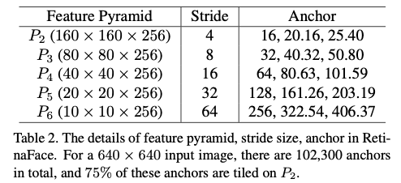
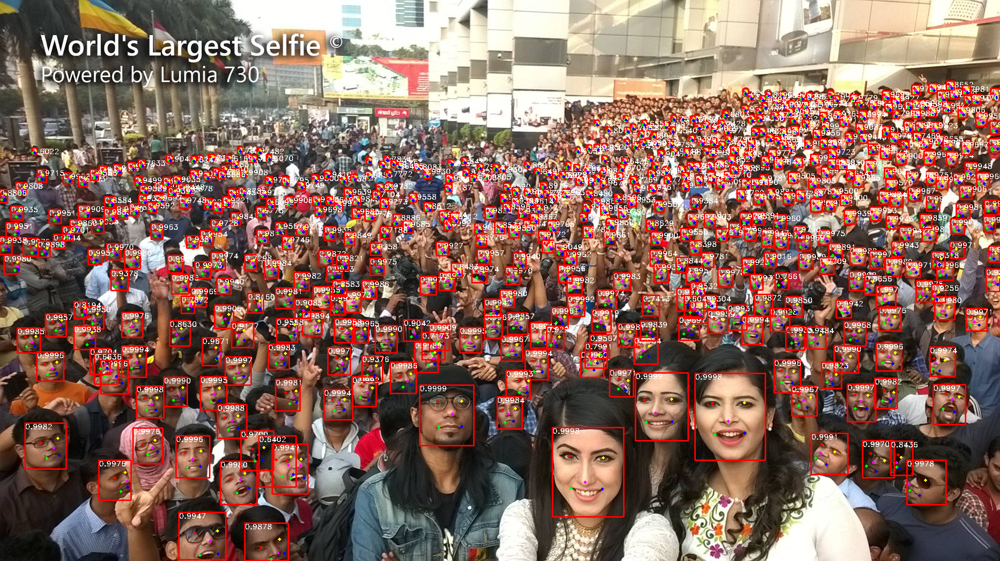

# RetinaFace : 高解像度に対応した顔検出モデル

# RetinaFace : 高解像度に対応した顔検出モデル

[](https://kyakuno.medium.com/?source=post_page---byline--37d0807581ce---------------------------------------)

[Kazuki Kyakuno](https://kyakuno.medium.com/?source=post_page---byline--37d0807581ce---------------------------------------)

10 min read

·

Feb 13, 2024

--

Share

高解像度に対応した顔検出用の機械学習モデルであるRetinaFaceのご紹介です。RetinaFaceを使用することで、高解像度の画像に対して、小さな顔のバウンディングボックスを高精度に計算可能です。

## RetinaFaceの概要

RetinaFaceは2019年5月に公開された高精度な顔検出モデルです。ロンドンにある理工系大学のICL（Imperial College London）と、顔認識ライブラリで著名なInsightFaceが開発しました。

RetinaFaceを使用することで、顔のバウンディングボックスと、目と口のキーポイントを取得可能です。

RetinaFaceは高解像度の画像をリサイズせずに入力することが可能で、階層的な検出処理を行うため、画像中の小さな顔もロバストに検知することが可能です。

Press enter or click to view image in full size


RetinaFaceの出力（World’s Largest Selfie）（出典：<https://github.com/riganxu/selfieBenchmark>）

[## GitHub - biubug6/Pytorch\_Retinaface: Retinaface get 80.99% in widerface hard val using…

### Retinaface get 80.99% in widerface hard val using mobilenet0.25. - GitHub - biubug6/Pytorch\_Retinaface: Retinaface get…

github.com](https://github.com/biubug6/Pytorch_Retinaface?source=post_page-----37d0807581ce---------------------------------------)

[## RetinaFace: Single-stage Dense Face Localisation in the Wild

### Though tremendous strides have been made in uncontrolled face detection, accurate and efficient face localisation in…

arxiv.org](https://arxiv.org/abs/1905.00641?source=post_page-----37d0807581ce---------------------------------------)

## RetinaFaceの概要

RetinaFaceは特徴ピラミッドを使用した階層処理によって、小さい顔を検出する事を可能としています。Backboneとしては、ResNet50を使用しており、ResNet50の複数階層の特徴ベクトルをDetectionステージに供給します。

Press enter or click to view image in full size


RetinaFaceの概要（出典：<https://arxiv.org/pdf/1905.00641.pdf>）

データセットとしては、Wider Faceデータセットに対して5ポイントの顔のランドマークを追加したものを使用しています。


アノテーションの付与（出典：<https://arxiv.org/pdf/1905.00641.pdf>）

入力画像は、0–255のレンジにRGB値からmeanである(104, 117, 123)を引いた後、AIモデルに供給します。出力は3つで、loc = (1, 16800, 4)、conf = (1, 16800, 2)、landms = (1, 16800, 10)です。16800の箇所はAnchorの数で、入力解像度により値は変化します。

## Get Kazuki Kyakuno’s stories in your inbox

Join Medium for free to get updates from this writer.

Subscribe

Subscribe

Remember me for faster sign in

AnchorであるPriorBoxのShapeは(16800, 4)で、下記のように、中心点であるcx, cyとサイズであるcw, chが格納されています。この値は、入力画像サイズから一意に決定することができます。そのため、任意の画像サイズに対してRetinaFaceを実行することができ、高解像度の画像をそのまま処理することが可能です。PriorBoxは3階層になっており、3階層分で12800 + 3200 + 800 = 16800となります。

```
[[0.00195312 0.00347826 0.0078125  0.01391304]  
 [0.00195312 0.00347826 0.015625   0.02782609]  
 [0.00585938 0.00347826 0.0078125  0.01391304]  
 ...  
 [0.9765625  0.98782609 0.25       0.44521739]  
 [0.9921875  0.98782609 0.125      0.2226087 ]  
 [0.9921875  0.98782609 0.25       0.44521739]]
```



Anchorの概要（出典：<https://arxiv.org/pdf/1905.00641.pdf>）

バウンディングボックスの座標を計算するには、モデル出力のlocを使用します。モデル出力のlocはx, y, w, hが格納されています。Anchorsのpriorsのcx, cyに、モデル出力のlocのx,yに対してvarianceである0.1,とAnchorsのpriorsのcw, chを乗算してスケーリングしたものを加算すると、BoundingBoxのcx, cyになります。また、Anchorsのpriorsのcw, chに、locのw, hをvarianceである0.2を乗算してexpを適用してスケーリングしたものを乗算すると、BoundingBoxのw, hになります。このように、Anchorsのpriorsの座標を、モデル出力のlocで補正することで、BoundingBoxを計算します。

```
    boxes = np.concatenate((  
        priors[:, :2] + loc[:, :2] * variances[0] * priors[:, 2:],  
        priors[:, 2:] * np.exp(loc[:, 2:] * variances[1])), axis = 1)  
    boxes[:, :2] -= boxes[:, 2:] / 2  
    boxes[:, 2:] += boxes[:, :2]  
    return boxes
```

ランドマークを計算するには、モデル出力のlandmsを使用します。モデル出力のlandmsはx, yが格納されています。モデル出力のlandmsのx, yに対して、variancesである0.1とpriorsのcw, chを乗算したものを、priorsのcx, cyに加算したのがLandmarkのcx, cyになります。下記の式のうち、preには変換前のlandmsが入ります。

```
    landms = np.concatenate((priors[:, :2] + pre[:, :2] * variances[0] * priors[:, 2:],  
                        priors[:, :2] + pre[:, 2:4] * variances[0] * priors[:, 2:],  
                        priors[:, :2] + pre[:, 4:6] * variances[0] * priors[:, 2:],  
                        priors[:, :2] + pre[:, 6:8] * variances[0] * priors[:, 2:],  
                        priors[:, :2] + pre[:, 8:10] * variances[0] * priors[:, 2:],  
                        ), axis = 1)  
    return landms
```

最後に、confを元に、BoundingBoxをフィルタリングします。

## RetinaFaceの精度

RetinaFaceは顔検出で52.318のmAPを達成しています。なお、論文の数値評価で使用されているBackboneはResNet151となっています。


顔検出の精度（出典：<https://arxiv.org/pdf/1905.00641.pdf>）

## 顔認証への応用

顔認証アルゴリズムとしてArcFaceが広く使用されています。しかし、ArcFaceでは、顔検出の方法については定義されていません。前処理にRetinaFaceを導入し、アライメントを行った画像を使用して学習と推論を行うことで、顔認証の精度が98.37%から99.49%に改善することが示されています。


顔認証の精度（出典：<https://arxiv.org/pdf/1905.00641.pdf>）

## RetinaFaceの使用方法

ailia SDKを使用することで、RetinaFaceを下記のコマンドで実行可能です。デフォルトではBackboneとしてResNet50を使用します。RetinaFaceは入力画像をリサイズせずに使用するため、高解像度の画像ほど処理時間が大きくなります。

```
$ python3 retinaface.py  --input input.jpg --savepath output.jpg
```

archオプションでBackboneをMobileNetに変更可能です。RetinaFaceを高解像度の画像に適用する場合に高速化が可能です。

```
$ python3 retinaface.py  --input input.jpg --savepath output.jpg --arch mobile0.25
```

[## ailia-models/face\_detection/retinaface at master · axinc-ai/ailia-models

### The collection of pre-trained, state-of-the-art AI models for ailia SDK - ailia-models/face\_detection/retinaface at…

github.com](https://github.com/axinc-ai/ailia-models/tree/master/face_detection/retinaface?source=post_page-----37d0807581ce---------------------------------------)

Press enter or click to view image in full size



ResNet50 Backboneの出力例（2048x1150, 712ms / M2 Mac GPU)

Press enter or click to view image in full size


MobileNet Backboneの出力例（2048x1150, 58.5ms / M2 Mac GPU）

ax株式会社はAIを実用化する会社として、クロスプラットフォームでGPUを使用した高速な推論を行うことができるailia SDKを開発しています。ax株式会社ではコンサルティングからモデル作成、SDKの提供、AIを利用したアプリ・システム開発、サポートまで、 AIに関するトータルソリューションを提供していますのでお気軽に[お問い合わせ](https://axinc.jp/)ください。