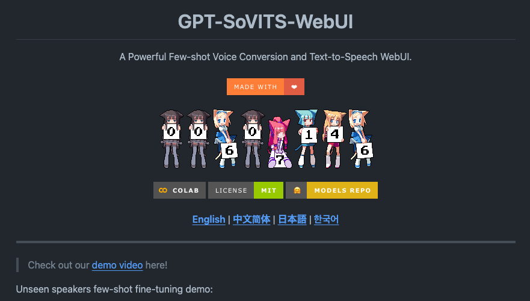
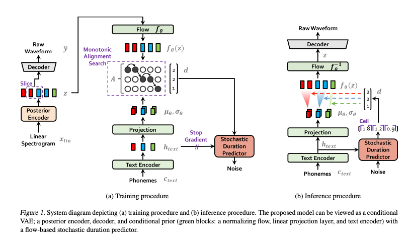
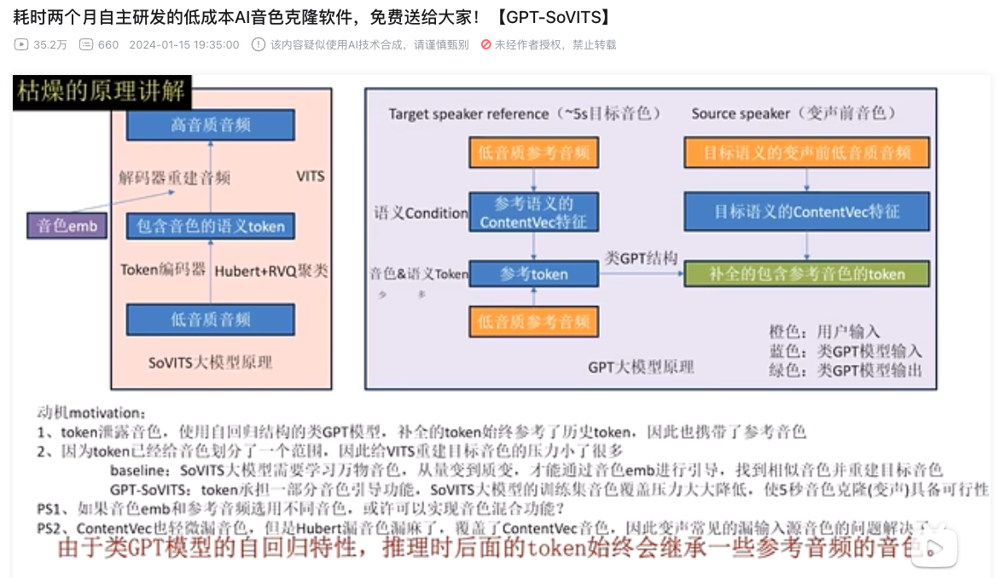
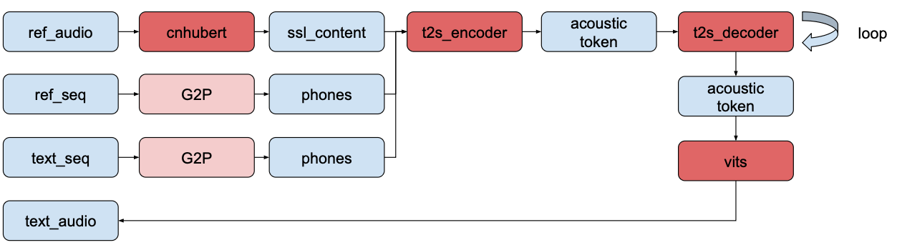
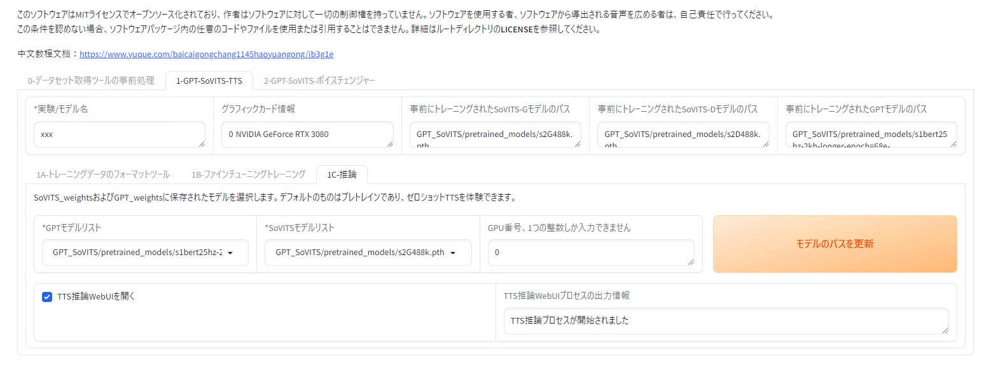
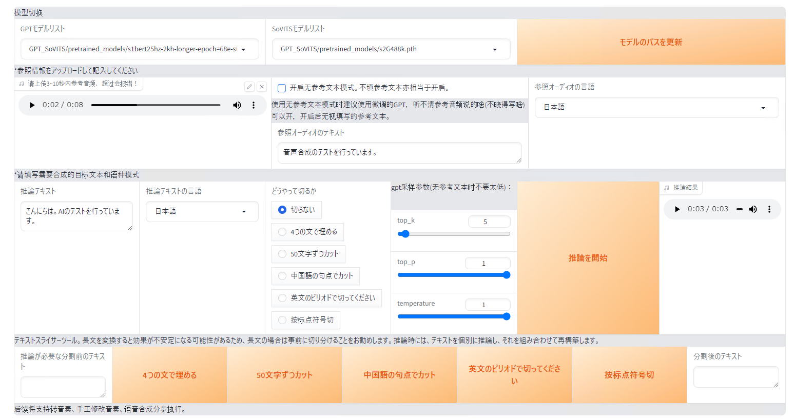
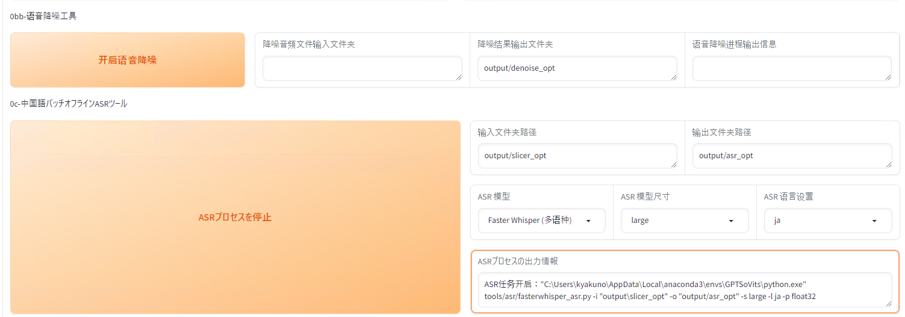
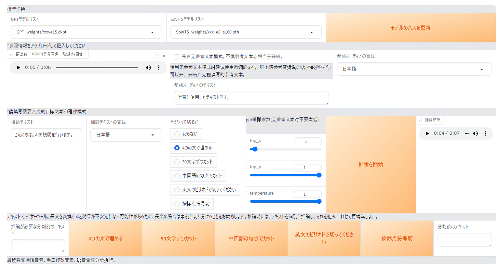

# GPT-SoVITS : ファインチューニングできる0ショットの音声合成モデル

# GPT-SoVITS : ファインチューニングできる0ショットの音声合成モデル

[](https://kyakuno.medium.com/?source=post_page---byline--2212eeb5ad20---------------------------------------)

[Kazuki Kyakuno](https://kyakuno.medium.com/?source=post_page---byline--2212eeb5ad20---------------------------------------)

19 min read

·

Feb 26, 2024

--

Share

ファインチューニングできる0ショットの音声合成モデルであるGPT-SoVITSの紹介です。GPT-SoVITSを使用することで、高品質な日本語音声合成が可能です。

## GPT-SoVITSの概要

GPT-SoVITSは2024年2月18日に公開された音声合成モデルです。リファレンス音声を使用した0ショットによる音声合成と、ファインチューニングに対応しています。

Press enter or click to view image in full size



GPT-SoVITS : <https://github.com/RVC-Boss/GPT-SoVITS>

[## GitHub - RVC-Boss/GPT-SoVITS: 1 min voice data can also be used to train a good TTS model! (few…

### 1 min voice data can also be used to train a good TTS model! (few shot voice cloning) - RVC-Boss/GPT-SoVITS

github.com](https://github.com/RVC-Boss/GPT-SoVITS?source=post_page-----2212eeb5ad20---------------------------------------)

## GPT-SoVITSの機能

GPT-SoVITSの機能は下記となります。

### ゼロショットTTS

5秒の音声サンプルを入力して、即座に音声合成します。

### フューショットTTS

わずか1分のトレーニングデータでモデルを微調整して、声の類似性とリアリティを向上させます。

### クロスリンガルサポート

トレーニングデータとは異なる言語での推論をサポートし、現在は英語、日本語、中国語をサポートしています。

### WebUIツール

音声と伴奏の分離、自動トレーニングセットのセグメンテーション、中国語のASR（音声認識）、およびテキストラベリングを含む統合ツールを備え、トレーニングデータセットの作成とGPT/SoVITSモデルの構築を支援します。

## GPT-SoVITSのアーキテクチャ

GPT-SoVITSは近年の音声合成およびボイスチェンジャーモデルの研究を元にしています。

VITSは2021年1月に公開されたEnd2Endの音声合成モデルです。従来のEnd2Endの音声合成モデルは、テキストを中間表現に変換する2段階のTTSシステムよりも性能が低いという問題がありました。VITSでは、Flowモデルを導入し、話者の特徴を取り除く正規化フローと敵対的なトレーニングプロセスを取り入れることで、音声合成の性能を改善します。

Press enter or click to view image in full size



出典：<https://arxiv.org/abs/2106.06103>

[## GitHub - jaywalnut310/vits: VITS: Conditional Variational Autoencoder with Adversarial Learning for…

### VITS: Conditional Variational Autoencoder with Adversarial Learning for End-to-End Text-to-Speech - jaywalnut310/vits

github.com](https://github.com/jaywalnut310/vits?source=post_page-----2212eeb5ad20---------------------------------------)

VITS2は2023年7月に公開されたEnd2Endの音声合成モデルです。VITSの開発者のJungil Kongさんがセカンドオーサーに入っています。VITSにおけるFlowをTransformer Flowに置き換えています。従来のEnd2Endの音声合成モデルは、不自然さ、計算効率、音素変換への依存という問題がありました。VITS2はVITSから改善された構造とトレーニングメカニズムを提案し、音素変換への強い依存性を抑制します。

[## GitHub - daniilrobnikov/vits2: VITS2: Improving Quality and Efficiency of Single-Stage…

### VITS2: Improving Quality and Efficiency of Single-Stage Text-to-Speech with Adversarial Learning and Architecture…

github.com](https://github.com/daniilrobnikov/vits2?source=post_page-----2212eeb5ad20---------------------------------------)

Bert-VITS2は2023年9月に公開されたEnd2Endの音声合成モデルで、VITS2のTextEncoderをMultilingual Bertに置き換えました。


出典：<https://github.com/fishaudio/Bert-VITS2>

[## GitHub - fishaudio/Bert-VITS2: vits2 backbone with multilingual-bert

### vits2 backbone with multilingual-bert. Contribute to fishaudio/Bert-VITS2 development by creating an account on GitHub.

github.com](https://github.com/fishaudio/Bert-VITS2?source=post_page-----2212eeb5ad20---------------------------------------)

SoVits（SoftVC VITS）は2023年7月に公開されたモデルで、VITSのText Encoderを、Audio EncoderであるSoftVCのContent Encoderに置き換えることで、Text2Speechではなく、RVCのようなSpeech2Speechを実現しています。


出典：<https://github.com/svc-develop-team/so-vits-svc>

[## GitHub - svc-develop-team/so-vits-svc: SoftVC VITS Singing Voice Conversion

### SoftVC VITS Singing Voice Conversion. Contribute to svc-develop-team/so-vits-svc development by creating an account on…

github.com](https://github.com/svc-develop-team/so-vits-svc?source=post_page-----2212eeb5ad20---------------------------------------)

GPT-SoVITSはこれらの研究を元にしており、VITSの高品質な音声合成と、SoVITSの0ショットの音色適用を融合しています。

Press enter or click to view image in full size



出典：<https://www.bilibili.com/video/BV12g4y1m7Uw/>

GPT-SoVITSのデモビデオは下記に公開されています。

[## 耗时两个月自主研发的低成本AI音色克隆软件，免费送给大家！【GPT-SoVITS】\_哔哩哔哩\_bilibili

### 关注UP主并私信GPT/gpt/sovits/SOVITS/SoVITS/SVC/svc自动获取整合训练包下载链接文案配音：AI孙笑川（GPT-SoVITS）算法相关经验和成果是我和Rcell经过半年时间踩了上百个坑得出的当前的最优解，如果…

www.bilibili.com](https://www.bilibili.com/video/BV12g4y1m7Uw?source=post_page-----2212eeb5ad20---------------------------------------)

## GPT-SoVITSのモデル構成

GPT-SoVITSは近代的なトークンベースの音声合成モデルで、acoustic tokenをseq2seqで生成後、acoustic tokenを波形に戻すことで音声合成した結果の波形を取得します。

Press enter or click to view image in full size



GPT-SoVITSのモデル構成

GPT-SoVITSは下記のモデルで構成されます。

1. cnhubert ：入力波形の特徴ベクトルへの変換
2. t2s\_encoder：入力テキスト、参照テキスト、特徴ベクトルからacoustic tokenの生成
3. t2s\_decoder：acoustic tokenから音声合成したacoustic tokenの生成
4. vits : acoustic tokenからの波形への変換

GPT-SoVITSの入力は下記となります。

1. text\_seq : 音声合成するテキスト
2. ref\_seq : リファレンス音声ファイルのテキスト
3. ref\_audio : リファレンス音声ファイルの波形

text\_seqとref\_seqは、g2pを使用して音素に変換後、symbols.pyでトークン列に変換します。日本語の場合、アクセント符号を含まない形でg2pを行います。中国語の場合、さらに、ref\_bertとtext\_bertとして、BERTのEmbeddingを併用しますが、日本語と英語の場合は0埋めされます。

ref\_audioは、0.3秒の無音を末尾に追加した後、cnhubertを使用してssl\_contentという特徴ベクトルに変換します。

ref\_seq、text\_seq、ssl\_contentを入力して、t2s\_encoderでacoustic tokenを生成します。

t2s\_decoderにacoustic tokenを入力し、seq2seqで続きのacoustic tokenを出力します。この出力が音声合成テキストに対応するacoustic tokenになります。tokenは1025種類で、1024がEOSに対応します。1トークンずつ出力し、top\_k、top\_pサンプリングを行い、EOSが来たら終了します。

最後に、vitsにacoustic tokenを入れることで、音声波形を得ます。

## GPT-SoVITSの音素変換

GPT-SoVITSでは、日本語はpyopenjtalkのg2p、英語はg2p\_enのg2pを使用して、テキストを音素に変換します。

日本語で「ax株式会社ではAIの実用化のための技術を開発しています。」を入力すると、「e i e cl k U s u k a b u sh I k i g a i sh a d e w a e e a i n o j i ts u y o o k a n o t a m e n o g i j u ts u o k a i h a ts u sh I t e i m a s U .」が音素となります。通常のg2pとは異なり、句読点も含まれます。

## Get Kazuki Kyakuno’s stories in your inbox

Join Medium for free to get updates from this writer.

Subscribe

Subscribe

Remember me for faster sign in

英語で「Hello world. We are testing speech synthesis.」を入力すると、「HH AH0 L OW1 W ER1 L D . W IY1 AA1 R T EH1 S T IH0 NG S P IY1 CH S IH1 N TH AH0 S AH0 S .」が音素となります。g2p\_enでは、cmudictの辞書を使用して単語を音素に変換するとともに、辞書にない単語については、ニューラルネットワークで音素に変換します。

[## g2p/g2p\_en/g2p.py at master · Kyubyong/g2p

### g2p: English Grapheme To Phoneme Conversion. Contribute to Kyubyong/g2p development by creating an account on GitHub.

github.com](https://github.com/Kyubyong/g2p/blob/master/g2p_en/g2p.py?source=post_page-----2212eeb5ad20---------------------------------------)

## GPT-SoVITSのインストール

Windows環境にAnacondaをインストールします。

[## Free Download | Anaconda

### Anaconda's open-source Distribution is the easiest way to perform Python/R data science and machine learning on a…

www.anaconda.com](https://www.anaconda.com/download?source=post_page-----2212eeb5ad20---------------------------------------)

リポジトリをCloneします。

```
git clone git@github.com:RVC-Boss/GPT-SoVITS.git
```

学習済みモデルをダウンロードして、`GPT\_SoVITS/pretrained\_models`フォルダに配置します。

[## lj1995/GPT-SoVITS at main

### We're on a journey to advance and democratize artificial intelligence through open source and open science.

huggingface.co](https://huggingface.co/lj1995/GPT-SoVITS/tree/main?source=post_page-----2212eeb5ad20---------------------------------------)

依存ライブラリをインストールします。

```
conda create -n GPTSoVits python=3.9  
conda activate GPTSoVits  
pip install -r requirements.txt
```

PytorchのGPU版をインストールします。

```
conda install pytorch torchvision torchaudio pytorch-cuda=11.8 -c pytorch -c nvidia
```

起動します。

```
python webui.py
```

## GPT-SoVITSの推論（0ショット）

0ショットで推論するには、WebUIの1-GPT-SoVITS-TTSを選択します。TTS推論WebUIを開くのチェックボックスを入れると、しばらくして、新規ウィンドウが開きます。

Press enter or click to view image in full size



推論のWebUIを開く

参照情報（音声ファイル）と、参照オーディオのテキスト、推論テキストを入力し、推論を開始を押します。推論結果が出力されます。0ショットでの推論では、入力音声の声色を使用して、推論テキストの音声が合成されます。

Press enter or click to view image in full size



0ショット推論

## GPT-SoVITSの学習

特徴のはっきりした声であれば、0ショットでもそれなりの音声を取得可能です。より高精度な声を取得したい場合は、Fine Tuningを行う必要があります。

まず、データセットを作成します。0-データセット取得ツールの事前処理の「0n-音声分割ツール」で音声ファイルのパスを指定し、音声を分割します。

Press enter or click to view image in full size


音声ファイルの分割

次に、ASRツールで音声認識を行い、リファレンスとなるテキストを生成します。Faster Whisperを選択することで、音声認識言語にjaを指定可能になります。

Press enter or click to view image in full size



音声認識による教師データ作成

出力されるlistファイルのフォーマットは下記となります。

```
The TTS annotation .list file format:  
  
```  
vocal_path|speaker_name|language|text  
```  
  
Language dictionary:  
  
- 'zh': Chinese  
- 'ja': Japanese  
- 'en': English  
  
Example:  
  
```  
D:\GPT-SoVITS\xxx/xxx.wav|xxx|en|I like playing Genshin.  
```
```

データセットの生成が完了後、トレーニングデータのフォーマットを行います。テキスト注釈ファイルと、トレーニングデータのオーディオファイルディレクトリを指定して、ワンクリック三連を開始を押します。

```
テキスト注釈ファイル  
C:\Users\kyakuno\Desktop\GPT-SoVITS\output\asr_opt\slicer_opt.list  
トレーニングデータのオーディオファイルディレクトリ  
C:\Users\kyakuno\Desktop\GPT-SoVITS\output\slicer_opt
```

Press enter or click to view image in full size


トレーニングデータのフォーマット

SoVITSと、GPTの両方の学習を行います。

Press enter or click to view image in full size


ファインチューニング

RTX3080で1分程度の音声を学習すると、SoVITSの8EPOCHで78秒程度、GPTの15EPOCHで60秒程度かかります。学習済みモデルのサイズは、GPTが151,453KB、SoVITSが82,942KBでした。

学習後、推論のWebUIを開き、学習したモデルを選択して音声合成を行います。デフォルトのTemperatureは1.0ですが、0.5程度まで下げた方が安定する気がします。

Press enter or click to view image in full size



音声合成

## ONNXへの変換

ONNXへのエクスポートコードは公式リポジトリに含まれています。ただし、このコードには、cnhubertへのエクスポートと、推論コードは含まれていないため、これらの処理の実装が必要です。

[## GPT-SoVITS/GPT\_SoVITS/onnx\_export.py at main · RVC-Boss/GPT-SoVITS

### 1 min voice data can also be used to train a good TTS model! (few shot voice cloning) …

github.com](https://github.com/RVC-Boss/GPT-SoVITS/blob/main/GPT_SoVITS/onnx_export.py?source=post_page-----2212eeb5ad20---------------------------------------)

また、ONNX版はtorch版よりも出力音声の精度が低く、調査したところ、ONNX版とtorch版は下記の差分があったため、これらの実装が必要です。

1. sampleのmultinomial\_sample\_one\_no\_syncへのexpの導入
2. SinePositionalEmbeddingのpeの修正
3. vq\_decodeのnoise\_scaleの導入
4. first\_stage\_decodeのEOSの除去

また、topKやtopPがモデルに埋め込まれていて、外から制御できないため、inputに追加すると便利です。

これらの対応を行なったリポジトリは下記に公開しています。

[## GitHub - axinc-ai/GPT-SoVITS: 1 min voice data can also be used to train a good TTS model! (few…

### 1 min voice data can also be used to train a good TTS model! (few shot voice cloning) - axinc-ai/GPT-SoVITS

github.com](https://github.com/axinc-ai/GPT-SoVITS?source=post_page-----2212eeb5ad20---------------------------------------)

また、本家のリポジトリにPRを発行しています。

[## Improve the consistency between ONNX and torch by kyakuno · Pull Request #835 · RVC-Boss/GPT-SoVITS

### Thank you for making available an excellent repository on speech synthesis. Upon using the included script for…

github.com](https://github.com/RVC-Boss/GPT-SoVITS/pull/835?source=post_page-----2212eeb5ad20---------------------------------------)

## 日本語のイントネーション

現在、日本語ではアクセント記号を含まないg2pを使用しており、日本語のイントネーションに違和感が出ることがあります。下記のIssueで、アクセント記号の導入が検討されているようですので、将来的には改善する可能性があります。

[## 建议增加对日语韵律音高信息的支持以提高语音合成质量 · Issue #326 · RVC-Boss/GPT-SoVITS

### 目前项目的日语语音合成前端直接使用pyopenjtalk的g2p函数来获取分词结果，然后将其直接输入模型。惊人的是，当前GPT模型已经在没有音高标注的情况下，通过自身的学习能力，实现了对音高的建模，取得了令人满意的韵律效果。…

github.com](https://github.com/RVC-Boss/GPT-SoVITS/issues/326?source=post_page-----2212eeb5ad20---------------------------------------)

## ailia SDKでの実行

GPT-SoVITSはailia SDK 1.4.0以降で実行可能です。下記のコマンドでは、reference\_audio\_captured\_by\_ax.wavを元に音声合成を行います。

```
python3 gpt-sovits.py -i "音声合成のテストを行なっています。" --ref_audio reference_audio_captured_by_ax.wav --ref_text "水をマレーシアから買わなくてはならない。"
```

[## ailia-models/audio\_processing/gpt-sovits at master · axinc-ai/ailia-models

### The collection of pre-trained, state-of-the-art AI models for ailia SDK - ailia-models/audio\_processing/gpt-sovits at…

github.com](https://github.com/axinc-ai/ailia-models/tree/master/audio_processing/gpt-sovits?source=post_page-----2212eeb5ad20---------------------------------------)

Google Colabでも実行可能です。

[## Google Colab

### Edit description

colab.research.google.com](https://colab.research.google.com/github/axinc-ai/ailia-models/blob/master/audio_processing/gpt-sovits/colab.ipynb?source=post_page-----2212eeb5ad20---------------------------------------)

## まとめ

GPT-SoVITSを使用することで、VALLE-Xよりも高品質な日本語の音声合成を行えることを確認しました。想像よりもファインチューニングの時間が短い印象で、実用性がありそうです。また、推論時間も短く、CPU推論も可能であるため、今後、幅広く使用されるようになりそうです。

## トラブルシューティング

セマンティックトークンの取得で、”SystemError: initialization of \_internal failed without raising an exception”というエラーが発生した場合は、numbaをアップデートしてください。

```
pip install -U numba
```

[## How to remove the error “SystemError: initialization of \_internal failed without raising an…

### I am trying to import Top2Vec package for nlp topic modelling. But even after upgrading pip, numpy this error is…

stackoverflow.com](https://stackoverflow.com/questions/74947992/how-to-remove-the-error-systemerror-initialization-of-internal-failed-without?source=post_page-----2212eeb5ad20---------------------------------------)

ax株式会社はAIを実用化する会社として、クロスプラットフォームでGPUを使用した高速な推論を行うことができるailia SDKを開発しています。ax株式会社ではコンサルティングからモデル作成、SDKの提供、AIを利用したアプリ・システム開発、サポートまで、 AIに関するトータルソリューションを提供していますのでお気軽に[お問い合わせ](https://axinc.jp/)ください。