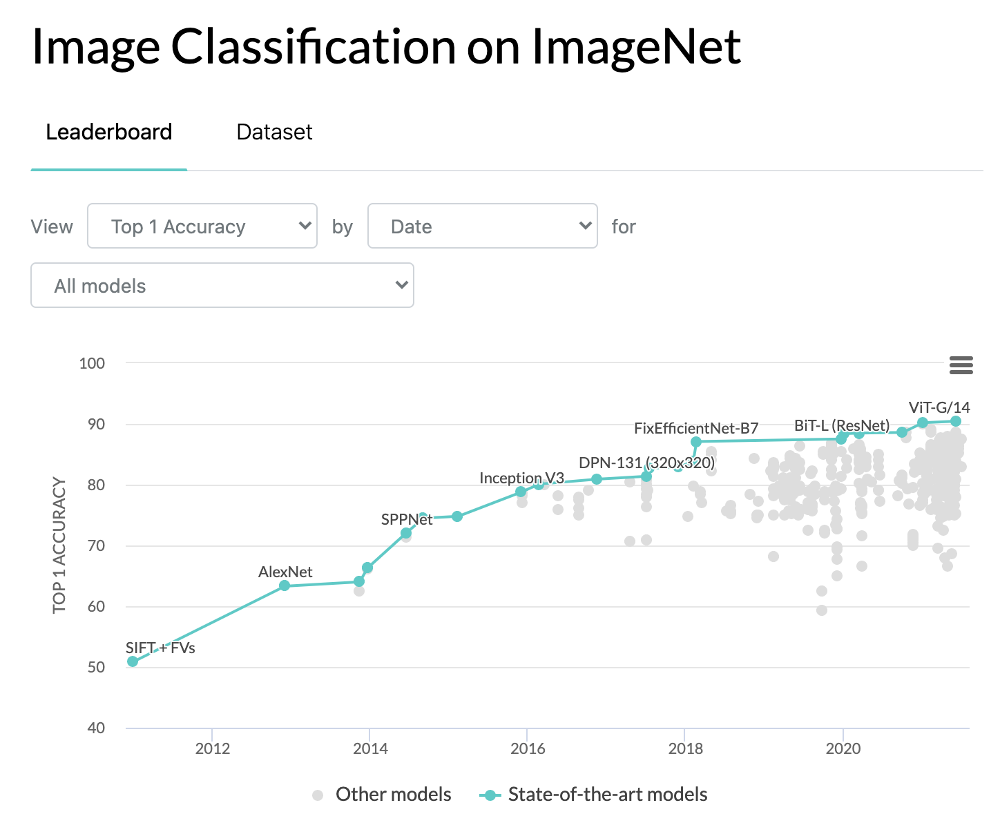
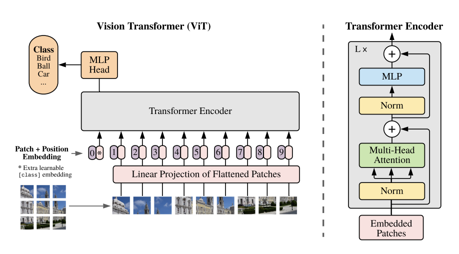
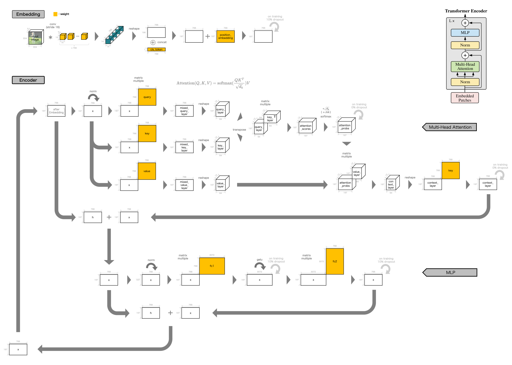
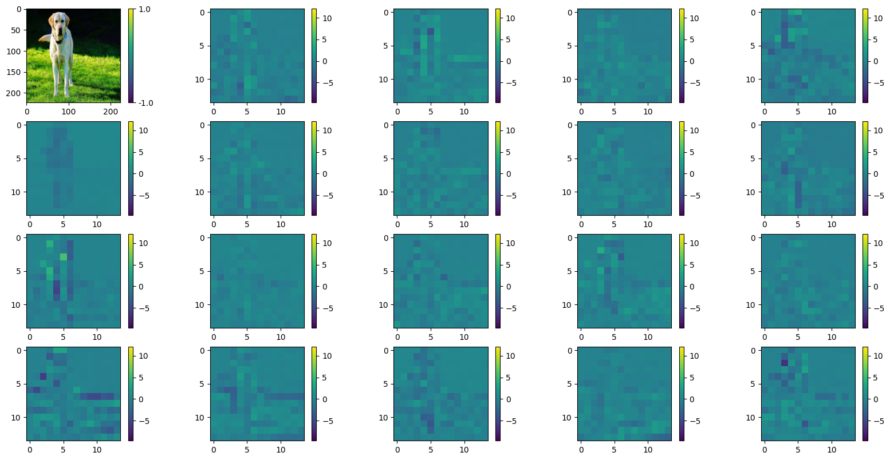
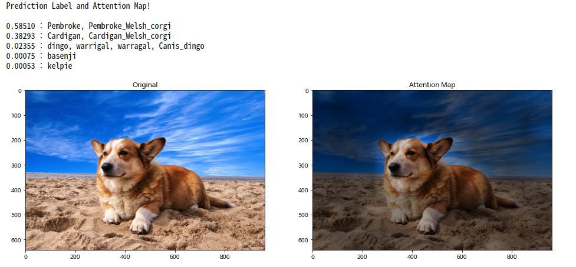
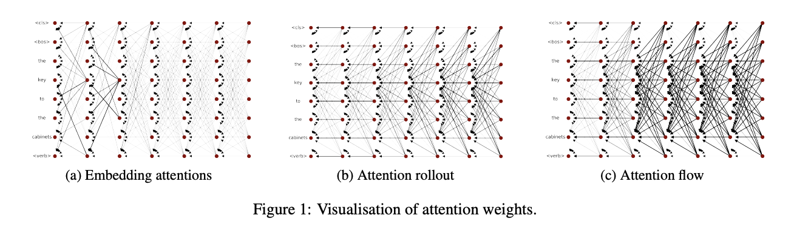
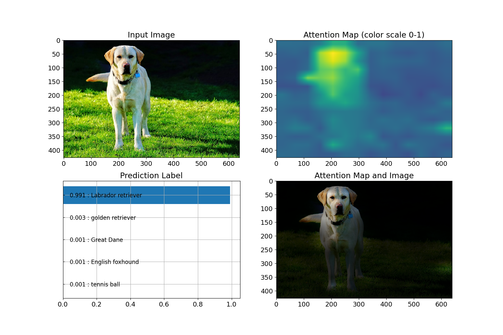

# Vision Transformer：畳み込み演算を用いない最新画像識別技術

# Vision Transformer：畳み込み演算を用いない最新画像識別技術

[](https://medium.com/@mucunwuxian?source=post_page---byline--84f06978a17f---------------------------------------)

[Taketo Kimura](https://medium.com/@mucunwuxian?source=post_page---byline--84f06978a17f---------------------------------------)

13 min read

·

Jul 10, 2021

--

Share

[ailia SDK](https://ailia.jp/)で使用できる機械学習モデルである「Vision Transformer（以下、ViT）」のご紹介です。  
[ailia SDK](https://ailia.jp/)はエッジ向け推論フレームワークであり、[ailia MODELS](https://github.com/axinc-ai/ailia-models)に公開されている機械学習モデルを使用することで、簡単にAIの機能をアプリケーションに実装することができます。

## ViTの概要

ViTは、大手Googleの研究部門であるGoogle Researchが発表した、畳込み演算を用いない最新画像識別技術です。  
スタンフォード大学が公開する、著名な画像識別コンペティションのIMAGENETにて、最高位の精度を記録しています。

画像識別とは、画像に写り込んでいる対象を予測するタスクとなります。  
IMAGENETでは、1,000もの識別種類がある画像50,000枚に対して、予測の正解率を競う形となっています。  
つまり、正解率0.1%の問題を50,000個答える形なのですが、ViTの識別精度が90%超の正答というので驚きです。

Press enter or click to view image in full size



出典：<https://paperswithcode.com/sota/image-classification-on-imagenet>（2021年7月時点）

ViTの公開時期は、論文の第一版が2020年10月、プログラムはその少し前であるようです。

[## An Image is Worth 16x16 Words: Transformers for Image Recognition at Scale

### While the Transformer architecture has become the de-facto standard for natural language processing tasks, its…

arxiv.org](https://arxiv.org/abs/2010.11929?source=post_page-----84f06978a17f---------------------------------------)

[## google-research/vision\_transformer

### Update (2.7.2021): Added the "When Vision Transformers Outperform ResNets..." paper, and SAM (Sharpness-Aware…

github.com](https://github.com/google-research/vision_transformer?source=post_page-----84f06978a17f---------------------------------------)

近年の画像識別で言えば、畳み込み演算を用いたConvolutional Neural Netwrkが、精度上位ランキングの常連でした。  
しかし、Vision Transformerは、畳み込み演算を用いずに最高位の精度を記録しているということで、その新規性に注目が集まっています。  
また、Transformerという技術は元々、画像処理分野でなく、自然言語処理分野にて、Google Researchが提案した手法となります。  
つまり、自然言語処理にて用いられていた技術が、画像処理に転用された形となります。

## ViTのアーキテクチャ

論文に紹介されているViTのネットワーク構成は以下となっています。

Press enter or click to view image in full size



出典：<https://arxiv.org/pdf/2010.11929.pdf>

大まかに流れを追うと、以下となります。

> *（１）画像をグリッド上に、バラバラに分割する  
> （２）（１）を重ね合わせた上で、輝度が格納されている縦横ピクセルの2次元配列を、1次元配列へとベクトル変換する  
> （３）（２）に対して、class token、position embeddingと呼ばれる調整可能な組み込み特徴を付与する  
> （４）（３）に対して、Transformer Encorderによる計算処理を、複数回実施する  
> （５）（４）で生成された特徴を用いて、1,000クラスの対象に対するsoftmax score（≒確率値）を計算する*

以上です。

尚、ここで面白い事実があり、論文には上記説明がされているものの、Google Researchが発行するGithubリポジトリでは、（１）について、実は異なる処理が行われています。  
その該当箇所の処理コードは、以下となります。  
（※2024/2/11、元リポジトリ変更に伴い、リンクアドレスを修正）

[## vision\_transformer/vit\_jax/models\_vit.py at main · google-research/vision\_transformer

### Contribute to google-research/vision\_transformer development by creating an account on GitHub.

github.com](https://github.com/google-research/vision_transformer/blob/main/vit_jax/models_vit.py?source=post_page-----84f06978a17f---------------------------------------#L261)

実際に行われていることは、以下です。

> *（１’）16x16などの大きめの畳込みフィルタで、ストライド幅16などの大きめの間引きをしながら、高圧縮畳み込み演算を行い、それをバラバラ画像の重ね合わせの代わりとする*

プログラムのコード上にも、以下のコメント記載があります。

```
# We can merge s2d+emb into a single conv; it's the same.  
x = nn.Conv(  
    features=self.hidden_size,  
    kernel_size=self.patches.size,  
    strides=self.patches.size,  
    padding='VALID',  
    name='embedding')(  
        x)
```

その為、具体的に行われていることを図示すると、以下のようになります。

Press enter or click to view image in full size



画像の出典：<https://pixabay.com/photos/labrador-retriever-dog-pet-labrador-6244939/>

Embedding処理の冒頭が、高圧縮畳み込み演算になっている形です。  
入力画像と、高圧縮畳み込み特徴の配列変数のサイズは、以下となります。

> 入力データのshape : [1, 3, 224, 224] # Batch, Channel, Height, Width  
> 畳み込み特徴のshape：[1, 768, 14, 14] # Batch, Channel, Height, Width

可視化すると、以下のようになります。  
左上が元画像で、それ以外が高圧縮畳込み特徴768枚の内の19枚となります。

Press enter or click to view image in full size



上記処理フローにおけるEmbeddingは、1度だけ実施されるものです。  
一方、Encoderは複数回実施されます。  
Encoderの出力が、再度入力へと合流している図の表現は、そういう意味になります。

Encoderで行われていることは、上段がSelf Attentionと呼ばれる処理、下段が一般的な多層パーセプトロン処理（以下、Multi Layer Perceptronの頭文字を取ってMLP）となります。  
そして、この2つを繰り返し行う構成が、ViTにおけるTransformer Encoderとなります。

尚、Attentionにおいて実現されている計算の意味合いについては、以下の記事が分かりやすいので、参照下さい。

[## 《日経Robo》自己注意機構：Self-Attention、画像生成や機械翻訳など多くの問題で最高精度

### ニューラルネットワークはあらかじめ設計されたネットワーク構造に従ってデータが入力から出力に向かって計算されながら伝搬していく。多くの問題では、事前知識を使って構造を設計することで性能を上げることができる。 ...

xtech.nikkei.com](https://xtech.nikkei.com/atcl/nxt/mag/rob/18/00007/00006/?source=post_page-----84f06978a17f---------------------------------------)

複数回のEncoder処理を繰り返した後は、処理を経て生成された特徴を用いて、一般的なsoftmax出力のMLPを行い、ネットワーク出力が完了します。

## ViTが実装されている各種リポジトリの紹介

若干本筋からは外れますが、Github上に公開して頂いているViTのリポジトリは幾つか存在し、それぞれに特徴がある為、紹介させて頂こうと思います。

## Get Taketo Kimura’s stories in your inbox

Join Medium for free to get updates from this writer.

Subscribe

Subscribe

Remember me for faster sign in

先ず、以下のgif動画が直感的に分かり易い、lucidrainsさんのvit-pytorchリポジトリです。

Press enter or click to view image in full size


[## lucidrains/vit-pytorch

### Implementation of Vision Transformer, a simple way to achieve SOTA in vision classification with only a single…

github.com](https://github.com/lucidrains/vit-pytorch?source=post_page-----84f06978a17f---------------------------------------)

Google Researchによるofficialリポジトリが、JAXでの実装であるのに対して、こちらのリポジトリはpytorchでの実装となっています。  
pytorchが好きな方は多いかと思いますので、非常に有り難い次第です。  
その為か、リポジトリに対するイイネ評価である「☆Star」の数は、officialよりも多くなっています。

こちらのリポジトリは、論文の通りにEmbeddingを行っています。  
つまり、以下の処理は言葉の通りとなっており、本当に一度も畳み込み演算を用いていない形となっています。

> *（１）画像をグリッド上に、バラバラに分割する*

その為、論文実装を純粋に再現したい場合に、重宝するリポジトリとなるかと思われます。  
しかし、明示的に事前学習モデルが用意されていない為、学習データを自分で用意した上で、1から学習を実施する必要があります。  
或いは、officialリポジトリにて用意されているJAXでの学習済みモデルを、pytorchへとconvertする必要があります。

次に、「☆Star」の数はそこまで多くないですが、非常に緻密に実装がされているlukemelasさんのPyTorch-Pretrained-ViTです。

[## lukemelas/PyTorch-Pretrained-ViT

### Install with pip install pytorch\_pretrained\_vit and load a pretrained ViT with: Or find a Google Colab example here…

github.com](https://github.com/lukemelas/PyTorch-Pretrained-ViT?source=post_page-----84f06978a17f---------------------------------------)

こちらのリポジトリもpytorch実装となっているのですが、主たるコンセプトは、Google Researchのofficialリポジトリが用意している事前学習済みモデルを、pytorchへと変換することになっています。  
JAX上での各種事前学習済みモデルの重み値を、pytorchにて実装された汎用的なViTモデルに、convertをしつつ挿入していく形となっています。

最後に、attention mapの実装までがされている、jeonsworldさんのViT-pytorchリポジトリです。

[## jeonsworld/ViT-pytorch

### Pytorch reimplementation of Google's repository for the ViT model that was released with the paper An Image is Worth…

github.com](https://github.com/jeonsworld/ViT-pytorch?source=post_page-----84f06978a17f---------------------------------------)

基本的にofficialリポジトリと同様のアルゴリズムが、pytorchにて実装されている上で、特定の学習済みモデルのconvertをしつつ、処理を行う形となっています。  
かつ、それらを可視化しつつ一連実施してくれるnotebookも用意がされていますので、とても親切です。  
以下は、そのnotebookの出力結果となります。

Press enter or click to view image in full size



識別を行ってくれた上で、判断の根拠とならない箇所を、暗くするようなattention mapの可視化もしてくれています。  
このattention mapの実装は、Google Researchのofficialリポジトリにも搭載されておらず、jeonsworldさんが以下リポジトリから踏襲したもののようです。

[## samiraabnar/attention\_flow

### This repository contain implementations of Attention Rollout and Attention Flow algorithms, which are post hoc methods…

github.com](https://github.com/samiraabnar/attention_flow?source=post_page-----84f06978a17f---------------------------------------)

attention flowの論文と、論文中に記載される概念図は、以下となります。

[## Quantifying Attention Flow in Transformers

### In the Transformer model, "self-attention" combines information from attended embeddings into the representation of the…

arxiv.org](https://arxiv.org/abs/2005.00928?source=post_page-----84f06978a17f---------------------------------------)

Press enter or click to view image in full size



出典：<https://arxiv.org/pdf/2005.00928.pdf>

ailia-modelsに搭載されているViTについては、jeonsworldさんの実装を踏襲させて頂いています。  
尚、ailia-modelsについては、動画入力の対応もしていますので、attention mapがフレーム毎にどう推移していくかを、連続的に確認することもできます。

## ailia SDKからの利用

ailia SDKで用意しているvitのプログラムは、以下となります。

[## axinc-ai/ailia-models

### (from https://pixabay.com/photos/labrador-retriever-dog-pet-labrador-6244939/) Automatically downloads the onnx and…

github.com](https://github.com/axinc-ai/ailia-models/tree/master/image_classification/vit?source=post_page-----84f06978a17f---------------------------------------)

画像に対して処理を実行するには、下記のコマンドを使用します。

```
$ python vit.py -i input.png
```

実行例が以下です。

（画像への実行）

Press enter or click to view image in full size



（動画への実行）

Press enter or click to view image in full size


動画の出典：<https://pixabay.com/videos/car-racing-motor-sports-action-74/>

ax株式会社はAIを実用化する会社として、クロスプラットフォームでGPUを使用した高速な推論を行うことができるailia SDKを開発しています。  
ax株式会社ではコンサルティングからモデル作成、SDKの提供、AIを利用したアプリ・システム開発、サポートまで、 AIに関するトータルソリューションを提供していますのでお気軽に[お問い合わせ](https://axinc.jp/)ください