# Vision Outlooker for Visual Recognition：視覚認識のための見通し視覚

# Vision Outlooker for Visual Recognition：視覚認識のための見通し視覚

[](https://medium.com/@mucunwuxian?source=post_page---byline--b281cce4e89f---------------------------------------)

[Taketo Kimura](https://medium.com/@mucunwuxian?source=post_page---byline--b281cce4e89f---------------------------------------)

41 min read

·

Mar 3, 2024

--

Share

ailia SDKで使用できる機械学習モデルである「Vision Outlooker for Visual Recognition（以下、VOLO）」のご紹介です。  
ailia SDKはエッジ向け推論フレームワークであり、ailia MODELSに公開されている機械学習モデルを使用することで、簡単にAIの機能をアプリケーションに実装することができます。

## **VOLOの概要**

VOLOは、Sea AI Labというシンガポールの会社と、シンガポール国立大学が発表した、ViTを改良したモデルです。  
スタンフォード大学が公開する、著名な画像識別コンペティションのIMAGENETにて、2021年6月当時、SOTA精度を記録しています。

尚、画像識別とは、画像に写り込んでいる対象を予測するタスクとなります。  
IMAGENETは、1,000もの識別種類がある画像50,000枚に対して、予測の正解率を競うコンペとなります。  
つまり、正解率0.1%の問題を50,000個答える形なのですが、VOLOの識別精度は87%超です。  
尚、「no extra data（追加の学習データ無し）」で、その精度に到達するモデルとして、当時新規性が高かったと論文内で教示してくれています。

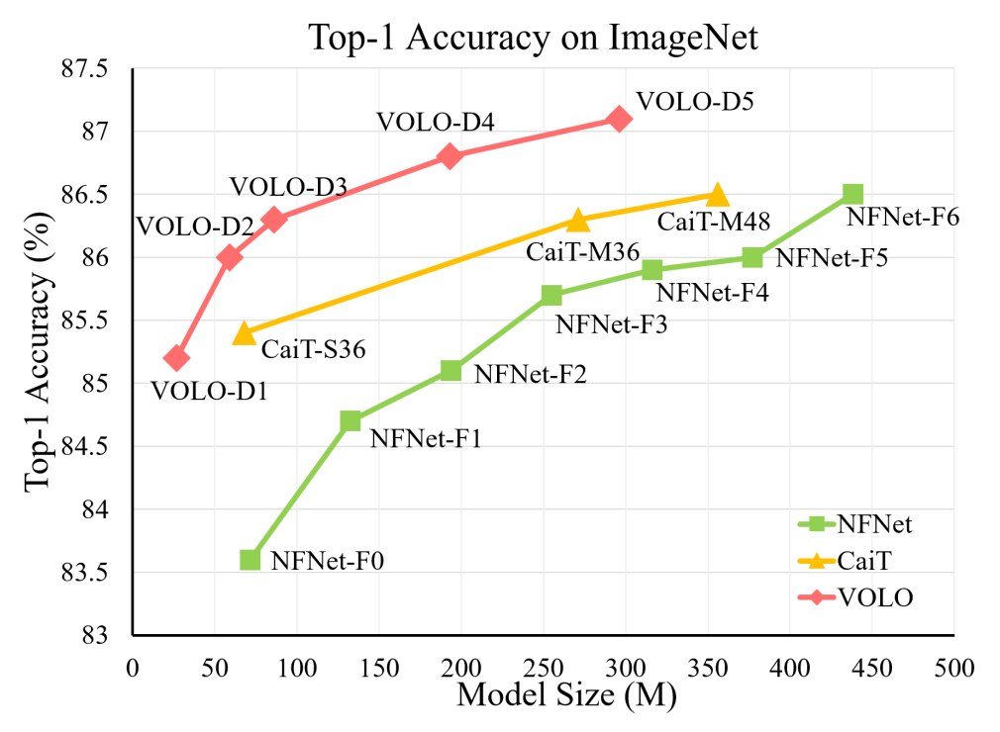

出典：<https://arxiv.org/pdf/2106.13112.pdf>

## VOLOのアーキテクチャ

VOLOの新規性は、「Vision Outlooker for Visual Recognition」 という論文名称にも含まれる、「Outlook Attention」というネットワークの部分構造となります。  
Outlook Attentionは、主に遠視眼的に視覚特徴の共起を捉えようとしがちなViTのself-attentionに対する解決方法提案となります。  
従来ViTモデルのself-attentionレイヤーについて、その1/4をOutlook Attentionに置き換えることで、精度向上を実現したとのことです。  
その上で、シンプルであり軽量であるという点も貢献主張となっています。

個人的には、近視眼的に視覚特徴の共起を捉えようとしがちなCNNのconvolutionに対する解決策にもなり得ると考えます。  
また、多く導入し過ぎると精度が飽和するとのことで、一種の正則化のような効果をもたらすものだろうとも考えます。

具体的には、以下図がOutlook Attentionの構造となります。  
これは、論文中に記載されている図で、この構造を、ネットワーク中に部分的に導入します。

Press enter or click to view image in full size

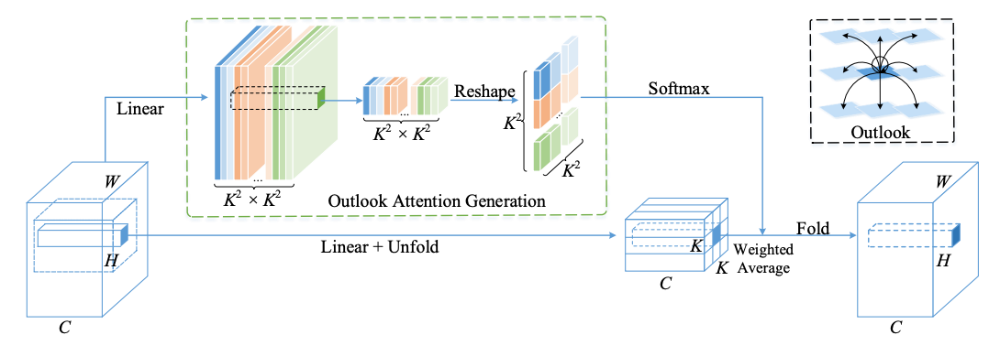

出典：<https://arxiv.org/pdf/2106.13112.pdf>

## Outlook Attentionのアルゴリズム

VOLO提案の核であるOutlook Attentionですが、次にはそのアルゴリズムについて、詳細に追っていきたいと思います。  
以下が、論文中にあるOutlook Attentionのアルゴリズム説明となります。

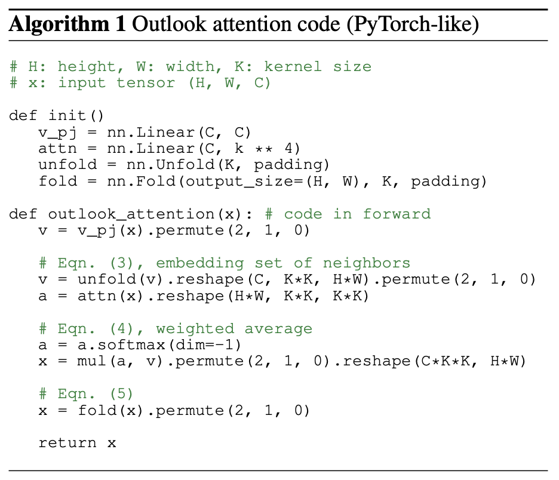

出典：<https://arxiv.org/pdf/2106.13112.pdf>

先程の構成図と上記のアルゴリズム説明は、2つとも同じOutlook Attentionについての説明になりますが、構成図の方がやや抽象的な処理イメージを想起するものであるのに対して、アルゴリズム説明は具体的にロジックを追っているものとなっています。  
しっかり理解したい方には、アルゴリズム説明を追ってもらう方が近道かと思われます。  
ただし、アルゴリズム説明についても、本質的でない部分が少し省略されているようでしたので、当該記事ではその部分についても補足をさせて頂こうと思います。

以降にて、アルゴリズム説明を各要素ずつに分けて、確認していきたいと思います。  
変数表記については、「**# H: height, W: width, K: kernel size, x: input tensor**」というコメントに沿って記載をしていきます。  
また、「**permute(2, 1, 0)**」という処理が度々登場するのですが、実際のVOLOリポジトリの実装では「**permute(2, 0, 1)**」となっており、また、「**permute(2, 0, 1)**」というアルゴリズムが一般的でもある為、全て「**permute(2, 1, 0) → permute(2, 0, 1)**」と置き換えた上で、掘り下げていこうと思います。  
（以降、該当箇所には念の為に「**permute(2, 0, 1) ※**」と記載します。）

### **「① v = v\_pj(x).permute(2, 0, 1) ※」**

それでは先ずは、「**def outlook\_attention**」内にある「**① v = v\_pj(x).permute(2, 0, 1) ※**」についてです。

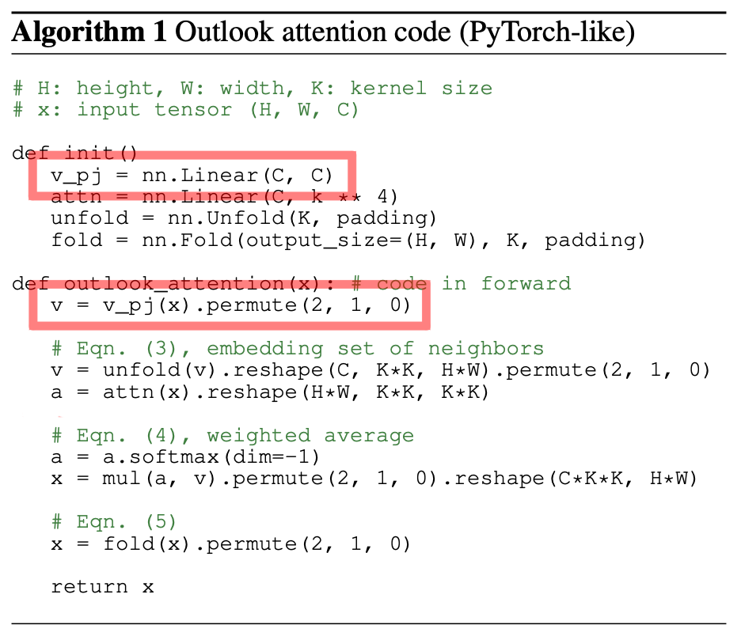

**① v = v\_pj(x).permute(2, 0, 1) ※**

分解すると、「**①−① v = v\_pj(x)**」という処理と、「**①−② v = v.permute(2, 0, 1) ※**」という2つの処理が、順番に行われる形です。

「**①−① v = v\_pj(x)**」については、「**# x: input tensor (H, W, C)**」というコメントにあるように、（**H, W, C**）という次元構成で入力された特徴テンソルxが、（**C, C**）次元の重みとの行列積にかけられて、（**H, W, C**）という次元構成の特徴テンソルvとして出力されます。

尚、線形代数の考え方としては、2次元の重み行列とは同じ2次元の特徴行列でないと掛け合わせられませんが、PyTorchではその点がアルゴリズムにて対応されています。  
2次元の重み行列と、N次元の特徴テンソルとの行列積を取る、即ち、Linear演算（行列積）を実施する仕様については、以下のstack overflowを見ると分かり易いです。  
要は、N次元の特徴テンソルを行列にほぐしながら、順々に行列積を計算していくアルゴリズムとなっています。

[## Multi dimensional inputs in pytorch Linear method?

### When building a simple perceptron neural network we usuall passes a 2D matrix of input of format (batch\_size,features)…

stackoverflow.com](https://stackoverflow.com/questions/58587057/multi-dimensional-inputs-in-pytorch-linear-method/77991481?source=post_page-----b281cce4e89f---------------------------------------#77991481)

イラストにすると、以下のようになります。

Press enter or click to view image in full size

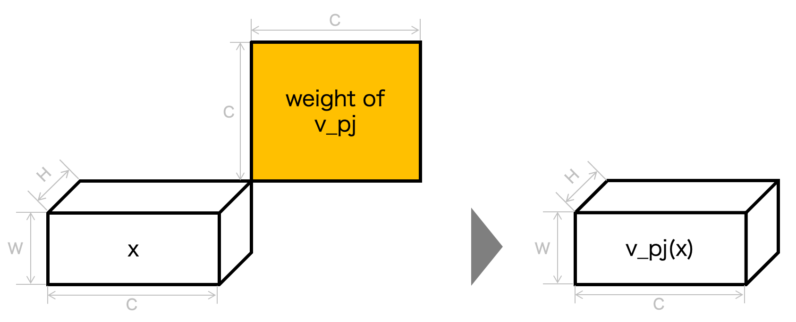

**v = v\_pj(x)**

「**v\_pj(x)**」の重みは2次元の行列ですので、入力の3次元よりも、次元数が1つ少ない形になります。  
ですが、入力データにHセット存在するW×Cの2次元行列と、C×Cの2次元行列である重みとの行列積を繰り返し実践する形で、上手く計算が行われます。

Press enter or click to view image in full size

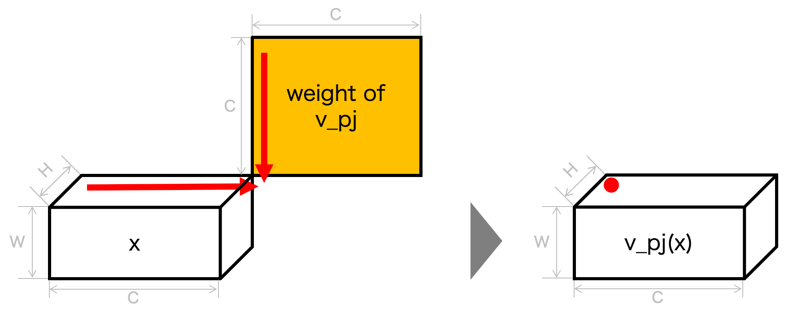

v = v\_pj(x) の計算の内の1つ

尚、上記イラストより「**v\_pj**」の重みが、空間位置毎に存在するC次元の特徴ベクトルとの共起を取っていることも見て取れるかと思います。

「**①−② v = v.permute(2, 0, 1) ※**」については、次元入れ替えになりますので、これで特徴のテンソルが（**H, W, C**）という次元構成から（**C, H, W**）へと変換されます。  
次元の入れ替えはお作法として、概ね末尾の1次元か2次元を、次なる演算オペレーションの対象になるように調整する形となります。  
この場合は、後ろに控えるunfoldの処理を（**H, W**）次元に対して適用したい為に、このような次元入替を実施しています。

### 「**② v = unfold(v).reshape(C, K\*K, H\*W).permute(2, 0, 1) ※**」

さて、次に「**② v = unfold(v).reshape(C, K\*K, H\*W).permute(2, 0, 1) ※**」についてです。

Press enter or click to view image in full size

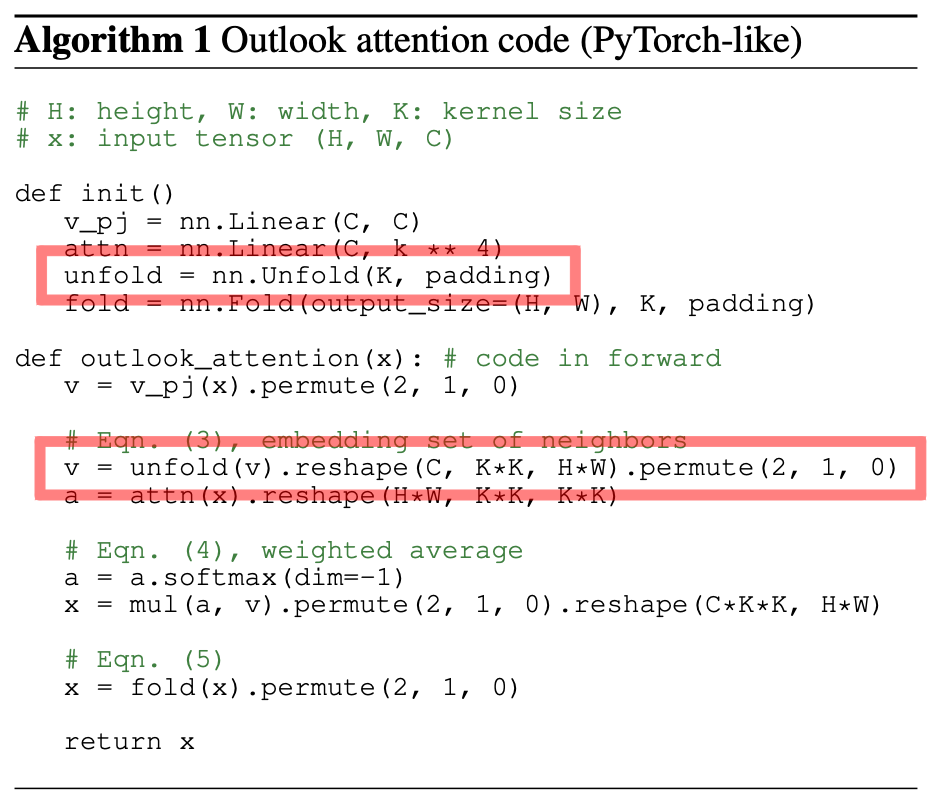

**② v = unfold(v).reshape(C, K\*K, H\*W).permute(2, 0, 1) ※**

分解すると、「**②−① v = v\_unfold(x)**」、「**②−② v = v.reshape(C, K\*K, H\*W)**」、「**②−③ v = v.permute(2, 0, 1) ※**」という3つの処理が順番に行われる形です。

ここで、unfoldの補足をさせて頂きます。  
GithubにリリースされているVOLOの実装においては、PyTorchにて実装されているunfold機能が用いられています。

[## Unfold — PyTorch 2.2 documentation

### Join the PyTorch developer community to contribute, learn, and get your questions answered.

pytorch.org](https://pytorch.org/docs/stable/generated/torch.nn.Unfold.html?source=post_page-----b281cce4e89f---------------------------------------)

unfoldの挙動ですが、例えば、「**torch.nn.Unfold(kernel\_size=3, dilation=1, padding=1, stride=1)**」という設定で処理を行った場合には、結果のイメージとして、以下のイラストのような出力がされる形となります。  
スライディングウィンドウで参照した部分画像を、冗長に縦横に連結していくイメージです。

Press enter or click to view image in full size

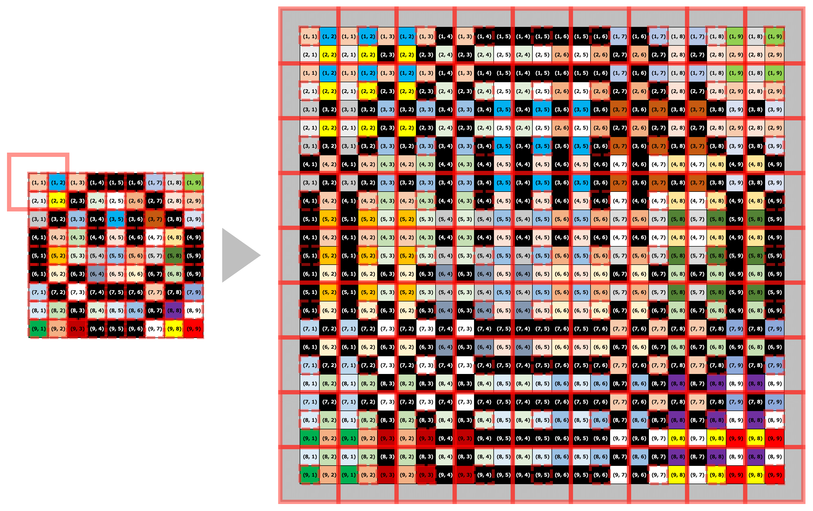

**torch.nn.Unfold(kernel\_size=3, dilation=1, padding=1, stride=1)**

実際には、PyTorchのunfoldの出力は、上記赤枠毎のベクトルが管理される形となります。  
（**C\*K\*K, H\*W**）という次元構成です。  
以下のコードを実施して頂くと、一連の関係性が確認できますので、ご参考までに。

```
import torch  
  
unfold = torch.nn.Unfold(kernel_size=3, dilation=1, padding=1, stride=1)  
tmp = (torch.arange(16) + 1).reshape(1, 1, 4, 4).to(torch.float32)  
print('tmp =\n', tmp)  
print()  
print('unfold(tmp).shape =\n', unfold(tmp).shape)  
print()  
print('unfold(tmp).reshape(1, 1, 3, 3, 4, 4).permute(0, 1, 4, 2, 5, 3).reshape(12, 12) =\n',  
      unfold(tmp).reshape(1, 1, 3, 3, 4, 4).permute(0, 1, 4, 2, 5, 3).reshape(12, 12))
```

↓（実行結果）

```
tmp =  
 tensor([[[[1., 2., 3.],  
          [4., 5., 6.],  
          [7., 8., 9.]]]])  
  
unfold(tmp).shape =  
 torch.Size([1, 9, 9])  
  
unfold(tmp).reshape(1, 1, 3, 3, 3, 3).permute(0, 1, 4, 2, 5, 3).reshape(9, 9) =  
 tensor([[0., 0., 0., 0., 0., 0., 0., 0., 0.],  
        [0., 1., 2., 1., 2., 3., 2., 3., 0.],  
        [0., 4., 5., 4., 5., 6., 5., 6., 0.],  
        [0., 1., 2., 1., 2., 3., 2., 3., 0.],  
        [0., 4., 5., 4., 5., 6., 5., 6., 0.],  
        [0., 7., 8., 7., 8., 9., 8., 9., 0.],  
        [0., 4., 5., 4., 5., 6., 5., 6., 0.],  
        [0., 7., 8., 7., 8., 9., 8., 9., 0.],  
        [0., 0., 0., 0., 0., 0., 0., 0., 0.]])
```

よって、「**②−① v = v\_unfold(x)**」の処理では、（**C, H, W**）の次元構成で入力された特徴テンソルが、（**C\*K\*K, H\*W**）という次元構成で出力される形となります。

「**②−② v = v.reshape(C, K\*K, H\*W)**」は、その（**C\*K\*K, H\*W**）という次元構成を、（**C, K\*K, H\*W**）という形の3次元にバラします。

そして、「**②−③** **v = v.permute(2, 0, 1) ※**」での次元入替えにて、特徴のテンソルが（**C, K\*K, H\*W**）という次元構成から、（**H\*W, K\*K, C**）への変換されます。

これが、「**② v = unfold(v).reshape(C, K\*K, H\*W).permute(2, 0, 1) ※**」という処理の内容となります。

ただしですが、実際のVOLOリポジトリの「**②−① v = v\_unfold(x)**」においては、「**torch.nn.Unfold(kernel\_size=3, dilation=1, padding=1, stride=2)**」という設定がデフォルトであるようでした。  
strideが2であることが注目ポイントです。  
strideが2であると、スライディングウィンドウでの参照が1ピクセルスキップしながらとなりますので、以下のようになります。  
先程のstrideが1の場合に比べて、出力がスリムになる形です。

Press enter or click to view image in full size

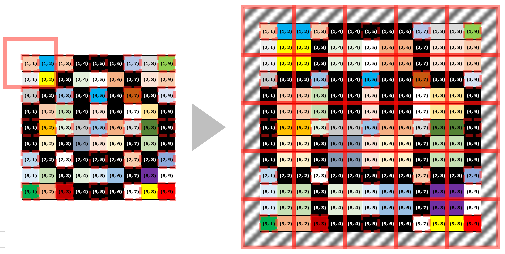

**torch.nn.Unfold(kernel\_size=3, dilation=1, padding=1, stride=2)**

以下が、strideが2の場合のサンプルコードです。

```
import torch  
  
unfold = torch.nn.Unfold(kernel_size=3, dilation=1, padding=1, stride=2)  
tmp = (torch.arange(16) + 1).reshape(1, 1, 4, 4).to(torch.float32)  
print('tmp =\n', tmp)  
print()  
print('unfold(tmp).shape =\n', unfold(tmp).shape)  
print()  
print('unfold(tmp).reshape(1, 1, 3, 3, 2, 2).permute(0, 1, 4, 2, 5, 3).reshape(6, 6) =\n',  
      unfold(tmp).reshape(1, 1, 3, 3, 2, 2).permute(0, 1, 4, 2, 5, 3).reshape(6, 6))
```

↓（実行結果）

```
tmp =  
 tensor([[[[ 1.,  2.,  3.,  4.],  
          [ 5.,  6.,  7.,  8.],  
          [ 9., 10., 11., 12.],  
          [13., 14., 15., 16.]]]])  
  
unfold(tmp).shape =  
 torch.Size([1, 9, 4])  
unfold(tmp).reshape(1, 1, 3, 3, 2, 2).permute(0, 1, 4, 2, 5, 3).reshape(6, 6) =  
 tensor([[ 0.,  0.,  0.,  0.,  0.,  0.],  
        [ 0.,  1.,  2.,  2.,  3.,  4.],  
        [ 0.,  5.,  6.,  6.,  7.,  8.],  
        [ 0.,  5.,  6.,  6.,  7.,  8.],  
        [ 0.,  9., 10., 10., 11., 12.],  
        [ 0., 13., 14., 14., 15., 16.]])
```

つまり、VOLOリポジトリのデフォルトの処理仕様では、「**②−① v = v\_unfold(x)**」に対して、（**C, H, W**）という次元構成で入力された特徴テンソルが、出力として（**C\*K\*K, H/2\*W/2**）という次元構成に変換されます。

より具体的に、実際に（**H=224, W=224, C=3**）の画像を入力して、VOLOの処理をデバッグしてみますと…。  
前段の処理を経て入力次元構成が（**C=192, H=28, W=28**）となった特徴テンソルが、「**②−① v = v\_unfold(x)**」によって、（**C\*K\*K=192\*3\*3=1728, H/2\*W/2=28/2\*28/2=196**）となって出力されました。

つまり、本質的には同様の処理を行っているものの、論文に記載されているアルゴリズムと、VOLOリポジトリにて実際に行われている処理は、厳密には異なった次第です。

また、「**②−② v = v.reshape(C, K\*K, H\*W)**」と「**②−③** **v = v.permute(2, 0, 1) ※**」についても、大きな違いが存在しました。  
その違いは、「Multi-Head Attention」の 考え方を踏襲しているか否かです。  
論文における説明表記上は、Multi-Head Attentionの考え方を踏襲していない、Single-Head Attentionの考え方に基づくアルゴリズムが記載されています。  
しかし、実際のVOLOリポジトリの処理上は、Multi-Head Attentionの考え方が踏襲されたアルゴリズムが実装されている形です。

改めまして、今、説明をさせてもらっているのはOutlook Attentionであり、Multi-Head Attentionとは別の考え方になります。  
そして、VOLOリポジトリの実装としては、Multi-Head Attentionの考え方が踏襲されている部分があります。  
尚、厳密にMulti-Head Attentionそのものが導入されている訳ではなく、Outlook Attentionにおいて、Multi-Head Attentionと同様のアイデアが踏襲されている処理部分が存在する形となります。

その考え方より、実際には上記reshapeとpermuteが、「**②−②’ v = v.reshape(Head数, C÷Head数, K\*K, H/2\*W/2)**」と「**②−③’ v = v.permute(0, 3, 2, 1)**」という形になっています。  
尚、（**Head数**）が1の場合には、Single-Head Attentionの考え方と合致します。  
（**Head数**）が2以上の場合に、Multi-Head Attentionの考え方を踏襲している形になります。

ここで、ご存知の方も多いと思いますが、補足までにMulti-Head Attentionなんたるかにつきまして、触れさせて頂こうと思います。  
Multi-Head Attentionは、（**C**）のChannel次元をHead毎に分割した上で、transformerのself-attentionにかける仕組みです。  
こうすることで、脇役的で目立たない共起表現の貢献が、主要な目立つ共起表現の後ろに隠れてしまう現象、或いは、押し潰されてしまう現象の抑止を期待するものです。

尚、Multi-Head AttentionのHeadの分割数はチューニングパラメーターとなります。  
最適な数は一概に言えず、解きたい問題別にチューニングをする必要があります。  
また、一般にヘッドを増やすと精度が上がるものの、学習時間とメモリ消費量が増える為、実用も踏まえてそのトレードオフと向き合うことが必要とのことです。  
加えて、 pre-trainedのモデルを用いる場合には、Head数はpre-train時の構造に準ずることが一般的です。  
その辺りについて、以下記事に分かりやすくまとめてありましたので、良ければ参照下さい。

[## How do you choose the optimal number of heads for multi-head attention?

### Learn what multi-head attention is, why it is useful, how to choose and tune the number of heads, and what are some…

www.linkedin.com](https://www.linkedin.com/advice/3/how-do-you-choose-optimal-number-heads?source=post_page-----b281cce4e89f---------------------------------------)

理解のために、Multi-Head Attentionの具体的な構造をイラストにしてみますと、例えば以下のようになります。  
一般的なViTにて、Head数が12のケースを記載しています。

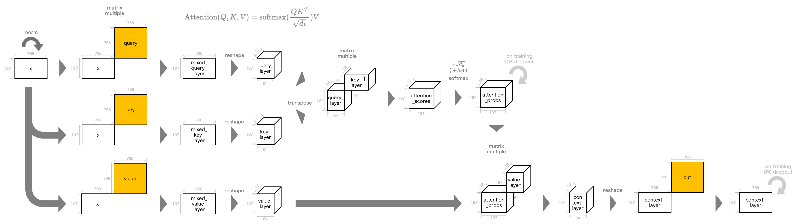

Multi-Head Attention

2次元の行列を、3次元のテンソルにreshapeしているところが、（**C**）のChannel次元をHead数分だけ分割し、Head毎に割り当てている処理部分となります。  
また、逆に3次元のテンソルを、2次元の行列にreshapeしているところが、各Head毎の結果をconcatによって集約している処理部分となります。  
このような分割・割当・集約を行うことで、Multi-Head Attention全体の入出力は、何れのHead数の場合でも同じ次元構成が保たれる形になります。

別途、以下のイラストもとても分かりやすかったので、参考までに載せさせて頂きます。  
左から2個目の図が、Multi-Head Attentionの説明になっています。

Press enter or click to view image in full size

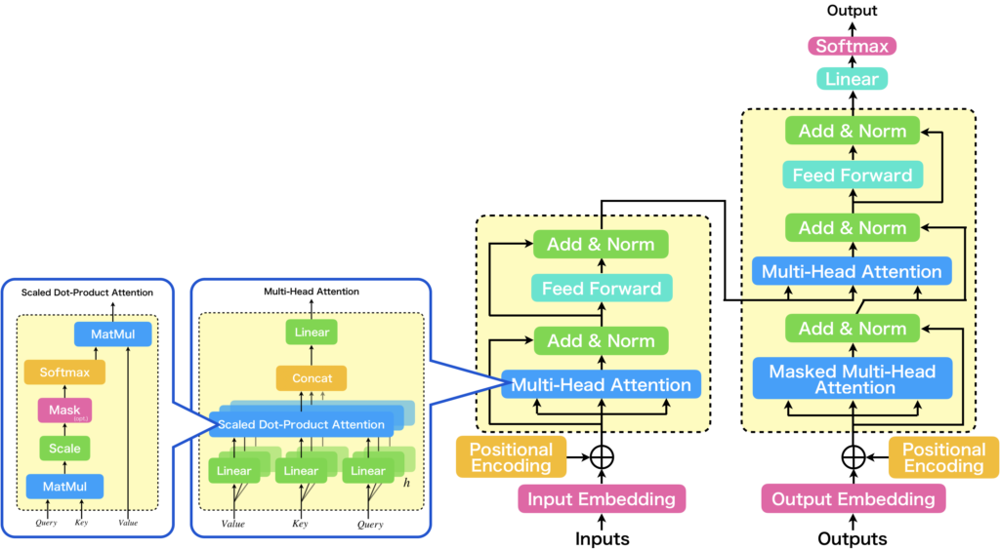

<https://developers.agirobots.com/jp/wp-content/uploads/2023/02/image-3-2048x1125.png>

さて、話をVOLOのアルゴリズム説明に戻そうと思います。  
上記の背景から、VOLOのデフォルト処理の実際は、入力の次元構成（**C, H, W**）が、「**②−① v = v\_unfold(x)**」によって（**C\*K\*K, H/2\*W/2**）へ、「**②−②’ v = v.reshape(Head数, C÷Head数, K\*K, H/2\*W/2)**」によって（**Head数, C÷Head数, K\*K, H/2\*W/2**）へ、「**②−③’ v = v.permute(0, 3, 2, 1)**」によって、（**Head数, H/2\*W/2, K\*K, C÷Head数**）へと変換される流れとなります。

繰り返しになりますが、本質的にはアルゴリズム説明の記載と同様の処理が行われています。

### 「**③ a = attn(x).reshape(H\*W, K\*K, K\*K)**」

次は、「**③ a = attn(x).reshape(H\*W, K\*K, K\*K)**」についてです。

Press enter or click to view image in full size

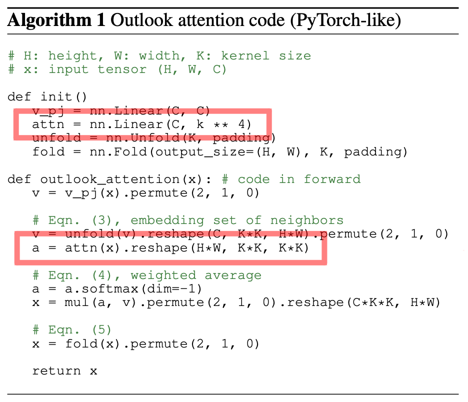

**③ a = attn(x).reshape(H\*W, K\*K, K\*K)**

分解すると、「**③−① a = attn(x)**」と「**③−② a = a.reshape(H\*W, K\*K, K\*K)**」という2つの処理が順番に行われる形です。

「**③−① a = attn(x)**」については、入力のxに対して処理を行っているもので、出力vとは別の計算ルートとなっています。  
後に、2つの計算ルートは「**mul(a, v)**」という計算にて、aとvとが合流する形となります。  
「**③−① a = attn(x)**」の処理によって、（**H, W, C**）という次元構成で入力された画像特徴テンソルが、（**C, K⁴**）次元の重みでの行列積にかけられて、（**H, W, K⁴**）という次元にて出力がされます。

そして、「**③−② a = a.reshape(H\*W, K\*K, K\*K)**」にて、（**H, W, K⁴**）という次元構成の出力を、（**H\*W, K\*K, K\*K**）という次元構成へと変換しています。

尚、実際には、ここの処理にもMulti-Head Attentionの考え方を踏襲したアイデアに合わせる形で、VOLOリポジトリの実装がされています。  
「**attn = nn.Linear(C, k\*\*4)**」は、「**attn = nn.Linear(C, k\*\*4 \* Head数)**」と定義されています。  
Head数倍だけ、計算量がリッチになっている形です。

[## volo/models/volo.py at main · sail-sg/volo

### VOLO: Vision Outlooker for Visual Recognition. Contribute to sail-sg/volo development by creating an account on GitHub.

github.com](https://github.com/sail-sg/volo/blob/main/models/volo.py?source=post_page-----b281cce4e89f---------------------------------------#L65)

更に、unfoldをstride=2の設定で実施した処理と同期を取る形で、「**③ a = attn(x).reshape(H\*W, K\*K, K\*K)**」を行う前には、stride=2で実施されるpoolingの処理と、そのpoolingを行うための次元構成変換も含まれています。

整理をすると、VOLOリポジトリには、「**③−①’ a = permute(2, 0, 1)**」、「**③−②’ a = pool(x)**」、「**③−③’ a = permute(1, 2, 0)**」、「**③−④’ a = attn(x)**」、「**③−⑤’ a = a.reshape(H/2\*W/2, Head数, K\*K, K\*K)**」、「**③−⑥’ a = a.permute(1, 0, 2, 3)**」という6つの処理が実装されています。

「**③−①’ a = permute(2, 0, 1)**」は、pooling処理を行うために、入力xの次元構成（**H, W, C**）を、（**C, H, W**）に変換しています。  
これは、poolingの処理を（**H, W**）次元に対して適用したい、即ち、特徴テンソルを（**H, W**）次元方向に対して圧縮したい為です。

## Get Taketo Kimura’s stories in your inbox

Join Medium for free to get updates from this writer.

Subscribe

Subscribe

Remember me for faster sign in

次に、stride=2のpooling処理「**③−②’ a = pool(x)**」を実施します。  
この処理によって、（**C, H, W**）の次元構成が、（**C, H/2, W/2**）へと変換されます。  
尚、poolingの種別としては、AveragePoolingが用いられています。

次に、次元構成（**C, H/2, W/2**）を、後に控えるLinear演算のために、「**③−③’ a = permute(1, 2, 0)**」にて、（**H/2, W/2, C**）へと変換します。

そして、「**③−④’ a = attn(x)**」を実施して、次元構成が（**H/2, W/2, C**）から（**H/2, W/2, K⁴\*Head数**）となります。

最後に調整の処理として、「**③−⑤’ a = a.reshape(H/2\*W/2, Head数, K\*K, K\*K)**」にて、次元構成が（**H/2, W/2, K⁴\*Head数**）から（**H/2\*W/2, Head数, K\*K, K\*K**）へと変換された後、「**③−⑥’ a = a.permute(1, 0, 2, 3)**」にて、（**Head数, H/2\*W/2, K\*K, K\*K**）へと変換されます。

### 「**④ a = a.softmax(dim=-1)**」

さて、次は「**④ a = a.softmax(dim=-1)**」についてです。

Press enter or click to view image in full size

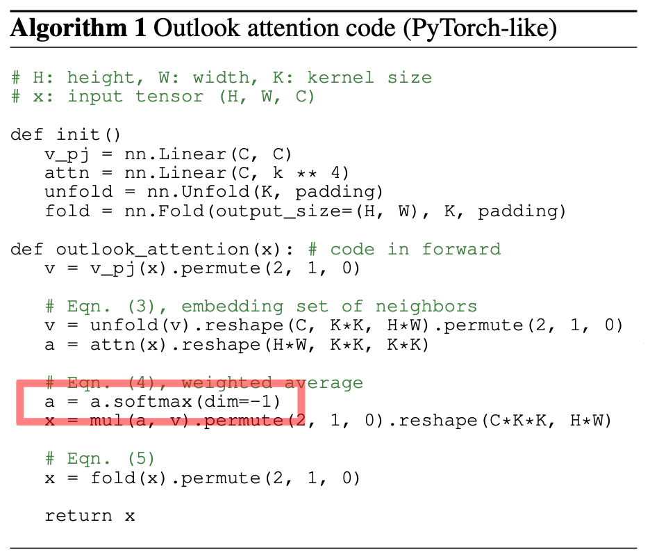

**④ a = a.softmax(dim=-1)**

ここは、シンプルなsoftmaxの適用です。  
実際のコードでは、softmaxによる非線形変換を実施する前に、「1 / √(C ÷ Head数)」で求められる数値を掛けて、特徴値をスケーリングしています。  
尚、softmax前に特徴値のスケールを小さくする操作は、softmax後の特徴テンソル値の分散を抑える効果があります。  
それにつきましては、以下の記事に分かりやすい説明がありますので、教のある方は参考にして下さい。

[## 《日経Robo》自己注意機構：Self-Attention、画像生成や機械翻訳など多くの問題で最高精度

### ニューラルネットワークはあらかじめ設計されたネットワーク構造に従ってデータが入力から出力に向かって計算されながら伝搬していく。多くの問題では、事前知識を使って構造を設計することで性能を上げることができる。例えば、畳み込みニューラルネットワー…

xtech.nikkei.com](https://xtech.nikkei.com/atcl/nxt/mag/rob/18/00007/00006/?source=post_page-----b281cce4e89f---------------------------------------)

### 「**⑤ x = mul(a, v).permute(2, 0, 1).reshape(C\*K\*K, H\*W) ※**」

次は、「**⑤ x = mul(a, v).permute(2, 0, 1).reshape(C\*K\*K, H\*W) ※**」です。

Press enter or click to view image in full size

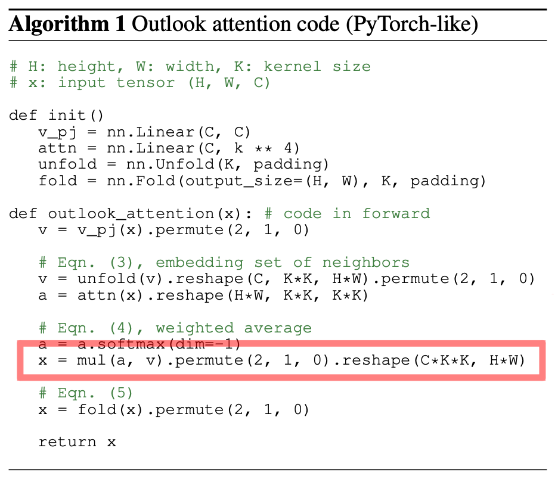

**⑤ x = mul(a, v).permute(2, 0, 1).reshape(C\*K\*K, H\*W) ※**

分解すると、「**⑤−① x = mul(a, v)**」、「**⑤−② x = x.permute(2, 0, 1) ※**」、「**⑤−③ x = x.reshape(C\*K\*K, H\*W)**」という3つの処理が順番に行われる形です。

「**⑤−① x = mul(a, v)**」は、行列積の実施です。  
アルゴリズム説明の記載ですと、（**H\*W, K\*K, K\*K**）という次元構成のaと、（**H\*W, K\*K, C**）という次元構成のvとの行列積で、（**H\*W, K\*K, C**）という次元構成に出力がされる流れです。

以下コードのような形です。

```
import torch  
  
H = 4  
W = 4  
K = 3  
C = 10  
  
a = torch.randn(H*W, K*K, K*K)  
v = torch.randn(H*W, K*K, C)  
  
print('a.shape =', a.shape)  
print('v.shape =', v.shape)  
  
x = a @ v  
  
print('x.shape =', x.shape)
```

↓（実行結果）

```
a.shape = torch.Size([16, 9, 9])  
v.shape = torch.Size([16, 9, 10])  
x.shape = torch.Size([16, 9, 10])
```

先述の通り、実際にはこの処理にも、Multi-Head Attentionの考え方を踏襲したアイデアの影響があります。  
aの次元構成は（**Head数, H/2\*W/2, K\*K, K\*K**）であり、vの次元構成は（**Head数, H/2\*W/2, K\*K, C÷Head数**）となります。  
これらの行列積をとって、xの次元構成は（**Head数, H/2\*W/2, K\*K, C÷Head数**）となります。

以下コードのような形です。

```
import torch  
  
num_head = 2  
H = 4  
W = 4  
K = 3  
C = 10  
  
a = torch.randn(num_head, int(H/2*W/2), K*K, K*K)  
v = torch.randn(num_head, int(H/2*W/2), K*K, int(C/num_head))  
  
print('a.shape =', a.shape)  
print('v.shape =', v.shape)  
  
x = a @ v  
  
print('x.shape =', x.shape)
```

↓（実行結果）

```
a.shape = torch.Size([2, 4, 9, 9])  
v.shape = torch.Size([2, 4, 9, 5])  
x.shape = torch.Size([2, 4, 9, 5])
```

ここで、何が行われているかを掘り下げさせて頂きたいと思います。  
この「**⑤ x = mul(a, v).permute(2, 0, 1).reshape(C\*K\*K, H\*W) ※**」の処理こそが、Outlook Attentionの最も重要なポイントかと思います。

この計算は、Outlook Attentionの構成図上に、以下のように描かれています。

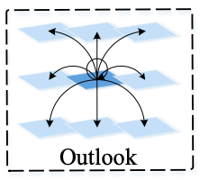

これがどういう意味なのかを知るには、「**⑤−① x = mul(a, v)**」の計算概念を理解することが近道かと思います。  
そのために、先程の行列積のサンプルコードを、値を追うような形で実行してみます。

```
import torch  
  
num_head = 2  
H = 2  
W = 4  
K = 2  
C = 4  
  
a = torch.arange(int(num_head*H/2*W/2*K*K*K*K)).to(torch.float32)  
v = torch.arange(int(num_head*H/2*W/2*K*K*C/num_head)).to(torch.float32)  
  
a = a.reshape(num_head, int(H/2*W/2), K*K, K*K)  
v = v.reshape(num_head, int(H/2*W/2), K*K, int(C/num_head)).to(torch.float32)  
  
print('a.shape =', a.shape)  
print('a =', a)  
print()  
print('v.shape =', v.shape)  
print('v =', v)  
print()  
  
x = a @ v  
  
print('x.shape =', x.shape)  
print('x =', x)
```

↓（実行結果）

```
a.shape = torch.Size([2, 2, 4, 4])  
a = tensor([[[[ 0.,  1.,  2.,  3.],  
          [ 4.,  5.,  6.,  7.],  
          [ 8.,  9., 10., 11.],  
          [12., 13., 14., 15.]],  
  
         [[16., 17., 18., 19.],  
          [20., 21., 22., 23.],  
          [24., 25., 26., 27.],  
          [28., 29., 30., 31.]]],  
  
  
        [[[32., 33., 34., 35.],  
          [36., 37., 38., 39.],  
          [40., 41., 42., 43.],  
          [44., 45., 46., 47.]],  
  
         [[48., 49., 50., 51.],  
          [52., 53., 54., 55.],  
          [56., 57., 58., 59.],  
          [60., 61., 62., 63.]]]])  
  
v.shape = torch.Size([2, 2, 4, 2])  
v = tensor([[[[ 0.,  1.],  
          [ 2.,  3.],  
          [ 4.,  5.],  
          [ 6.,  7.]],  
  
         [[ 8.,  9.],  
          [10., 11.],  
          [12., 13.],  
          [14., 15.]]],  
  
  
        [[[16., 17.],  
          [18., 19.],  
          [20., 21.],  
          [22., 23.]],  
  
         [[24., 25.],  
          [26., 27.],  
          [28., 29.],  
          [30., 31.]]]])  
  
x.shape = torch.Size([2, 2, 4, 2])  
x = tensor([[[[  28.,   34.],  
          [  76.,   98.],  
          [ 124.,  162.],  
          [ 172.,  226.]],  
  
         [[ 780.,  850.],  
          [ 956., 1042.],  
          [1132., 1234.],  
          [1308., 1426.]]],  
  
  
        [[[2556., 2690.],  
          [2860., 3010.],  
          [3164., 3330.],  
          [3468., 3650.]],  
  
         [[5356., 5554.],  
          [5788., 6002.],  
          [6220., 6450.],  
          [6652., 6898.]]]])
```

繰り返しになりますが、aの次元構成は（**Head数, H/2\*W/2, K\*K, K\*K**）であり、vの次元構成は（**Head数, H/2\*W/2, K\*K, C÷Head数**）となっています。  
そして、これらの行列積をとって、xの次元構成は（**Head数, H/2\*W/2, K\*K, C÷Head数**）となっています。

計算結果を見て分かることは、同じ（**Head**）のindex、同じ（**H/2\*W/2**）のindexについてのみ、（**K\*K, K\*K**）と（**K\*K, C÷Head数**）の行列積が行われていることです。  
つまり、組合せで計算されているのは、unfoldのカーネルの大きさに準じて確保された周辺座標の集合概念に対してのみとなっています。  
これが、構成図に描かれている上記イラストの意味になります。

一般的なViTでは、以下イラストのような、QKVに分かれた後の共起表現の獲得において、全ての（**H\*W**）に対する組合せにて、**C**次元特徴ベクトルの共起表現獲得を行っています。  
ここで、12は（**Head数**）です。  
197の内訳は、（**H=14, W=14, cls\_token=1**）という形で、（**H\*W+cls\_token**）というまとめられ方がされているものです。  
64は、（**C=768**）であったものが、（**Head数=12**）で分割されて、各HeadにおけるC次元特徴の長さが「**768/12=64**」となった形です。

Press enter or click to view image in full size

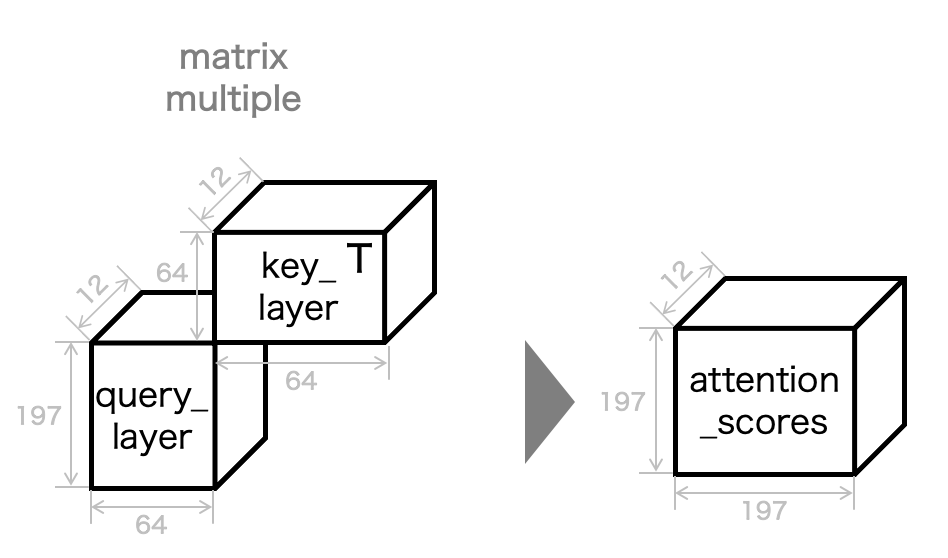

**いわゆるQKᵀ**

Press enter or click to view image in full size

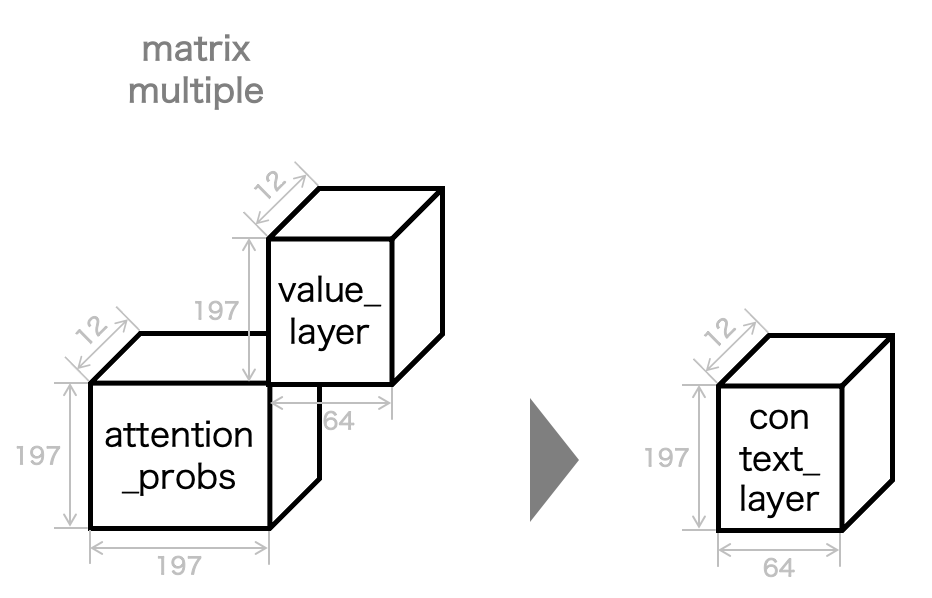

いわゆるsoftmax(**QKᵀ/√d\_k**)V

これが、距離の遠い判断根拠の結び付きを、上手く捉えられるメカニズムになっています。  
一方で、VOLOの論文は、一般的なViTは遠視眼的になりがちであると指摘をしています。

そこで、Outlook Attentionは、そこまで広い共起表現の獲得はせずに、周辺空間との共起表現獲得に留めています。  
共起表現獲得に向けて、眺める範囲を狭めている形です。  
この概念が、「Outlook」という言葉に込められているものと思われます。

ただし、冒頭にも書かせて頂いたように、従来ViTモデルのself-attentionレイヤーについて、その1/4をOutlook Attentionに置き換えることで、精度向上を実現した、というのが論文からの教示となっています。  
つまり、従来ViTモデルのself-attentionレイヤーは勿論有効であるとする上で、遠視眼的になる傾向を抑えるべく、視野を周辺空間に留めることを時折挟むことで、精度向上が実現できたと、そういう主張となっているかと思われます。

### 「**⑥ x = fold(x).permute(2, 0, 1) ※**」

最後に、「**⑥ x = fold(x).permute(2, 0, 1) ※**」です。

Press enter or click to view image in full size

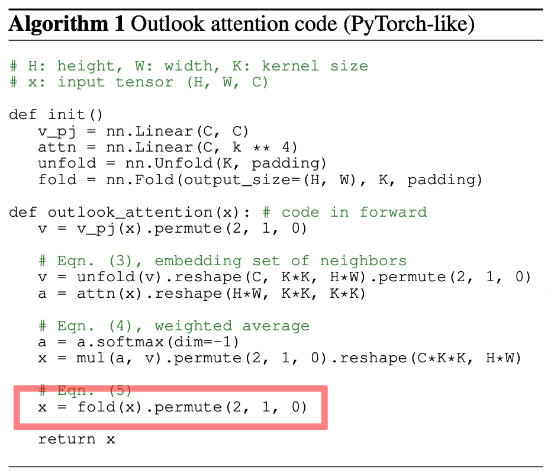

**⑥ x = fold(x).permute(2, 0, 1) ※**

分解すると、「⑥**−① x = fold(x)**」と「**⑥−② a = a.permute(2, 0, 1) ※**」という2つの処理が順番に行われる形です。

先に、「**⑥−② a = a.permute(2, 0, 1) ※**」についてですが、これはfold処理を行うに当たって、末尾次元が（**H\*W**）だったところを、また、fold処理の結果として（**C, H, W**）という次元構成になっていたところを、元の入力と同じ（**H, W, C**）という次元構成に戻す形となっています。  
つまり、特に意義はなく、最終出力調整という次第です。

「⑥**−① x = fold(x)**」についてですが、fold処理は概ねunfold処理の逆の動作となっています。  
概念としては、周辺視野を巻き込む形で冗長な画像状に展開されている特徴を、元の形に戻すような処理です。  
つまりは、Outlook Attentionを実施するにあたり、unfoldで冗長展開された特徴を、foldで元の形に締め戻すイメージとなっています。

Press enter or click to view image in full size

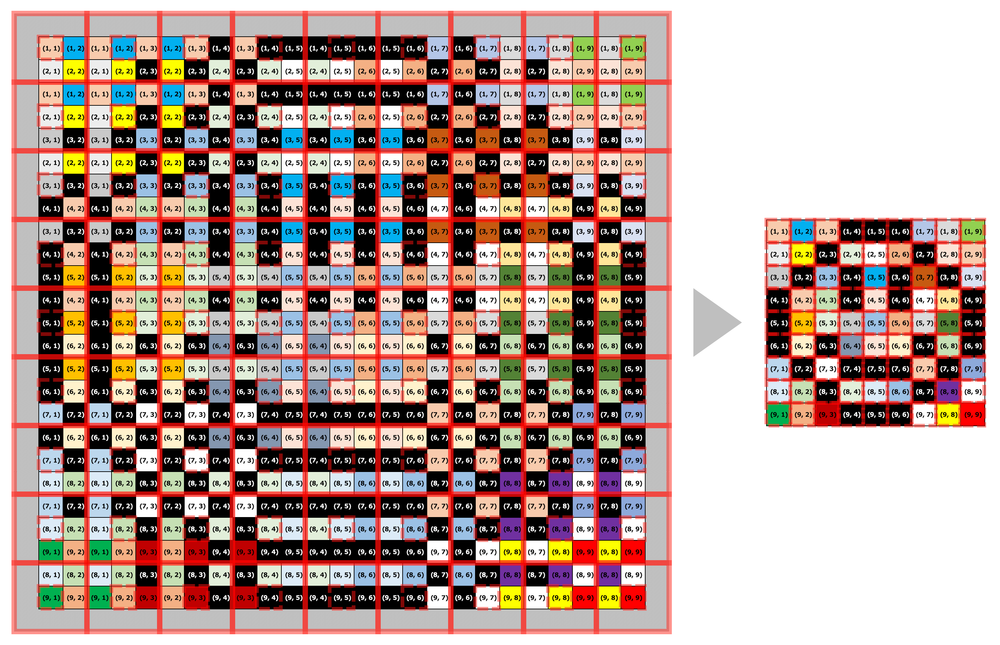

ちなみに、unfold処理の原理は比較的ご存知の方が多いかと思われる一方、fold処理の原理についてはご存じない方が多いかもしれません。  
ここで、補足としまして、その原理について掘り下げさせて頂きたいと思います。

以下に、mnistのデータを用いて、unfold処理とfold処理を順番に実施して、冗長展開と復元を行うコードを記載します。  
fold処理については、PyTorchによるものと、分かりやすくnumpyでスクラッチ実装したものと、2つを実施して同値確認をしています。

```
from sklearn.datasets import fetch_openml  
import matplotlib.pyplot as plt  
  
if 'digits' not in locals():  
    digits = fetch_openml(name='mnist_784', version=1)  
img_list = digits.data.to_numpy().reshape(70000, 28, 28)  
  
print('img_list.shape =', img_list.shape)  
  
x = img_list[0]  
x = x / 255  
  
print('x.shape =', x.shape)  
  
plt.figure(figsize=(10, 4), dpi=100)  
plt.imshow(x)  
plt.title(x.shape)  
plt.colorbar()  
plt.show()  
  
unfold = torch.nn.Unfold(kernel_size=3, dilation=1, padding=1, stride=2)  
x = x.reshape(1, 1, 28, 28)  
x = torch.from_numpy(x)  
x = unfold(x)  
  
print('x.shape =', x.shape)  # x.shape = torch.Size([1, 9, 196])  
  
plt.figure(figsize=(56, 56), dpi=100)  
  
for i_vert in range(14):  
    for i_horz in range(14):  
        plt.subplot(14, 14, (i_vert * 14 + i_horz + 1))  
        plt.imshow(x[0, :, (i_vert * 14 + i_horz)].reshape(3, 3), clim=[0, 1])  
        plt.gca().axis("off")  
  
plt.show()  
  
y = F.fold(x,  
           output_size=(28, 28),  
           kernel_size=3,  
           padding=1,  
           stride=2)  
  
print(y.shape)  
  
y = y[0, 0].clone().detach().numpy()  
  
plt.figure(figsize=(10, 4), dpi=100)  
plt.imshow(y)  
plt.title(y.shape)  
plt.colorbar()  
plt.show()  
  
x = x.reshape(3, 3, 14, 14)  
  
y_ = torch.zeros([30, 30])  
  
for i_vert in range(14):  
    for i_horz in range(14):  
        j_vert = (i_vert * 2)  
        j_horz = (i_horz * 2)  
        y_[j_vert:(j_vert + 3), j_horz:(j_horz + 3)] = (y_[j_vert:(j_vert + 3), j_horz:(j_horz + 3)] +  
                                                        x[:, :, i_vert, i_horz])  
  
print(x.shape)  
  
y_ = y_[1:-1, 1:-1].clone().detach().numpy()  
  
plt.figure(figsize=(10, 4), dpi=100)  
plt.imshow(y_)  
plt.title(y_.shape)  
plt.colorbar()  
plt.show()  
  
plt.figure(figsize=(10, 4), dpi=100)  
plt.imshow(np.abs(y - y_))  
plt.colorbar()  
plt.show()
```

コード実行によって表示される図を追いながら、説明をさせて頂きます。

先ず、入力画像が以下となります。

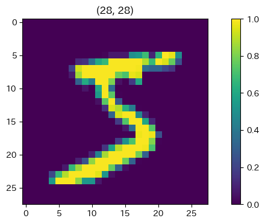

次に、入力画像に対してunfold処理をした結果が以下となります。  
unfold処理の出力として、（**K\*K=3\*3=9, H\*W=14\*14=196**）という次元構成となります。  
それを（**K\*K**）毎に可視化したものが以下となります。  
尚、unfold処理のパラメーター設定は、VOLOリポジトリのデフォルト設定と合わせています。

Press enter or click to view image in full size

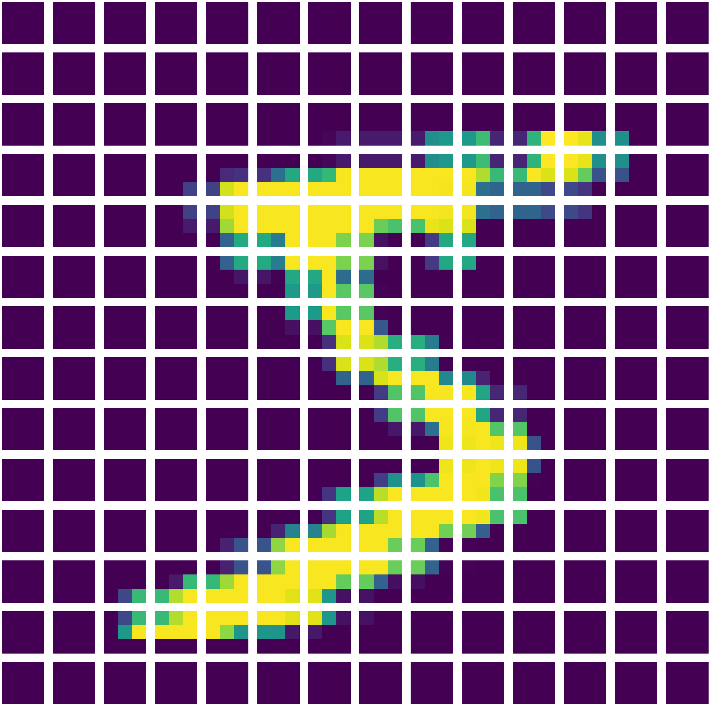

次に、unfold処理を実施した冗長画像に対して、Pytorchによるfold処理を実施した結果が以下となります。  
VOLOリポジトリのfold処理のstrideが2になっている為に、以下のような斑模様になります。

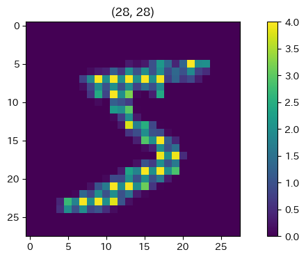

次に、unfold処理を実施した冗長画像に対して、numpyでスクラッチ実装したfold処理を実施した結果が以下となります。


最後に、上記2つの差分の絶対値を取った結果が以下となります。  
カラーバーを見てもらうと差分がほぼZEROであることが確認できると思います。  
PyTorchでの処理が再現できている形となります。

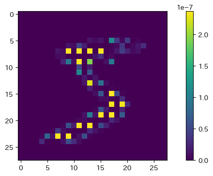

尚、fold処理のstrideが2であることによって生じている斑模様についてですが、これによって隣接ピクセルのアテンション値が強制的にと言いますか、小さくなる傾向があります。  
特徴値が飛び石のような形状になる次第です。  
かなりヒューリスティックですが、恐らくはこのアテンション値の飛び石化が、近視眼的な特徴の捉え方を抑制する効果もあるのではないかと、個人的には考える次第です。

以上が、Outlook Attentionのアルゴリズムの説明となります。  
つぶさに追いかけてみると、意外とシンプルなアイデアであることがご理解頂けたかと思います。  
そして、このOutlook Attentionを導入したViTのことを、VOLOとして提案されている形となります。

## Outlook Attentionの導入方法について

当該記事の最後の結びとして、論文中に紹介されているOutlook Attentionの導入アプローチ、及び、その結果を紹介させて頂きます。  
どうやってOutlook Attentionを導入するのかという、1つの試みとなっています。  
課題毎にその正解が異なるであろう為、チューニングは必要かと思いますが、論文記載のアプローチは非常に参考になる次第です。

以下は、論文中に載っている、VOLOで精度を出すまでのアプローチとその結果となります。

Press enter or click to view image in full size

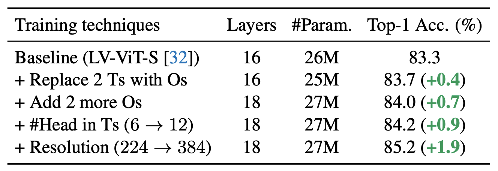

先ず、「BaseLine LV-ViT-S」ですが、paper with codeにその情報があります。

[## Papers with Code - All Tokens Matter: Token Labeling for Training Better Vision Transformers

### 84 best model for Semantic Segmentation on ADE20K (Validation mIoU metric)

paperswithcode.com](https://paperswithcode.com/paper/token-labeling-training-a-85-5-top-1-accuracy?source=post_page-----b281cce4e89f---------------------------------------)

論文中にも、LV-ViT-Sの「Top-1 Acc. (%)」が83.3%と記載されています。  
Outlooker導入前のBaselineが、先ずはこの精度という訳です。

尚、Outlookerとは、以下式のように、Outlook Attentionレイヤーと、C次元方向に対するmulti-layer perceptron（MLP）を包含する、Outlook Attentionの上位構成のことを指します。

Press enter or click to view image in full size

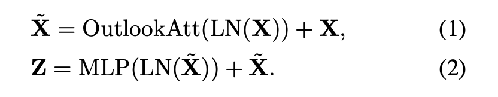

さて、ベースモデルに対して、先ずは「+ Replace 2 Ts with Os」を適用します。  
表現力豊かで詳細な特徴を取得するということがOutlookerの目標とのことで、ここで先ずはOutlook Attentionの適用準備として、パッチサイズを「16×16」から「8×8」に変更するとのことです。  
更に、解像度の高い特徴レベルにて、2つのtransformerをOutlookerに置き換えます。  
そうすることで、「Top-1 Acc. (%)」が83.7%まで上昇するそうです。

次に、「+ Add 2 more Os」です。  
更に、2つのOutlookerを追加することで、83.9%まで向上するそうです。

次に、「+ #Head in Ts (6 → 12)」。  
全てのtransformerのHead数を6から12に変更することで、83.9%にまで向上。

最後に、「+ Resolution (224 → 384)」。  
入力の解像度を384×384の解像度に調整すると、「Top-1 Acc. (%)」が85.2%にまで向上するとのことです。

このようにOutlookerは、既存のtransformerを置き換える等して導入をします。  
また、Outlooker導入の背景を踏まえて、入力画像を高解像度化したり、導入先を高解像度特徴を処理対象とするレイヤーにしたりと、上手く配慮することで効果発揮に繋げられるようです。

## ailia SDKからの利用

ailia SDKで用意しているVOLOのプログラムについてですが、現在目下実装中となります。  
リリース次第、紹介をさせて頂きます。

ax株式会社はAIを実用化する会社として、クロスプラットフォームでGPUを使用した高速な推論を行うことができるailia SDKを開発しています。  
ax株式会社ではコンサルティングからモデル作成、SDKの提供、AIを利用したアプリ・システム開発、サポートまで、 AIに関するトータルソリューションを提供していますのでお気軽に[お問い合わせ](https://axinc.jp/)ください