# Multi-input Transformer for Age and Gender Estimation：年齢と性別を推定するためのマルチインプットトランスフォーマーモデル

# Multi-input Transformer for Age and Gender Estimation：年齢と性別を推定するためのマルチインプットトランスフォーマーモデル

[](https://medium.com/@mucunwuxian?source=post_page---byline--8b77aa8c6dbc---------------------------------------)

[Taketo Kimura](https://medium.com/@mucunwuxian?source=post_page---byline--8b77aa8c6dbc---------------------------------------)

37 min read

·

Mar 19, 2024

--

Share

ailia SDKで使用できる機械学習モデルである「Multi-input Transformer for Age and Gender Estimation（以下、MiVOLO）」の紹介です。  
ailia SDKはエッジ向け推論フレームワークであり、ailia MODELSに公開されている機械学習モデルを使用することで、簡単にAIの機能をアプリケーションに実装することができます。

## MiVOLOの概要

MiVOLOは、ロシアのSaluteDevicesという会社が発表した、顔画像と身体画像の2画像を入力として、年齢と性別を推定するSOTAモデルです。  
この記事を書いている2024年2月時点にて、年齢と性別の推定について、軒並みGlobal Rank #1の精度を記録しています。

Press enter or click to view image in full size

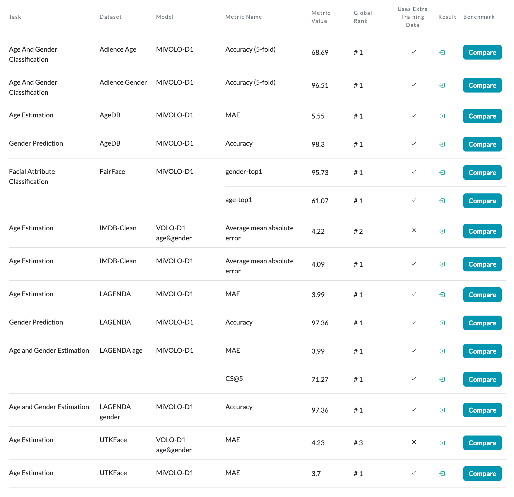

出典：<https://paperswithcode.com/paper/mivolo-multi-input-transformer-for-age-and>（2024年2月時点）

MiVOLOの公開時期は、論文の第一版とGithubリポジトリが2023年7月であるようです。

[## MiVOLO: Multi-input Transformer for Age and Gender Estimation

### Age and gender recognition in the wild is a highly challenging task: apart from the variability of conditions, pose…

arxiv.org](https://arxiv.org/abs/2307.04616?source=post_page-----8b77aa8c6dbc---------------------------------------)

[## GitHub - WildChlamydia/MiVOLO: MiVOLO age & gender transformer neural network

### MiVOLO age & gender transformer neural network. Contribute to WildChlamydia/MiVOLO development by creating an account…

github.com](https://github.com/WildChlamydia/MiVOLO?source=post_page-----8b77aa8c6dbc---------------------------------------)

MiVOLOの先頭2文字のMiは、Multi-inputの略となります。  
VOLOは、とあるViTの派生手法の1つ、その名称となります。  
Outlook Attentionというself-attentionに代わるAttention手法を導入したものが、「Vision Outlooker for Visual Recognition」という手法名称で、略してVOLOとなります。  
つまり、MiVOLOとは、Multi-input VOLOの略になります。

論文タイトルの字面だけを見ると、「シンプルにアーキテクチャの入力部分をMulti-inputに拡張してだけのVOLOなのかな」と、私などは勝手な想像をしてしまったのですが、いざ論文を読んでみるとそんなことはなく、非常に恐縮な次第でした。  
沢山の提案や工夫がMiVOLOには含まれており、大変学びの多い論文となります。

## MiVOLO論文での提案

MiVOLO論文での提案内容は、個人的には大きく以下3つにまとめられるかと思います。

1. アーキテクチャへの工夫として、VOLOをベースに、年齢と性別の推定のための発展形モデルのMiVOLOを提案
2. 学習ロジックの工夫として、「Label distribution smoothing」の適用や、年齢の回帰と性別の2クラス識別とをマルチタスクとして、かつ、それを共通の単一特徴ベクトルを介して解くことを提案
3. 学習データへの配慮として、既存のデータセットの課題感を洗い出した上で、別途自ら構築したデータセットを提案

以上。  
ここからは、この3つについて、1つずつ順番に掘り下げさせて頂きます。

## 1. MiVOLOのアーキテクチャ

MiVOLOにて行われているアプローチについて、大きな括りでの1つ目としては、ネットワークアーキテクチャの工夫が挙げられます。  
MiVOLOのアーキテクチャのベースには、VOLOが用いられています。  
VOLOの説明については、別途以下記事に記載していますので、参照頂けたらと思います。

[## Vision Outlooker for Visual Recognition：視覚認識のための見通し視覚

### ailia SDKで使用できる機械学習モデルである「Vision Outlooker for Visual Recognition（以下、VOLO）」のご紹介です。 ailia SDKはエッジ向け推論フレームワークであり、ailia…

medium.com](https://medium.com/axinc/vision-outlooker-for-visual-recognition-%E8%A6%96%E8%A6%9A%E8%AA%8D%E8%AD%98%E3%81%AE%E3%81%9F%E3%82%81%E3%81%AE%E8%A6%8B%E9%80%9A%E3%81%97%E8%A6%96%E8%A6%9A-b281cce4e89f?source=post_page-----8b77aa8c6dbc---------------------------------------)

MiVOLOは、VOLOのアーキテクチャをベースに、Multi-inputの構成を積み上げた形になっています。  
論文中の説明の図が以下となります。

Press enter or click to view image in full size

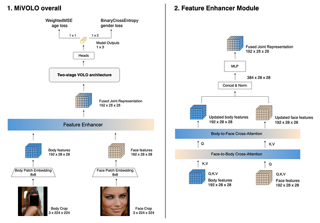

図のパート毎に1つずつ掘り下げて説明をさせて頂きます。

### ① 入力

Press enter or click to view image in full size

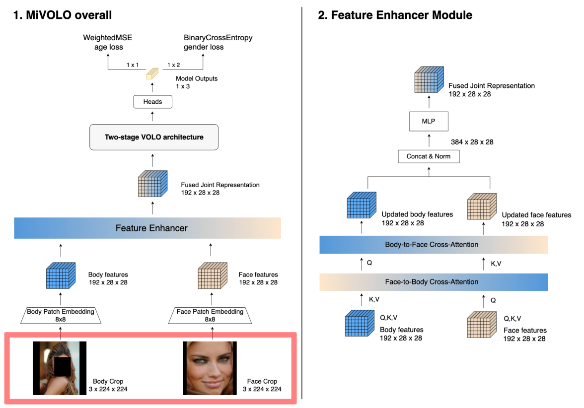

入力については、解像度224x224の入力画像データを2つ用意します。  
1つは、顔の画像データです。  
もう1つは、全身の画像データとなります。

尚、顔と全身の両方の画像データが入力されず、片方だけが入力された場合にも、推論が行えるように設計がされています。  
或いは、片方だけの入力は想定内であると、論文に記されています。  
ただし、私の手元にて、学習済みモデルでの推論テストを幾つかのパターンで行ってみた印象では、顔と全身と両方のデータが入力された場合と比べると、片方だけの入力の場合は、推論精度が下がる様子でした。  
特に、顔が入力されない場合は、最も精度が下がってしまう印象でした。

入力の画像については、前処理としてYOLOv8による顔検出と全身検出を実施することで、それらを獲得する仕組みになっています。  
また、顔画像と全身画像は、本人のみの画像に限定してcropを実施します。  
もしも、cropされた画像上に、本人以外の画像が映り込んでいる場合には、その部分に対して、黒塗りマスクを実施します。  
全身画像については、crop後に、本人以外の画像が映り込んでいる部分に黒塗りマスクを実施するのに加えて、本人の顔が映り込んでいる部分に対しても、黒塗りマスクを実施します。  
その処理のイメージが、説明の図になっている形です。

### **② Patch Embedding**

Press enter or click to view image in full size

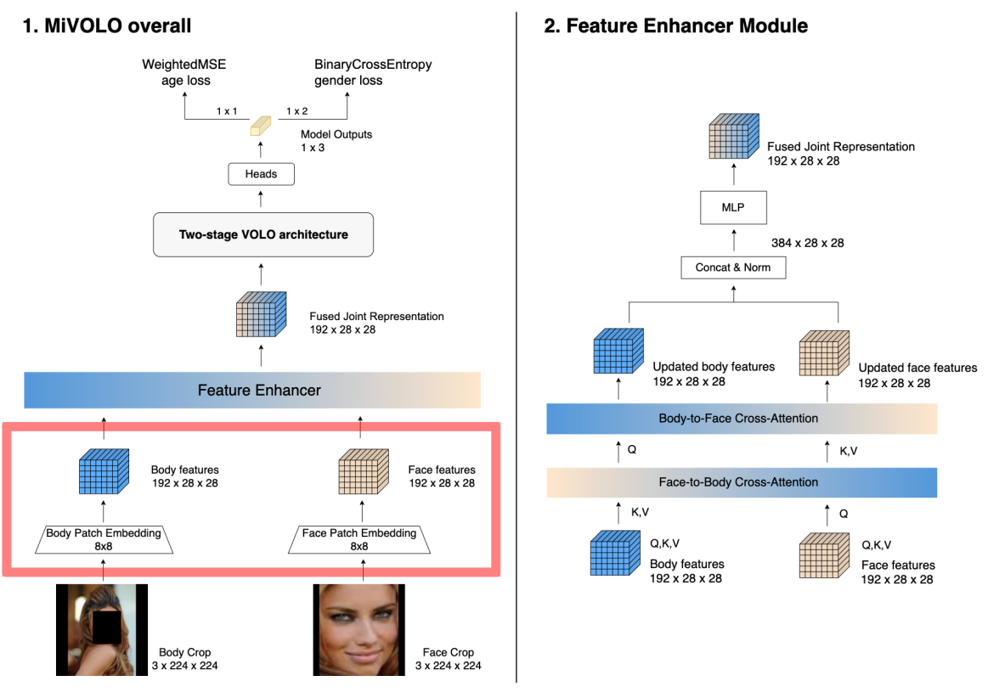

2つの画像が入力されたら、それぞれの画像に対してPatch Embeddingを実施します。  
Patch Embeddingとは、ViT全般にて冒頭に行われる処理になります。  
パッチ画像の取得という認識が一般的ですが、実際にはstrideが大きいconvolutionが行われています。  
Patch Embeddingの説明、及び、理論と実際が異なる点については、別途以下の元祖ViTの説明記事で説明をさせて頂いていますので、参照頂けたらと思います。

[## Vision Transformer：畳み込み演算を用いない最新画像識別技術

### ailia SDKで使用できる機械学習モデルである「Vision Transformer（以下、ViT）」のご紹介です。 ailia SDKはエッジ向け推論フレームワークであり、ailia…

medium.com](https://medium.com/axinc/vision-transformer-%E7%95%B3%E3%81%BF%E8%BE%BC%E3%81%BF%E6%BC%94%E7%AE%97%E3%82%92%E7%94%A8%E3%81%84%E3%81%AA%E3%81%84%E6%9C%80%E6%96%B0%E7%94%BB%E5%83%8F%E8%AD%98%E5%88%A5%E6%8A%80%E8%A1%93-84f06978a17f?source=post_page-----8b77aa8c6dbc---------------------------------------)

MiVOLOでのPatch Embeddingは、VOLOでの設定と同じものを用いていますが、それは元祖ViTとは少し異なるものになります。  
解像度の高い特徴を抽出すべく、設定がカスタマイズされている形です。  
元祖ViTでは、16x16のカーネルを用いて、（**H=14, W=14**）という解像度の特徴を抽出していました。  
VOLOでは、8x8のカーネルを用いて、（**H=28, W=28**）という解像度の特徴を抽出するようにカスタマイズされています。  
以下のようなイメージです。

Press enter or click to view image in full size

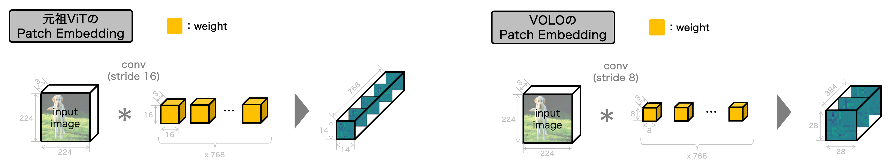

これは、VOLO提案の肝であるOutlook Attentionの適用に合わせたチューニングとなっています。

### **③ Cross-Attention**

Press enter or click to view image in full size

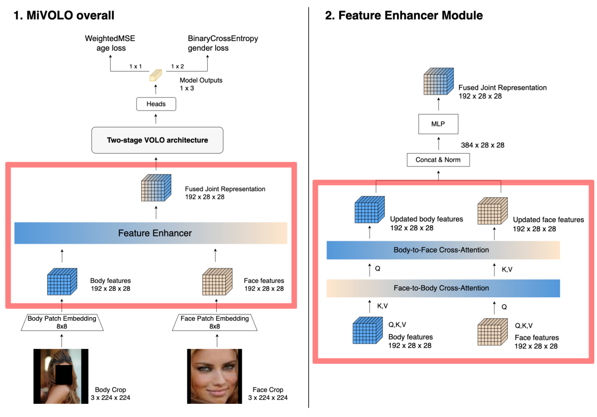

次に、Patch Embeddingによって抽出された（**H=28, W=28, C=192**）という次元構成の特徴テンソルを入力に、「Cross-Attention」を実施します。  
顔の画像から抽出した特徴をQKVに分け、全身の画像から抽出された特徴もQKVに分けて、それらを交差させるような形で、Attentionを実施します。

尚、説明の図上は「Face-to-Body Cross-Attention」と「Body-to-Face Cross-Attention」とが順列に順番に実施されるような見た目になっていますが、実際には「Face-to-Body Cross-Attention」と「Body-to-Face Cross-Attention」は並列に処理が実施されて、「Updated body features」と「Updated face features」が別々に算出されます。  
ここのところは、図の記載が少し勘違いを読んでしまうポイントかと思われます。

Cross-Attentionにて行われていることはシンプルです。  
大まかには、「**softmax(QK)V**」という形です。  
「行列積 → softmax → 行列積」という処理の順番になります。  
この時、顔画像特徴から得られたQKVと、全身画像特徴から得られたQKVを交差させる形で、Cross-Attentionを実施します。  
具体的には、顔画像特徴から得られたQと、全身画像特徴から得られたKVで、Face-to-Body Cross-Attentionが行われます。  
つまり、「**softmax(Q[顔]K[全身])V[全身] = Updated body features**」という形です。  
もう一方は、全身画像特徴から得られたQと、顔画像特徴から得られたKVで、Body-to-Face Cross-Attentionが行われます。  
つまり、「**softmax(Q[全身]K[顔])V[顔] = Updated face features**」という形です。

論文によれば、これはCross-Attentionを用いて、クロスビュー特徴融合を実現しているとのことです。  
尚、論文中にはCross-Attention操作に関するニュアンスとして、「追加情報による特徴の強化」という風に記されています。  
ここから、どうやらメイン情報は顔画像特徴であり、全身画像特徴は追加情報であるという著者の認識が伺える次第です。

### ④ Concat & Norm & MLP

Press enter or click to view image in full size

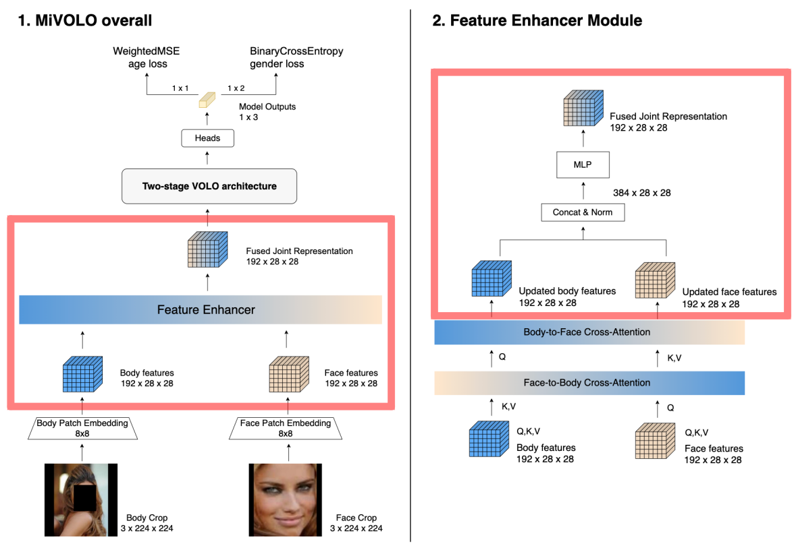

Cross-Attentionを経て抽出された特徴に対して、シンプルな連結とNomalizationを実行し、続いてMLP（多層パーセプトロン）を実行して、特徴の次元を削減調整しています。  
ここは、見たままのシンプルなアルゴリズムが適用されている形です。

論文によれば、この特徴の融合によって、顔画像と全身画像の両入力からの重要な特徴に注意を払うことができる、かつ、重要性の低い特徴を無視することができるとのことです。  
更に、片方の入力が空である場合でも、意味のある情報が確実に抽出されるとのことです。

### ⑤ Two-stage VOLO architecture

Press enter or click to view image in full size

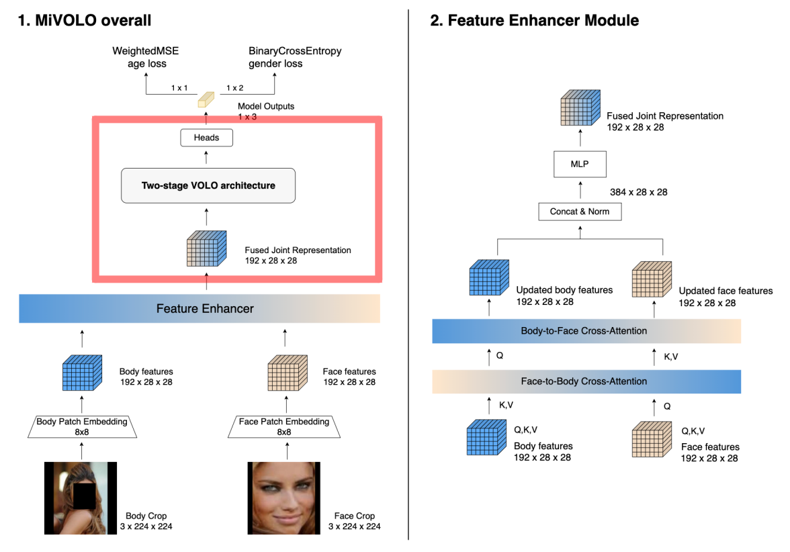

次に、④の処理によって融合された特徴が、「Two-stage VOLO architecture」にて処理されます。  
MiVOLOにおける、VOLO要素の本懐部分になります。

特に、Two-stage VOLO architectureの構造部分は、以下のような全体VOLO構造中の以下赤枠部分となります。  
尚、VOLOの構造はOutlookerを導入したViT構造全般であり、以下構造のみに限られないかと思われます。

Press enter or click to view image in full size

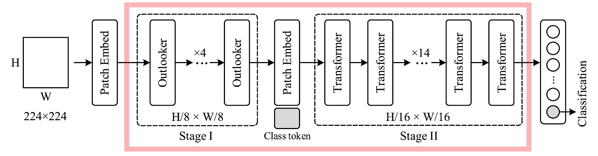

また、上記図は少し古いものなのか、実際とは微妙に形状が異なるようでした。  
実際にMiVOLOのリポジトリにて、torchinfoを用いたネットワークのサマリ出力を行ってみると、以下となっていました。  
論文中の説明も、この実際の姿をベースに説明がされています。

```
======================================================================  
Layer (type:depth-idx)                        Output Shape  
======================================================================  
MiVOLOModel                                   [1, 3]  
├─PatchEmbed: 1-1                             [1, 192, 28, 28]  
│    └─Sequential: 2-1                        [1, 64, 112, 112]  
│    │    └─Conv2d: 3-1                       [1, 64, 112, 112]  
│    │    └─BatchNorm2d: 3-2                  [1, 64, 112, 112]  
│    │    └─ReLU: 3-3                         [1, 64, 112, 112]  
│    │    └─Conv2d: 3-4                       [1, 64, 112, 112]  
│    │    └─BatchNorm2d: 3-5                  [1, 64, 112, 112]  
│    │    └─ReLU: 3-6                         [1, 64, 112, 112]  
│    │    └─Conv2d: 3-7                       [1, 64, 112, 112]  
│    │    └─BatchNorm2d: 3-8                  [1, 64, 112, 112]  
│    │    └─ReLU: 3-9                         [1, 64, 112, 112]  
│    └─Conv2d: 2-2                            [1, 192, 28, 28]  
│    └─Sequential: 2-3                        [1, 64, 112, 112]  
│    │    └─Conv2d: 3-10                      [1, 64, 112, 112]  
│    │    └─BatchNorm2d: 3-11                 [1, 64, 112, 112]  
│    │    └─ReLU: 3-12                        [1, 64, 112, 112]  
│    │    └─Conv2d: 3-13                      [1, 64, 112, 112]  
│    │    └─BatchNorm2d: 3-14                 [1, 64, 112, 112]  
│    │    └─ReLU: 3-15                        [1, 64, 112, 112]  
│    │    └─Conv2d: 3-16                      [1, 64, 112, 112]  
│    │    └─BatchNorm2d: 3-17                 [1, 64, 112, 112]  
│    │    └─ReLU: 3-18                        [1, 64, 112, 112]  
│    └─Conv2d: 2-4                            [1, 192, 28, 28]  
│    └─CrossBottleneckAttn: 2-5               [1, 192, 28, 28]  
│    │    └─Conv2d: 3-19                      [1, 576, 28, 28]  
│    │    └─Conv2d: 3-20                      [1, 576, 28, 28]  
│    │    └─PosEmbedRel: 3-21                 [1, 784, 784]  
│    │    └─PosEmbedRel: 3-22                 [1, 784, 784]  
│    │    └─LayerNorm: 3-23                   [1, 384, 28, 28]  
│    │    └─Mlp: 3-24                         [1, 192, 28, 28]  
│    │    └─Identity: 3-25                    [1, 192, 28, 28]  
├─ModuleList: 1-4                             --  
│    └─Sequential: 2-6                        [1, 28, 28, 192]  
│    │    └─Outlooker: 3-26                   [1, 28, 28, 192]  
│    │    └─Outlooker: 3-27                   [1, 28, 28, 192]  
│    │    └─Outlooker: 3-28                   [1, 28, 28, 192]  
│    │    └─Outlooker: 3-29                   [1, 28, 28, 192]  
│    └─Downsample: 2-7                        [1, 14, 14, 384]  
│    │    └─Conv2d: 3-30                      [1, 384, 14, 14]  
├─Dropout: 1-3                                [1, 14, 14, 384]  
├─ModuleList: 1-4                             --  
│    └─Sequential: 2-8                        [1, 14, 14, 384]  
│    │    └─Transformer: 3-31                 [1, 14, 14, 384]  
│    │    └─Transformer: 3-32                 [1, 14, 14, 384]  
│    │    └─Transformer: 3-33                 [1, 14, 14, 384]  
│    │    └─Transformer: 3-34                 [1, 14, 14, 384]  
│    └─Sequential: 2-9                        [1, 14, 14, 384]  
│    │    └─Transformer: 3-35                 [1, 14, 14, 384]  
│    │    └─Transformer: 3-36                 [1, 14, 14, 384]  
│    │    └─Transformer: 3-37                 [1, 14, 14, 384]  
│    │    └─Transformer: 3-38                 [1, 14, 14, 384]  
│    │    └─Transformer: 3-39                 [1, 14, 14, 384]  
│    │    └─Transformer: 3-40                 [1, 14, 14, 384]  
│    │    └─Transformer: 3-41                 [1, 14, 14, 384]  
│    │    └─Transformer: 3-42                 [1, 14, 14, 384]  
│    └─Sequential: 2-10                       [1, 14, 14, 384]  
│    │    └─Transformer: 3-43                 [1, 14, 14, 384]  
│    │    └─Transformer: 3-44                 [1, 14, 14, 384]  
├─ModuleList: 1-5                             --  
│    └─ClassBlock: 2-11                       [1, 197, 384]  
│    │    └─LayerNorm: 3-45                   [1, 197, 384]  
│    │    └─ClassAttention: 3-46              [1, 1, 384]  
│    │    └─Identity: 3-47                    [1, 1, 384]  
│    │    └─LayerNorm: 3-48                   [1, 1, 384]  
│    │    └─Mlp: 3-49                         [1, 1, 384]  
│    │    └─Identity: 3-50                    [1, 1, 384]  
│    └─ClassBlock: 2-12                       [1, 197, 384]  
│    │    └─LayerNorm: 3-51                   [1, 197, 384]  
│    │    └─ClassAttention: 3-52              [1, 1, 384]  
│    │    └─Identity: 3-53                    [1, 1, 384]  
│    │    └─LayerNorm: 3-54                   [1, 1, 384]  
│    │    └─Mlp: 3-55                         [1, 1, 384]  
│    │    └─Identity: 3-56                    [1, 1, 384]  
├─LayerNorm: 1-6                              [1, 197, 384]  
├─Linear: 1-7                                 [1, 3]  
├─Linear: 1-8                                 [1, 196, 3]  
======================================================================
```

さて、MiVOLOにおけるTwo-stage VOLO architectureの中には、以下が含まれていると説明がされています。

- Outlookerの塊
- stride=2等の畳み込みフィルタによる特徴のダウンサンプリング
- 一連のTransformer
- 上部の 2 つのヘッド

以上。  
上部の2つのヘッドとは、上記torchinfoのサマリにおけるClassBlockのことを指しているかと思われます。

このTwo-stage VOLO architectureが、MiVOLOにおける特徴抽出の核になっていると推察します。

### ⑥ 年齢の回帰と、性別の識別

Press enter or click to view image in full size

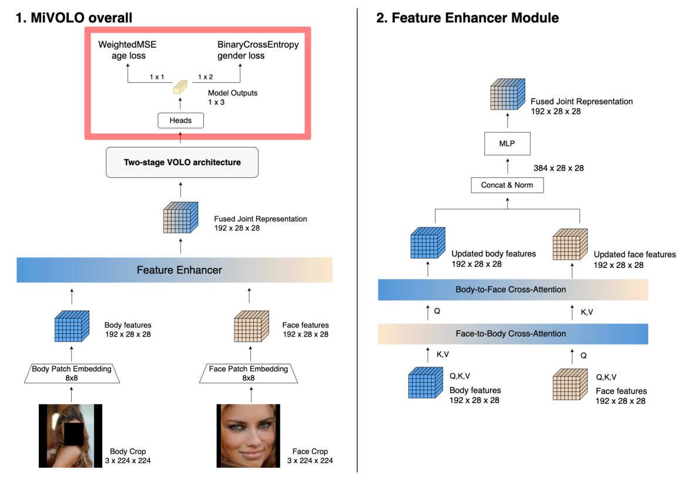

最後は抽出された特徴を用いて、年齢の回帰と性別の識別を行います。  
VOLO自体は、ImageNetの識別モデルとしての提案ではありますが、そこを応用させている形です。

左右に分かれた2つの最終線形レイヤーは、3次元ベクトルに埋め込まれた推測値を更新します。  
性別に関する2つの出力値と、年齢値に関する1つの出力値です。  
尚、年齢値については、正規化された値が出力されます。

別途、性別と年齢とを個別に予測するために、複数のHeadを使用する手法として、「[Age and Gender Prediction From Face Images Using Attentional Convolutional Network](https://arxiv.org/pdf/2010.03791.pdf)」等があるそうですが、MiVOLOではそれとは異なり、画像毎に両方の出力をもたらす単一のベクトルを生成します。  
最終的に、性別識別用の特徴ベクトルと、年齢回帰用の特徴ベクトルとを別々に出力するのではなく、それらを1つにまとめてしまう形です。

この特徴ベクトルを1つにまとめてしまうというアプローチは、大変興味深いですよね。  
同様の特徴で解くことで、相互に過学習を抑える正則化の効果がある等の効果があるのかもしれません。  
論文中には、「マルチタスク学習による両タスクでの改善達成」と記載がされており、かつ、その結果も表で掲載されています。  
確かに、マルチタスク学習を行った場合の方が精度が高くなっています。

Press enter or click to view image in full size

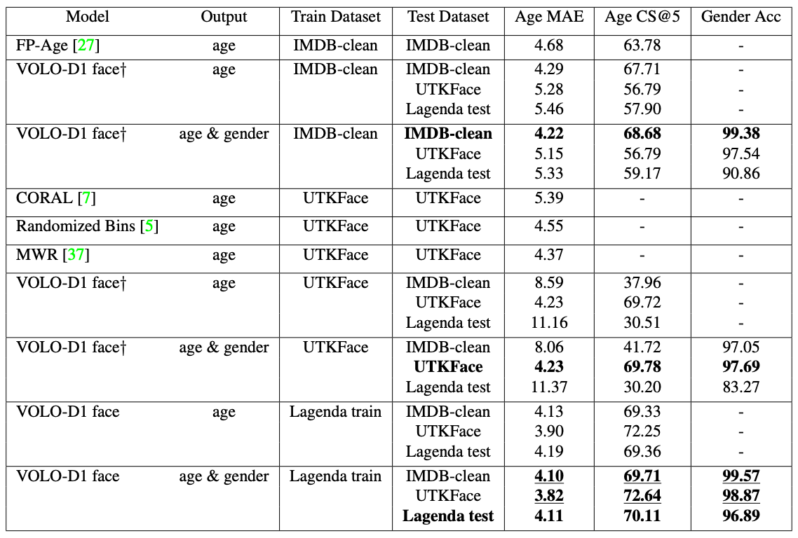

以上が、MiVOLOのアーキテクチャに関する説明となります。

## 2. MiVOLOでの学習の工夫

MiVOLOにて行われているアプローチについて、大きな括りでの2つ目としては、学習の工夫が挙げられます。  
つい先程に説明をした、最終的な特徴ベクトルを単一にまとめることや、マルチタスク学習にすることで精度向上を実現したことなども、学習の工夫になります。  
そして、それら以外にも幾つかの工夫が盛り込まれています。

先進的な学習アルゴリズムの導入として、冒頭でも紹介した「Label distribution smoothing（以下、LDS）」の適用があります。  
LDSとは、2021年のICML学会にて発表された「Deep Imbalanced Regression（以下、DIR）」という論文の中で紹介されている学習アルゴリズムとなります。

DIR論文の解説につきましては、以下ページの解説が分かりやすかった為、ご参考までに紹介させて頂きます。

[## 著者が直面した実社会の問題であるDeep Imbalanced Regression(DIR)という新しいタスクを提案

### 3つの要点✔️ Deep Imbalanced Regression(略称：DIR)という新しいタスクを提案✔️ LDSとFDSという新しい手法を提案✔️ 5つの新しいDIRデータセットを構築Delving into Deep…

ai-scholar.tech](https://ai-scholar.tech/articles/deep-learning/DIR?source=post_page-----8b77aa8c6dbc---------------------------------------)

この記事においては、LDSについての少し掘り下げた解説をさせて頂こうと思います。

### LDS

「label distribution smoothing」と検索をすると、「label smoothing」や「label distribution learning」等の類似手法が検索結果に上がってきますが、MiVOLOで扱っている対象は「label distribution smoothing」となります。

LDSが行ってくれることは、抽象的に結論から申しますと、ラベル内容と推論結果とのlossに対する、データ毎の重み付けになります。  
いわゆる「sample weight」の重み付けです。  
LDSは、その重みの決め方の提案手法となります。  
重みを決める上では、ラベル値の分布（label distribution）を参考にしており、かつ、そのラベル値の分布を任意のフィルタで滑らかにしている（smoothing）ことから、LDSという名前が付けられているものと思われます。

具体的なLDSのアルゴリズムは、以下の5ステップになります。

- **ラベル値の種類毎に件数を集計し、ラベル値の頻度分布を作成する**
- **作成したラベル値の頻度分布について、頻度値の微調整をする**
- **頻度値を調整した分布を、フィルタリングで滑らかにする**
- **滑らかにしたラベル値の頻度分布より、頻度の高さを反転させた重み値を算出する**
- **各サンプルのラベル値に対応する重みを、学習時のlossに対して掛け合わせる**

以上。

## Get Taketo Kimura’s stories in your inbox

Join Medium for free to get updates from this writer.

Subscribe

Subscribe

Remember me for faster sign in

1つずつ掘り下げていくために、以下のGithubリポジトリにて、IMDB-WIKI-DIRという画像から年齢を推定するためのオープンデータセットを用いた学習処理の触りを起動させてみます。

[## imbalanced-regression/imdb-wiki-dir at main · YyzHarry/imbalanced-regression

### ICML 2021, Long Talk] Delving into Deep Imbalanced Regression - imbalanced-regression/imdb-wiki-dir at main ·…

github.com](https://github.com/YyzHarry/imbalanced-regression/tree/main/imdb-wiki-dir?source=post_page-----8b77aa8c6dbc---------------------------------------)

先ず、「**ラベル値の種類毎に件数を集計し、ラベル値の分布を作成する**」についてですが、シンプルに集計をします。  
numpyを使い慣れている方であれば、「np.unique(labels, return\_counts=True)」と言えば分かるかもしれません。  
実際には、以下のように実装されています。

```
labels = df['age'].values  
for label in labels:  
    value_dict[min(max_target - 1, int(label))] += 1
```

↓（IMDB-WIKI-DIRでの結果）

```
value_dict =  
 {0: 7, 1: 35, 2: 49, 3: 11, 4: 27, 5: 62, 6: 104, 7: 168, 8: 244, 9: 296, 10: 367, 11: 589, 12: 643, 13: 812, 14: 920, 15: 1084, 16: 1254, 17: 1645, 18: 2152, 19: 3017, 20: 3959, 21: 4342, 22: 4870, 23: 5322, 24: 6228, 25: 6222, 26: 6562, 27: 6414, 28: 6742, 29: 7088, 30: 7410, 31: 7449, 32: 6951, 33: 6648, 34: 6384, 35: 6650, 36: 6459, 37: 6031, 38: 6177, 39: 5874, 40: 4988, 41: 5136, 42: 4729, 43: 4516, 44: 4012, 45: 4505, 46: 3660, 47: 3438, 48: 3058, 49: 2953, 50: 2633, 51: 2621, 52: 2332, 53: 2043, 54: 2112, 55: 1742, 56: 1629, 57: 1598, 58: 1635, 59: 1589, 60: 1432, 61: 1218, 62: 1170, 63: 1171, 64: 988, 65: 1003, 66: 735, 67: 814, 68: 660, 69: 683, 70: 576, 71: 530, 72: 508, 73: 414, 74: 386, 75: 347, 76: 362, 77: 301, 78: 268, 79: 285, 80: 209, 81: 201, 82: 171, 83: 135, 84: 127, 85: 114, 86: 78, 87: 97, 88: 62, 89: 41, 90: 59, 91: 42, 92: 33, 93: 20, 94: 15, 95: 11, 96: 11, 97: 5, 98: 7, 99: 8, 100: 12, 101: 3, 102: 4, 103: 2, 104: 2, 105: 1, 106: 0, 107: 1, 108: 3, 109: 2, 110: 4, 111: 1, 112: 1, 113: 3, 114: 1, 115: 1, 116: 0, 117: 0, 118: 0, 119: 3, 120: 15}
```

少し抽象化されてしまいますが、結果をヒストグラム表現で図示すると、以下のような形になります。

Press enter or click to view image in full size

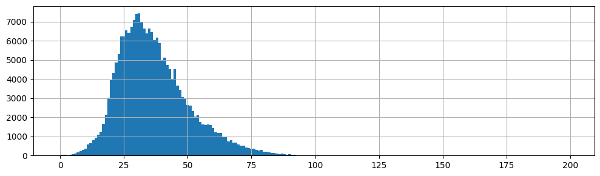

次に、「**作成したラベル値の頻度分布について、頻度値の微調整をする**」についてです。  
尚、個人的には、微調整をしない選択肢もアリだと思うのですが、Githubリポジトリのコード上では、LDSを実施する場合、微調整の実施が必須となっています。

微調整の方法は2つあり、1つ目は2乗根です。  
2乗根によって、大きな値をより小さく、小さな値は相対的にはあまり小さくせず、というスケーリングが行われる形です。

Press enter or click to view image in full size

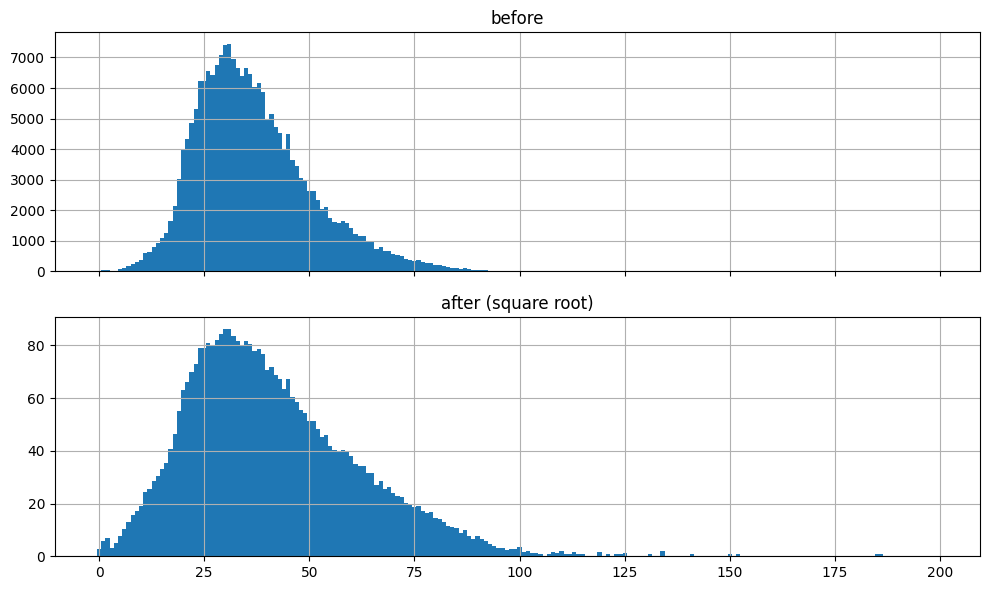

2つ目はclipです。  
ある程度の頻度以上を同様に扱うという調整になります。

Press enter or click to view image in full size

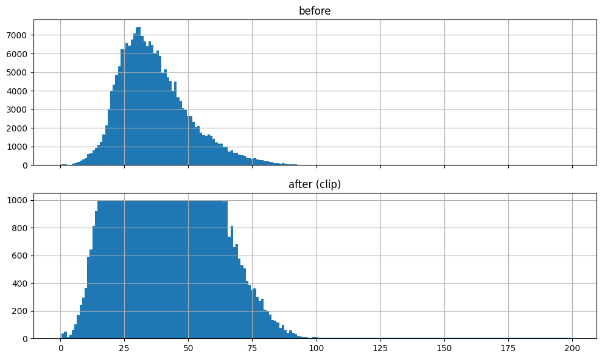

微調整が終わりましたら、次は「**頻度値を調整した分布を、フィルタリングで滑らかにする**」についてです。  
上記で微調整を行った分布に対して、フィルタリングを行います。

Githubリポジトリには、平滑化フィルタのラインナップとして、ガウシアンフィルタと、トライアンギュラーフィルタと、ラプラスフィルタを用意してくれているようでした。  
トライアンギュラーフィルターは珍しいですね。

[## imbalanced-regression/imdb-wiki-dir/utils.py at main · YyzHarry/imbalanced-regression

### ICML 2021, Long Talk] Delving into Deep Imbalanced Regression — imbalanced-regression/imdb-wiki-dir/utils.py at main ·…

github.com](https://github.com/YyzHarry/imbalanced-regression/blob/main/imdb-wiki-dir/utils.py?source=post_page-----8b77aa8c6dbc---------------------------------------#L110)

これらのフィルタを、Githubリポジトリのデフォルトパラメーターにて作成し、図示化してみたものが以下となります。  
より滑らかにしたい場合には、ガウシアンフィルを。  
元の分布らしさを残しつつ滑らかにしたい場合には、ラプラスフィルタを。  
その中間で調整したい場合には、トライアンギュラーフィルタを選択すると良いかと思われます。

Press enter or click to view image in full size

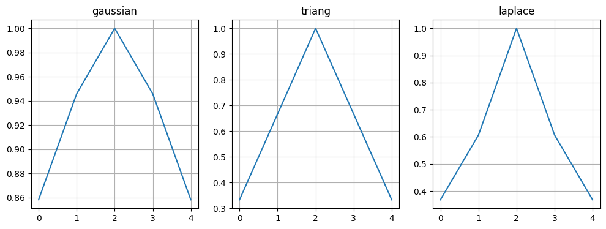

ここでは、Githubリポジトリのデフォルトであるガウシアンフィルタを選択して、平滑化を実施してみます。

Press enter or click to view image in full size

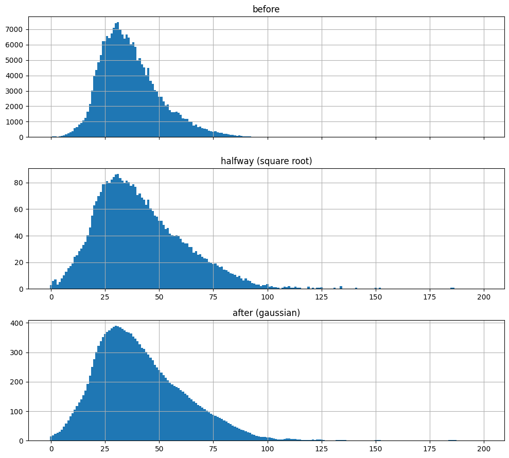

分布が滑らかになったことが確認できました。

次に、「**滑らかにしたラベル値の頻度分布より、頻度の高さを反転させた重み値を算出する**」についてです。  
先程算出した滑らかにしたラベル値の頻度分布から、各サンプルが持つラベル値をキーに、各サンプル毎にそのラベル値の頻度を得ます。  
そうすると、サンプル数分だけの頻度配列が得られる形となります。  
小さい順に並べて図示化すると以下のような形です。  
縦軸の値が、上記頻度分布の値と合致していることが確認できるかと思います。

Press enter or click to view image in full size

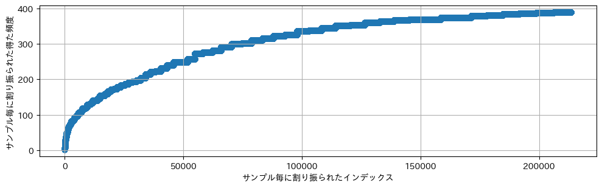

そして、学習においては、頻度が少ないラベル値に対してはlossが嵩むように、頻度が多いラベル値に対してはlossを抑えるように調整したい為、この値を逆転させた重みを算出します。  
算出コードは以下となります。  
weights変数の合計が、サンプル数と合致する形です。

```
weights = [np.float32(1 / x) for x in num_per_label]  
scaling = len(weights) / np.sum(weights)  
print('scaling =', scaling)  
weights = [scaling * x for x in weights]
```

この処理を経て得られたサンプル毎の学習時の重み、いわゆるsample weightが以下となります。

Press enter or click to view image in full size

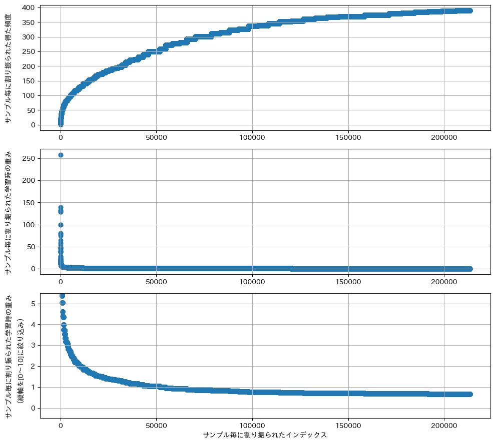

一見、非線形にスケーリングされているように見えますが、それは一部の非常に頻度が少ないサンプルに起因する見た目の問題で、縦軸の値を絞り込んで見てみると、概ね線形的に変換がされています。  
例えば、頻度が「50」だったものと「400」だったものは8倍の頻度差がありますが、逆数にして「1 ÷ 50」と「1 ÷ 400」となっても、そのスケールの差は依然として8倍という形です。

最後に、「**各サンプルのラベル値に対応する重みを、学習時のlossに対して掛け合わせる**」についてです。  
ここは、実際にコードを見てもらった方が分かりやすいかと思います。

[## imbalanced-regression/imdb-wiki-dir/loss.py at main · YyzHarry/imbalanced-regression

### ICML 2021, Long Talk] Delving into Deep Imbalanced Regression - imbalanced-regression/imdb-wiki-dir/loss.py at main ·…

github.com](https://github.com/YyzHarry/imbalanced-regression/blob/main/imdb-wiki-dir/loss.py?source=post_page-----8b77aa8c6dbc---------------------------------------)

特に、MiVOLOでは「Weighted MSE Loss」を用いたとのことですので、そのコードを直書きさせて頂きます。

```
def weighted_mse_loss(inputs, targets, weights=None):  
    loss = (inputs - targets) ** 2  
    if weights is not None:  
        loss *= weights.expand_as(loss)  
    loss = torch.mean(loss)  
    return loss
```

重み（weights）を掛け合わせている様子が確認できるかと思います。  
尚、expand\_asは、サンプル数要素のベクトル（**B**）であるweightsを、lossの形状（**B, 1**）に合わせて次元拡張する命令となっています。

以上が、LDSの説明、及び、MiVOLOで行われている学習の工夫の説明となります。

また、補足といいますか、面白ネタの共有になりますが、MiVOLO論文著者は、DIR論文にLDSと一緒に紹介されている学習アルゴリズム「Feature distribution smoothing（FDS）」についても、導入を試みたとのことですが、実験の末に組み込まない判断に至ったとのことでした。  
適用による大幅な改善は観察されず、特に大規模なデータセットの場合、トレーニング段階での計算コストがかなり大きくなってしまうとのことです。  
こちらは、MiVOLOの公式Githubリポジトリに対して質問をさせて頂きましたところ、ご回答を頂いた内容となっております。  
（予想以上にご返信が早く、お礼が遅れてしまったことが申し訳なかった次第でした…。🙇‍♂）

[## Where is `\_fds\_forward` ? · Issue #31 · WildChlamydia/MiVOLO

### Thank you for your great article and repository. I was impressed. Please tell me about the code below…

github.com](https://github.com/WildChlamydia/MiVOLO/issues/31?source=post_page-----8b77aa8c6dbc---------------------------------------)

## 3. MiVOLOでの学習データ提案

MiVOLOにて行われているアプローチについて、大きな括りでの3つ目としては、学習データへの配慮が挙げられます。  
既存のデータセットの課題感を洗い出した上で、もはや別途自らでデータセットを構築してしまうという、なかなかハードな提案をされています。  
その方法論が非常に参考になりますので、ここに記載をさせて頂こうと思います。

先述の通り、MiVOLOは2024年2月時点にて、年齢と性別の推定について、軒並みGlobal Rank #1の精度を記録しています。  
ただし、それらデータセットには、偏りの問題があると分析しています。  
有名人の女優さんが、若く見えてしまう例が論文中にも記載されています。  
53歳だそうですが、確かにそれよりも若く見えます。  
写真の撮り方もまた、プロのカメラマンだと若見えしてしまうと指摘されています。

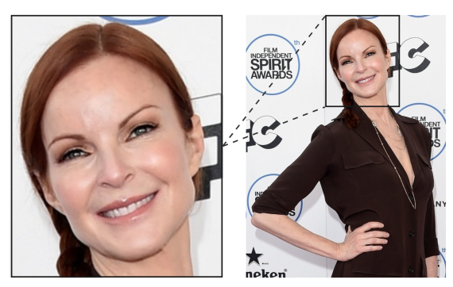

そこで、著者達は、いわゆるwildな撮影状況での年齢と性別の認識タスクのために、全く新しいベンチマークデータセットを論文で導入しています。  
そのベンチマークデータセットを、著者達はチームの名前から「Layer Age Gender Dataset (LAGENDA)」と名付けたとのことです。

LAGENDAを作成するために、先ずは「Open Images Dataset (OID)」からランダムな人物画像をサンプリングしたそうです。

[## Open Images V7

### 15,851,536 boxes on 600 classes 2,785,498 instance segmentations on 350 classes 3,284,280 relationship annotations on…

storage.googleapis.com](https://storage.googleapis.com/openimages/web/index.html?source=post_page-----8b77aa8c6dbc---------------------------------------)

OIDは、様々なシーンやドメインを網羅する、高いレベルの多様性を提供するデータセットです。  
また、画像にはクラウドソースプラットフォームを使用して、アノテーションが付けられているのだそうです。

そして、著者達も、OIDからサンプリングしたランダムな人物画像に対して、クラウドソースプラットフォームを使用した年齢推定のためのアノテーションを実施したそうです。  
また、高品質なアノテーションを保証するために、CSという指標を導入しています。  
以下がCSの式です。

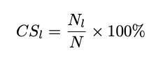

ここで「N」は、年齢推定の検査総数を表します。  
「N@l」は、推定年齢と実年齢との絶対誤差がl歳を超えない検査数を表します。  
したがって、「CS@3」というと、推定年齢が実年齢±3歳に収まった割合となります。

アノテーションの管理措置として、全てのユーザーに予めトレーニングを義務付けた上で、ユーザーは試験に合格する必要があります。  
試験にて、「CS@3」が20%未満のユーザーは、アノテーション実施が禁止となるとのことです。

具体的には、アノテーションタスクは6つの例と1つの非表示制御タスクで構成されるそうです。  
このタスクを10個完了した後、「CS@3」が20%未満のユーザーはアノテーション実施が禁止され、回答が拒否されるとのことです。  
これらの対策は、ボットやチーターによる重大なノイズを防ぐために実装されたそうで、よく考えられています。

仕上げに、5歳おきのグループに分けた上で、各グループ毎に男女のデータ数が均等になるようにしたそうです。  
その結果、男性41,457人、女性42,735人のサンプルからなる84,192人を含む67,159枚の画像が得られたとのことです。  
以下が、そのデータの分布となります。

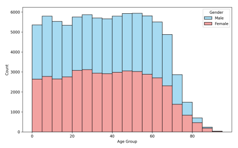

ただし、年齢層の高いサンプルを見つけるのが難しかったそうで、右端の一部の範囲には依然として不均衡が存在してしまったそうです。

また、1つのデータに対して10の重複したアノテーションを実施しているそうです。  
これはつまり、各サンプル毎にアノテーションが、年齢と性別の両方で10票を受け取ったことを意味します。  
そうして得られた投票を、どのように活用するかを決定するという課題に、著者達は直面したとのこと。  
色々と試してみた結果が、以下の表だそうです。

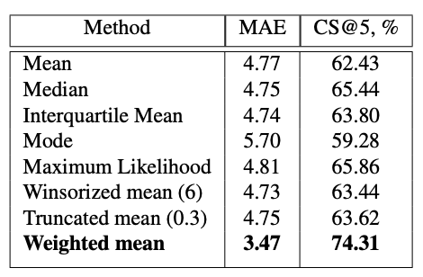

その結果、複数アノテーションに対しては、加重平均を用いる戦略を、著者達は採用しました。  
実装としては、次の式に従ったそうです。

Press enter or click to view image in full size

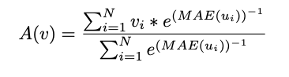

ここで、「A」はユーザー投票の「v」ベクトルの最終年齢予測です。  
Nはvのサイズで、即ち、このサンプルのアノテーションを行ったユーザーの数です。  
「MAE(v\_i)」は、「i」番目のユーザー「u」の全ての制御タスクに渡っての個々のMAEを示します。  
例えば、MAEが3であるユーザーと、4であるユーザーとを比較すると、アノテーションの品質には大きな差があるという著者達の考えから、線形ではなく、指数関数的な重み係数を使用したのだそうです。  
この加重平均アプローチは、他のアプローチよりも大幅に優れたパフォーマンスを発揮したそうで、ここは実戦向きの非常に面白い結果だと個人的に考えます。

性別は単純に最頻値「mode(v)」という方式で集計されたそうです。  
ここで、「v」は要素が「v ∈ male, female」である配列となります。  
そして、頻度の高い方の割合が75%未満となるデータは破棄をしたとのことです。  
これは、人間でも間違えやすいデータを、学習データに加えない工夫かと思われます。

以上が、データセット作成についての配慮や、その先の方法論となります。  
最後に、データセット作成に関する総括のようなものが、論文上に記載されています。

最終的なデータセット作成、及び、それに伴う実験には、OIDのデータだけでは足りず、他のソースや、著者達が所属する会社の製品（恐らく、そういう意味かと思われます…）からも、データ収集をしたそうです。  
尚、それらの画像は、OIDの画像とほぼ同じ視覚領域にあるものだそうです。

結果として、著者達が作成した最終的な学習データセットには、合計約500,000枚の画像が含まれており、LAGENDAベンチマークと全く同じ方法で注釈が付けられているとのことです。  
それをLAGENDA-trainsetと呼ぶとのこと。  
このデータを一般公開することはできないが、そのデータでトレーニングされたモデルはGithubリポジトリのリンクから提供をしてくれています。

以上が、MiVOLOにおける学習データへの配慮となります。

## Appendix

尚、MiVOLOに関しては、著者が論文以外にMediumの記事も執筆しています。  
ここには、論文よりももう少しフランクに、MiVOLOについての解説がされています。  
また、MiVOLO提案に至るまでの紆余曲折などについても触れて下さっており、非常に趣深い内容となっています。  
もしよかったら、ご参照ください。

[## MiVOLO: a new State-of-the-Art open-source neural network for age and gender estimation

### I want to tell you our story about how an initially routine work task ended up resulting in the creation of a new…

medium.com](https://medium.com/@mvkuprashevich/mivolo-a-new-state-of-the-art-open-source-neural-network-for-age-and-gender-estimation-9074bb4780cb?source=post_page-----8b77aa8c6dbc---------------------------------------)

## ailia SDKからの利用

ailia SDKで用意しているMiVOLOのプログラムは、以下となります。

[## ailia-models/face\_recognition/mivolo at master · axinc-ai/ailia-models

### The collection of pre-trained, state-of-the-art AI models for ailia SDK - ailia-models/face\_recognition/mivolo at…

github.com](https://github.com/axinc-ai/ailia-models/tree/master/face_recognition/mivolo?source=post_page-----8b77aa8c6dbc---------------------------------------)

画像に対して処理を実行するには、下記のコマンドを使用します。

```
$ python mivolo.py -i input.png
```

実行結果例が以下です。

**（画像への実行）**

Press enter or click to view image in full size

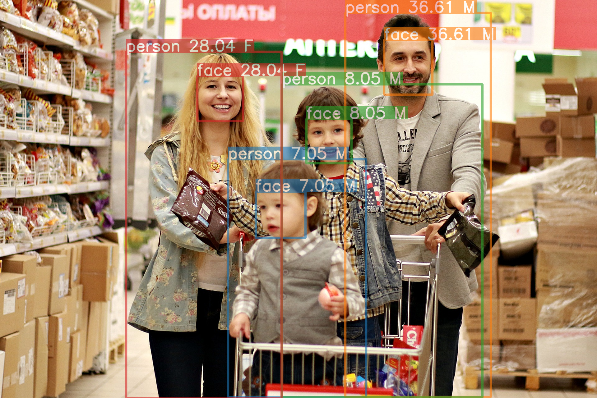

画像の出典：<https://pixabay.com/ja/photos/%E5%BA%97-%E3%82%B9%E3%83%BC%E3%83%91%E3%83%BC%E3%83%9E%E3%83%BC%E3%82%B1%E3%83%83%E3%83%88-%E3%82%B9%E3%82%AB%E3%83%BC%E3%83%88-4527402/>

**（動画への実行）**


動画の出典：<https://pixabay.com/ja/videos/%E8%B5%B0-%E4%BA%BA%E7%A8%AE-%E9%99%B8%E4%B8%8A%E7%AB%B6%E6%8A%80-33781/>

ax株式会社はAIを実用化する会社として、クロスプラットフォームでGPUを使用した高速な推論を行うことができるailia SDKを開発しています。  
ax株式会社ではコンサルティングからモデル作成、SDKの提供、AIを利用したアプリ・システム開発、サポートまで、 AIに関するトータルソリューションを提供していますのでお気軽に[お問い合わせ](https://axinc.jp/)ください