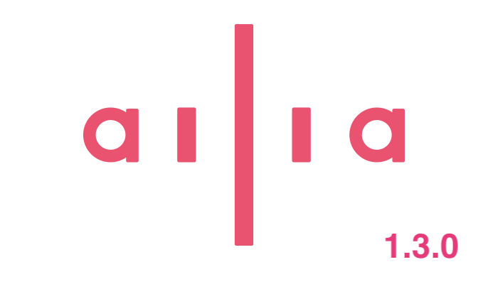
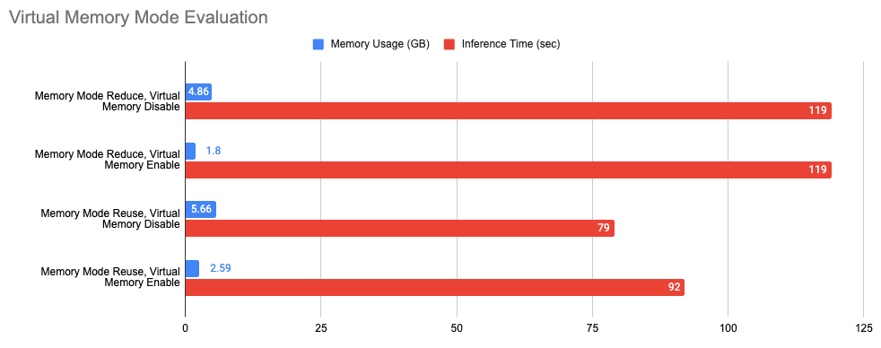
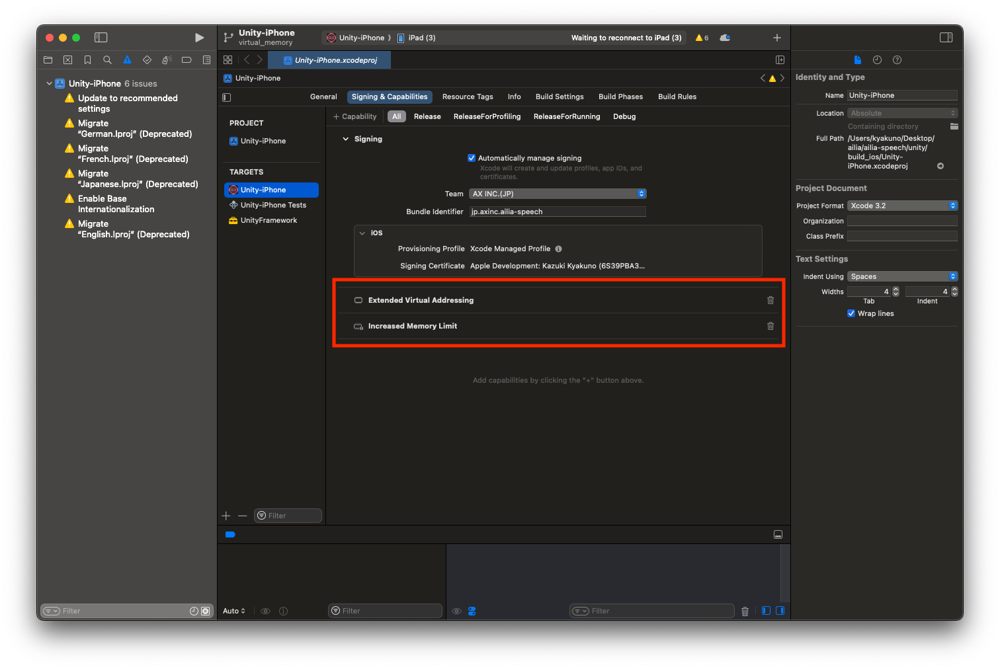
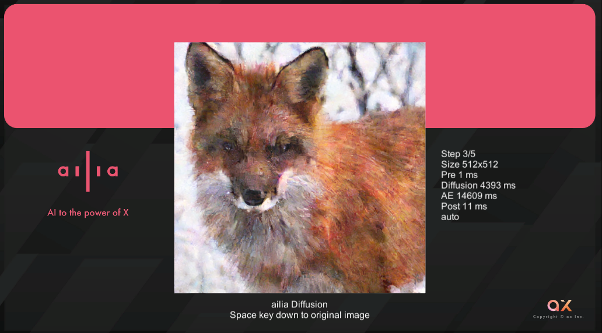

# ailia SDK 1.3.0をリリース

# ailia SDK 1.3.0をリリース

[](https://kyakuno.medium.com/?source=post_page---byline--a5e42efafb0b---------------------------------------)

[Kazuki Kyakuno](https://kyakuno.medium.com/?source=post_page---byline--a5e42efafb0b---------------------------------------)

Apr 1, 2024

--

Share

仮想メモリへの対応、モバイルGPUへの対応強化を行ったailia SDK 1.3.0のご紹介です。ailia SDKについては[こちら](https://ailia.jp/)をご覧ください。

## ailia SDK 1.3.0について

ailia SDK 1.3.0は、近年、増加している大規模AIモデルを動作させるため、仮想メモリへの対応や、モバイルGPUにおける巨大テンソルへの対応を行なったリリースとなります。



ailia SDK 1.3.0

## 仮想メモリへの対応

従来、AIモデルのテンソルとウエイトは全て物理メモリ上に配置されていました。そのため、大規模なモデルを推論しようとした場合に、メモリ不足になる場合がありました。

ailia SDK 1.3.0では、memory\_modeにAILIA\_MEMORY\_REDUCE\_CONSTANT\_WITH\_FILE\_MAPPEDを追加し、AIモデルのウエイトをストレージ上の仮想メモリに配置することが可能になりました。

これにより、iOSなどメモリが少ない環境で、従来よりも大きなモデルの実行が可能になります。例えば、RAMが4GBのiPad Mini 6において、Whisper Mediumなどの大規模モデルが実行可能になります。

仮想メモリ機能をC APIから使用するには、memory\_modeにAILIA\_MEMORY\_REDUCE\_CONSTANT\_WITH\_FILE\_MAPPEDを追加します。Python APIの場合、get\_memory\_mode APIのuse\_memory\_mappedをTrueにします。ストレージ上にウエイトを保存するため、事前に、set\_temporary\_cache\_path APIを呼び出す必要があります。

```
ailia.set_temporary_cache_path("./")  
memory_mode = ailia.get_memory_mode(reduce_constant=True, ignore_input_with_initializer=True, reduce_interstage=False, reuse_interstage=True, use_memory_mapped=True)  
ailia.Net(weight_path="input.onnx", memory_mode=memory_mode)
```

Whisper MediumをM2のMacBookAirで推論した場合の評価です。

Press enter or click to view image in full size



仮想メモリの評価

AILIA\_MEMORY\_REDUCE\_INTERSTAGE（メモリ都度解放モード）と併用した場合、4.86GBのメモリが必要だったのが、1.8GBまで削減可能です。また、40秒の音声ファイルを推論するために必要な時間は119秒と、仮想メモリを使用してもパフォーマンスは変化しません。

AILIA\_MEMORY\_REUSE\_INTERSTAE（メモリ再利用モード）と併用した場合、5.66GBのメモリが必要だったのが、2.59GBまで削減可能です。40秒の音声ファイルを推論するためのに必要な時間は79秒から92秒と、仮想メモリを使用することで、16%程度、パフォーマンスが低下します。

## Get Kazuki Kyakuno’s stories in your inbox

Join Medium for free to get updates from this writer.

Subscribe

Subscribe

Remember me for faster sign in

なお、iOSの場合はデフォルトでは仮想メモリ空間のサイズに制約があります。そのため、XcodeのCapabilityで[Extended Virtual Addressing](https://developer.apple.com/documentation/bundleresources/entitlements/com_apple_developer_kernel_extended-virtual-addressing)を追加してください。

Press enter or click to view image in full size



iOSのCapabilityの設定

## モバイルGPUへの対応強化

従来より、ailia SDKはAdrenoなどのモバイルGPUに対応しており、YOLOXなどのモデルを高速に推論可能です。

しかし、近年のDiffusionモデルはモデルの大型化が進んでおり、グラフ中に512MBなどの巨大なテンソルが出現します。

Vulkanでは、maxStorageBufferRangeが規定されており、Adreno GPUでは256MB等に設定されています。そのため、このサイズを超えたテンソルに書き込みを行った場合、maxStorageBufferRangeを超えたサイズへの書き込みが行えないという問題がありました。

ailia SDK 1.3.0では、Vulkanのカーネルの分割実行に対応し、maxStorageBufferRangeを超えたテンソルへの書き込みに対応しました。これにより、DiffusionモデルをAdreno GPU上で実行が可能になります。

Press enter or click to view image in full size



diffusionの実行例

Stable Diffusionを含むDiffusionモデルをUnityから実行するサンプルも提供しています。

[## ailia-models-unity/Assets/AXIP/AILIA-MODELS/Diffusion at master · axinc-ai/ailia-models-unity

### Unity version of ailia models repository. Contribute to axinc-ai/ailia-models-unity development by creating an account…

github.com](https://github.com/axinc-ai/ailia-models-unity/tree/master/Assets/AXIP/AILIA-MODELS/Diffusion?source=post_page-----a5e42efafb0b---------------------------------------)

## メモリ再利用のGPU対応

ailia SDK 1.2.16で導入したメモリ再利用の改良により、CPUでのメモリ消費量の削減を実現しました。ailia SDK 1.3.0では、新たにGPUでのメモリ再利用に対応し、GPUでもメモリの再利用の効率が向上しました。

メモリ再利用は、memory\_modeにAILIA\_MEMORY\_REUSE\_INTERSTAGEを指定することで使用可能です。

## オペレータの高速化

CPUおよびSIMD向けに、1DPool、ScatterElement、Pad、Reduce、LRN、Gemmの高速化を行なっています。また、ActivationのFuseを強化しており、Gelu、Swish、Hardswish、MishがConvolutionにFuseできるようになり、これらのActivationを使用するモデルが高速化されています。

## モデル読み込みの高速化

モデル読み込み時間を高速化しました。M2のmacOSでCPU推論する場合、Deticのモデル読み込み時間が、ONNX Runtimeで3339ms、ailia SDK 1.2.16で1609msですが、ailia SDK 1.3.0では1152msに高速化されます。

## ailia SDKのバージョニングルールの改良

従来、1.x.yをバージョン番号として、yのバージョン番号を上げていましたが、今後、xのバージョン番号を上げていく方針としました。これにより、パッチバージョンとビルドバージョンを分離し、より実態に沿った運用を可能にします。

ax株式会社はAIを実用化する会社として、クロスプラットフォームでGPUを使用した高速な推論を行うことができるailia SDKを開発しています。ax株式会社ではコンサルティングからモデル作成、SDKの提供、AIを利用したアプリ・システム開発、サポートまで、 AIに関するトータルソリューションを提供していますのでお気軽に[お問い合わせ](https://axinc.jp/)ください。