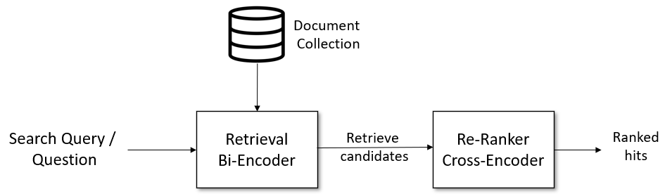
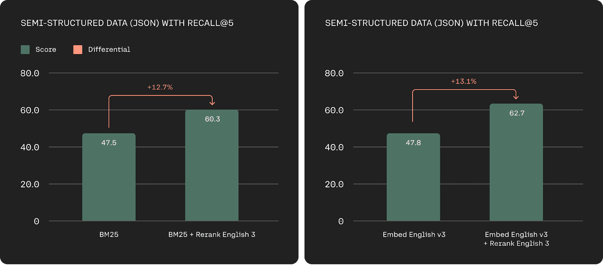
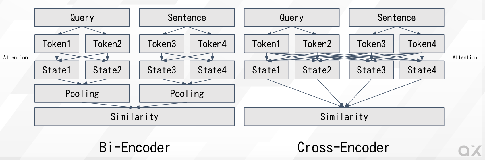

# CrossEncoderMmarco : 質問文と回答文の類似度を計算する機械学習モデル

# **CrossEncoderMmarco : 質問文と回答文の類似度を計算する機械学習モデル**

[](https://kyakuno.medium.com/?source=post_page---byline--c90b35e9fc09---------------------------------------)

[Kazuki Kyakuno](https://kyakuno.medium.com/?source=post_page---byline--c90b35e9fc09---------------------------------------)

10 min read

·

May 7, 2024

--

Share

質問文と回答文の類似度を計算する機械学習モデルであるCrossEncoderMmarcoのご紹介です。CrossEncoderMmarcoを使用することで、RAGにリランクの仕組みを導入し、精度を改善することが可能です。

## CrossEncoderMmacroの概要

CrossEncodcerMmacroは、マルチリンガルのデータセットであるmMARCOを使用して学習された、質問文と回答文を入力とし、類似度を計算するための機械学習モデルです。

TokenizerにはXMLRobertaを使用しており、SentenceTransformerやE5と互換性があります。

[## jeffwan/mmarco-mMiniLMv2-L12-H384-v1 · Hugging Face

### We’re on a journey to advance and democratize artificial intelligence through open source and open science.

huggingface.co](https://huggingface.co/jeffwan/mmarco-mMiniLMv2-L12-H384-v1?source=post_page-----c90b35e9fc09---------------------------------------)

ベースモデルとして、Microsoftの開発したMiniLMv2を使用しています。MiniLMv2は10 億以上の訓練ペアの大規模で多様なデータセットで事前学習されています。

[## unilm/minilm at master · microsoft/unilm

### Large-scale Self-supervised Pre-training Across Tasks, Languages, and Modalities — unilm/minilm at master ·…

github.com](https://github.com/microsoft/unilm/tree/master/minilm?source=post_page-----c90b35e9fc09---------------------------------------)

## MS MARCOとmMARCOについて

MS MARCO（Microsoft MAchine Reading COmprehension）はMicrosoftが2016年に提供を開始した、Bingにおける匿名化された10万の質問と、人間が生成した回答を含む、英語のデータセットです。その後、データセットは拡張され、現在は100万の質問と回答と、Passage Rankingデータセットが追加されています。

[## MS MARCO

### 10.23.2020 Task Retirement 1. Retire QnA V2 Task 2. Retire NLGEN V2 Task 3. Retire OpenKP Task 08.11.2020 New Task 1…

microsoft.github.io](https://microsoft.github.io/msmarco/?source=post_page-----c90b35e9fc09---------------------------------------)

mMARCOはMS MARCOのPassage RankingデータセットをGoogle翻訳で多言語に拡張したマルチリンガルのデータセットです。14言語に対応しています。

[## GitHub - unicamp-dl/mMARCO: A multilingual version of MS MARCO passage ranking dataset

### A multilingual version of MS MARCO passage ranking dataset - unicamp-dl/mMARCO

github.com](https://github.com/unicamp-dl/mMARCO?source=post_page-----c90b35e9fc09---------------------------------------)

[## mMARCO: A Multilingual Version of the MS MARCO Passage Ranking Dataset

### The MS MARCO ranking dataset has been widely used for training deep learning models for IR tasks, achieving…

arxiv.org](https://arxiv.org/abs/2108.13897?source=post_page-----c90b35e9fc09---------------------------------------)

## RAGにおけるベクトル検索とリランク

CrossEncoderMmarcoは、RAGにおけるベクトル検索の後段で使用されます。

従来のベクトル検索によるRAGでは、通常のベクトル検索で候補を10件などに絞り込み、ChatGPTで処理して回答を得ます。

CrossEncoderMmarcoによるリランクを併用したRAGでは、通常のベクトル検索で候補を100件などに絞り込んだ後、CrossEncoderMmacroによるリランクで並び替え、最終的な10件をChatGPTで処理して回答を得ます。

## Get Kazuki Kyakuno’s stories in your inbox

Join Medium for free to get updates from this writer.

Subscribe

Subscribe

Remember me for faster sign in

これにより、より高精度なRAGが実現可能です。

Press enter or click to view image in full size



CrossEncoderによるリランキング（出典：<https://www.sbert.net/examples/applications/retrieve_rerank/README.html>）

CommandR+を開発したCohereも、リランクのためのAIモデルをクラウドで提供しています。リランクを導入することで、通常のベクトル検索よりも精度が向上します。

Press enter or click to view image in full size



Rerankの精度改善効果（出典：<https://cohere.com/blog/rerank-3>）

[## Introducing Rerank 3: A New Foundation Model for Efficient Enterprise Search & Retrieval

### Today, we're introducing our newest foundation model, Rerank 3, purpose built to enhance enterprise search and…

cohere.com](https://cohere.com/blog/rerank-3?source=post_page-----c90b35e9fc09---------------------------------------)

Press enter or click to view image in full size


CommandR+を使用したRAGのシステム例（出典：<https://lightning.ai/lightning-ai/studios/rag-using-cohere-command-r?section=featured>）

[## RAG using Cohere Command R+ - a Lightning Studio by akshay

### Discover a fresh approach to interact with your documents through Cohere's powerful Command R+ model, specifically…

lightning.ai](https://lightning.ai/lightning-ai/studios/rag-using-cohere-command-r?section=featured&source=post_page-----c90b35e9fc09---------------------------------------)

## 通常のベクトル検索（BiEncoder）との違い


BiEncoderとCrossEncoder（出典：<https://www.sbert.net/examples/applications/cross-encoder/README.html>）

一般的なベクトル検索で使用されるBiEncoderでは、質問文と回答文を個別にTransformerに与えて、ベクトル表現を求め、類似度を計算します。具体的に、質問文だけ、回答文だけからEmbeddingを計算し、Embedding間のL2距離やコサイン距離を計算します。質問文と回答文は独立して処理されるため、TransformerのAttentionは、質問内、回答内のみで計算されます。また、質問と回答の関連性は、Embeddingの低次元空間に変換された後に類似度計算されます。

対して、CrossEncoderでは、質問文と回答文をまとめてTransformerに与えて、類似度を計算します。質問文と回答文をまとめて処理するため、TransformerのAttentionは、質問と回答の両方から計算されます。そのため、単純なEmbeddingよりも精度が高くなります。また、質問と回答の関連性は、高次元空間で距離計算されます。

Press enter or click to view image in full size



Bi-EncoderではQueryとSentenceが独立でAttentionが計算されるが、Cross-Encoderの場合はQueryとSentenceをまとめてAttentionが計算されるため、計算量が多い

CrossEncoderは、事前計算ができないため、BiEncoderよりも計算負荷が高くなります。その分、CrossEncoderは、BiEncoderよりも精度が高くなります。

例えば、通常のEmbeddingでは、「ベルリンには何人が住んでいますか」「ベルリンには何人が住んでいますか。」などの、句読点の有無でEmbeddingが微妙に揺らぎ、その結果、RAGで検索されるTOPKの中の順番が揺らぐという問題があります。

CrossEncoderMmarcoを使用してリランクすると、このような揺らぎは発生せず、常に安定した順番で文章を取得することが可能です。

## ailia SDKでCrossEncoderMmarcoを使用する

ailia SDKでCrossEncoderMmarcoを使用するには下記のようにします。qに質問文、pに回答文を指定することで、関連度を数値で出力します。関連度は値が大きいほど、関連性が高いことを示しています。

```
$ python3 cross_encoder_mmarco.py -q "How many people live in Berlin?" -p "Berlin has a population of 3,520,031 registered inhabitants in an area of 891.82 square kilometers."  
$ python3 cross_encoder_mmarco.py -q "How many people live in Berlin?" -p "New York City is famous for the Metropolitan Museum of Art."  
$ python3 cross_encoder_mmarco.py -q "ベルリンには何人が住んでいますか？" -p "ベルリンの人口は891.82平方キロメートルの地域に登録された住民が3,520,031人います。"  
$ python3 cross_encoder_mmarco.py -q "ベルリンには何人が住んでいますか？" -p "ニューヨーク市はメトロポリタン美術館で有名です。"
```

```
Output : [array([[10.761541]], dtype=float32)]  
Output : [array([[-8.127746]], dtype=float32)]  
Output : [array([[9.374646]], dtype=float32)]  
Output : [array([[-6.408309]], dtype=float32)]
```

[## ailia-models/natural\_language\_processing/cross\_encoder\_mmarco at master · axinc-ai/ailia-models

### The collection of pre-trained, state-of-the-art AI models for ailia SDK …

github.com](https://github.com/axinc-ai/ailia-models/tree/master/natural_language_processing/cross_encoder_mmarco?source=post_page-----c90b35e9fc09---------------------------------------)

ax株式会社はAIを実用化する会社として、クロスプラットフォームでGPUを使用した高速な推論を行うことができるailia SDKを開発しています。ax株式会社ではコンサルティングからモデル作成、SDKの提供、AIを利用したアプリ・システム開発、サポートまで、 AIに関するトータルソリューションを提供していますのでお気軽に[お問い合わせ](https://axinc.jp/)ください。