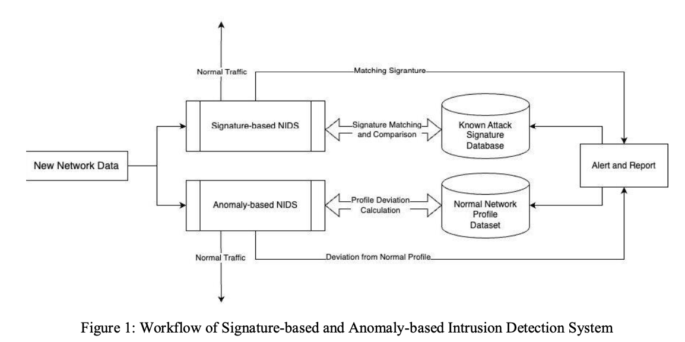
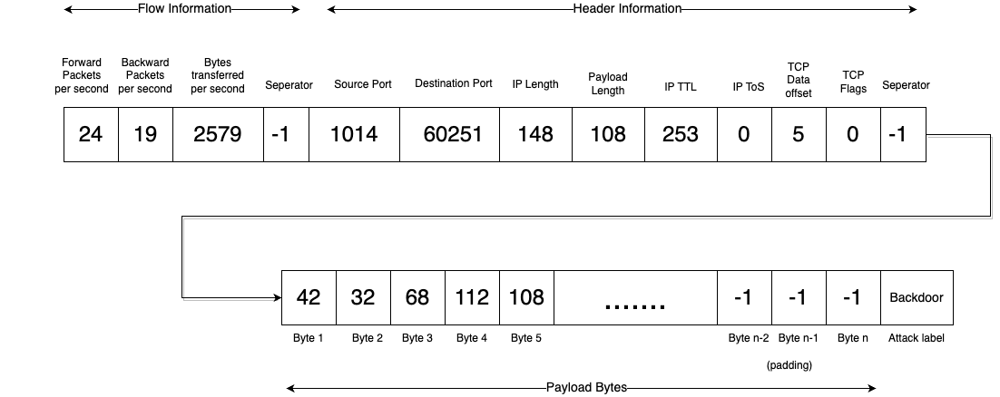

# Bert Network Packet Flow Header Payload : ネットワークへの攻撃検知を行うための機械学習モデル

# **Bert Network Packet Flow Header Payload : ネットワークへの攻撃検知を行うための機械学習モデル**

[](https://kyakuno.medium.com/?source=post_page---byline--1df9a711a338---------------------------------------)

[Kazuki Kyakuno](https://kyakuno.medium.com/?source=post_page---byline--1df9a711a338---------------------------------------)

11 min read

·

Apr 1, 2024

--

Share

ailia SDKで使用できる機械学習モデルである「Bert Network Packet Flow Header Payload」の紹介です。ailia SDKはエッジ向け推論フレームワークであり、ailia MODELSに公開されている機械学習モデルを使用することで、簡単にAIの機能をアプリケーションに実装することができます。

## Bert Network Packet Flow Header Payloadの概要

Bert Network Packet Flow Header Payloadは、Network Intrusion Detectionと呼ばれるネットワークへの攻撃検知を行うための機械学習モデルです。パケットのHexデータを入力とし、BERTを使用して、攻撃種別のタグを出力します。

[## rdpahalavan/bert-network-packet-flow-header-payload · Hugging Face

### We're on a journey to advance and democratize artificial intelligence through open source and open science.

huggingface.co](https://huggingface.co/rdpahalavan/bert-network-packet-flow-header-payload?source=post_page-----1df9a711a338---------------------------------------)

Bert Network Packet Flow Header Payloadの詳細は下記の論文に記載されています。

<https://github.com/rdpahalavan/PADEC/blob/main/Thesis/Thesis.pdf>

## Network Intrusion Detectionの歴史

ネットワークのセキュリティの重要性は年々増しています。ネットワークの侵入検知を行うシステムは、Network Intrusion Detection System (NIDS)と呼ばれており、ネットワークのトラフィックを監視することで、侵入を検知します。

従来のシステムは、Signature-based detectionか、Anomaly-based detection、Flow-based detectionが使用されています。

Press enter or click to view image in full size



出典：<https://github.com/rdpahalavan/PADEC/blob/main/Thesis/Thesis.pdf>

Signature-based detectionでは、既知の攻撃パターンのパターンをベースに、攻撃検知を行います。データベースを使用して、攻撃のパターンを分類します。Anomaly-based detectionでは、通常時のネットワークの状態から変化があった場合にアラートを出します。Anomaly-based detectionでは、ネットワークのトラフィックの量や、プロトコルの使用方法、リソースの状態などをもとに、異常検知します。

これらのシステムに対して、近年、機械学習ベースの方法が提案されています。Flow-based detectionでは、攻撃時のネットワークのフローに注目します。パケットのシーケンスのフローをもとに機械学習で攻撃を検知します。学習のためのデータセットとして、CIC-IDS2017、UNSW-NB15、CTU-13、ISCS NSL-KDDが使用できます。

Signature-based detectionでは、パケットの情報をもとにパターン認識します。この方法では、既知の攻撃パターンは検知できますが、新しい攻撃パターンを検知することはできないという問題があります。

Flow-based detectionでは、RNNとLSTMが使用されていますが、最新のTransformerは使用されていません。

## Bert Network Packet Flow Header Payloadのアーキテクチャ

近年、Transformerが登場しています。TransformerをNIDS向けにFine Tuningすることで、高精度な検知が行える可能性があります。そこで、Bert Network Packet Flow Header Payloadでは、BERTを使用することで、高精度な攻撃検知を行うことを目指します。

既存のBERTはパケットデータに対して学習されていないため、Fine Tuningを行う必要があります。既存のBERTのTokenizerとの互換性のため、パケットの各数値を文字列にし、バイトごとにスペースで区切り、連結した長い文字列にします。WordPiece tokenizerによって、スペースごとにトークンが分割され、データセットのパケットの各列が独立したトークンとなります。BERTの最大トークン長は512トークンとなるため、入力のpayloadは最大で500byteに制約します。

データセットとしては、パケット情報を含むCIC-IDS2017とUNSW-NB15を使用します。パケット情報としては、Payload Bytes、Package Bytes、Packet Fieldsを使用します。70%を学習用、30%を検証用とします。学習データは各クラス10万パケット、合計で240万パケットです。学習には、24クラスの分類問題を使用します。

## Get Kazuki Kyakuno’s stories in your inbox

Join Medium for free to get updates from this writer.

Subscribe

Subscribe

Remember me for faster sign in

24クラスの内訳は下記となります。

```
{'Analysis': 0,  
 'Backdoor': 1,  
 'Bot': 2,  
 'DDoS': 3,  
 'DoS': 4,  
 'DoS GoldenEye': 5,  
 'DoS Hulk': 6,  
 'DoS SlowHTTPTest': 7,  
 'DoS Slowloris': 8,  
 'Exploits': 9,  
 'FTP Patator': 10,  
 'Fuzzers': 11,  
 'Generic': 12,  
 'Heartbleed': 13,  
 'Infiltration': 14,  
 'Normal': 15,  
 'Port Scan': 16,  
 'Reconnaissance': 17,  
 'SSH Patator': 18,  
 'Shellcode': 19,  
 'Web Attack - Brute Force': 20,  
 'Web Attack - SQL Injection': 21,  
 'Web Attack - XSS': 22,  
 'Worms': 23}
```

推論では、パケットのHexを元に、Hex内のパケットヘッダからメタ情報を抽出、パケットのペイロードを付加することで入力データを作成します。

Press enter or click to view image in full size



出典：<https://huggingface.co/datasets/rdpahalavan/network-packet-flow-header-payload/blob/main/Data-Format.png>

```
    final_format = [  
        forward_packets_per_second,  
        backward_packets_per_second,  
        bytes_transferred_per_second,  
        -1,  
        source_port,  
        destination_port,  
        IP_len,  
        payload_len,  
        IP_ttl,  
        IP_tos,  
        TCP_dataofs,  
        TCP_flags,  
        -1,  
    ]  
 final_format = final_format + payload[:500]
```

最終的に、入力データは下記のような文字列となります。

```
0 4 5493 -1 443 63834 1480 1428 245 0 8 0 -1 32 87 216 38 19 204 44 114 27 135 158 240 14 109 146 91 202 146 160 45 82 159 213 135 253 142 90 156 185 61 210 164 5 216 49 86 18 80 13 113 121 207 124 1 202 94 24 205 19 127 226 4 79 225 88 152 213 180 39 34 249 231 155 188 116 49 206 113 17 113 170 99 166 183 121 54 125 116 90 11 84 50 250 50 110 142 114 56 209 80 51 218 96 26 75 185 201 190 164 100 ...
```

この文字列に対して、Tokenizerを適用し、BERTに入力し、攻撃種別を取得します。

## 検証用のパケットデータ

検証用のパケットデータは下記にあります。これらのデータは、Bert Network Packet Flow Header Payload向けに変換済みのデータとなります。

[## rdpahalavan/network-packet-flow-header-payload · Datasets at Hugging Face

### We're on a journey to advance and democratize artificial intelligence through open source and open science.

huggingface.co](https://huggingface.co/datasets/rdpahalavan/network-packet-flow-header-payload?source=post_page-----1df9a711a338---------------------------------------)

## 独自データでの学習

BERTのFine Tuningのコードは下記にあります。これを使用することで、独自データでの学習も可能です。

[## PADEC/Code/Finetuning\_Models.ipynb at main · rdpahalavan/PADEC

### Thesis research on enhancing Network Intrusion Detection System (NIDS) explainability using Transformers. …

github.com](https://github.com/rdpahalavan/PADEC/blob/main/Code/Finetuning_Models.ipynb?source=post_page-----1df9a711a338---------------------------------------)

ログを見ると、509050件のテストデータでの攻撃分類精度は99.48%となっています。

## Bert Network Packet Flow Header Payloadの使用方法

ailia SDKを使用してBert Network Packet Flow Header Payloadを使用するには下記のようにします。入力にはパケットのHEXデータのテキストファイルを与えます。サンプルとして、通常パケットとしてinput\_hex.txtと、攻撃パケットとしてinput\_exploit.txtを同梱しています。

```
python3 bert-network-packet-flow-header-payload.py --input input_hex.txt
```

[## ailia-models/network\_intrusion\_detection/bert-network-packet-flow-header-payload at master ·…

### The collection of pre-trained, state-of-the-art AI models for ailia SDK …

github.com](https://github.com/axinc-ai/ailia-models/tree/master/network_intrusion_detection/bert-network-packet-flow-header-payload?source=post_page-----1df9a711a338---------------------------------------)

## 関連情報

実際にbert-network-packet-flow-header-payloadを使用してネットワークトラフィックの分析が行われているリポジトリです。モデルをそのまま使用したケースと、FineTuningしたケースで、ネットワークへのDoS attackの検出を試みており、良好な結果が得られたと報告されています。

このリポジトリでは、payloadにIPパケットそのものを格納しています。ailia-modelsでは、公式のリポジトリに則ってTCPのペイロードを入力していますが、 — ipオプションを使用することで、このリポジトリと同じく、IPパケットそのものを格納して評価することも可能です。

[## GitHub - TPs-ESIR-S9/PcapFileAnalysis: Malicious Network Traffic Analysis with AI

### Malicious Network Traffic Analysis with AI. Contribute to TPs-ESIR-S9/PcapFileAnalysis development by creating an…

github.com](https://github.com/TPs-ESIR-S9/PcapFileAnalysis/tree/main?source=post_page-----1df9a711a338---------------------------------------)

BERTではなく、CIC-IDS2017データセットとLSTMを使用したネットワーク異常検出の研究としては、大阪府立大学の研究がありました。（[PDF](https://ipsj.ixsq.nii.ac.jp/ej/?action=repository_action_common_download&item_id=206179&item_no=1&attribute_id=1&file_no=1)）

[## LSTMによるネットワーク異常検出 | 文献情報 | J-GLOBAL 科学技術総合リンクセンター

### 文献「LSTMによるネットワーク異常検出」の詳細情報です。J-GLOBAL…

jglobal.jst.go.jp](https://jglobal.jst.go.jp/detail?JGLOBAL_ID=202002212245801732&source=post_page-----1df9a711a338---------------------------------------)

ax株式会社はAIを実用化する会社として、クロスプラットフォームでGPUを使用した高速な推論を行うことができるailia SDKを開発しています。  
ax株式会社ではコンサルティングからモデル作成、SDKの提供、AIを利用したアプリ・システム開発、サポートまで、 AIに関するトータルソリューションを提供していますのでお気軽に[お問い合わせ](https://axinc.jp/)ください。