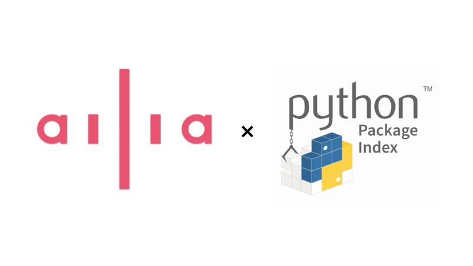

# ailia SDKの評価版がpip経由でインストール可能に

# ailia SDKの評価版がpip経由でインストール可能に

[](https://kyakuno.medium.com/?source=post_page---byline--c69e620f5dc9---------------------------------------)

[Kazuki Kyakuno](https://kyakuno.medium.com/?source=post_page---byline--c69e620f5dc9---------------------------------------)

Apr 9, 2024

--

Share

ailia SDKの評価版がpip経由でインストール可能になりました。従来よりも簡単にailia SDKの導入・評価が可能です。

## ailia SDKの評価版のpip経由でのインストール

pipはPythonで標準的に使用されているパッケージ管理ツールです。従来、ailia SDKの評価版のダウンロードには、評価版リクエストページからのSDKのダウンロードが必要でした。本日より、ailia SDKの評価版のpip経由でのインストールに対応し、より簡単にailia SDKの導入・評価を行うことが可能になりました。

Press enter or click to view image in full size



ailia x pypi

## pip経由でのインストール方法

下記のコマンドを実行いただくだけで、ailia SDKの評価版のインストールが可能です。

```
pip3 install ailia
```

対応するプラットフォームは、Windows、macOS、Linux、Raspberry Pi、Jetsonです。

ailia SDKの評価版を実行すると、自動的に30日の評価ライセンスをクラウドからダウンロードします。ライセンスは30日ごとに自動更新されます。

## ailia MODELSの使用方法

ailia MODELSを使用することで、300種類以上のAIモデルを実行することが可能です。

## Get Kazuki Kyakuno’s stories in your inbox

Join Medium for free to get updates from this writer.

Subscribe

Subscribe

Remember me for faster sign in

ailia MODELSのリポジトリをCloneします。

```
git clone https://github.com/axinc-ai/ailia-models.git
```

[## GitHub — axinc-ai/ailia-models: The collection of pre-trained, state-of-the-art AI models for ailia…

### The collection of pre-trained, state-of-the-art AI models for ailia SDK — axinc-ai/ailia-models

github.com](https://github.com/axinc-ai/ailia-models?source=post_page-----c69e620f5dc9---------------------------------------)

依存ライブラリをインストールします。

```
pip3 install -r requirements.txt
```

ランチャーを起動します。

```
python3 launchar.py
```

実行したいモデルを選択し、Run modelボタンを押すと、モデルを実行可能です。

Press enter or click to view image in full size


## Google Colaboratoryでの実行方法

ailia SDKでのpip経由での提供開始に伴い、Google Colaboratoryでもailia SDKとailia MODELSを使用可能になりました。Google Colaboratoryでの実行例は下記を参照してください。

[## ailia-models/hello\_ailia.ipynb at master · axinc-ai/ailia-models

### The collection of pre-trained, state-of-the-art AI models for ailia SDK - ailia-models/hello\_ailia.ipynb at master ·…

github.com](https://github.com/axinc-ai/ailia-models/blob/master/hello_ailia.ipynb?source=post_page-----c69e620f5dc9---------------------------------------)

## ailia SDKの個人での無償利用範囲の拡大

ailia SDKの個人利用の範囲を拡大し、個人での非商用利用の場合は無償でご利用いただけるようになりました。

ライセンス条件のQ&Aは下記のページを参照ください。

[## ailia SDK License

### ailia SDK License Information [Japanese] [English] About license 【使用上のご注意】…

ailia.ai](https://ailia.ai/license/?source=post_page-----c69e620f5dc9---------------------------------------)

ax株式会社はAIを実用化する会社として、クロスプラットフォームでGPUを使用した高速な推論を行うことができるailia SDKを開発しています。ax株式会社ではコンサルティングからモデル作成、SDKの提供、AIを利用したアプリ・システム開発、サポートまで、 AIに関するトータルソリューションを提供していますのでお気軽に[お問い合わせ](https://axinc.jp/)ください。