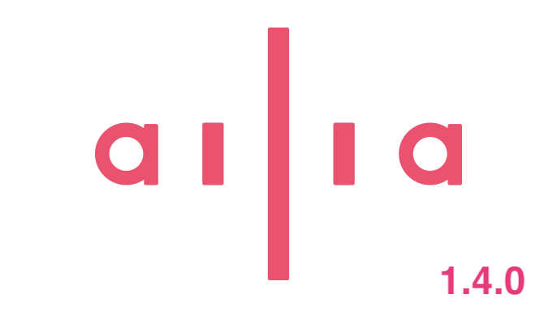

# ailia SDK 1.4.0をリリース

# ailia SDK 1.4.0をリリース

[Kazuki Kyakuno](https://kyakuno.medium.com/?source=post_page---byline--eb26d251f6de---------------------------------------)

Jun 11, 2024

--

Share

STFTやCol2Imなど新たなレイヤーと、cuDNN9に対応したailia SDK 1.4.0をリリースしました。

## 新たなレイヤーへの対応

STFT、CenterCropPad、Col2Im、QuantizeLinear、DequantizeLinearに対応しました。これにより、音声系のモデルの対応が強化されます。

## cuDNN9に対応

WindowsおよびLinux環境において、cuDNN9に対応しました。

## パフォーマンスの改善

LSTMとRandomのGPU対応を行いました。また、Arm SVEへの対応の強化、モデル読み込み速度の改善、LayerNormの速度改善、入力Blobの形状変更を伴う推論の高速化を行いました。

## パッケージマネージャへの対応

PythonのpipやUnity Package Managerなどのパッケージマネージャに対応し、より簡単なインストールが可能なフォルダレイアウトに変更しました。

## Get Kazuki Kyakuno’s stories in your inbox

Join Medium for free to get updates from this writer.

Subscribe

Subscribe

Remember me for faster sign in

なお、Unity Packageのフォルダ構成に変更がありますが、C APIに互換性があるため、既存のプロジェクトのPluginsフォルダのDLLを上書きすることでもailia SDK 1.4.0に更新可能です。

## ailia SDK 1.4.0で新たにサポートするモデル

Reazon Speech（日本語の音声認識）

[## ailia-models/audio\_processing/reazon\_speech at master · axinc-ai/ailia-models

### The collection of pre-trained, state-of-the-art AI models for ailia SDK - ailia-models/audio\_processing/reazon\_speech…

github.com](https://github.com/axinc-ai/ailia-models/tree/master/audio_processing/reazon_speech?source=post_page-----eb26d251f6de---------------------------------------)

Reazon Speech 2（日本語の音声認識）

[## ailia-models/audio\_processing/reazon\_speech2 at master · axinc-ai/ailia-models

### The collection of pre-trained, state-of-the-art AI models for ailia SDK - ailia-models/audio\_processing/reazon\_speech2…

github.com](https://github.com/axinc-ai/ailia-models/tree/master/audio_processing/reazon_speech2?source=post_page-----eb26d251f6de---------------------------------------)

GPT-SoVITS（英語と日本語の音声合成）

[## ailia-models/audio\_processing/gpt-sovits at master · axinc-ai/ailia-models

### The collection of pre-trained, state-of-the-art AI models for ailia SDK - ailia-models/audio\_processing/gpt-sovits at…

github.com](https://github.com/axinc-ai/ailia-models/tree/master/audio_processing/gpt-sovits?source=post_page-----eb26d251f6de---------------------------------------)

ax株式会社はAIを実用化する会社として、クロスプラットフォームでGPUを使用した高速な推論を行うことができるailia SDKを開発しています。ax株式会社ではコンサルティングからモデル作成、SDKの提供、AIを利用したアプリ・システム開発、サポートまで、 AIに関するトータルソリューションを提供していますのでお気軽に[お問い合わせ](https://axinc.jp/)ください。